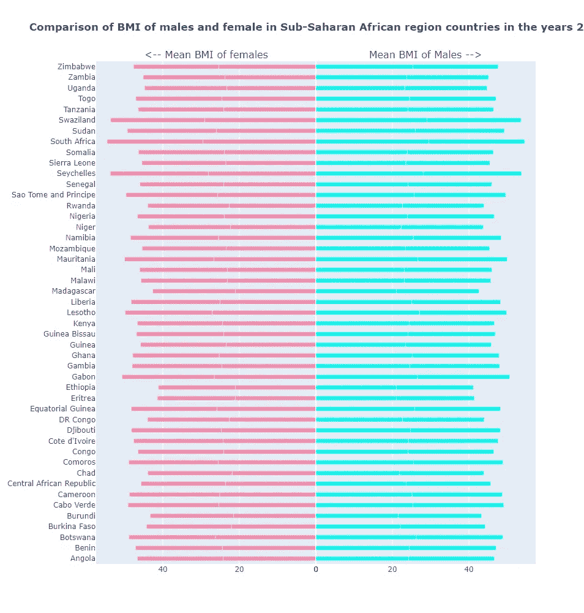

# Python 和 Plotly 中的 Dumbell 图、斜率图和镜像条形图

> 原文：<https://levelup.gitconnected.com/dumbell-plots-slope-charts-and-mirror-bar-charts-in-python-and-plotly-55dd0e1478a5>

*用 Python 创建 3 个图表的实践教程，帮助我们有效地比较相似的数据点*

谈到数据可视化，数据分析师有许多选择。糟糕的数据表示会导致误解和不正确的数据解释。另一方面，智能数据可视化可以帮助您获得数据驱动决策的好处。有效的数据可视化不仅有助于更好地理解数据，还可以向用户传达一个故事。

本教程将着重于可视化方法，使我们能够有效地比较相似的值。比如不同性别人群的健康统计，各种时间戳的数据等等。matplotlib 或 plotly 库中的基本图可以用来生成我们将要看到的三个图。比起 Matplotlib，我更喜欢 Plotly，因为它自带的内置特性。工具提示是我个人的最爱。这些工具提示可用于传达大量附加信息。其他伟大的 Plotly 功能包括缩放，平移/套索选择，以及作为 png 文件的绘图下载。

让我们言归正传，开始策划吧。图表数据来自 NCDRisc 网站。它包含从 1975 年到 2015 年各个国家男性和女性的糖尿病、身体质量指数和病态肥胖等健康统计数据。它还包括每个国家的国内生产总值和西方饮食得分的信息。你可以从我的 github 库[这里](https://raw.githubusercontent.com/hgarg01/graphs-for-comparing-values/main/data.csv)获得合并数据。

## 1.邓贝尔图

哑铃图有助于显示一段时间内的变化或两个(或三个)组之间的差异。dumbell 形状就是它的名字。

我们从读取该图的数据开始。如果你想继续下去，你可以在这里阅读 github [的原始数据。](https://raw.githubusercontent.com/hgarg01/graphs-for-comparing-values/main/data.csv)

```
data = pd.read_csv('[https://raw.githubusercontent.com/hgarg01/graphs-for-comparing-values/main/data.csv'](https://raw.githubusercontent.com/hgarg01/graphs-for-comparing-values/main/data.csv'))
data.shape
(16800, 17)
data.columns
Index(['Country', 'ISO', 'Sex', 'Year', 'Mean_BMI_adults',
       'Prevalence_obesity_adults', 'Prevalence_underweight_adults',
       'Prevalence_morbid_obesity_adults', 'Diabetes_prevalence',
       'Systolic_blood_pressure', 'Prevalence_raised_blood_pressure', 'Region',
       'Superregion', 'Years_of_education', 'Urbanisation',
       'Western_diet_score', 'GDP_USD'],
      dtype='object')
```

数据集中有 1975 年至 2015 年所有国家的美元 GDP。我们只使用这两年的数据，因为我们想显示 1975 年和 2015 年之间 GDP 的对比。此外，由于数据集中有太多的国家，将它们一起绘制会过于拥挤，我们选择只显示撒哈拉以南非洲的数据。数据的滑动是在下面完成的。

```
df_africa = data[(data['Superregion']=='Sub-Saharan Africa') & (data['Sex'] == 'Male')& ((data['Year'] == 2015) | (data['Year'] == 1975))]
df_africa_gdp = df_africa[['Country', 'Year', 'GDP_USD']]
```

用 plotly 做一个 dumbell 图，为每个 GDP 值画点，画一条连接两点的线，连接 1975 年到 2005 年每个国家的 GDP。下面是完整的代码。

在上面的第 1 行中，我们将 year 列转换为 string，因此它们被视为分类值，而不是定量值。在第 3 行中，我们使用函数 px.scatter 绘制了一个散点图，x 轴表示 GDP，y 轴表示国家。我们用不同的颜色为 1975 年和 2015 年各画一个点。颜色已由函数的 color_discrete_map 参数指定。

在第 7 行，我们迭代每个国家，按每个国家的名称过滤数据框(第 9 行),并使用 add_shape 函数添加一条线，连接前面绘制的 2 个点。在第 20 行，我们通过隐藏网格和设置标题来更新布局。


1975 年和 2015 年撒哈拉以南国家的 GDP 对比:作者图片

这个图表对于比较两年的 GDP 非常有用。我们可以清楚地看到，赤道几内亚不仅是该地区最富裕的国家，而且在 1975 年至 2015 年期间，它的 GDP 增幅也是最大的。谷歌搜索显示，自上世纪 90 年代中期开始生产石油以来，赤道几内亚已成为非洲人均最富裕的国家，也是撒哈拉以南非洲第三大产油国。

我们可以观察到一些国家的 GDP 在下降，2015 年的 GDP 低于 1975 年。加蓬是国内生产总值下降最快的国家之一。其主要原因是石油储量和价格的下降。

我使用了与上面相同的代码来比较 2015 年撒哈拉以南非洲国家男性和女性的身体质量指数，并创建了以下图形。


平均身体质量指数的比较:作者笔下的形象

从上图中我们可以看出，在大多数国家，成年女性的平均身体质量指数比男性高。在马达加斯加和布隆迪等极少数国家，这一趋势正在逆转。女性的最大平均身体质量指数出现在南非，男性的最大平均出现在塞舌尔。

我们可以调整上面的代码来包含 3 或 4 个点，并用一条线将它们连接起来。但是当你一次比较两个值时，这个图效果最好。一条线上的点太多可能会造成混乱。

## 2.斜率图表

斜率图是简单的图表，显示随时间推移的转变或变化、绝对值和排名。斜率图描绘了两个数值随时间的变化，从一点到下一点的斜率表示变化量和变化率。

我们选择在斜率图上显示 Ocenia 超级区域的国家。这个超级区域非常适合显示这些数据，因为它包含 16 个国家——既不会太多而使图表过于拥挤，也不会太少而显得稀疏。此外，从 1975 年到 2015 年，超级区域中一些国家的 GDP 增加了，而其他国家的 GDP 减少了，这使得信息显示起来很有趣。

在能够绘制数据之前，我们需要对数据进行切片和处理，使其适合绘图。

首先，我们对第 1 行的数据进行切片，使其包含 Ocenia 超级区域以及 1975 年和 2015 年这两年的数据。第 6 行创建了一个数据透视表，使用国家作为索引，使用 1975 年到 2015 年的 GDP 数据作为列。然后计算 1975 年至 2015 年的 GDP 差异(第 8 行)。如果 GDP 的变化大于零，增长方向为“向上”，否则为“向下”(第 11-13 行)。最后，我们给每个方向分配一个单独的颜色(第 15 行)，这将在我们的代码中用来区分增长类型。以下是生成的数据帧的帧头。


操作后创建的数据标题:作者提供的图像

在第 2 行和第 6 行中，我们在垂直列中创建了两年 GDP 值的散点图，其中每一列代表一年。在第 12 行，我们连接两列上代表同一个国家的两个点。我们之前在数据框中计算的方向颜色决定了连接线的颜色:绿色代表 GDP 正增长，红色代表 GDP 负增长。然后用注释增强这些图表，使它们更加清晰易懂。在第 26 行中，我们遍历所有国家的名称列表，在 1975 列中写入奇数索引的国家，在 2015 列中写入偶数索引的国家。这样做是为了避免名称过于拥挤。有些名字看起来仍然很接近。我们可以通过增加情节的高度来纠正这种情况。


Ocenia 地区国家的 GDP 比较—图片由作者提供

这张图表解释了许多事情，包括 1)1975 年与 2015 年各国 GDP 的排名。一个国家在垂直线上的位置越高，该国当年的 GDP 就越高。2)一个国家的 GDP 在 40 年间的变化。绿线表示正增长，红线表示负增长。除了帕劳、汤加和基里巴斯之外，该区域大多数国家都有正增长。GDP 增长率。一个国家的 GDP 增长或下降越快，这条线的斜率就越陡。库克岛的增长线极其陡峭，表明发展迅速。同样，从 1975 年到 2015 年，帕劳的国内生产总值急剧下降。

我们可以将上面的代码推广到绘制超过 2 年的数据。我们用 1995 年的额外 GDP 值绘制了与上述相同数据的斜率。这是结果


三年间北欧国家的 GDP 对比

从图表中我们可以清楚地看到，从 1975 年到 1995 年，许多国家(如帕劳和托克劳)的经济大幅下滑，如上图所示，但在随后的 20 年中，它们的表现似乎有所改善。从 1975 年到 1995 年，再到 2015 年，法属波利尼西亚的 GDP 稳步增长，令人印象深刻。旅游业和珍珠出口在这一增长中发挥了重要作用。

我们看到了在斜率表中增加年份线的数量以包含更多数据是多么简单。然而，将行数保持在最多 3 或 4 行效果最好；否则，情节可能会过于拥挤，使观众感到困惑。

## 3.镜像条形图

镜像条形图沿纵轴并排比较显示两组数据。图表的两面看起来像镜子里的倒影，因此得名镜像条形图。

我们使用撒哈拉以南非洲超级区域的数据来创建镜像条形图。下面给出了完整的代码。

我们首先将图形分成共享 y 轴的两个子图(第 4 行)。在第 7 行和第 8 行，我们添加了两个条形图，显示了所选国家在 1975 年和 2015 年的 GDP 值。1975 年图表的范围在第 21 行被设置为“反转”。现在，该图将以相反的方向绘制。以下是最后的结局:


撒哈拉以南非洲国家的镜像条形图:作者图片

这个图表对于比较这两个值很有用。我们可以清楚地观察到，加蓬在 1975 年 GDP 第一，但在 2015 年跌至第三。

我们可以用成年人的身体质量指数数据画一个类似的镜像条形图，如下所示。



撒哈拉以南非洲国家成人平均身体质量指数:作者图片

因为大多数国家都有可比的身体质量指数值，所以该图不能恰当地代表上图中的情况。

最后，我们可以得出结论，镜像图对于并排比较两个数据是有用的。然而，如果差别不大，就像上面的例子一样，它们是无效的。它们也不能显示两个以上的时间值，不像 dumbell 图和斜率图。

当谈到由数据表示的叙事时，分析师和数据科学家有各种各样的情节选择。我们学习了如何创建 Dumbell 图、斜率图和镜像条形图来比较两个时间点的值。它们都有自己的一套优点和缺点。当根据我们的需求选择合适的图表时，我们应该记住这些，并选择最适合我们数据的图表。

plotly 图表教程到此结束。感谢您抽出时间阅读本文。我希望你学到了新的东西。我其他一些受欢迎的文章可以在这里找到和[这里](https://medium.com/analytics-vidhya/calendar-heatmaps-a-perfect-way-to-display-your-time-series-quantitative-data-ad36bf81a3ed)。如果这篇文章值得你花时间，请随意鼓掌，然后[跟着](https://hgarg01.medium.com/)。如果没有，请告诉我如何才能做得更好。继续读，继续学！！