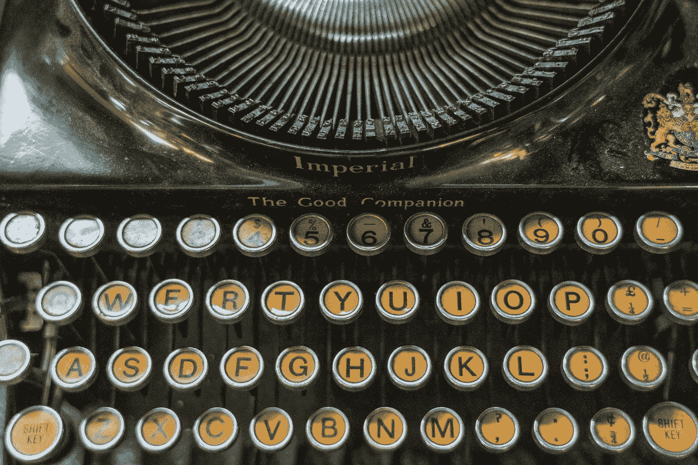
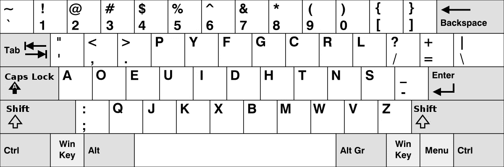
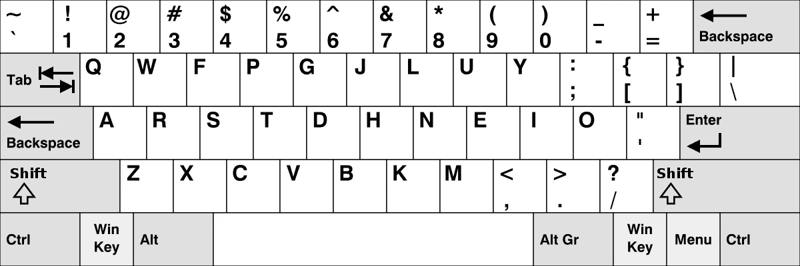
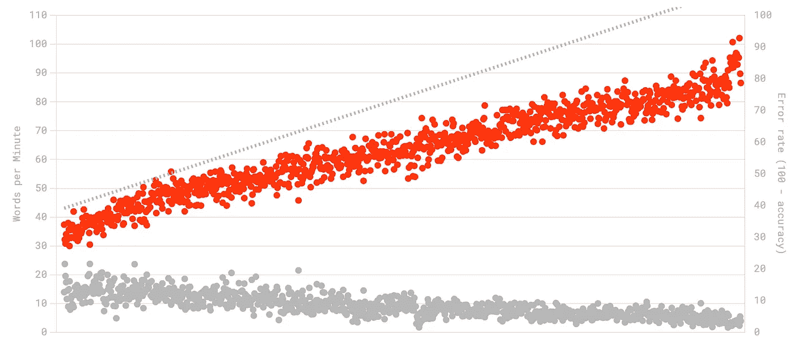

# 转储 Qwerty

> 原文：<https://levelup.gitconnected.com/dumping-qwerty-9435ebc93c60>

## 我成为现代潮人的经历

照片由 [Unsplash](https://unsplash.com?utm_source=medium&utm_medium=referral) 上的[尼克·费因斯](https://unsplash.com/@jannerboy62?utm_source=medium&utm_medium=referral)拍摄

# 动机

这一切都始于六个月前，当时我感到手指有刺痛感。我的腕骨随着每一次击键而断裂。每打一个字都让我的手更僵硬，更接近崩溃。

**我打得越多，就越讨厌它。**

我的同事也讨厌我。我不会回复任何信息——相反，我给他们回了电话，因为我不想发短信。不好的是人们不再联系我，好的是人们不再联系我。

直到有一天我崩溃了。

我的手不动了。我的手指不再响应我的命令。

然后我明白了——我必须做点什么。我不得不设法让打字更舒服。

我看过医生，见过女巫。无济于事。

但是后来我看了一篇关于一些**替代键盘布局**的莫名其妙的文章。

“这不可能”，我说。Qwerty 是唯一的键盘布局。

我迷上了另一种布局的想法，所以我开始练习德沃夏克。我花了几个晚上在电脑前随意打字。我输入的所有胡言乱语正在慢慢融化我的大脑。

没关系。重要的是我的手不再疼了。

我又喜欢打字了。

# **开个玩笑……**

这可能是大多数人决定离开 Qwerty 的故事。

但是我——我只是想变酷。

当我努力在同事的机器上打字时，我一直在想工作中可能会有的对话。

> -对不起，我不再使用 Qwerty 了，因为最常用的键之间的距离太大，导致手腕疼痛。天哪，这太酷了！多给我讲讲！

但实际上，这种情况从未发生过。

在我为一个客户演示的时候，只发生过一次。

我在共享筛选我的 iOS 模拟器，我必须键入一个你能想象到的最简单的密码。你可以想象，我无法做到这一点，因为无论我的机器布局如何，iOS 模拟器都使用 Qwerty。

所以我就在那里，喃喃自语着一些不太像一个关注自己双手健康的专业开发人员的经历。

所以，是的——试图装酷对我来说并不奏效。

但是现在已经没有回头路了。我再也不会打 Qwerty 了。

# 开始时的感觉

我第一次尝试德沃夏克是灾难性的。我觉得自己就像一个试图说出第一个词的新生儿。

想象一下，一个老太太有了她的第一台电脑，正在搜索食谱。那是我——但更糟。

最糟糕的不是我不会打德沃夏克——毕竟我才刚刚开始。最糟糕的是，我的手还在敲 Qwerty 键盘，尽管我试图阻止它们。

德沃夏克布局

所以我就在那里，看着上面的布局，试图拼出一个完整的单词。

我的语速惊人，几乎每分钟 4 个单词(T3)。

# 我是如何开始进步的

只是看看版面，试着打字，对我来说没什么效果。

如果版面不在我面前，我还是写不出任何东西。

然后我找到了一些网站，比如 https://learn.dvorak.nl/的，让学习变得更容易。

他们背后的想法是，你可以逐渐学习 Dvorak*——主行键，然后第一行键，等等。*

*这比直接进入完整的布局要容易得多。*

*但即使那样，我也无法超过每分钟 10 个单词的速度。我的问题是我的手仍在尝试书写 Qwerty——而德沃夏克与它完全不同。*

*所以我寻找其他布局，更类似于 Qwerty 的更平滑的过渡，但仍然具有 Dvorak 的人体工程学优势。*

*我找到了 Colemak，并开始练习。*

**

*科尔马克布局*

*但是现在我遇到的不是一个**而是两个**问题。我想输入 Colemak，但是我的右手仍然想要 Dvorak——而我的左手想要 Qwerty。*

*我阅读了其他人尝试改变的经验，我想如果他们成功了，那么我也可以——所以我继续练习。*

*我在 Colemak 上慢慢变好，在 Qwerty 上慢慢变差。*

*我的问题是我不能完全切换到 Colemak，因为我每天仍要工作 8 小时。是的，他们说编程是 90%的思考和 10%的编码——但是思考需要大量的谷歌搜索，而谷歌搜索需要大量的打字……*

# *我再也不能打字了*

*一个月后，我到了不能再打字的地步。我在 Colemak 上达到了合理的速度，在 Qwerty 上也差不多。*

**两者均较低。**

*我的生产力急剧下降。我用短句回复信息，尽可能地给人们打电话，避免打字。*

*我想放弃，但我已经走到一半了。即使我放弃了，我也必须重新学习 Qwerty——所以我继续练习。*

# *它是如何点击的*

**

*使用 Colemak 时我的 WPM 速度随时间的变化*

*我决定完全改用 Colemak。不是因为我达到了一个不错的速度，而是因为不得不一直切换布局使它变得更加困难。*

*我坚持练习——早上，晚上，开会的时候。直到有一天我意识到我甚至不再想钥匙了…*

*我只是在打字——我在打 Colemak。*

*即使在工作中，我也能像以前一样以惊人的速度搜索。一切最终恢复正常。*

*所以最后，我不得不做出完全的改变。不断切换布局损害了我的肌肉记忆，使它变得更加困难。*

# *结论*

*正如我在开始所说，我没有任何手腕疼痛。所以我不能说“哇，Colemak 救了我的手！”。*

*但是它让打字变得更舒服。打字时只需轻轻动一下手指，就有一种舒缓的感觉。一切都在那里。*

*与输入 Qwerty 相比，我每分钟的速度也提高了 10 到 20 倍。*

*所以努力变酷最终是值得的。*