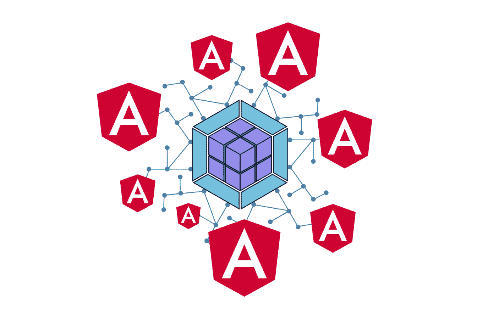
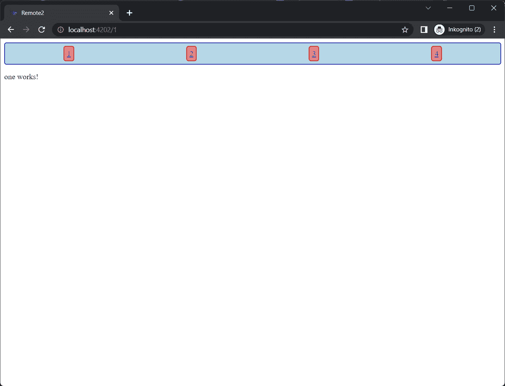
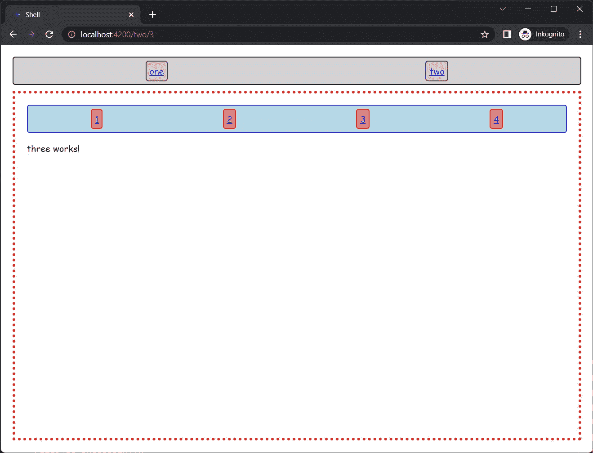

# 动态角度微前端

> 原文：<https://levelup.gitconnected.com/dynamic-angular-microfrontends-7de8f2634f0a>



# 在我的博客上阅读这个故事:

[](https://ng-journal.com/blog/2022-11-06-dynamic-angular-microfrontends/) [## 动态角度微前端

### 微前端背后的关键思想是在运行时延迟加载代码，这样 Angular 编译器就不需要…

ng-journal.com](https://ng-journal.com/blog/2022-11-06-dynamic-angular-microfrontends/) 

# 介绍

微前端背后的关键思想是在运行时延迟加载代码，这样 Angular 编译器不需要知道运行时延迟加载的功能模块。当多个团队在一个项目上工作，并且独立的部署对于生产力是必要的时候，这是特别有用的。

```
await import('http://localhost:4200').then(m => m.ROUTES)
```

尽管这是一个关键的想法，但这并不像开箱即用那样有效，因为 Angular 不能在编译时解决依赖性。Webpack 可以用来做一些不可思议的事情，例如在模块联合插件的帮助下，惰性加载可以工作。

如果你不熟悉基本概念，我建议你先看看这篇文章:

[](/your-first-angular-microfrontend-58950768a465) [## 你的第一个角形微前端

### 这是关于如何创建一个简单的 angular 应用程序来使用另一个应用程序的模块的分步指南…

levelup.gitconnected.com](/your-first-angular-microfrontend-58950768a465) 

在下一部分中，我将假设您已经知道如何使用模块联邦来静态延迟加载带有硬编码 URL 的微前端。显然，使用硬编码的 URL 并不好，因为我们可能希望实现一些逻辑，根据用户权限或者只是部署阶段(dev、staging、prod)来决定应该加载哪些微前端。

# 辅导的

我创建了一个包含两个**远程** (remote1，remote2)和一个**外壳**的 monorepository。remote1 和 remote2 都在 webpack 配置中公开了一个路由配置，这样路由配置就可以被 shell 延迟加载。外壳只包含一个用于显示遥控器的 router-outlet，还包含一个 navbar，每个遥控器都有一个 router-link。这基本上是演示所需的所有代码。棘手的部分是基于清单文件的动态路由。

清单文件至少应该实现来自[@ angular-architects/module-Federation](https://www.npmjs.com/package/@angular-architects/module-federation)包的 RemoteConfig，并且可以扩展您的应用程序所需的更多自定义属性。例如，我的清单对其进行了如下扩展:

这个清单文件应该存储在 assets 文件夹中，然后我们可以确保在引导时远程是可加载的。

现在，路由是主要问题，因为我们不能只编码静态路由配置。相反，我们可以使用来自 angular-router 的低级依赖注入令牌，这样我们就可以使用 **useFactory** 属性。重要的是提供一个空的路由配置，然后我们可以访问**路由**注入令牌。

**createRoutes** 函数是一个基于清单文件返回 Routes 对象的实用函数。基本上，清单被迭代并使用清单的值映射到路由配置。为了加载清单，可以使用 **getManifest** 函数。

差不多就是这样了。剩下的唯一一件事就是动态地添加路由器链接到导航栏。该组件还使用 getManifest 函数，在模板中，我们可以简单地迭代 ngFor 中的条目。

## 结果是:



**遥控器 2** ，端口 4202



**外壳**，端口 4200

# 解决

这种动态方法可以用于多种有趣的情况。代码是静态的，但是逻辑包含在清单文件中，因此 CI/CD 管道可以根据阶段交换文件。否则，根据登录用户的权限，清单可以完全从后端加载。或者它可以用于 A/B 测试

*   **部署阶段**
*   **A/B 测试**
*   **仪表盘**
*   **基于权限的条件渲染**
*   **插件架构**

总之，这种动态加载使公司能够为他们的微前端架构提供更多的控制和可伸缩性。

## GitHub 回购

[](https://github.com/HaasStefan/dynamic-module-federation) [## GitHub-HaasStefan/动态模块联盟

### 此时您不能执行该操作。您已使用另一个标签页或窗口登录。您已在另一个选项卡中注销，或者…

github.com](https://github.com/HaasStefan/dynamic-module-federation) 

## 加入介质

[](https://medium.com/@stefan.haas.privat/membership) [## 通过我的推荐链接-斯特凡·哈斯加入媒体

### 阅读斯特凡·哈斯的每一个故事(以及媒体上成千上万的其他作家)。您的会员费直接支持…

medium.com](https://medium.com/@stefan.haas.privat/membership) 

## 阅读更多

[](/breaking-the-frontend-monoltih-b1837f8ed2e5) [## 打破前端巨石

### 在本文中，您将了解将典型的前端整体迁移到…

levelup.gitconnected.com](/breaking-the-frontend-monoltih-b1837f8ed2e5) [](/moduliths-in-angular-with-nx-b8b0076794fb) [## 以 Nx 为单位的角度模数

### 使用 DDD 和 Monorepos 创建可持续应用

levelup.gitconnected.com](/moduliths-in-angular-with-nx-b8b0076794fb) [](/secure-frontend-authorization-67ae11953723) [## 停止在前端进行令牌认证

### 为单页应用程序构建安全认证过程的现代方法。

levelup.gitconnected.com](/secure-frontend-authorization-67ae11953723)