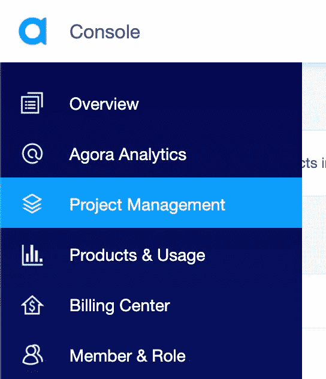
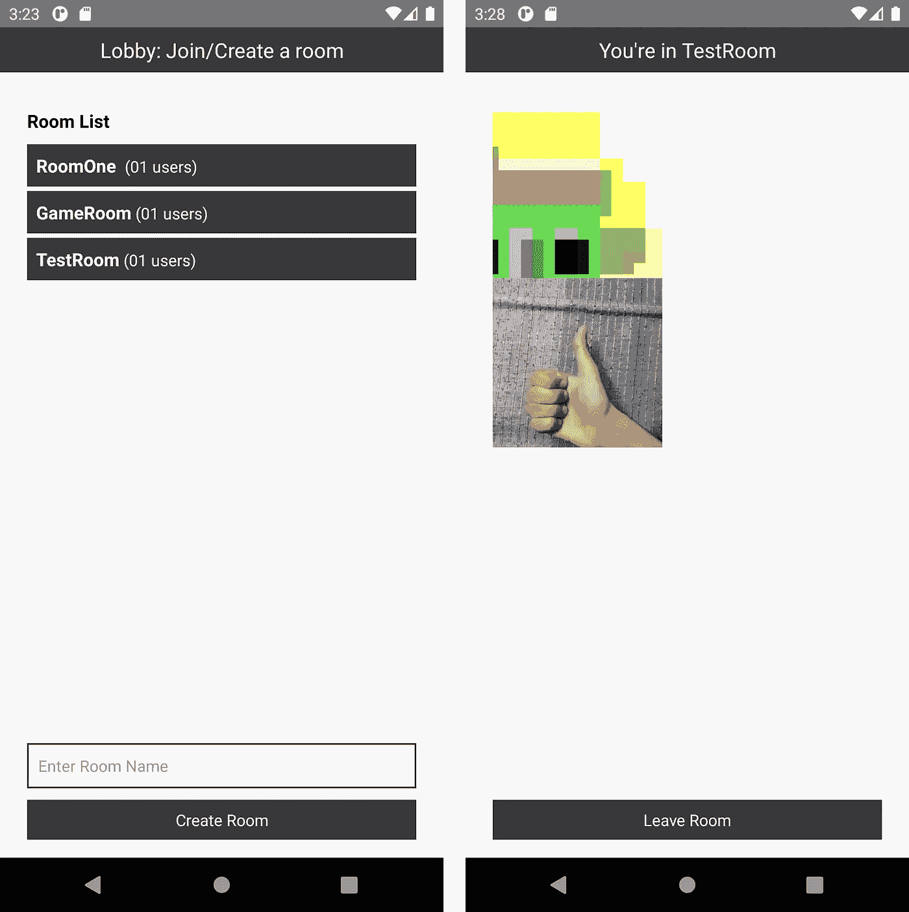

# React Native 上使用 Agora RTM 进行视频聊天的动态频道

> 原文：<https://levelup.gitconnected.com/dynamic-channels-for-video-chat-using-agora-rtm-on-react-native-8ea18addae2b>


Agora RTC(实时通信)SDK 使在 React Native 上构建视频聊天应用变得非常容易。我们可以让多个用户在视频聊天室中使用同一个频道名称进行交流。

如果您正在构建一个社交视频聊天应用程序，您可能希望让您的用户创建其他用户可以浏览、加入和交流的房间。您可以使用后端服务器来处理这些请求，并向其他用户更新关于已创建房间的信息，但这将涉及编写后端代码和托管您自己的服务器。

在本教程中，我们将看到通过使用 Agora RTM(实时消息传递)SDK 实现相同目标的另一种方法。我们将使用用户发送的消息来交流动态视频聊天室的创建和更新，所有这些都使用前端代码。

这非常方便，因为当您不想构建后端服务器时，可以使用消息向其他用户更新房间的状态。这种方法可以很容易地扩展到拥有完全管理的房间，以及像管理员允许/拒绝用户、静音另一个用户和从房间中删除用户这样的功能。

在这个例子中，我们将使用 [Agora RTC SDK](https://www.npmjs.com/package/react-native-agora/) 和 [Agora RTM SDK](https://www.npmjs.com/package/agora-react-native-rtm) 进行 React Native。在撰写本文时，我使用的是 RTC SDK 的 v3.2.2 和 RTM SDK 的 v 1 . 2 . 2-α3。

# 项目概述

*   我们有一个称为“大厅”的 RTM 房间。当有人创建了一个新房间或者房间中的成员发生变化时，我们将使用它来通知用户。
*   我们的方法是让视频聊天室中最资深的成员给其他人发送消息。房间里年龄最大的成员被认为是资深成员，稍后会详细介绍。
*   我们将以“roomName:memberCount”的形式发送消息，其他用户可以处理这些消息，将房间名称和成员计数作为字典存储在他们的应用程序状态中。我们将使用它来呈现一个包含成员数量的房间列表。
*   一旦我们有了列表，我们就可以使用 RTC SDK 加入房间。我们还需要监听用户的加入和离开，以更新其他人的成员数。这仅由高级成员完成，以避免开销。
*   我们还需要考虑两种情况来为其他用户更新房间信息。首先，当新用户加入大厅时，每个通道中级别最高的成员会向该用户发送一条对等消息。第二，当频道的成员数更新时，我们向连接到大厅的所有用户发送频道消息，以更新他们的房间列表。

# 创建 Agora 帐户

[注册](https://sso.agora.io/en/signup?utm_source=medium&utm_medium=blog&utm_campaign=dynamic-channels-for-video-chat-using-agora-rtm-on-react-native)账户并登录仪表板。



网站上的项目管理选项卡

导航到“项目管理”选项卡下的“项目列表”选项卡，并通过单击蓝色的“创建”按钮来创建项目。(当系统提示使用应用 ID +证书时，请仅选择应用 ID。)在您开发应用程序时，应用程序 ID 将用于授权您的请求，而不会生成令牌。将应用 ID 复制到安全的地方，我们稍后会用到它。

*注意:*本指南不实施令牌认证，建议在生产环境中运行的所有 RTE 应用程序都实施令牌认证。有关 Agora 平台中基于令牌的认证的更多信息，请参见[https://docs.agora.io/en/Video/token?平台=所有% 20 平台](https://docs.agora.io/en/Video/token?platform=All%20Platforms)。

# 下载源代码

如果你喜欢，你可以跳到代码。代码是开源的，可以在 [GitHub](https://github.com/EkaanshArora/Agora-Dynamic-VideoChat-Rooms) 上获得。要亲自尝试，请参阅自述文件，了解如何运行该应用程序的步骤。



安卓模拟器上运行的应用截图

# 我们示例的结构

这是我们正在构建的应用程序的结构:

```
**.**
├── android
├── components
│ └── **Permission.ts**
│ └── **Style.ts**
├── ios
├── **App.tsx
.**
```

## App.tsx

App.tsx 将成为应用的入口。我们将所有的代码都放在这个文件中。

我们从编写导入语句开始。接下来，我们为应用程序状态定义一个包含以下内容的接口:

*   `**appId**`:我们的 Agora 应用 ID
*   `**token**`:生成加入通道的令牌
*   `**inCall**` **:** 当我们在一个活跃的视频聊天室时存储的布尔值
*   `**inLobby**` **:** 如果我们在大厅，布尔型要存储
*   `**input**` **:** 创建新房间时输入的存储字符串
*   `**peerIdsRTC**`:存放视频聊天室其他用户 RTC UIDs 的数组
*   `**seniors**` **:** 存储在我们之前加入视频聊天室的 RTM 成员的数组
*   `**myUsername**`:登录 RTM 的本地用户名
*   `**rooms**` **:** 存储房间名称及其成员数的字典

我们定义了一个基于类的组件:`_rtcEngine`变量将存储 RtcEngine 类的实例，`_rtmEngine`变量将存储 RtmEngine 类的实例，我们可以用它来访问 SDK 函数。

在构造函数中，我们设置状态变量并请求在 Android 上录制音频的权限。(我们使用来自`permission.ts`的一个助手函数，如下所述。)当组件被挂载时，我们调用`initRTC` 和`initRTM`函数，这些函数使用 App ID 初始化 RTC 和 RTM 引擎。当组件卸载时，我们销毁我们的引擎实例。

## RTC 初始化

我们使用 App ID 来创建引擎实例。我们使用`enableVideo`方法将 SDK 设置为视频模式。

当我们加入通道时，RTC 会为在场的每个用户以及随后加入的每个新用户触发一个`userJoined`事件。当用户离开频道时，触发`userOffline`事件。我们使用事件侦听器来用 uid 更新 peerIds 数组。我们稍后将使用这个数组来呈现来自其他用户的视频提要。

一旦我们加入了一个频道，SDK 就会触发`JoinChannelSuccess`事件。我们将状态变量`inCall`设置为 true 来呈现视频聊天 UI。

当一名新用户加入我们的视频聊天室时，如果我们是之前讨论过的高级会员，我们会使用`lobby` RTM 频道向所有频道成员发送一条频道消息，其中包含更新后的用户数。

## RTM 初始化

我们使用 RTM 发送房间名称和成员数量。我们保留了一批年长者，即在我们之前加入号召的成员。如果老年人数组大小< 2，这意味着我们是最高级的成员，负责信号。(本地用户也是阵列的一部分。)

首先，我们附加了`channelMemberJoined`和`channelMemberLeft`监听器，它们在用户加入或离开 RTM 通道时被触发。当用户加入大厅频道时，如果我们是级别最高的成员，我们会向他们发送一条同级消息。如果用户离开当前的视频聊天频道，我们会更新老年人数组(如果他们比我们先到，就将他们从数组中删除)。如果我们是高级会员，我们还会向大厅发送频道消息来更新计数。

接下来，我们附加`channelMessageReceived`和`messageReceived`事件监听器，它们分别在我们接收到通道消息和对等消息时被触发。我们分割`channelName:memberCount`字符串(例如，`‘helloWorld:5’`)，并使用这两段数据来更新我们的字典。(例如，`rooms: { ‘helloWorld’: 5, ‘roomTwo’: 3 }`)。

## 加入通话

我们定义了一个函数来加入调用，该函数将通道名作为参数。我们使用通道名更新状态，并使用`joinChannel`方法加入 RTM 和 RTC 上的通道。

我们使用 RTM 上的`getChannelMembersBychannelId`方法来获取通道上用户的 uid。如果我们是唯一的成员，我们将向 RTM 上的大厅频道发送频道消息，以向每个人更新创建的房间。

## 离开电话

我们离开了 RTM 和 RTC 视频聊天室频道，但仍与 RTM 上的大厅频道保持连接，以不断接收更新。我们通过清除`peerIds`数组、`seniors`数组和`channelName`来更新我们的状态。我们还将`inCall`设置为 false，将`inLobby`设置为 true，以呈现大厅 UI。

## 呈现我们的用户界面

我们定义了显示按钮的渲染函数，以便在通话或大厅中显示状态。

我们使用`_renderRooms`函数来呈现一个滚动视图，该视图遍历 rooms 字典来显示已创建房间的列表及其成员计数。用户可以点击任何房间加入，这将调用`joinCall`功能。我们还呈现一个文本输入，让用户创建一个房间，用该输入调用同一个`joinCall`函数。

一旦连接到视频聊天室，我们就使用`_renderCall`功能来呈现视频。我们使用 SDK 中的`RtcLocalView`组件来呈现我们自己的(本地用户的)视频。我们在滚动视图中使用`RtcRemoteView`来呈现使用存储在`peerIds`数组中的 uid 连接的用户的视频。我们还显示一个离开房间的按钮。

## Permission.ts

我们正在导出一个助手函数，向 Android 操作系统请求麦克风权限。

## Style.ts

Style.ts 文件包含组件的样式。

# 下一步是什么？

同样的技术也可以用来传递其他信息，比如连接的用户名、房间描述和房间标题。我们甚至可以使用相同的机制，通过发送 RTM 消息来将用户踢出呼叫，该消息在被评估后调用远程用户设备上的离开通道方法。

# 结论

您已经看到了我们如何利用 Agora RTM SDK 来共享信息和动态创建视频聊天室。您可以参考[Agora React Native API Reference](https://docs.agora.io/en/Video/API%20Reference/react_native/index.html)，了解可以帮助您快速向下一个实时互动应用添加更多功能的方法。