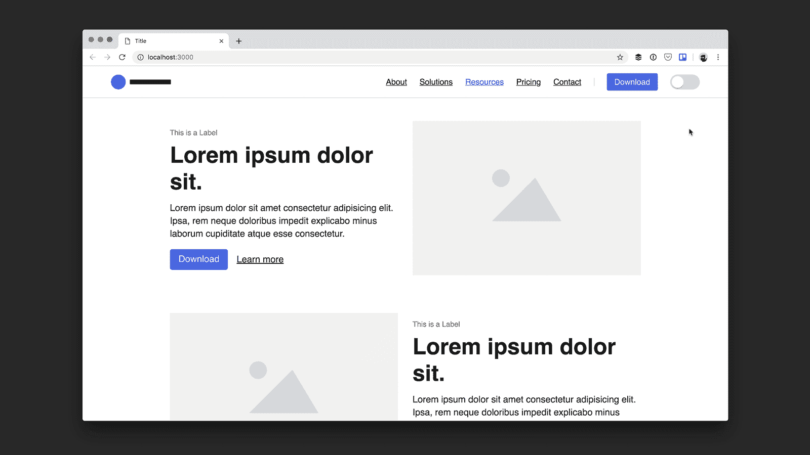
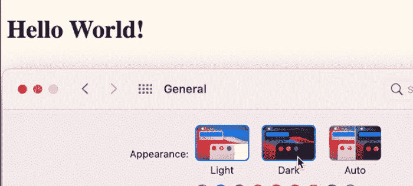
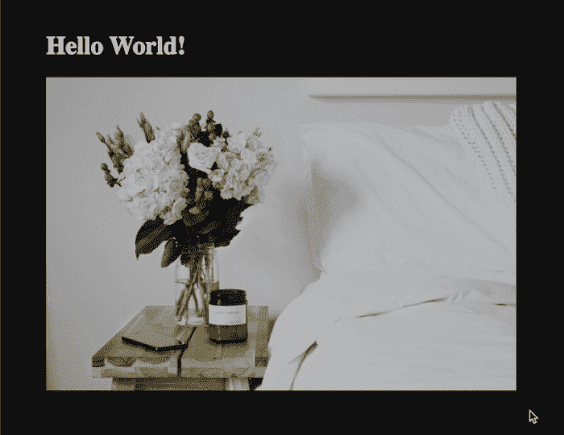

# Web 上的动态暗/亮模式

> 原文：<https://levelup.gitconnected.com/dynamic-dark-light-mode-on-the-web-d55e4c0d3aa9>


黑暗模式近年来非常流行，因为常见的操作系统(iOS、Android、macOS、Windows)都支持黑暗模式，而且很多人更喜欢黑暗模式。大多数流行的移动应用程序也支持黑暗模式，所以喜欢黑暗模式的用户会感到舒服。

# 黑暗模式问题

有很多网站通过一个切换按钮来支持黑暗模式，用户可以使用这个按钮在黑暗和光明模式之间切换。这里的问题是，用户必须点击那个按钮才能切换到黑暗模式，这给像我这样的懒惰用户带来了额外的工作。



还有其他类型的网站完全处于黑暗模式，没有切换到光明模式的选项。这个对黑暗模式的用户来说是完美的，但是光明模式的用户讨厌它。

唯一的解决方案是，网站应该检测系统颜色主题，并动态切换到适当的颜色主题。

好消息是，有一个 CSS 媒体功能！

# CSS 媒体查询来检测用户是否喜欢黑暗模式

有一个 CSS 媒体查询，允许根据用户首选的配色方案覆盖或定义样式:

```
@media (prefers-color-scheme: dark) {}
```

你可以在这里了解更多关于偏好配色方案 CSS 媒体查询[的信息。](https://developer.mozilla.org/en-US/docs/Web/CSS/@media/prefers-color-scheme)

换句话说，如果网站在白色背景上有黑色文本，它可以调整为深色首选系统，如下所示:

```
body {
  background: FloralWhite;
}h1 {
  color: #121212;
}@media (prefers-color-scheme: dark) {
  body {
      background: #121212;
  }

  h1 {
    color: FloralWhite;
  }
}
```

在这个例子中，我只是交换了媒体查询中的亮/暗颜色。



查看[代码栏](https://codepen.io/aramvr/pen/QWGWKbX)中的完整示例。

# 检测用户是否喜欢 Javascript 中的黑暗模式

您还可以使用 javascript 来检测系统配色方案:

```
const prefersDarkScheme = window.matchMedia("(prefers-color-scheme: dark)");
```

例如，它可以用于将“黑暗模式”类添加到 body 标签中:

```
if (prefersDarkScheme.matches) {
  document.body.classList.add("dark-mode");
}
```

# 为黑暗模式使用 CSS 变量

控制网站中配色方案的另一种方法是声明 [CSS 变量](https://developer.mozilla.org/en-US/docs/Web/CSS/Using_CSS_custom_properties)，然后在 CSS 媒体查询中更改变量颜色。

在示例中，我在“:root”伪类中声明了 CSS 变量，因此它可以在整个 HTML 文档中全局应用:

```
:root {
  --main-bg-color: FloralWhite;
  --main-text-color: #121212;
}
```

接下来，让我们使用这些变量:

```
body {
  background: var(--main-bg-color);
}h1 {
  color: var(--main-text-color);
}
```

最后，让我们更改“prefers-color-scheme”CSS 媒体查询中这些变量的值:

```
@media (prefers-color-scheme: dark) {
  :root {
    --main-bg-color: #121212;
    --main-text-color: FloralWhite;
  }
}
```

查看[代码栏](https://codepen.io/aramvr/pen/ExNxNdr)中的完整示例。

# 黑暗模式下的图像

黑暗模式下闪亮的图像有时会看起来太亮，这在黑暗模式下并不酷。

这里有一个例子:


洛根·诺林在 [Unsplash](https://unsplash.com/photos/EvceCyopkKI) 上的照片

Mark Otto 分享了一个关于如何在黑暗模式下降低图像亮度的好例子:

```
[@media](http://twitter.com/media) (prefers-color-scheme: dark) {
 img {
    opacity: .75;
    transition: opacity .5s ease-in-out;
  }
  img:hover {
    opacity: 1;
  }
}
```

结果对我来说很好:



不幸的是，这对于每种情况都是不够的，有时我们需要根据系统首选的颜色主题完全改变图像源。例如，您可以将网站上的一些图标或徽标更改为黑暗模式。


好消息是，有一种简单的方法可以实现这一点，只需使用 HTML:

```
<picture>
  <source srcset="light-image.png" media="(prefers-color-scheme: light) or (prefers-color-scheme: no-preference)">
  <source srcset="dark-image.png" media="(prefers-color-scheme: dark)">
</picture>
```

在上面的例子中，在“<picture>”标签中有两个“”标签。它应该显示来自第一个来源的图像，如果用户更喜欢光模式或没有任何偏好。第二个光源将用于喜欢黑暗模式的用户。</picture>

# 浏览器支持

包括 Chrome 76+、Firefox 67+、Safari 12.5+(iOS 上为 13+)在内的主流浏览器都支持“prefers-color-scheme”媒体查询。
它不支持 Internet Explorer。

[我可以用](https://caniuse.com/?search=prefers-color-scheme)估计超过 89%的互联网用户覆盖率。

# 结论

许多主要网站已经支持黑暗模式，包括脸书、推特和 Youtube。它不仅时尚，而且通过支持在明亮模式下对眼睛疲劳敏感的用户，增强了易用性。这也使得网站在用户使用的系统中保持一致。

如果你已经有了一个网站，我希望这篇文章对你有所帮助，让你的网站以正确的方式支持亮/暗模式。

下次当你开始一个新的网络项目时，我不知道你是否能投入时间让网站支持黑暗模式，但你能做的是使用颜色变量，这将使你的应用程序在未来很容易进入“黑暗”网络。

材料设计系统也支持黑暗模式，你可以在这里查看。

如果你觉得这篇文章有帮助，给我一些掌声？。