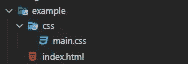
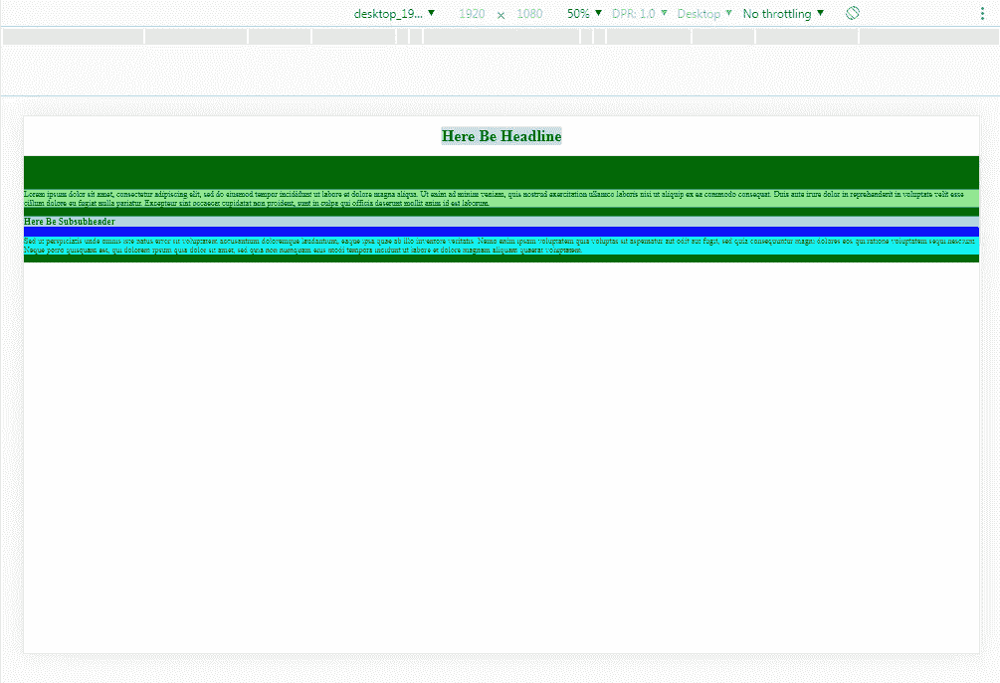
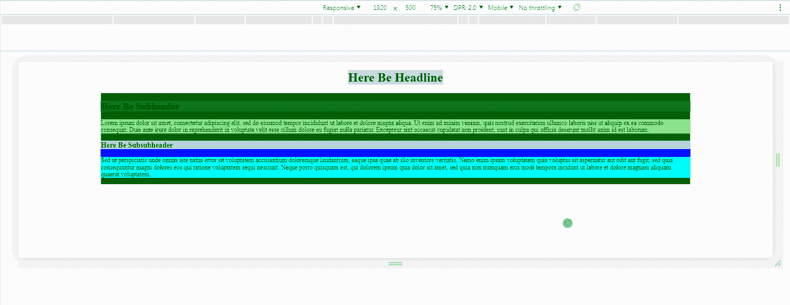
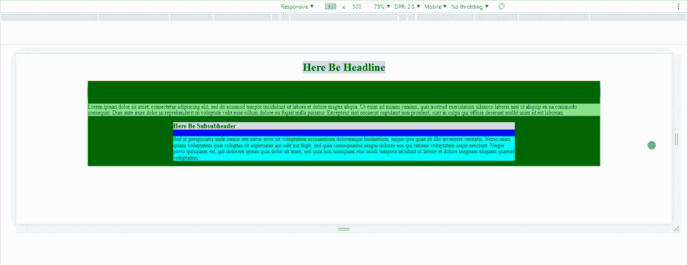
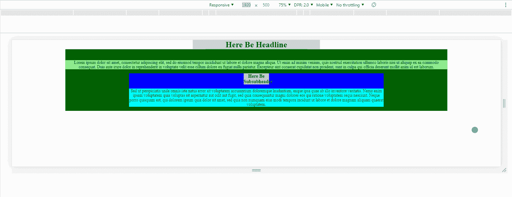
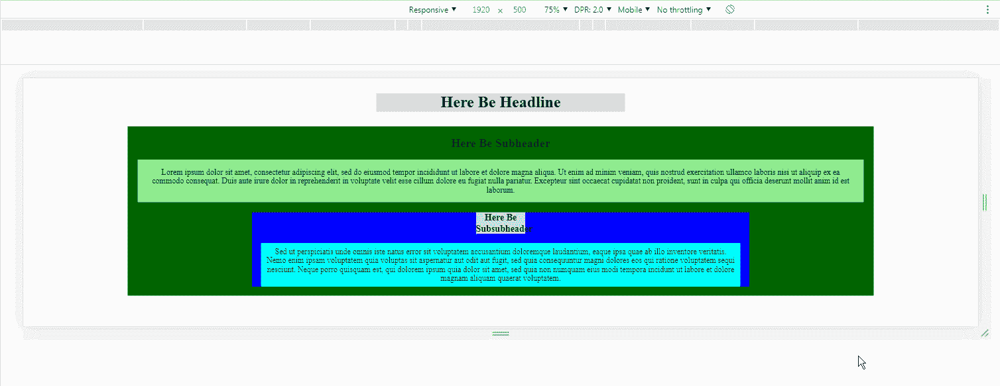
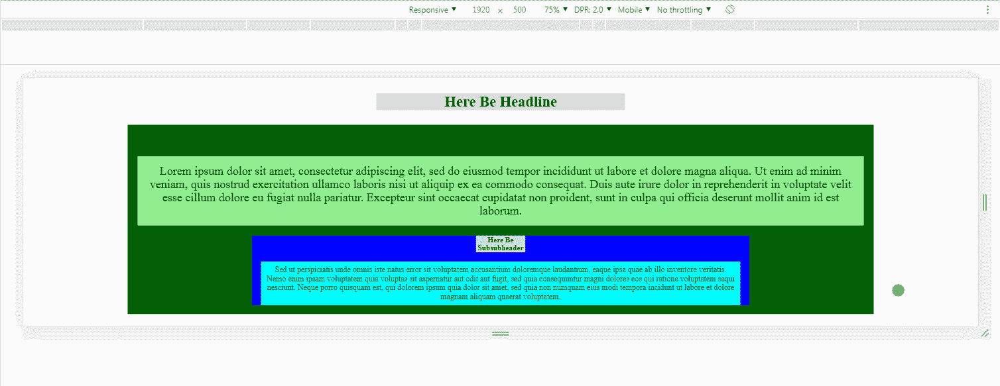
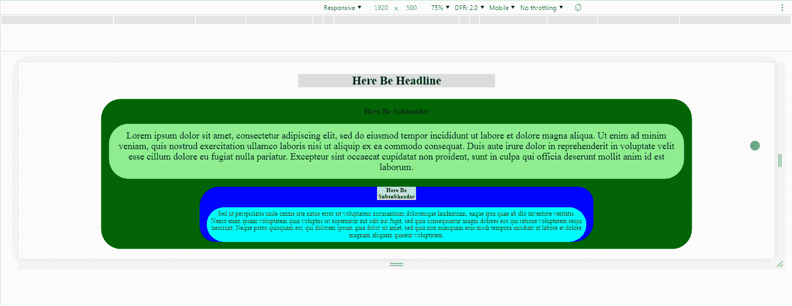
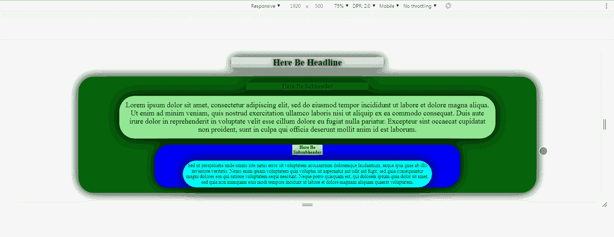

# CSS 中的动态元素缩放

> 原文：<https://levelup.gitconnected.com/dynamic-element-scaling-in-css-7e35ed9a3914>

## 一个 calc()函数如何改变一切


本周的博客将会和我平时写的有所不同。我想分享一个我在 CSS 中遇到的最有用的技巧。

它允许我动态缩放任何我想要的 HTML 元素，也消除了我写媒体查询的许多理由。

首先，我要感谢最初提出这个函数的[**Mike Riethmuller**](https://www.madebymike.com.au/writing/precise-control-responsive-typography/)和 CSS-Tricks 的 Geoff Graham 对其功能的扩展。我不认为是我创造了这个功能。我只想歌颂它。

所以，让我们开始设计吧。

## 公式

CSS 打包了一种用名为`calc()`的函数进行基本数学运算的方法。我们可以用`calc()`做任何简单的数学等式，并将我们计算的内容设置为任何需要数值的 CSS 属性。从`font-size`，到`width`，到`box-shadow`……我们都可以用`calc()`。

CSS 还有一个度量单位，用来计算名为`vh`和`vw`的浏览器窗口的`viewport` `height`和`viewport` `width`。`100vh`代表浏览器窗口的整个高度，而`100vw`代表整个`width`。使用`100%`和`100vh` / `100vw`的区别在于`100%`是相对于在中定义的选择器，而`100vh` / `100vw`是相对于浏览器窗口的。这将是一个重要的区别。

随着`calc()`和`100vh` / `100vw`的解释，我将跳过一些步骤，直接进入公式。

这个公式将允许我们根据浏览器的宽度或高度动态缩放任何带有数值的属性:

```
calc([min size]px + ([max size] — [min size]) * ((100vw — [min vw width]px) / ([max vw width] — [min vw width])))
```

好吧…让我们来分析一下。

首先，让我们看看等式的右边:

`[min size]px`

我们想要为我们的`element`设置一个最小尺寸，这样无论我们想要缩放什么`element`都不会以`0px`的尺寸结束。如果我们希望一个`element`至少是`25px`，我们可以将该值插入到`calc()`的第一部分:

`[min size]px` = `25px`

这本身是没用的，但当我们看等式的左边时就不是了:

```
([max size] — [min size]) * ((100vw — [min vw width]px) / ([max vw width] — [min vw width])))
```

让我们也来分解一下:

`([max size] — [min size])`

这是我们可以通过最小和最大尺寸设置一个范围的地方，我们希望一个`element`在这里，它将作为一个乘数。如果我们希望一个`element`至少是`25px`并且最多是`50px`，我们可以将这些值代入:

`([max size] — [min size])` = `(50 - 25)`

第三部分是最复杂的:

```
((100vw — [min vw width]px) / ([max vw width] — [min vw width]))
```

在这里，我们可以设置一个范围，通过最小和最大的大小，我们期望浏览器的分辨率。在桌面上，我总是凭经验判断`1920px`(1080 p 的水平分辨率)和`500px`(Chrome 允许缩小到没有 ChromeDevTools 的最小分辨率)。

代入这些值，等式的最左边看起来像这样:

`((100vw — [min vw width]px) / ([max vw width] — [min vw width]))` = `((100vw — 500px) / (1920–500)))`

这会根据浏览器的`viewport`属性的大小创建一个比率。在`500px`和`1920px`范围之外的任何东西都将继续分别按比例增加或减少，但是是以线性速率。我们还可以为移动设备或超宽显示器编写一个媒体查询，或者将这些异常写入`calc()`函数本身。

让我们开始简化事情，将一些数字插入到这个函数中，并查看它的运行情况。我们可以用我们喜欢的任何分辨率替换`100vw`，并查看我们为`element`的尺寸设置的比例:

```
((1920px — 500px) / (1920–500)) = 1
((1565px — 500px) / (1920–500)) = 0.75
((1210px — 500px) / (1920–500)) = 0.5
((855px — 500px) / (1920–500)) = 0.25
((500px — 500px) / (1920–500)) = 0
```

如果我们用之前设置的`element`的大小乘数乘以这个比率，我们会得到一个基于浏览器`viewport`大小的`element`大小的动态值:

```
(50–25) * ((1920px — 500px) / (1920–500)) = 25px
(50–25) * ((1565px — 500px) / (1920–500)) = 18.75px
(50–25) * ((1210px — 500px) / (1920–500)) = 12.5px
(50–25) * ((855px — 500px) / (1920–500)) = 6.25px
(50–25) * ((500px — 500px) / (1920–500)) = 0px
```

最后，如果我们将`element`的最小尺寸加到这个乘数上，我们得到`element`的最终尺寸:

```
25 + (50–25) * ((1920px — 500px) / (1920–500)) = 50px
25 + (50–25) * ((1565px — 500px) / (1920–500)) = 43.75px
25 + (50–25) * ((1210px — 500px) / (1920–500)) = 37.5px
25 + (50–25) * ((855px — 500px) / (1920–500)) = 31.25px
25 + (50–25) * ((500px — 500px) / (1920–500)) = 25px
```

因此，如果我们希望当浏览器的宽度为`500px`时，我们的`element`为`25px`，当浏览器的宽度为`1920px`时，我们的`50px`，那么整个函数将如下所示:

```
calc(25px + (50–25) * ((100vw — 500px) / (1920–500)))
```

复杂？是的。

有用吗？非常好。

**TLDR** :

```
calc([min size]px + ([max size] — [min size]) * ((100vw — [min vw width]px) / ([max vw width] — [min vw width])))
```

所以我们来看一些例子。

## 设置

我有一个非常简单的 HTML 框架设置，它导入一个 CSS 文件:



*中的* `*index.html*` *:*

*中的* `*main.css*` *:*

*在 Chrome 中:*



很美，我知道。

## 宽度

让我们通过使用我们新奇的缩放功能，开始摆弄`square`和`small_square`的`width`。

假设我们希望`square`有一个最多为`1500px`的`width`，至少为`250px`。

*中的* `*main.css*` *:*

*在 Chrome:*



很好。

让我们也调整`small_square`，使`width`最多为`1000px`，最少为`100px`。

*中的* `*main.css*` *:*

*在 Chrome 中:*



很好。

## 头球

*中的* `*main.css*` *:*

*在 Chrome 中:*



很好。

## 边距/填充

`*main.css*` *中的*:**

*在 Chrome 中:*



很好。

## 字体大小

*中的* `*main.css*` *:*

*在 Chrome 中:*



很好。

## 边框半径

*中的* `*main.css*` *:*

*在 Chrome:*



很好。

## 框/文本阴影

*中的* `*main.css*` *:*

*在 Chrome 中:*



很好。

您几乎可以在需要数值的选择器中的任何地方应用这个`calc()`函数。它非常灵活。

## 任务完成

这个`calc()`功能对我来说是一个游戏改变者，感觉它值得写博客。当我发现响应式/动态网页设计时，我不得不彻底反思我是如何处理的，当我开始潜心研究 SCSS 时，我发现它甚至更加强大(但那是另一个故事了)。

因此，我开始在任何地方使用它，并使我的整个项目 [**空格键粉碎器**](https://trunkslamchest.com/spacebarsmasher/) 完全响应，而不使用单一的媒体查询。我也可以使用这个`calc()`函数添加手机特定的布局。我都不知道该叫它什么。

在我最近的一个项目中，我把它命名为`calcSize`，所以这可能是它最好的名字。

不管怎样，我希望你得到了一些有用的信息，希望你所有的函数都返回 true，所有的请求都用 200 来响应。

保持安全…保持健康…继续为正义而战。