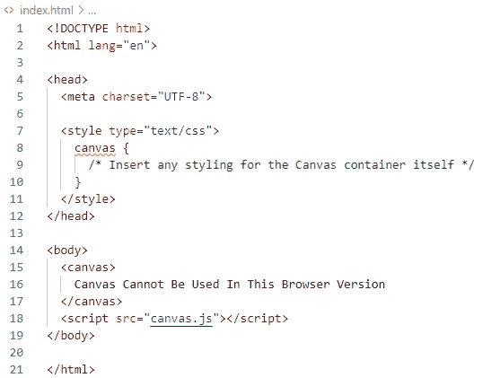
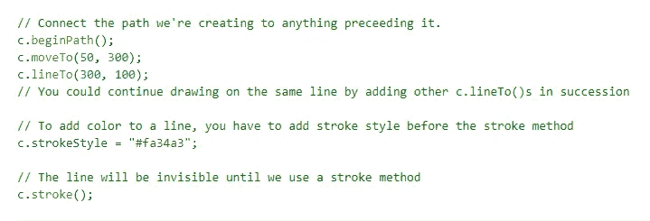
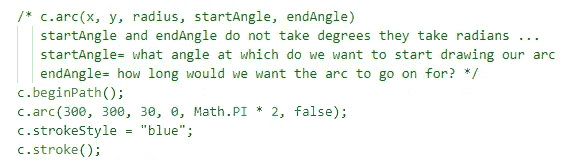

# 动态图形生成:画布

> 原文：<https://levelup.gitconnected.com/dynamic-graphics-generation-the-canvas-cac98ace99c3>


HTML5 是最新的、得到普遍支持的、向后兼容的 HTML 版本，也是增加了 **canvas** 元素的版本。简而言之，它创建了一个绘图空间，用于创建各种各样的动态图形，只使用基本级别的 HTML 和普通脚本。

在本文中，为了清楚地理解 canvas 的核心要点，我们将介绍最常用的方法、属性和形状。接下来，您需要知道开始构建自己的交互式动画画布页面的步骤。然后简单地说，canvas 如何与类似功能的其他选项相比较，以及该领域中更高级开发的下一步可能会带您到哪里。

# 能力

实际上，您可以使用 HTML5 Canvas 元素构建数量惊人的东西。因为它让您可以在如此详细的级别上控制绘图区域，所以可以创建从静态图像和图表到各种复杂的动画和完全充实的 2D 游戏(或者，甚至是借助外部 Javascript API(特别是 WebGL，将在本文后面讨论)的 3D)的任何东西。

**用例:**

*   任何种类的动画或动态图形
*   离线和在线游戏(在过去你可能必须使用 Flash 来创建)
*   互动的音频和视频
*   静态图像、图表或其他特征

# 基本画布术语

**上下文—** 这是在开始使用 canvas 元素之前需要为其设置的绘图/渲染上下文。基本上，它决定了绘图区域的具体用途。

为准备使用的 canvas 元素建立上下文的方法是通过 **getContext** 方法。该方法返回一个“超级对象”,其中堆叠了所有操作所选上下文的特性所需的东西(2d 组件、3d 渲染、图像位图等)。).

**路径—** 由线连接的点的列表。用画布形成除了矩形以外的任何东西将通过把一个或多个路径的一些版本放在一起使用。

**网格原点—** 你可以看出，画布创建的绘图空间内部本质上是一个网格，其中每个网格单元等同于一个画布像素。画布内所有内容的定位都基于其相对于网格原点(即左上角点或坐标(0，0))在任何方向上的相对距离。

## 添加书签的方法:

具体来看一下 2D 上下文的用法，这是本文中的焦点画布示例，您需要熟悉几个方法，只是为了了解您使用它们的频率。

一旦您将前面提到的 **canvas.getContext('2d')** 的结果保存到一个变量中，这些方法就可用了。

**填充—** 。填充()
采取一个形状，并给予内部区域固体内容。
根据你要画的形状，可能会有一种特定的填充方法来画出一个形状并立即填充它(矩形用 fillRect ),而不是使用**。画完形状后填充**。

**笔画—** 。stroke()
为形状创建轮廓，而不是实心的填充内容。
这里最重要的是(与 fill 方法相同)，即使你成功地将对象绘制到画布上，**在调用填充或描边之前，不会显示任何对象。**

## 属性:

**风格—** 。填充样式**或**。strokeStyle
这些属性控制形状的“样式”或颜色，无论是形状的内部填充还是轮廓，分别为^.
这里要设置的值将是一个 CSS 颜色类型的字符串，它可以是您可以在实际 CSS 中设置的任何内容:

*   CSS 颜色名称(“橙色”)
*   十六进制代码(" #RRGGBB ")
*   十进制代码(' rgb(R，G，B)')
*   渐变对象
*   模式对象

如果在调用 fill 或 stroke 方法之前没有设置 fillStyle 或 strokeStyle，形状的默认颜色将是黑色。

一旦用这些方法中的任何一种设置了任何样式，每个进行中的形状都将采用最后设置的颜色。所以请记住，如果你想让单个元素有不同的颜色，你必须在元素填充或笔画调用之前直接调用合适的样式方法。

# 它是如何工作的？

要获得一个支持画布的页面，使静止的或移动的、可变的元素运行起来，所需要的只是一个 HTML 文件(正如你**应该**有一个单独的脚本文件，其中有你很可能必须添加的大量代码，但技术上来说没有必要，可以将它们全部包含在 HTML 中的<脚本>部分)。

**HTML**



在 index.html 中设置，画布元素首先在这里创建。

这里很容易看到，因为画布基本上只是另一个 HTML 元素:

*   它必须像往常一样创建。***<canvas></canvas>****标签具有相同的可添加的公共属性，如 id、类等。*
*   *元素本身的任何样式都可以在头部的 style 标记中进行(这是为画布设置边框、将显示的背景颜色从白色更改为白色、删除在页面周边和侧面之间创建间隙的边距等操作的地方)。).或者如果还有更多，你显然可以选择创建和链接一个外部 CSS 文件。*
*   *然后，像往常一样，我们链接负责 JavaScript 代码的文件，这些代码将控制我们在画布中构建的任何东西。*

*还应该承认，在上面的 index.html 示例中，已经设置了一个默认显示值(“Canvas 不能在这个浏览器版本中使用”)。虽然 canvas 是 HTML 5(HTML 的最新版本)的一部分，但它在大多数较旧版本的浏览器中不受支持。还有一种情况是，一些浏览器禁用了 JavaScript，在这种情况下，canvas 元素也不会显示。
**最好的做法是通过一些伪值通知用户，为什么页面上没有呈现任何东西。***

***JavaScript***

**

*为画布元素设置。这些事情应该在任何对象创建尝试之前完成。*

*此时，已经在 HTML 中创建了 canvas 元素，接下来必须识别它，在实际代码中保存对它的引用，以便可以管理它的所有方面。在这里我们:*

*   *找到我们想要使用的特定画布(这个例子只需要找到 canvas 元素就可以了，因为在这个例子中，页面上只存在一个元素。如果有更多的，id 可以被设置，他们会发现这种方式代替。)并设置为 canvas 变量。*
*   *安排画布的大小以适合整个屏幕，而不是画布及其绘图区域大小默认为的
    *300 px***W****x***150 px***H**。*
*   *设置画布的上下文，确定哪个对象将被返回并被设置为 c 变量(c 实际上通常被用作上下文的缩写名称，因为它在整个代码中被频繁使用，所以一位数的长度更为理想)。*

*从那以后，它实际上主要是一些简单的几何问题。理解一个非常基础的层次将允许您在画布上创建任意数量的对象，并同时或单独控制它们，设置它们在指定区域内如何移动和移动到哪里的限制，以及它们如何相互反应，以及(可选)用户输入。*

*— — — — — — — — — — — — — — — — — — — — — — — — — —*

## *创建简单形状:*

*canvas 包含了两种形状的创建功能:**矩形** & **路径**。作为简单到更复杂绘图的基础构件，这两个图元可用于形成您可能需要的任何形状。*

*本着提供足够有用的形状的精神，同时仍然给你一些容易动画的东西，我们将看看这三个主要的:矩形，直线和圆形。*

***长方形***

*对于矩形，有两种主要方法来绘制形状:*

*   ***。rect()** 是创建矩形的基本方式。接下来你必须调用 **stroke()** 或 **fill()** 来查看你的矩形出现在页面上。*
*   *第二种也是更快捷的方法是使用一种结合绘制和填充/描边步骤的方法。也就是说，您不必继续调用另一个方法来查看它在画布中的显示。
    在一组快捷选项中，你可以选择画一个空心或实心的矩形:用 **strokeRect** 或 **fillRect** 。*

*无论您决定使用哪一种，矩形函数的所有版本都采用相同的参数来创建形状:*

**

*用于设置矩形左上角的(x，y)坐标相对于画布的左上角(网格的“原点”)。*

***线条***

*路径用于在画布上画线，在画布上，它们可以在任何点被其他线扩展，并添加在该路径的相关 **endPath()** 调用之前出现的新的点坐标集。*

*很容易想象，如果你把它想象成你在纸上手工画一条线:*

*   *你决定划清界限。
    (在画布中:这是通过 **beginPath()** 完成的，表示一条路径即将被创建，并将通过调用 **stroke()** 或 **fill()** 继续)*
*   *你选择一个起点，把你的铅笔移向它。
    (在 canvas 中:您将使用 **moveTo()** 传递线条开始的坐标，这将把绘图光标移动到网格上的该点并开始绘制线条)*
*   *当你画线的时候，你就决定了线中包含的点。
    (在画布中:我们将它们标识为子路径，并将使用 **lineTo()** 方法添加它们，该方法获取当前线段的“端点”,并将前一个点连接到它)*
*   *一旦你到达终点，你就选择了终点。
    (在画布中:我们想表示当前路径(线)已经完成，此时不会再添加。我们希望确保我们的线条出现，我们调用 **stroke()** 或 **fill()** 。)*

***moveTo** 和 **lineTo** 函数都接受(x，y)坐标参数。在我们上面提到的常规画线过程之外，还有一个 **closePath()** ，它可以在最后一个 **lineTo** 之后调用，并将连接线条的终点和初始起点(这可以用于多种不同的用途，但创建三角形是最有用的用途之一)。*

**

***圆圈***

*画布没有指定的圆形，但允许创建圆弧。通过一些非常简单的操作，我们可以使用 arc 类型来绘制一些圆，并将它们放在页面上，这样我们就可以开始制作它们的动画了。*

*   *你仍然从 **beginPath()** ，开始，就像你在画一条上面显示的直线一样。*
*   ***。arc()** 是负责将曲线绘制到画布上的方法，它接受 x 坐标、y 坐标、半径以及开始和结束“角度”(这意味着作为弧度而不是实际的角度传递)。*
*   *在绘制出弧线之后，您可以设置样式(可选)并像往常一样调用 **stroke()** 或 **fill()** 方法，使其着色并显示在页面上。*

**

*上例中显示的 arc 的最后一个参数是可选参数，它允许逆时针绘制弧线。它默认为 false(将它设置为顺时针绘制。虽然 true 会将它设置为逆时针绘制弧线)，但仍作为 false 包含在上面，以表明它是一个可能的添加参数。*

*— — — — — — — — — — — — — — — — — — — — — — — — — —*

## *创建简单的动画:*

*对于动画和交互性代码示例和解释，我们将保持简洁，只关注如何在画布上为一个圆形元素实现这些目标，而不是为上面创建的所有三个形状。*

*这一部分将分为两部分:*

1.  *内在的运动:看一看画布本身的变换。*
2.  *自定义动画:创建自己的动画和运动。*

***内置机芯***

**

*这些转换包含在从代码开头的**get context(**‘2d’**)**返回的上下文对象中。在我们到目前为止看到的例子中，它们将通过" **c** "变量来访问(见下文)。*

```
*const canvas = document.querySelector('canvas');
const c = canvas.getContext(“2d”);c.rotate(20 * Math.PI / 180); 
c.fillRect(200, 40, 100, 50);*
```

** *具体来说，Where rotate 将只影响调用 rotate 方法后创建的形状。***

# *下一关*

*从画布包含的 2D 背景过渡到 3D 开发并不是一个巨大的飞跃，你已经看到了这一点。WebGL 是一个 API，允许渲染 2D 或 3D web 内容，因为它是为了与 canvas 一起工作而创建的，所以它可以作为我们在本文开始时了解的上下文函数的参数选项。*

*这意味着在开始使用 WebGL 之前，您需要修改的 canvas 脚本代码中的唯一一行是 getContext 行。它可能看起来像这样:*

**

*还要认识到，有许多框架简化了 WebGL 的功能，使构建相同的三维游戏和应用程序变得更加容易(three.js 是最著名的一个)。但是，这并没有降低知道如何独立使用框架种子的价值(毕竟，你认为 three.js 和其他类似的框架是如何构建的)。*

# *结论:*

*   *Canvas 是 HTML 中的嵌入式元素，这意味着它本质上是 DOM 的一部分，可以与 DOM 和其中的任何其他元素进行交互。这将使它自动位于任何嵌入的外部文件之前。*
*   *作为 HTML5 的一部分，canvas 本身受到 web 浏览器的支持，不需要任何类型的插件安装(像 Flash 这样的其他选项需要)，也不需要用户承担任何保持安装版本的责任。*
*   *学习如何使用只需要很少的时间，因为它只是模糊地熟悉一些用于创建图形的技术，对于任何已经知道脚本语言的人来说，他们已经拥有了添加功能的技能。*

*你可能会惊讶地发现，一些没有任何外部 API 帮助的动画是多么的先进；以及在 3D 附加组件的帮助下你能走多远。值得一试这些严肃的画布使用的例子，并为你自己的画布项目获取一些灵感。*

*[画布项目](https://code.tutsplus.com/articles/21-ridiculously-impressive-html5-canvas-experiments--net-14210)
web GL&画布项目*

## *感谢您的阅读！*