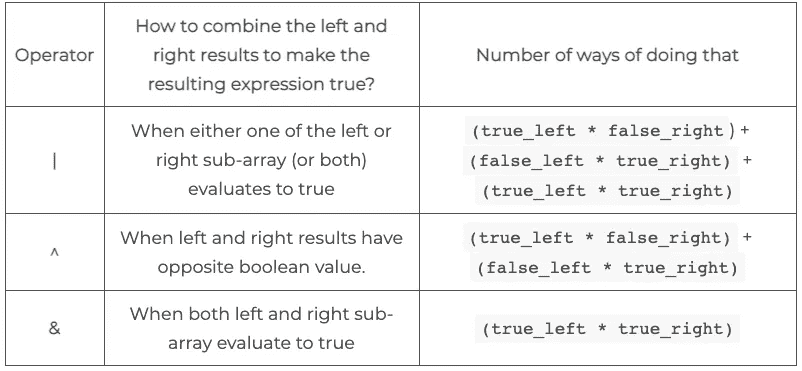
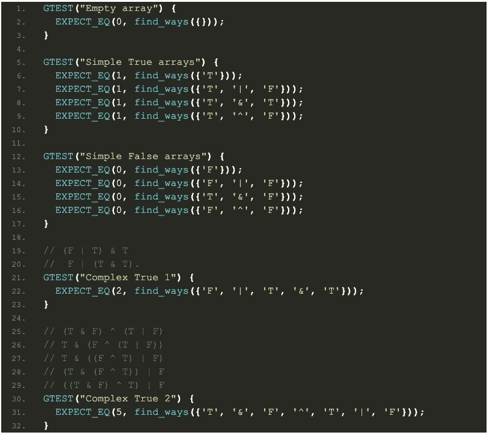

# 动态规划和布尔公式

> 原文：<https://levelup.gitconnected.com/dynamic-programming-and-boolean-formulae-2e1d09fcb6fb>

*在编程面试中，动态编程是许多面试官的最爱——它测试你的问题公式化策略、对递归算法和数据结构(大多是多维数组或哈希表)的良好使用，还测试你对具有记忆化的递归算法的计算复杂性的推理能力。*

让我们在一个意想不到的地方解决一个动态编程问题。这个问题是 QuantCast 问的。随意翻阅 [*其他*](https://cppcodingzen.com/?p=319) [*帖子*](https://cppcodingzen.com/?p=218) *获取大部分动态编程实例。*

# 问题

您将看到一个表示布尔表达式的数组。这些元素有两种:

确定使用括号对数组元素进行分组的方式的数量，以便整个表达式的计算结果为`True`。

例如，假设输入是`['F', '|', 'T', '&', 'T']`。在这种情况下，有两个可接受的分组:`(F | T) & T`和`F | (T & T)`。

# 解决办法

像许多问题一样，解决方案的潜在提示来自这个例子。在给定的例子中，我们在不同的位置(在这种情况下，在布尔运算符`|`和`&`)对输入数组进行*分割*，并组合得到的解。这暗示了一个*分治*递归解决方案:

*   迭代整个符号数组。
*   每当我们遇到一个布尔运算符(`|`、`&`、`^`)，就把数组分成两部分，递归地找到这两部分的括号。
*   使用布尔运算符将两个解决方案组合起来，组成完整的解决方案。

假设我们原来的数组叫做`symbols`，假设`symbols[i]`是布尔运算符。我们将把数组分成两个子数组- `symbols[0...i-1]`(称为`left`)和`symbols[i+1...n]`(称为`right)`)。让我们定义四个数字:

1.  `false_left` =评估为假的`left`的括号数。
2.  `true_left` =评估为真的`left`的括号数。
3.  `false_right` =评估为假的`right`的括号数。
4.  `true_right` =评估为真的`right`的括号数。

使用运算符`symbols[i]`正确组合这四个数字非常重要，这样整个数组的计算结果为真。我们可以使用下表来组合它们:

我们将有一个类似的表，用于计算组合子数组的结果以使整个数组计算为假的方法的数量。

有了这个递归公式，就很容易为这个问题编写一个递归的解决方案。大多数候选人应该能够轻松地编写代码。然而，提出递归公式只是战斗的一部分！如果你利用这个事实，即许多对算法的递归调用共享这个解决方案，你的解决方案将会脱颖而出。对于任何给定的 I，符号[0..i-1]可以作为参数多次传递给递归方法。这种观察是 ***动态编程的标志。***

> 当一个问题的解可以从子问题的解中构造出来时，这个问题就被称为展示了一个最优子结构。此外，如果多个子问题共享一个解决方案，则可以使用**动态编程来解决该问题。**

动态编程通过在第一次调用子问题时将子问题的结果缓存在哈希表(通常称为*存储表*)中来实现高效的解决方案。对子问题的每个后续调用都简单地使用更快的缓存查找(而不是再次执行计算)来返回解决方案。

下面是我们例子中记忆化的工作方式——我们的原始数组是`symbols = ['F', '|', 'T', '&', 'T']`。假设我们试图解决子数组`symbols[2...4] = ['T', '&', 'T']`。

*   将评估为`true`的子数组括起来的方式有一种:`(T & T)`
*   没有任何方法可以将子数组括起来，以对其求值`false`。

计算完这些信息后，我们将其保存到两个表中:

*   `true_table[['T', '&', 'T']] = 1`
*   `false_table[['T', '&', 'T']] = 0`

对 ***相同子数组*** *的任何后续调用在 true_table 和 false_table 中查找并返回结果(1 或 0)，而不是重新计算括号。*

上面的动态编程公式启发了下面的 C++递归函数:

圆括号的递归动态规划算法

# 复杂性

显然，算法的复杂性是由递归`find_parenthesization`方法的复杂性决定的。看看这个方法——它被调用了多少次？该方法在数组中取两个索引，`start`和`end`。这两者都可以取 1 到 n 之间的任何值，其中 n 是数组的大小。而且，*因为记忆化，每一对(start，end)最多传递给递归函数一次！*由于有 O(n)对索引，递归方法最多调用 O(n)次。在每个调用中，我们可能会迭代整个子数组`symbols[start...end]`，做 O(n)量的工作。因此，算法的总时间复杂度为 O(n ) * O(n) = O(n)。由于我们维护的地图最多有 O(n)对形式的`(start, end)`，算法的总空间复杂度是 O(n)。

# 单元测试

让我们写几个好的单元测试，让我们的面试真正脱颖而出！我们将涵盖一些简单的情况(空数组，空真假数组等)。我们还将为一些复杂的情况编写测试，包括问题陈述中的情况。

圆括号的单元测试

*原载于 2021 年 1 月 19 日 https://cppcodingzen.com***。**