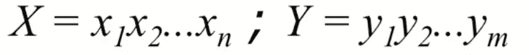
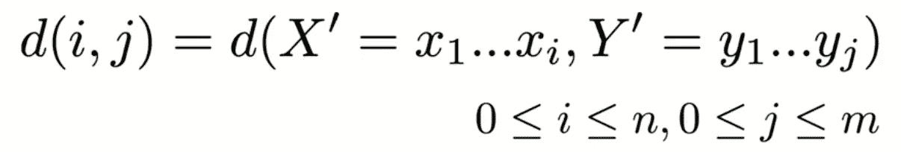
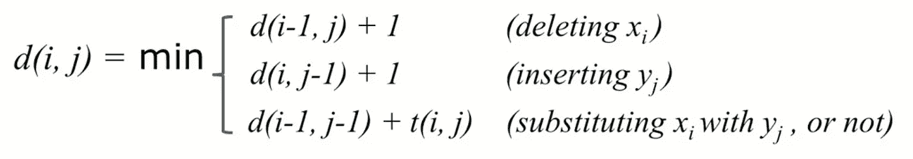

# 序列相似性的动态规划

> 原文：<https://levelup.gitconnected.com/dynamic-programming-for-sequence-similarity-ccc26472912e>

米卡·鲍梅斯特在 [Unsplash](https://unsplash.com?utm_source=medium&utm_medium=referral) 上的照片

有许多方法可以从数学上描述两个单词或字符序列之间的差异。我们可以查看两个字符串中的字符集，或者保持顺序，将每个字符串作为有序序列进行检查，对插入和替换给予不同的惩罚，等等。雅克卡相似度、余弦相似度和欧几里德距离是我们可以比较两个字符串的其他方法，根据您的使用情况，它们可能有价值。在本文中，我们将研究 Levenshtein 编辑距离的 Wagner-Fischer 算法，并用 python 实现它。

# 用例

字符串相似性有许多用例——DNA 序列比较、拼写检查和剽窃等等。通过拼写检查，我们可以用最小的编辑距离找到最近的单词。为了加速这个过程，我们可以在字典中存储各种子序列的编辑距离，并在用户键入时执行查找。

# 通过 Levenshtein 编辑距离的文本相似性

编辑距离告诉我们使两个序列相同所需的“最少数量的变化”。这可能包括插入、删除和替换字符。

设 d 为两个子序列之间的编辑距离，最多可以有 n 或 m 次编辑将字符串转换为另一个。

初始化 X 和 Y

编辑距离的公式

遍历矩阵，我们将在增加编辑距离时做出三个选择之一——删除、插入和替换。请注意，我们将通过一个矩阵将问题分解成更小的问题，其中存储了所有子序列的编辑距离。

# 动态规划方法

当实现 Wagner-Fischer 算法时，我们将使用一个 n x m 矩阵，其中第一行和第一列是给定的(因为我们知道我们最多可以有 n 或 m 个编辑，这与索引相同)。在动态规划中，我们通过解决子问题来解决更复杂的问题。在这种情况下，复杂的问题是整个序列，简单的问题是每次迭代的最小子序列(字符级)。我们从 d(1，1)开始，评估上面描述的 3 个选项。填写完该位置后，我们移动到(x+1，y)并完成该行。

我们的目标是 d(n，m)，在这里我们已经解决了沿途的每个子问题，并且可以通过链接编辑来追溯我们的编辑步骤。跟踪每行所需的最少数量的更改可能没有用，例如，知道 X 和 Y 的子序列比不同的子序列具有更长的编辑距离。如果我们追踪对角线，就会发现它在现实世界的用例中更有用。只需转到 distance_matrix(n，m)处的目标，以获得最少的编辑次数来使序列相同。

# Python 实现

这是编辑距离的代码。你会注意到我们接受两个字符串参数并返回一个定义为整数列表的矩阵。由于我们需要比较序列中的每个字母，并确定需要进行哪些更改，因此该算法的运行时间将为 O(n*m)。空间复杂度也将是 O(n*m ),但是我们可以进一步将其修改为仅是前一行，因为这是当前计算任务所需要的。

# 优化和修改

*   计算对角线，而不是矩阵中的每个位置，这将导致 O(m(1+d))运行时间，其中 d 是 Levenshtein 距离。
*   通过只存储前一行来优化空间，因为我们不需要任何其他信息。O(m) vs O(m*n)。
*   根据您的使用情况，使用不同的权重进行插入/删除/替换——在 DNA 序列编辑中，插入和删除具有不同的成本。
*   返回编辑距离而不是整个矩阵。

# 结论

Levenshtein 编辑距离易于理解和实现，其局限性取决于您的使用情况。人类基因组大约有 30 亿个碱基对，我们可以看到，考虑到这种规模的任务，这种类型的算法在时间和空间复杂度上都是低效的。我们将在以后的文章中探索评估序列相似性的更有效的方法。