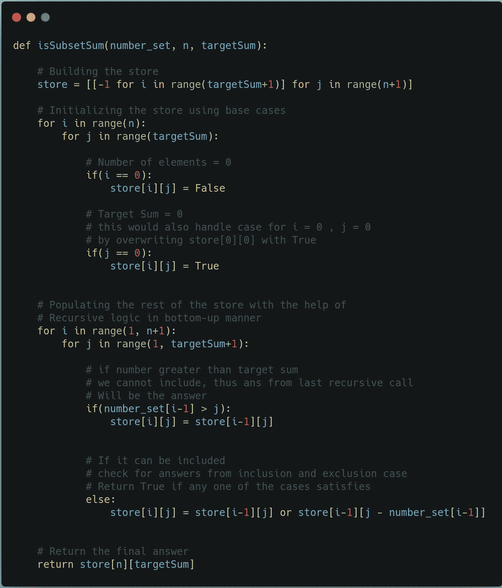

# 动态规划:子集和问题

> 原文：<https://levelup.gitconnected.com/dynamic-programming-subset-sum-c386126621cd>

## 动态规划问题#2:子集和


萨法尔·萨法罗夫在 [Unsplash](https://unsplash.com?utm_source=medium&utm_medium=referral) 上拍摄的照片

在开始子集和问题之前，我强烈推荐你阅读一下 [**动态编程**](https://medium.com/swlh/dynamic-programming-9a5e60fb7245) 的介绍。在这里，我已经介绍了如何处理基于 DP 的问题的基本方法。我们将使用相同的概念来解决**子集和**问题。我还建议仔细研究一下 [**背包问题**](https://medium.com/@tanishqvyas069/dynamic-programming-0-1-knapsack-5af91763b6d5) ，因为它是**子集和问题**的父问题。

话虽如此，我们开始吧！

# 1.什么是子集和问题？

给定一组 **N** 非负整数和一个目标和 **S** ，确定是否存在给定集合的子集，使得子集的元素和等于 **S** 。如果存在这样的子集，则返回 1，否则返回 0。

# 2.递归、记忆和制表

这个问题与[0–1 背包问题](https://medium.com/@tanishqvyas069/dynamic-programming-0-1-knapsack-5af91763b6d5)非常相似，在这种情况下是它的父问题。因此我推荐你去看一看。

如果你读过上面提到的两篇文章，那么你就会知道，为了编写一个合适的基于 DP 的解决方案，你必须能够想到一个递归的解决方案。我们将使用 Python3 来编码这个问题的解决方案。让我们看看递归解是什么样的。

## a)递归方法

为了写出一个递归解，一个人必须能够弄清楚两件事:*基础条件&递归逻辑*/递归关系*。*

1.  基本条件:基本条件总是指我们试图解决的问题的最小可能情况。在这种情况下，有两种可能性:

*   如果目标总和 **S** 等于 0。在这种情况下，不管给定的集合是什么，人们总是能够找到一个子集(它是空集),使得该子集的一些元素是 0。
*   如果集合( **N)** 中的元素个数为零。在这种情况下，无论我们如何努力，我们都无法得到一个元素之和等于目标和 **S** 的子集。因此，在所有这些情况下，我们返回**假**。然而，如果 **N = 0** 以及 **S = 0** ，我们返回 **True** ，因为空集满足要求。但是由于我们在上一点中已经讨论了这个案例，所以我们不需要在这里担心它。

2.**递归逻辑:**就像我们在[0–1 背包问题](https://medium.com/@tanishqvyas069/dynamic-programming-0-1-knapsack-5af91763b6d5)中做的一样，即使在这里我们也要看这个数是否有可能包含在子集里。

*   该数字的值必须小于或等于目标总和 **B** 才能被考虑纳入。
*   如果这个数字可以包括在内，我们考虑两种情况:

1.  数的包含:如果数被包含，那么我们将目标和减去该数，并继续下一个递归调用。

```
target_sum = target_sum - number
```

2.排除数:如果数不包括在内，那么目标和保持不变，我们简单地进行下一个递归调用。

记住所有这些，这就是递归解决方案的样子


有了基本的逻辑和我们前面讨论的案例，上面是相同的递归实现。现在我们有了递归的解决方案，让我们把它转换成一个**记忆的**解决方案。

## 记忆化

从我们在[这个](https://medium.com/swlh/dynamic-programming-9a5e60fb7245)和[这个](https://medium.com/@tanishqvyas069/dynamic-programming-0-1-knapsack-5af91763b6d5)的讨论中，我们都知道在编写记忆解决方案时，我们必须牢记以下几点:

*   为了减少递归调用，我们保存计算的值供以后使用。我更喜欢把这个变量叫做 **store** 。
*   商店的规模取决于在我们的递归解决方案的变化参数的数量。在这种情况下是 2:目标总和& N。因为目标总和可以总共取 **S+1** 个值，并且元素数目可以总共取 **N+1** 个可能值。这样我们就有了**商店【N+1】【S+1】**。
*   在计算任何呼叫的答案之前，我们检查存储中是否存在答案。如果它存在，我们同样返回。否则我们计算它并存储它以备后用。
*   可视化 **store** 最简单的方法是理解这样一个事实，即(在本例中)一般来说 **store[n][s]** 保存着函数调用 **isSubsetSum(number_set，n，s)** 的答案。

记住这几点，让我们看看修改后的解决方案是什么样的。


这就是我们如何通过增加几个简单的步骤来记忆我们的递归解。这极大地改进了解决方案，因为它将时间复杂度从指数级降低到多项式级。

现在让我们看看如何编写一个**列表**解决方案。

## c)制表

表格化的关键概念是能够借助**基本条件**和**递归逻辑**自下而上地构建**存储**。

从我们在[这](https://medium.com/swlh/dynamic-programming-9a5e60fb7245)和[这](https://medium.com/@tanishqvyas069/dynamic-programming-0-1-knapsack-5af91763b6d5)中的讨论中，我们都知道在编写列表解决方案时必须牢记以下几点:

*   商店的规模取决于在我们的递归解决方案的变化参数的数量。在这种情况下是 2:目标总和& N。因为目标总和可以总共取 **S+1** 个值，并且元素数目可以总共取 **N+1** 个可能值。这样我们就有了**商店【N+1】【S+1】**。
*   可视化 **store** 最简单的方法是理解这样一个事实，即(在这种情况下)通常 **store[n][s]** 保存函数调用 **isSubsetSum(number_set，n，s)** 的答案。
*   为了开始，我们必须有所建树。因此我们需要初始化**存储**的某些值。这就是**基地条件**来救援的地方。我们在递归解的基础条件的帮助下初始化存储。
*   使用初始化的值和递归逻辑完成对**存储器**的填充。从而最终获得 **store[n][targetSum]** 的值，我们知道，该值保存了对原始函数调用 **isSubsetSum(number_set，n，targetSum)** 的回答。然后我们返回相同的。

记住这几点，让我们看看列表解决方案(自下而上的方法)会是什么样子。



这就是如何通过遵循前面讨论的步骤和我们从递归解得到的知识来编写列表解。

至此，**子集求和问题**结束。我希望这篇文章能提供信息，帮助你正确理解 DP 的概念，以及如何为**子集和问题**编写**记忆**和**列表**解决方案。

# **参考文献&其他文章**

1.  [动态编程入门](https://medium.com/swlh/dynamic-programming-9a5e60fb7245)
2.  [0–1 背包问题|动态规划](https://medium.com/@tanishqvyas069/dynamic-programming-0-1-knapsack-5af91763b6d5)
3.  [等分问题|动态规划](https://tanishqvyas069.medium.com/dynamic-programming-equal-sum-partition-problem-b5059caf46bb)