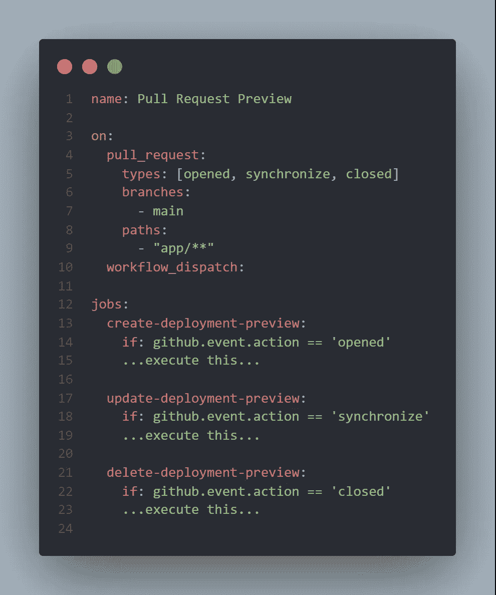
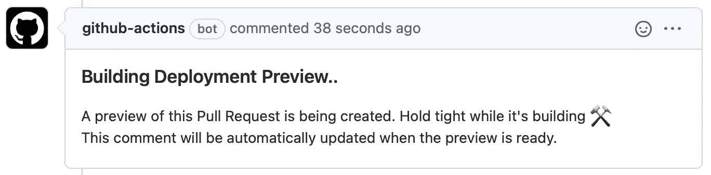

# 使用 GitHub 操作和 Azure 应用服务的动态拉取请求预览

> 原文：<https://levelup.gitconnected.com/dynamic-pull-request-previews-with-github-actions-and-azure-app-service-1f613986eab8>


## 如果你正在从 Vercel 或 Azure 静态 Web 应用程序中寻找你所知道并喜欢的 CI/CD 功能，但使用 Azure 应用程序服务，这篇文章是为你准备的。

**设置场景:**作为一名开发人员，您将业务挑战转化为代码，经常与希望(或需要)在 QA 环境中预览您的更改的设计人员和非技术利益相关者一起工作，确保在将它合并到生产中之前，一切看起来和工作起来都符合预期。

**挑战:**这通常需要大量的环境和开发运维流程——简而言之，大量的前期工具，这不是很敏捷！

> 作为一名开发人员，我希望能够与设计师分享我对 UI 的最新更改的实时预览，以便在集成代码之前，我们可以在一个实时但隔离的环境中更好地协作。

以下指南和代码要点记录了如何使用 Azure App Service 执行基于拉请求的部署预览。这个想法很大程度上是受 Abel Wang 的使用 Azure DevOps 的 Azure App 服务的静态 Web App PR 工作流[的启发。](https://devblogs.microsoft.com/devops/static-web-app-pr-workflow-for-azure-app-service-using-azure-devops/)


# 简单地

到本文结束时，您将已经构建了一个 GitHub Actions 工作流，它可以为 Node.js(灵活的)项目自动执行以下过程。

1.  开发人员打开一个拉取请求。
2.  该操作构建拉请求，将其部署到一个唯一的 URL，并在拉请求上留下一条注释，其中包含实时预览的链接。
3.  当开发人员将更多代码推送到拉请求的分支时，我们希望更新实时预览以反映他们的最新更改。
4.  一旦拉请求被关闭(通过合并显式地或隐式地)，实时预览应该被删除，因为它不再起作用。

✨ **注意:**最终的 GitHub 动作流程可以在本文底部找到。关于上下文，请继续阅读。

# 第 1 章:入门

本文假设您已经在 Azure 订阅中部署了 Azure 应用服务。如果您配置了从 GitHub 中的*主*分支到 App 服务的连续部署(这可以在创建 App 服务时配置，也可以稍后通过部署中心配置),您就可以开始了！


将 GitHub 连接到用于 CI/CD 的 Azure 应用服务

## 创建服务主体

其次，我们需要[创建一个服务主体](https://docs.microsoft.com/en-us/cli/azure/create-an-azure-service-principal-azure-cli)。请将此视为一组专用的凭证，GitHub 操作流将使用这些凭证来创建、更新和删除 App 服务的部署槽。

不用硬编码您自己的用户名和密码，我们可以利用服务主体的 RBAC 配置来精确地限定其权限范围，这样它只能执行它需要执行的特定任务集，而不能执行其他任务。

## **选项 A:使用 Azure 门户创建服务主体**

遵循这个指南:[通过 Azure 门户创建服务主体](https://docs.microsoft.com/en-us/azure/active-directory/develop/howto-create-service-principal-portal)

## **选项 B:使用 CLI 创建服务主体**

假设您通过`$ az login`进行了身份验证，在您的终端中执行下面的命令，但是一定要用您自己的值分别替换 SUBSCRIPTION-ID 和 RESOURCE-GROUP 占位符。

```
$ az ad sp create-for-rbac --name CICD-SP --role Contributor --scopes /subscriptions/[SUBSCRIPTION-ID]/resourceGroups/[RESOURCE-GROUP-NAME] --sdk-auth
```

上面的命令在你的 Azure 租户下创建一个名为 *CICD-SP* 和角色*贡献者*的服务主体。输出如下所示。稍后我们需要复制整个 JSON 响应。

```
{
  "clientId": "<GUID>",
  "clientSecret": "<GUID>",
  "subscriptionId": "<GUID>",
  "tenantId": "<GUID>",
  (...)
}
```

# 将服务主体添加为 GitHub 机密

第三步是告诉 GitHub 我们的服务原则，因为我们将在我们的动作工作流中使用它来认证和执行必要的部署任务。只需在您的存储库中创建一个新的 GitHub Secret，然后粘贴上面的 JSON 响应。

我将命名我的秘密: *AZURE_CREDENTIALS*


创建一个新的 GitHub 秘密

## 回顾:刚刚发生了什么？

我们创建了一个具有所需权限的服务主体。这个服务主体随后作为一个秘密被添加到我们的 GitHub 存储库中。现在，我们可以从 GitHub 动作工作流内部认证 Azure。

# 第 2 章:构建 GitHub 动作工作流

正如我们已经发现的，Azure 应用服务以部署插槽为特色。这些是可交换的环境，我们将利用它们为我们的拉请求动态地创建、发布和删除预览。


它看起来会像这样！

## 让我们建造它！

任何 GitHub 动作工作流的第一部分都是一个触发器，我们想要在一个 *pull_request* 事件上触发，但是具体来说，每次一个 pull 请求都是*打开*、*同步*或者*关闭*。因此，我们的模板如下所示:



GitHub 动作工作流程剖析

如您所见，我们有三个具体的任务，分别对应于我们需要执行的操作类型(即创建、更新或删除预览)。我们在这里看到的是，每个作业都是根据事件动作的类型有条件地执行的。

## 通过自动注释通知开发人员

如果拉请求被打开(第一次)，我们触发*创建-部署-预览*。我们需要做的第一件事就是通知开发者一个拉请求预览正在构建中。让我们从使用[创建或更新评论](https://github.com/marketplace/actions/create-or-update-comment)动作在这个拉请求上留下评论开始。


当在我们的工作流中实现时，它看起来像这样:



输出:对拉取请求的注释

## 创建唯一的部署插槽

这时我们的服务负责人终于出现了。我们需要连续做三步。登录 Azure，在我们的应用服务中创建部署槽，并发布代码！

得益于 [Azure 登录](https://github.com/marketplace/actions/azure-login)动作，通过 GitHub 动作登录 Azure 变得简单了。我们需要做的就是引用我们之前创建的 GitHub 秘密。


一旦我们通过了身份验证，我们希望创建一个惟一的部署槽，将拉请求的实时预览推送到这个部署槽。在这一步，我们通过 [Azure CLI 动作](https://github.com/marketplace/actions/azure-cli-action)利用 Azure CLI 命令。


当我们调用 Azure CLI 命令来创建新的部署插槽时，这里会发生一些事情(参见 [CLI 文档](https://docs.microsoft.com/en-us/cli/azure/webapp/deployment/slot))。

首先，我们传递应用服务的名称和相应的资源组。最后，我们需要向命令传递一个插槽名称。这里，我们根据连续的拉请求编号动态地构建一个名称。例如:*预览-pr-1*


现在，我们将拉请求预览发布到先前创建的部署槽。这意味着我们将能够在完成后在浏览器中查看它。但是你会问，开发人员如何知道这个动态构造的预览 URL 呢？提示:我们更新评论！

## 更新部署预览注释

为了不使 pull 请求复杂化，我们将最初的注释(通知开发人员他们的代码正在部署中)更新为更有用的消息，共享到实时预览的链接。使用注释 id 和*编辑模式:替换*我们可以简单地覆盖它。

此外:+100 加分，因为你可以在评论中添加反馈！


🎉恭喜你！这就是我从现在开始用 Azure App Service 做拉请求部署预览的方式。


完整的 GitHub Actions 工作流(包括如何处理对 Pull 请求的更新，以及在 PR 结束时删除部署槽)记录如下。我将感谢您的反馈👏🏼

✨领英:[奥拉夫·瑞伊登](https://www.linkedin.com/in/olafwrieden/)✨github:[关注我](https://github.com/olafwrieden)

[](https://www.buymeacoffee.com/olafwrieden)

## 完成 GitHub 操作工作流程