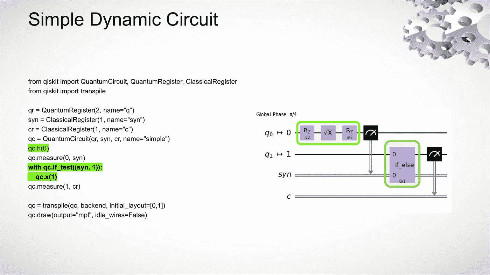

# 动态量子电路，第一课

> 原文：<https://levelup.gitconnected.com/dynamic-quantum-circuits-lesson-1-f712bc6a9e1d>



# 仅供参考:代码片段不起作用。

动态量子电路在 [IBM 量子峰会 2022](https://medium.com/@bsiegelwax/ibm-quantum-summit-2022-d1c646169189) 上宣布，并在第二天的 [IBM 量子从业者论坛](https://bsiegelwax.medium.com/ibm-quantum-practitioners-forum-2022-67a31a23407f)上展示了一些细节。简而言之，你在将静态量子电路排队运行之前，先设计它们的整体，而在它们排队运行之后和实际运行期间，你使用经典逻辑来生成动态电路。

这一课将会很简短，但却很重要。

## 第一课

你不能打开你的旧 Jupyter 笔记本，开始更新你的代码来生成动态电路。尽管你需要最新版本的 Qiskit，你需要改变你设计电路的方式，你也需要改变你加载后端的方式，以及你传输和执行动态电路的方式。我建议浏览 Qiskit“[动态电路介绍](https://quantum-computing.ibm.com/services/programs/docs/runtime/manage/systems/dynamic-circuits/Introduction-To-Dynamic-Circuits)”和其他教程，以免错过任何更新。

## 例子

```
from qiskit_ibm_provider import IBMProvider

provider = IBMProvider()
backend = provider.get_backend(backend_name, instance=hgp)
```

我不得不改变我的模板中的所有上述内容。

```
qc = transpile(qc, backend, initial_layout=[0,1])
```

它可能在没有 *initial_layout* 参数的情况下也能工作，但是它包含在足够多的示例中，因此值得推荐。

```
job = backend.run(
    qc, dynamic=True, init_qubits=False
) 
```

参数 *dynamic* 和 *init_qubits* 是新的…也是重要的。

同样，实际设计电路的方式也发生了很大的变化。

## 结论

您总是会发现许多要解决的问题，但是希望这篇文章能够让您在未来的痛苦中少受一点折磨。如果你复制并粘贴了一些代码，但它不能工作，很有可能你只是没有足够的复制和粘贴。