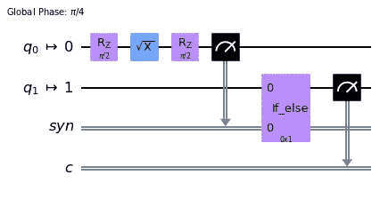

# 动态量子电路，第二课

> 原文：<https://levelup.gitconnected.com/dynamic-quantum-circuits-lesson-2-d31d7a287c62>


[https://pix abay . com/illustrations/binary-1-0-computer-code-zero-1066983/](https://pixabay.com/illustrations/binary-1-0-computer-code-zero-1066983/)

# 注意你的古典音乐

动态量子电路在 [IBM 量子峰会 2022](https://medium.com/@bsiegelwax/ibm-quantum-summit-2022-d1c646169189) 上宣布，并在第二天的 [IBM 量子从业者论坛](https://bsiegelwax.medium.com/ibm-quantum-practitioners-forum-2022-67a31a23407f)上展示了一些细节。简而言之，你在将静态量子电路排队运行之前，先设计它们的整体，而在它们排队运行之后和实际运行期间，你使用经典逻辑来生成动态电路。

## 教程预告

Qiskit 教程让动态电路看似简单。您有一个简单的电路，执行一些操作，进行电路中间测量，执行(或不执行)一些条件操作，然后进行最终测量。很简单。



静态动态电路

## 静态动态电路

我称之为静态动态电路。如果仔细观察上面的电路，您会发现定义了两个经典寄存器。每次测量都有一个经典寄存器。如果您事先知道您需要多少个经典寄存器，那就太好了，但如果您不知道呢？

## 动态电路

我正在研究一条真正动态的赛道。我事先不知道要测量多少次。虽然模拟器允许位重用，但真正的硬件不允许。再者，你不能动态定义经典寄存器，例如:cr[0]，cr[1]等。不要相信错误消息是描述性的；他们不是。

```
...
list_of_qubits = [0, 1]
list_of_bits = list_of_qubits
qc.measure(list_of_qubits, list_of_bits)
...
list_of_bits = [bit + len(list_of_qubits) for bit in list_of_bits]
qc.measure(list_of_qubits, list_of_bits)
...
```

不过，您可以动态地做一件事，那就是位分配。虽然我不知道我需要进行多少度量，但我的代码知道。因此，如果您发现自己处于这种情况，您可以定义一个大型经典寄存器，然后以编程方式分配测量值，以便每个测量值都有自己的专用位。

如果你不介意你的位完美，模拟器可能仍然使它看起来好像一切都很好。然而，硬件是无情的。

## 动态量子电路系列

*   [动态量子电路，第一课](https://medium.com/@bsiegelwax/dynamic-quantum-circuits-lesson-1-f712bc6a9e1d)