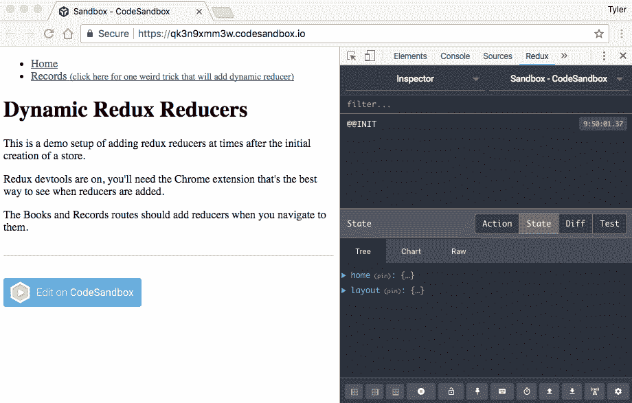

# 动态 Redux 减速器

> 原文：<https://levelup.gitconnected.com/dynamic-redux-reducers-f2889adb83fa>


*原载于我的个人博客*[*【https://tylergaw.com/articles/dynamic-redux-reducers】*](https://tylergaw.com/articles/dynamic-redux-reducers/)

这篇文章是针对我最近在 React / Redux 项目中的一个需求而写的。这是一个常见的需求，我以前也遇到过，但这是我第一次需要为它想出一个解决方案。这对我来说很难。我不得不放慢速度，花时间去理解我想做的事情和所有相关的部分。我希望这篇文章能帮助其他使用 Redux 的人解决这个问题。

我将在这篇文章中详细描述我的过程。这里有一个[现场演示](https://qk3n9xmm3w.codesandbox.io/)和一个[可编辑沙盒](https://codesandbox.io/s/qk3n9xmm3w)。查看效果的最佳方式是使用 Redux DevTools Chrome 扩展。

如果你正在阅读这篇文章，我将假设你已经了解 Redux，并且正在通过`react-redux`的方式将它与 React 一起使用。我还假设你正在寻找一个类似问题的解决方案。

# 我在努力做什么，为什么？

在标准 Redux 用法中，您在使用`createStore`创建存储时提供 reducer 函数。我想要一种随后按需添加 reducer 功能的方法。

很多人需要这个，因为由于代码分裂，他们的减速器在`createStore`时间不可用。这是动力减速器的完美用途。

我的项目不使用代码分割。为此，动态减速器是首选。我不想在整个项目结构中传播关于模块的信息。我希望每个特性都存在于一个目录中，尽可能地隔离开来。这意味着共同定位异径管、组件、样式等等。我可以这样做，并且仍然将减速器导入到主减速器创建中，但是这样会将模块减速器耦合到主减速器。

# 现有解决方案

在我搜索现有解决方案时，我登陆到了[这个堆栈溢出问题和答案](https://stackoverflow.com/a/33044701)。答案来自丹·阿布拉莫夫，所以我知道这是一个不错的选择。我的解决方案使用了该答案中的大部分代码。

在丹的回答中，直到他举例说明如何注射还原剂，我才明白。我正在使用 React 路由器，但我没有按照他描述的方式定义路由。我不想为此改变我对路线的定义。我也找不到他在例子中使用的方法的官方文档，所以我想避免复制/粘贴。我还想完全理解我添加到项目中的代码。

值得一提的是我在搜索中遇到的两个项目: [redux-dynamic-reducer](https://github.com/ioof-holdings/redux-dynamic-reducer) 和 [paradux](https://github.com/asteridux/paradux) 。我没有尝试这两种方法，因为我认为没有必要添加另一个依赖项，但是它们可能适合您。

# 演示展示了什么

[演示](https://qk3n9xmm3w.codesandbox.io/)显示了一个简单的页面，上面有一个到`/records`的链接。当页面加载时，Redux 状态树包含两个键，存储创建时引入的每个 reducer 函数对应一个键。

有一个到`/records`页面的链接。当您导航到该页面时，我为记录添加了另一个 reducer 函数。在这篇文章的剩余部分，我将描述我是如何做到这一点的。

# 代码

你可以在[代码沙箱](https://codesandbox.io/s/qk3n9xmm3w)中跟随。我将从在`/rootReducer.js`中创建根减速器开始。

```
import { combineReducers } from "redux"; 
import layout from "./reducers/layout"; 
import home from "./reducers/home"; /** 
 * @param {Object} - key/value of reducer functions 
 */ 
const createReducer = asyncReducers => 
  combineReducers({ 
    home, 
    layout, 
    ...asyncReducers 
  }
); export default createReducer;
```

我从丹的回答中提取了这段代码。它有两个减速器功能；`layout`和`home`。它们是全局归约器，而不是模块级的，所以它们非常适合根归约器。

这里的关键细节是`asyncReducers`参数。将它的内容添加到给定给`combineReducers`的对象中，这就是我们后来添加 reducers 的方式。

接下来是在`/initializeStore.js`创建商店。同样，大部分代码来自 Dan 的例子。

```
import { createStore } from "redux"; 
import createReducer from "./rootReducer"; const initializeStore = () => { 
  const store = createStore(createReducer());   store.asyncReducers = {}; 
  store.injectReducer = (key, reducer) => { 
    store.asyncReducers[key] = reducer;  
    store.replaceReducer(createReducer(store.asyncReducers)); 
    return store; 
  }; return store; 
}; export default initializeStore;
```

`initializeStore`的第一行是我们用来自`createReducer`的初始减速器创建 Redux 商店的地方。在标准的 Redux 用法中，这就是你所需要的。仓库已设置好，并准备好`home`和`layout`减速器。

`createStore`返回一个普通的对象，所以我们将利用这个优势在它上面添加有用的项目。我们将使用`store.asyncReducers`安装动态减速器。`store.injectReducer`我背离了丹的榜样。该功能与他的`injectAsyncReducer`功能相同，但为了方便起见，我将其附加到了`store`对象上。我以后会展示给你看。

`injectReducer`有两个职责。首先将所有动力减速器存放在`asyncReducers`。这确保了每次我们调用`injectReducer`时，我们不会丢失其他动态减少器。接下来是主要工作。`[replaceReducer](https://redux.js.org/docs/api/Store.html#replaceReducer)`不是定制的，是 Redux 的一部分。它做它在 tin 上说的事情:调用它会用你给它的函数替换 reducer 函数。

# 对我来说事情变得棘手了

在这一点上，对我来说一切都很简单，但是我很快就迷路了。我有一个存储，我有一个函数来添加新的 reducers，但是我在哪里可以访问该函数来调用它呢？在我疯狂的谷歌搜索中，我找不到一个适合我的例子。所以，我坐下来想出了一个解决方案。

我花了一段时间才想出在哪里可以访问那个`store`对象。不过，我有线索。在我的入口点文件`/index.js`中，我使用了`Provider`组件。这是 reactor/Redux 项目的标准要求。

```
import React from "react"; 
import { render } from "react-dom"; 
import { Provider } from "react-redux"; 
import initializeStore from "./initializeStore"; 
import App from "./App"; const store = initializeStore(); 
render( 
  <Provider store={store}> 
    <App /> 
  </Provider>, 
  document.getElementById("root") 
);
```

将`store`赋予`Provider`使其通过`connect`功能可用于所有子组件。我读了更多关于它的东西，并且了解到`store`在每个组件的`context`中也有提供。如果你读过任何关于反应`context`的东西，你就已经读到你可能不应该使用它。对我来说，这里似乎足够孤立，可以接受。时间会证明这是对还是错。稍后会有更多关于我的`context`用法的细节。

# 把这些碎片放在一起

我想用尽可能少的代码来添加减压器。我用`/withReducer.js`中的[高阶成分](https://reactjs.org/docs/higher-order-components.html)来做这个。

```
import React from "react"; 
import { object } from "prop-types"; const withReducer = (key, reducer) => WrappedComponent => { 
  const Extended = (props, context) => { 
    context.store.injectReducer(key, reducer); 
    return <WrappedComponent {...props} /> 
  };   Extended.contextTypes = { 
    store: object 
  }; return Extended;
}; export { withReducer };
```

`routes/Records/Records.js`中的用法示例:

```
import { withReducer } from "../../withReducer"; 
import reducer from "./ducks"; const Records = () => (...); export default withReducer("records", reducer)(Records);
```

我先从`Records.js`中的用法说起。我从`routes/Records/ducks/index.js`导入记录缩减器。reducer 做的不多:它设置一个硬编码的初始状态，然后按原样返回。该组件的作用类似于容器组件。我可以`connect`它，但是为了这个演示的目的，把它省略了。

相关的部分是最后一行。在那里，我调用`withReducer`，并为它提供一个“records”键和记录缩减器。然后我调用返回的函数，提供`Records`组件。

`Records`是我导入的 React 组件，用作 React 路由器`<Route />`的`component`属性值。

# withReducer 组件

`withReducer`是[的高阶元件](https://reactjs.org/docs/higher-order-components.html)。`key`参数成为 Redux 状态树中的关键字。`reducer`参数是要添加的减速器。它返回一个接受单个参数`WrappedComponent`的函数，该参数应该是一个有效的 React 组件。在前面的使用示例中，那是`Records`组件。

我将跳到`withReducer`的一个重要部分，它对我来说是新的，可能会令人困惑。

```
... 
Extended.contextTypes = { store: object }; 
...
```

`Extended`是一个无状态组件，所以它必须定义一个`contextTypes`属性来访问`context`。从 React 文档中:

> *如果 contextTypes 被定义为函数的属性，无状态功能组件也能够引用上下文。*
> 
> [*react js . org/docs/context . html # referencing-context-in-stateless-functional-components*](https://reactjs.org/docs/context.html#referencing-context-in-stateless-functional-components)

在`contextTypes`中，我在组件`store`中定义了我想要访问的属性。它使用了来自`prop-types`库中的`object`类型。

当一个组件定义了一个`contextTypes`属性时，它接收第二个参数`context`。这可以从`Extended`签名中看出:

```
... 
const Extended = (props, context) => {...} 
...
```

`Extended`现在可以访问`store`对象。这是因为`/index.js`中的`<Provider store={store}>`通过`context`使其对所有子组件可用。

这发生在带有`[getChildContext](https://github.com/reactjs/react-redux/blob/master/src/components/Provider.js#L26)`和`[childContextTypes](https://github.com/reactjs/react-redux/blob/master/src/components/Provider.js#L52)`的`Provider.js`源中。如果你正在寻找`context`用法的例子，这段代码是很好的读物。

在`initializeStore.js`中，我在 store 对象上创建了一个函数`store.injectReducer`。现在，我用它来添加新的减速器:

```
... 
const Extended = (props, context) => { 
  context.store.injectReducer(key, reducer); 
  return <WrappedComponent {...props} />; 
}; 
...
```

原来的成分不变。`Extended`只返回它的任何原始属性。

# 如何看待这项工作

此时，代码工作了，但是这种类型的更改很难可视化。如前所述， [Redux DevTools Chrome 扩展](https://github.com/zalmoxisus/redux-devtools-extension)可以很好地实现这个目的。在[演示](https://qk3n9xmm3w.codesandbox.io/)中，我在创建商店时包含了 DevTools 片段。如果您安装扩展并查看 Redux 面板，您可以看到新的 Redux 改变了状态树。



*导航到/records 路线时添加记录缩减器的演示。*

为了在演示中进一步展示结果，我`connect`添加了记录路径来显示来自商店的记录数据。

```
... 
const mapStateToProps = (state, props) => { 
  const { match: { params: { id } } } = props; return { 
    recordId: id, 
    record: state.records[id] || {} 
  }; 
}; export default connect(mapStateToProps)(Record);
```

完整代码在`/routes/Records/routes/Record.js`中。

# 一个解决方案

正如我前面提到的，出于不同的原因，这是 React/Redux 项目中的常见需求。我过去也使用过其他类似的动态路线方法。其他人有不同的方法。也就是说，这是*一个*的解决方案，不一定是*一个*的解决方案。

如果这是有帮助的，并且你照原样使用它或者改变它以适合你的需要，让我知道。总有改进的空间。

*感谢阅读*

*原载于*[*tylergaw.com*](https://tylergaw.com/articles/dynamic-redux-reducers/)*。*