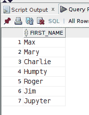

# 使用案例表达式的动态 RPAD()函数— Oracle SQL 示例

> 原文：<https://levelup.gitconnected.com/dynamic-rpad-function-using-a-case-expression-oracle-sql-example-digital-owls-prose-591e2bf2de08>

我最近写了两篇关于 SQL `CASE`表达式的博文，并附有 MySQL 中的例子。随着我对 Oracle SQL 的研究和了解越来越多，我想将一个`CASE`表达式应用到用于*动态字符串 pa* 添加的`RPAD()`字符函数中。继续阅读，查看查询示例…

图片由 [Gerd Altmann](https://pixabay.com/users/geralt-9301/?utm_source=link-attribution&utm_medium=referral&utm_campaign=image&utm_content=235079) 提供，来自 [Pixabay](https://pixabay.com/?utm_source=link-attribution&utm_medium=referral&utm_campaign=image&utm_content=235079)

自我推销:

如果你喜欢这里写的内容，尽一切办法，把这个博客和你最喜欢的帖子分享给其他可能从中受益或喜欢它的人。既然咖啡是我最喜欢的饮料，如果你愿意，你甚至可以给我买一杯！

SQL `CASE`表达式非常强大，我越来越多地在需要动态*选项的查询表达式中使用它。*

## 实践数据

这篇文章的虚构数据存储在一个 **FRIENDS** 表中，其中 **FIRST_NAME** 列包含以下值:

使用`LENGTH()`函数，我们可以在这个查询中看到每个**名字**和相应的名字长度:

## 创建绑定变量

为了确定最长的 **FIRST_NAME** 列长度值，我将对 **FIRST_NAME** 列使用`LENGTH()`字符函数，并将整个表达式包装在一个`MAX()`函数调用中:

接下来，我创建一个名为 **max_fname_len** 的绑定变量来存储这个值，以便在任何后续查询中更容易地使用和处理:

## 动态 RPAD()用例

对于这个需求，我使用了`RPAD()`函数将 *n* 个字符添加到每个‘first _ name’值中，这取决于该值是否小于最大‘first _ name’列长度值 7。`RPAD()`接受 3 个参数(2 个强制，1 个可选):

*   target_string —要填充的字符串。
*   length —字符串用设置的填充字符串填充后的长度。
*   填充字符串—将填充到 target_string 的字符串(在本例中，右填充)。如果未指定，则使用单个空格。

通过使用第二个参数中搜索到的`CASE`，每行的长度值为*动态*:

请注意，在查询结果中，具有**名字**列值‘查理’和‘朱庇特’的行没有被*右填充*，因为它们各自的长度都是 7。但是，所有其他的 **FIRST_NAME** 列值都被*右填充了一些星号(*)，直到 **max_fname_len** 值为 7。*

**FIRST_NAME** 列值为‘Humpty’的行被*右填充了一个星号*，因为该字符串的长度为 6。然而,“Jim”这个名字是用 4 个星号字符右填充的*,这样总长度为 7，因为它的长度只有 3。*

如果你对其他类似的内容感兴趣，请随意访问下面的帖子:

*   [使用 Oracle SQL Developer 导入 CSV 文件](/import-csv-file-with-oracle-sql-developer-b619240168e4)
*   [SUBSTR()字符函数— Oracle SQL 示例](/substr-character-function-oracle-sql-example-fcdd37a5a3a8)
*   [如何使用 Oracle SQL 日期函数找到一个月的第一天和最后一天](/how-to-find-the-first-and-last-day-of-a-month-with-oracle-sql-date-functions-706572c751a8)

我知道这个示例查询可能没有实际用途，完全是任意的。但是，我希望通过这篇博文，您能够了解如何在查询中需要动态值时应用 **CASE** 表达式。感谢您的阅读。

喜欢你读过的？看到什么不正确的吗？请在下面评论，感谢阅读！！！

# 行动的号召！

感谢你花时间阅读这篇文章。我真心希望你发现了一些有趣和有启发性的东西。请在这里与你认识的其他人分享你的发现，他们也会从中获得同样的价值。

访问[投资组合-项目页面](https://wp.me/P28ctb-3KD)查看我为客户完成的博文/技术写作。

[**咖啡是我最喜欢喝的东西！**](https://ko-fi.com/joshlovescoffee)

要在最新的博客文章发表时收到来自本博客(“数字猫头鹰散文”)的电子邮件通知(绝不是垃圾邮件)，请点击“点击订阅！”按钮在首页的侧边栏！(如有任何问题，请随时查看 [Digital Owl 的散文隐私政策页面](https://wp.me/P28ctb-3gI):电子邮件更新、选择加入、选择退出、联系表格等)

请务必访问[“最佳”](https://joshuaotwell.com/where-blog_post-in-digital-owls-prose-best-of/)页面，收集我的最佳博文。

[作为一名 SQL 开发人员和博客写手，Josh Otwell](https://joshuaotwell.com/about/) 热衷于学习和成长。其他最喜欢的活动是让他埋头于一本好书、一篇文章或 Linux 命令行。其中，他喜欢桌面 RPG 游戏，阅读奇幻小说，并与妻子和两个女儿共度时光。

免责声明:本文中的例子是关于如何实现类似结果的假设。它们不是最好的解决方案。所提供的大多数(如果不是全部)示例都是在个人发展/学习工作站环境中执行的，不应被视为生产质量或就绪。您的特定目标和需求可能会有所不同。使用那些最有利于你的需求和目标的实践。观点是我自己的。

如果这篇文章和其他 SQL/PHP 内容让你感兴趣，请务必注册我的每周电子邮件(离线链接)。

*原载于 2021 年 6 月 9 日 https://joshuaotwell.com**的* [*。*](https://joshuaotwell.com/dynamic-rpad-function-using-a-case-expression-oracle-sql-example/)