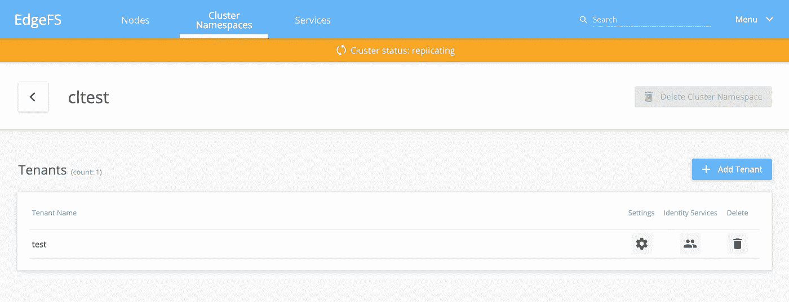
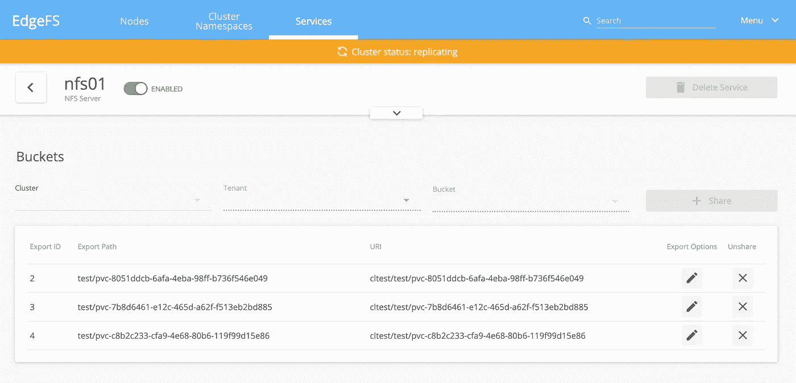
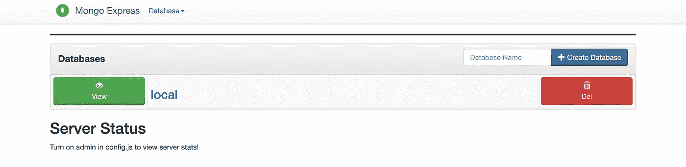
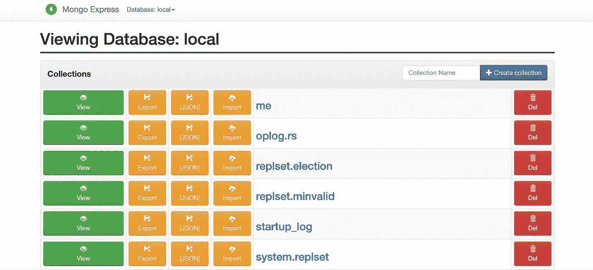

# Kubernetes 的动态存储供应

> 原文：<https://levelup.gitconnected.com/dynamic-storage-provisioning-for-kubernetes-d43891fd1a51>

## 让 Rook/EdgeFS 驱动您的 MongoDB 集群


照片由[劳伦斯利弗莫尔国家实验室](https://commons.wikimedia.org/wiki/Lawrence_Livermore_National_Laboratory)提供

在我的上一篇文章[构建你自己的家庭云存储(第二部分)](https://medium.com/better-programming/build-your-own-in-home-cloud-storage-part-2-8fe86e9bd5bf)中，我们使用 [Rook](https://rook.io/) 创建了一个 [EdgeFS](http://edgefs.io/) 存储集群，但是没有真正使用它。在本文中，我将展示如何创建一个存储类类型，允许您对它进行持久的卷声明。

直到最近，声称在 Kubernetes 存储是一个偶然的事情。这是因为它被视为 GKE 或 AWS 等 Kubernetes 提供商的领域，每个人都有自己的解决方案。Kubernetes 1.13 增加了容器存储接口(CSI ),它为第三方存储提供商提供了一条通向 Kubernetes 集群的桥梁。通过 CSI，提供商可以实现`StorageClass`和`PersistentVolume`类型的基本方面，使管理员能够静态或动态地定义存储，并使 pod 用户能够申请存储。我们将通过 Rook/EdgeFS 使用这个接口为一个 [MongoDB](https://www.mongodb.com/) 副本集提供存储。

我应该描述一下我们将在本文中用到的一些部分。EdgeFS 是一个集群存储解决方案，可以独立使用。Rook 是一个 Kubernetes 操作符，它将在 Kubernetes 中自动建立一个 EdgeFS 集群。Rook 有一个 CSI 驱动程序，允许我们在 EdgeFS 中动态地创建和使用存储桶。在我的上一篇文章[构建您自己的家庭云存储(第 2 部分)](https://medium.com/better-programming/build-your-own-in-home-cloud-storage-part-2-8fe86e9bd5bf)中，我用 Rook 创建了 EdgeFS 集群，我们将在此基础上添加 CSI 实现。如果您不理解我的前一篇文章，我们有一个 Kubernetes 集群，它有七个节点，kube1-kube4 作为我们的控制面板和三个工作节点，node 1–3 作为处理 EdgeFS 集群的节点。我的 GitHub 存储库中的 [README.md](https://github.com/rkamradt/storage-deploy/blob/master/README.md) 有设置集群的基本说明。

首先，让我们对 Kubernetes 做一个小小的设置。我在我的文章 [Kubernetes from Scratch](https://medium.com/better-programming/kubernetes-from-scratch-4691283e3995) 中创建的集群没有正确的 CSI 驱动程序定义，所以我需要添加它们:

现在，您需要 ssh 到 Kubernetes 集群中的每个节点，并安装 NFS 支持:

```
sudo apt install -y nfs-common rpcbind open-iscsi watchdog
```

我添加了`open-iscsi`包，以防我们以后想玩 CSI `iscsi`驱动。

为了让事情更有条理，我将为 CSI 驱动程序组件创建一个单独的名称空间，名为`edgefs-nfs-csi`。

```
kubectl create namespace edgefs-nfs-csi
```

接下来，我们可以配置和部署 EdgeFS CSI NFS 驱动程序。在我的上一篇文章[构建你自己的家庭云存储(第 2 部分)](https://medium.com/better-programming/build-your-own-in-home-cloud-storage-part-2-8fe86e9bd5bf)中，我们从 Rook GitHub 资源库下载了示例。如果您没有，可以下载:

```
git clone --single-branch --branch release-1.3 \
       [https://github.com/rook/rook.git](https://github.com/rook/rook.git)
```

我已经创建了自己的 GitHub 存储库， [storage-deploy](https://github.com/rkamradt/storage-deploy/tree/v1.2) ，用于存储我的部署文件，因此我将把必要的文件复制到我的本地克隆中:

```
cp rook/cluster/examples/kubernetes/edgefs/csi/nfs/*.yaml \
     storage-deploy
```

这将给我们两个文件，`edgefs-nfs-csi-driver-config.yaml`和`edgefs-nfs-csi-driver.yaml`，它们都需要一点编辑。以下是`edgefs-nfs-csi-driver-config.yaml`的值

```
k8sEdgefsNamespaces: ["rook-edgefs"] 
k8sEdgefsMgmtPrefix: rook-edgefs-mgr 
cluster: cltest 
tenant: test    
username: admin 
password: admin
```

既然里面有密码，那就需要是 Kubernetes 的秘密。它可能也不应该出现在 GitHub repo 中，但是因为它只是一个例子，所以我将把它留在我的例子中。有点遗憾的是，配置都在同一个地方，而不是有一个单独的方式来指示用户名/密码。也许有一种方法，我会让你去发现。在更安全的环境中，我希望将集群的配置与凭证分开，因为我们不应该将凭证存储在版本控制中，但是我们可能希望将其余的定义存储在那里。

`edgefs-nfs-csi-driver.yaml`需要引用我们创建的名称空间。事实上，它使用`default`作为名称空间，但是我不想破坏`default`名称空间。编辑文件并用`namespace: edgefs-nfs-csi`替换`namespace: default`的所有实例。

在我们继续之前，我们需要在 EdgeFS 客户机中设置一些东西。CSI 适配器通过创建附加到集群/租户/服务三元组的存储桶来工作。但是这些工件需要提前创建，只有桶是动态创建的。在上面的配置中，集群是`cltest`，租户是`test`。稍后我们将使用一个服务`nfs01`。所以我们需要首先创建它们。您可以使用我们在上一篇文章末尾提到的 GUI 来创建这些工件，也可以使用命令行界面。我将在这里展示命令行界面版本。在`rook-edgefs`名称空间中找到`rook-edgefs-mgr`的 pod，在交互终端中执行`toolbox`命令

```
rkamradt@beast:~/storage-deploy$ kubectl exec -it rook-edgefs-mgr-648457b454-j2tcl -n rook-edgefs -- toolbox
Defaulting container name to rook-edgefs-mgr.
Use 'kubectl describe pod/rook-edgefs-mgr-648457b454-j2tcl -n rook-edgefs' to see all of the containers in this pod.Welcome to EdgeFS Mgmt Toolbox.
Hint: type neadm or efscli to beginroot@rook-edgefs-mgr-648457b454-j2tcl:/opt/nedge# efscli system statusSID                | HOST  |          POD           | USED,% | STATE   
+----------------------------------+-------+------------------------+--------+--------+
  3131644475DD1E38274C22A6E7D14DA8 | node1 | rook-edgefs-target-1-0 |  0.00  | ONLINE  
  40AD4245F79D8924F686E560C2256383 | node2 | rook-edgefs-target-0-0 |  0.00  | ONLINE  
  7A4ED7164285247D68236351AB7CD770 | node3 | rook-edgefs-target-2-0 |  0.00  | ONLINEroot@rook-edgefs-mgr-648457b454-j2tcl:/opt/nedge# efscli cluster create cltest
root@rook-edgefs-mgr-648457b454-j2tcl:/opt/nedge# efscli tenant create cltest/test
root@rook-edgefs-mgr-648457b454-j2tcl:/opt/nedge# efscli service create nfs nfs01
root@rook-edgefs-mgr-648457b454-j2tcl:/opt/nedge# exit
exit
```

会创造出我们需要的三件艺术品。我们还没有将服务附加到集群/租户，因为 CSI 供应器会这样做。如果您愿意，您可以在之前设置的 GUI 中查看这些服务。单击集群名称空间，然后单击`cltest`框，您应该会看到:



现在我们可以创建密码并应用驱动程序:

```
kubectl create secret generic edgefs-nfs-csi-driver-config \
   -n edgefs-nfs-csi --from-file=./edgefs-nfs-csi-driver-config.yaml
kubectl apply -n edgefs-nfs-csi -f edgefs-nfs-csi-driver.yaml
```

检查以确保它都在运行:

```
rkamradt@beast:~/storage-deploy$ kubectl get all -n edgefs-nfs-csi
NAME                              READY   STATUS    RESTARTS   AGE
pod/edgefs-nfs-csi-controller-0   3/3     Running   0          88s
pod/edgefs-nfs-csi-node-lcdxx     2/2     Running   0          88s
pod/edgefs-nfs-csi-node-tvc6m     2/2     Running   0          88s
pod/edgefs-nfs-csi-node-x97cp     2/2     Running   0          88sNAME                                TYPE        CLUSTER-IP    EXTERNAL-IP   PORT(S)     AGE
service/edgefs-nfs-csi-controller   ClusterIP   10.110.6.49   <none>        12345/TCP   88s
service/kubernetes                  ClusterIP   10.96.0.1     <none>        443/TCP     48dNAME                                 DESIRED   CURRENT   READY   UP-TO-DATE   AVAILABLE   NODE SELECTOR   AGE
daemonset.apps/edgefs-nfs-csi-node   3         3         3       3            3           <none>          88sNAME                                         READY   AGE
statefulset.apps/edgefs-nfs-csi-controller   1/1     88s
```

可能需要一段时间才能让所有的 pod 显示为就绪，所以请休息一下。

到目前为止，我们有一个名为`edgefs-nfs-csi-controller`的有状态集和一个名为`edgefs-nfs-csi-node`的守护进程集，一切都很好！

为了从我们的集群中进行动态配置，我们需要设置一个存储类。用以下内容创建一个文件`nfs-storage-class.yaml`:

```
apiVersion: storage.k8s.io/v1
kind: StorageClass
metadata:
  name: edgefs-nfs-csi-storageclass
provisioner: io.edgefs.csi.nfs
parameters:
  segment: rook-edgefs
  service: nfs01
```

然后应用:

```
kubectl apply -f nfs-storage-class.yaml
```

注意，存储类没有名称空间。现在，您应该能够使用存储类`edgefs-nfs-csi-storageclass`进行持久的卷声明

让我们通过使用新的存储类设置一个 MongoDB 副本集来尝试一下。创建一个文件`mongodb-stateful.yaml`并添加以下内容:

```
apiVersion: rbac.authorization.k8s.io/v1beta1
kind: ClusterRoleBinding
metadata:
  name: mongo-sidecar-rbac
subjects:
  - kind: ServiceAccount
    name: default
    namespace: default
roleRef:
  kind: ClusterRole
  name: cluster-admin
  apiGroup: rbac.authorization.k8s.io
---
apiVersion: v1
kind: Service
metadata:
  name: mongo
  labels:
    name: mongo
spec:
  ports:
  - port: 27017
    targetPort: 27017
  clusterIP: None
  selector:
    role: mongo
---
apiVersion: apps/v1
kind: StatefulSet
metadata:
  name: mongo
spec:
  serviceName: "mongo"
  replicas: 3
  selector:
    matchLabels:
      app: mongodb
  template:
    metadata:
      labels:
        role: mongo
        app: mongodb
        environment: test
    spec:
      terminationGracePeriodSeconds: 10
      containers:
        - name: mongo
          image: mongo:3.4
          command:
            - mongod
            - "--replSet"
            - rs0
            - "--bind_ip"
            - 0.0.0.0
            - "--smallfiles"
            - "--noprealloc"
          ports:
            - containerPort: 27017
          volumeMounts:
            - name: mongo-persistent-storage
              mountPath: /data/db
        - name: mongo-sidecar
          image: cvallance/mongo-k8s-sidecar
          env:
            - name: MONGO_SIDECAR_POD_LABELS
              value: "role=mongo,environment=test"
  volumeClaimTemplates:
  - metadata:
      name: mongo-persistent-storage
      annotations:
        volume.beta.kubernetes.io/storage-class: "edgefs-nfs-csi-storageclass"
    spec:
      accessModes: [ "ReadWriteOnce" ]
      resources:
        requests:
          storage: 100Gi
```

这将建立一个服务和一个有状态集。您将会注意到，除了 MongoDB 图像之外，它还使用了 sidecar 中的[cvallance/mongo-k8s-sidecar](https://github.com/cvallance/mongo-k8s-sidecar)助手。在一个 pod 中，您可以有多个容器，如果有一个主容器和一个辅助容器，则使用“sidecar”这个术语。它们仍然是独立的容器，但是因为它们存在于同一个 pod 中，所以它们共享所有相同的资源。sidecar 容器帮助 MongoDB 找到其他副本并在它们之间进行协调。用`kubectl apply -f mongodb-stateful.yaml`涂抹。

这里需要注意的是，上述 yaml 的第一部分将默认的 pod 用户绑定到 cluster-admin，这意味着您的任何 pod 都可以在集群上执行任何 Kubernetes 命令。这在生产中不是一个好主意。这里需要它，因为 sidecar 需要列出所有的 pod，以便能够找到对等的 mongo 服务。可能有一个更好的解决方案，但是现在，我要给所有的 pod`cluster-admin`权限。

它还使用了卷声明模板，因此每个 pod 都可以从我们之前创建的`edgefs-nfs-csi-storageclass`类中分配自己的存储。一旦所有副本都出现，我们就可以返回到 EdgeFS GUI 并检查供应情况。单击 Services 选项卡，单击`nfs01`框，然后向下滚动查看系统创建的存储桶:



在`nfs01`服务中，每个 mongo 副本集都有自己的存储桶。

因此，让我们测试一下我们的新 MongoDB 集群。我将安装 Mongo Express，这是一个基于网络的管理员。它可以从 [cowboysysop](https://www.cowboysysop.com/en/) 获得。要安装，需要两个命令:

```
helm repo add cowboysysop [https://cowboysysop.github.io/charts/](https://cowboysysop.github.io/charts/)
helm install mongo-express -n rook-edgefs \
    --set mongodbServer=mongo.default cowboysysop/mongo-express
```

我将它添加到了`rook-edgefs`名称空间，这样我就可以重用用于 EdgeFS GUI 的虚拟主机入口。由于`mongo`服务在`default`名称空间中，我必须将`.default`附加到`mongodbServer`值上。现在我可以更新我已经拥有的`vhost-ingress.yaml`:

```
apiVersion: networking.k8s.io/v1beta1
kind: Ingress
metadata:
  name: rook-ingress
  annotations:
    cert-manager.io/issuer: ca-issuer 
spec:
  rules:
  - host: rook.local
    http:
      paths:
      - backend:
          serviceName: rook-edgefs-ui
          servicePort: 3000
        path: /
  - host: mongo-express.local
    http:
      paths:
      - backend:
          serviceName: mongo-express
          servicePort: 8081
        path: /
  tls:
  - hosts:
    - mongo-express.local
    secretName: mongo-express-cert
  - hosts:
    - rook.local
    secretName: rook-cert
```

用`kubectl apply -n rook-edgefs vhost-ingress.yaml`涂抹。然后在您的笔记本电脑上添加`mongo-express.local`作为入口 IP 的别名，并浏览到`https://mongo-express.local`。



目前，唯一的数据库是由 MongoDB 默认创建的本地数据库。单击“查看”按钮查看详细信息



现在您已经有了 EdgeFS GUI 和 MongoDB Express GUI 可以使用了。就像您为 MongoDB 做持久存储声明一样容易，您也可以为其他 Kubernetes 应用程序获取存储。或者将您的微服务附加到新的 MongoDB 集群。玩得开心！感谢您阅读我的另一篇文章，这篇文章试图给软件开发增添一点乐趣。

以下是 GitHub 存储库，包含所有使用的脚本:

[](https://github.com/rkamradt/storage-deploy/tree/v1.2) [## rkamradt/存储-部署

### 将 Rook/EdgeFS 系统部署到 Kubernetes，参见文章“构建您自己的家庭云存储第二部分”

github.com](https://github.com/rkamradt/storage-deploy/tree/v1.2) 

这里是提到的其他文章:

[](https://medium.com/better-programming/build-your-own-in-home-cloud-storage-part-2-8fe86e9bd5bf) [## 构建您自己的家庭云存储(第 2 部分)

### 使用 Rook/EdgeFS 向 Kubernetes 集群添加存储

medium.com](https://medium.com/better-programming/build-your-own-in-home-cloud-storage-part-2-8fe86e9bd5bf) [](https://medium.com/better-programming/kubernetes-from-scratch-4691283e3995) [## 从零开始

### 不含 Minikube 或 Microk8s 的 Kubernetes

medium.com](https://medium.com/better-programming/kubernetes-from-scratch-4691283e3995)