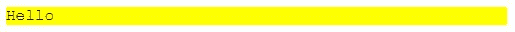

# 使用 Vue.js 的动态样式—更改类

> 原文：<https://levelup.gitconnected.com/dynamic-styling-with-vue-js-changing-classes-ad83ff4dd8a5>


约书亚·希伯特在 [Unsplash](https://unsplash.com?utm_source=medium&utm_medium=referral) 上拍摄的照片

Vue.js 是一个易于使用的 web 应用框架，我们可以用它来开发交互式前端应用。

在本文中，我们将看看如何通过改变类来用 Vue.js 动态地设计元素的样式。

# 更改 CSS 类

我们可以像其他属性一样用`v-bind`动态改变 CSS 类。

## 对象语法

这意味着我们可以用`class`属性做同样的事情。所以我们可以在`src/index.js`写下以下内容

```
new Vue({
  el: "#app",
  data: {
    message: "Hello",
    isActive: true
  }
});
```

那么在`index.js`中，我们可以写:

```
<!DOCTYPE html>
<html>
  <head>
    <title>App</title>
    <meta charset="UTF-8" />
    <script src="[https://cdn.jsdelivr.net/npm/vue/dist/vue.js](https://cdn.jsdelivr.net/npm/vue/dist/vue.js)">    </script>
    <style>
      .active {
        background-color: yellow;
      }
    </style>
  </head> <body>
    <div id="app">
      <div v-bind:class="{ active: isActive }">
        {{message}}
      </div>
    </div> <script src="src/index.js"></script>
  </body>
</html>
```

我们将得到黄色背景的单词`Hello`。

在上面的代码中，当`isActive`为`true`时，我们设置了`active`类。

类名是对象的属性名，布尔值表示该类将被应用`true`。

我们还可以如下所示将多个类添加到对象中。在`src/index.js`中，我们写道:

```
new Vue({
  el: "#app",
  data: {
    message: "Hello",
    isActive: true,
    isFancy: true
  }
});
```

然后在`index.html`中，我们写道:

```
<!DOCTYPE html>
<html>
  <head>
    <title>App</title>
    <meta charset="UTF-8" />
    <script src="[https://cdn.jsdelivr.net/npm/vue/dist/vue.js](https://cdn.jsdelivr.net/npm/vue/dist/vue.js)"></script>
    <style>
      .active {
        background-color: yellow;
      } .fancy {
        font-family: "Courier New", Courier, monospace;
      }
    </style>
  </head> <body>
    <div id="app">
      <div v-bind:class="{ active: isActive, fancy: isFancy }">
        {{message}}
      </div>
    </div> <script src="src/index.js"></script>
  </body>
</html>
```

然后应用`active`和`fancy`类，我们得到:



## 字符串语法

这个类也可以是一个字符串，所以我们可以这样写:

```
<div v-bind:class="active"></div>
```

当我们有一个字符串时，我们不需要引号。

## 数组语法

我们也可以用字符串数组来设置类。

例如，我们可以在`src/index.js`中编写以下内容:

```
new Vue({
  el: "#app",
  data: {
    message: "Hello",
    activeClass: "active",
    fancyClass: "fancy"
  }
});
```

然后在`index.html`中，我们写道:

```
<!DOCTYPE html>
<html>
  <head>
    <title>App</title>
    <meta charset="UTF-8" />
    <script src="[https://cdn.jsdelivr.net/npm/vue/dist/vue.js](https://cdn.jsdelivr.net/npm/vue/dist/vue.js)"></script>
    <style>
      .active {
        background-color: yellow;
      } .fancy {
        font-family: "Courier New", Courier, monospace;
      }
    </style>
  </head> <body>
    <div id="app">
      <div v-bind:class="[activeClass, fancyClass]">
        {{message}}
      </div>
    </div> <script src="src/index.js"></script>
  </body>
</html>
```

然后我们应用两个类，因为我们有`[activeClass, fancyClass]`，它和`['active', 'fancy']`一样。

如果我们想有条件地设置它们，我们可以这样写:

```
<div v-bind:class="[isActive ? activeClass : '', isFancy ? fancyClass: '']">
  // ...
</div>
```

而不是我们上面的。


[约书亚·希伯特](https://unsplash.com/@joshnh?utm_source=medium&utm_medium=referral)在 [Unsplash](https://unsplash.com?utm_source=medium&utm_medium=referral) 上拍摄的照片

# Vue 组件

我们可以直接给组件设置类。例如，如果我们在`src/index.js`中有以下内容:

```
new Vue({
  el: "#app",
  data: {}
});Vue.component("foo", {
  template: "<p class='foo'>Hi</p>"
});
```

然后我们可以在`index.html`中写下以下内容:

```
<!DOCTYPE html>
<html>
  <head>
    <title>App</title>
    <meta charset="UTF-8" />
    <script src="[https://cdn.jsdelivr.net/npm/vue/dist/vue.js](https://cdn.jsdelivr.net/npm/vue/dist/vue.js)"></script>
    <style>
      .active {
        background-color: yellow;
      } .fancy {
        font-family: "Courier New", Courier, monospace;
      } .foo {
        border: 1px solid red;
      }
    </style>
  </head> <body>
    <div id="app">
      <foo class="active fancy"></foo>
    </div> <script src="src/index.js"></script>
  </body>
</html>
```

在`foo`组件上设置类。然后，当我们包括应用的组件时，我们得到组件和我们应用的组件上的类，所以我们得到:

```
<p class='active fancy foo'>Hi</p>
```

# 结论

我们可以用不同的方式设置类。要动态设置类，我们可以用对象语法、字符串、数组或组件内外来设置它们。

为了有条件地设置类，我们可以对每个语法使用三元运算。

有了 object 语法，我们可以把类名写成对象的键，当我们想要打开一个类时，我们可以写一个布尔值`true`。