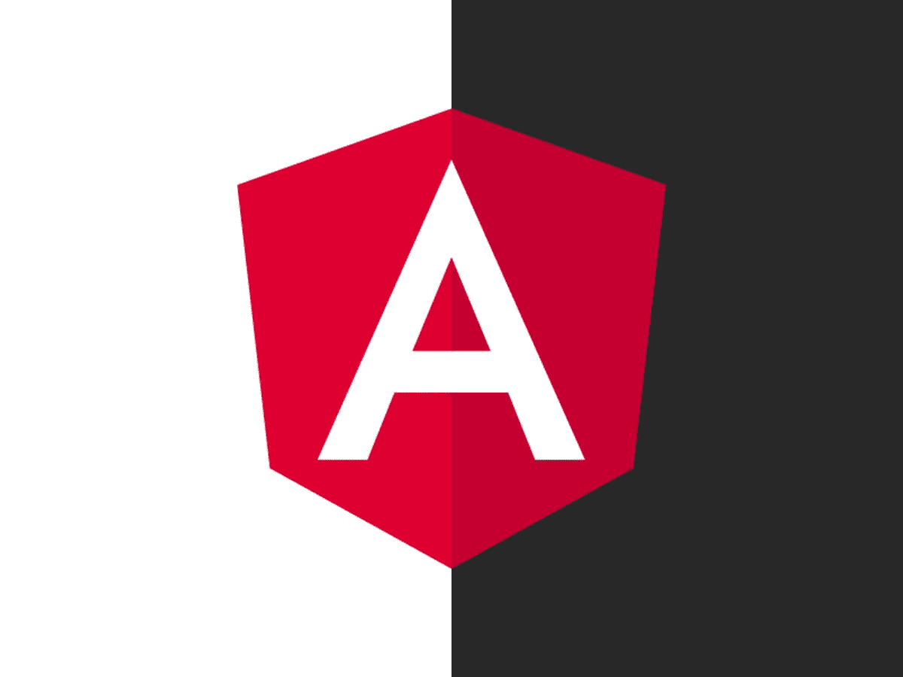
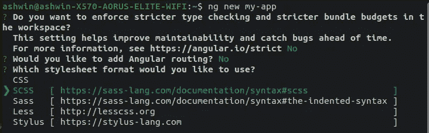
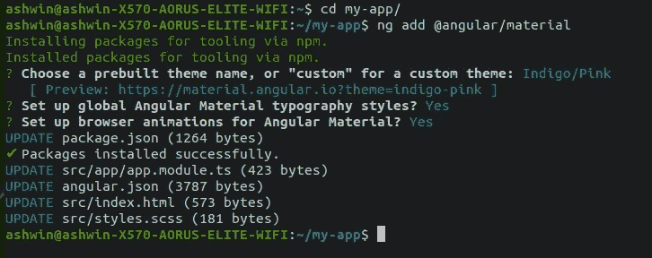

# 使用角形材料的动态主题

> 原文：<https://levelup.gitconnected.com/dynamic-theming-using-angular-material-c0b7dc7a12d4>



不久前，我在做一个项目，在 UI 中使用 Angular，在 UI 组件中使用 Angular 材质。这让我想到——如果我允许用户为应用程序选择一个亮或暗的主题会怎么样？

# 首先:创建应用程序

*如果您的应用已经创建，请跳过这一部分*

你知道该怎么做。要创建应用程序，请在终端中运行`ng new`命令。在执行应用程序创建过程之前，Angular CLI 会问您几个问题，最后一个问题是要使用的样式表格式。因为我们需要使用`mixins`(稍后会详细介绍)，所以选择 SCSS。



选择 SCSS 作为样式表格式

完成后，Angular CLI 将继续创建应用程序。

# 将角形材料添加到项目中

由于我们使用 Angular Material 作为 UI 组件库，我们需要首先将它添加到项目中。为此，浏览到项目目录并运行以下命令

```
ng add @angular/material
```

CLI 再次为您提供了一个提示列表。随意回答你想要的任何选项。



`ng add @angular/material`

# 现在，真正的交易

让我们看看如何在应用程序中实现动态主题化。为此，我们将使用`mixins`的概念，首先根据 Angular Material 提供的主题自定义主题。

好吧，那里发生了很多事。让我们详细地看看这一切，了解这是怎么回事。

首先我们进口`~@angular/material/theming`，包含`mat-core()`。这是为了让所有默认的材料设计风格复制到我们定义的主题。

Nest，我们为主题定义调色板。根据 Angular Material 的方案，我们需要一种原色和一种强调色。为了定义主题的主色和强调色，我们使用了`mat-palette`方法。正如你所看到的，建议为强调色定义多种色调。一旦定义了颜色，我们就定义了主题本身，因为这是灯光主题，我们使用`mat-light-theme`方法来定义主题。最后，我们使用`include`将主题添加到应用程序中。

一旦设置了默认主题，我们就定义了替换主题，在我们的例子中是黑暗主题。这里唯一的主要区别是我们在一个类中使用了`include`，我称之为`dark-theme`。我们这样做是为了只有当`dark`类被应用到应用程序时，黑暗主题才被应用。

在幕后，`mat-light-theme`和`mat-dark-theme`方法控制 UI 元素的颜色——例如，当使用`mat-light-theme`时，`mat-card`组件将为白色，而当使用`mat-dark-theme`时，它将为深灰色。

除了覆盖组件的主题化，比如`mat-dialog`、`mat-snackbar`等，这应该可以处理大部分的事情。为此，我们需要在模块级别设置应用程序主题，如下所示:

注意，我们已经静态地硬编码了主题名称。我们将在后面的步骤中使其动态化。

# `theme service`

既然样式和主题已经就绪，我们需要创建一个服务来控制应用程序主题。为什么是服务？因为它符合我们的要求——与组件不同，只创建了一个服务实例，这意味着我们对主题有一个中央控制。让我们使用 Angular CLI 来创建服务。浏览到项目目录并运行以下命令:

```
ng g s theme 
```

向服务中添加以下代码

如您所见，我们已经用我们的主题名称声明了一个 enum，这样我们就不必冒着拼写错误的风险一遍又一遍地拼写它。接下来，我们声明一个变量，其中存储了当前主题(`currentTheme`)和一个[主题](https://rxjs-dev.firebaseapp.com/guide/subject)，该主题将在当前主题发生变化(`currentThemeSubject`)时发出。接下来，我们声明两个方法——一个用于切换主题(`toggleTheme`)，另一个用于将主题 subject 作为应用程序可以监听的[可观察对象](https://rxjs-dev.firebaseapp.com/guide/observable))返回(`getTheme`)。

如前所述，现在我们必须使模块上的主题动态化。为此，对我们之前添加的代码进行以下更新。

现在我们唯一能做的就是。对应用程序有条件地应用黑暗主题。为此，我们转到 App 组件。我们首先向`app.component.ts`添加必要的代码。

在`app.component.html`文件中，我们在所有内容周围添加了一个包装 div。

就是这样。现在你应该有一个动态主题的 Angular 应用程序，主题颜色由你自定义。你现在需要做的就是添加某种控件，比如说，一个允许你切换主题的切换按钮，你可以将它连接到主题服务中的`toggleTheme`方法。

我希望你喜欢这个故事，并且比你开始读这个故事的时候聪明一点。

> 有兴趣和我就这个故事或 Angular、Typescript 和 Javascript 进行一对一的交谈吗？前往[雇佣作者](https://www.hiretheauthor.com/ashwinSathian)，让我们连线！