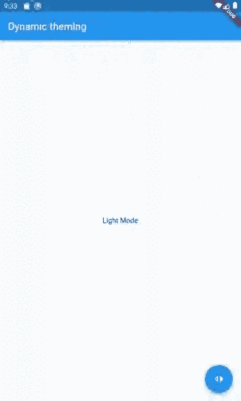

# 使用 Hive、Bloc 和 Flutter 的动态主题化

> 原文：<https://levelup.gitconnected.com/dynamic-theming-using-hive-and-flutter-feb90cb9728b>

一个应用程序的一个很好的特性是能够在亮主题和暗模式之间切换。黑暗模式对用户的眼睛来说更容易，随着数字福利的普及，我认为写一个关于使用 Flutter 在应用程序中实现明暗主题的教程是一个很好的主意。让我们直接开始吧！

**演示**

在本教程中，我们将构建一个应用程序，如下图所示:



**简介**

假设您已经基本掌握了 Dart 编程语言和系统上安装的 Flutter SDK。如果您的系统上没有安装 Flutter SDK，请访问 [flutter.dev](https://flutter.dev/) 获取安装说明。

此外，您需要来自 [pub.dev](https://pub.dev/) 的以下库:

1.  hive: Hive 是一个安全的 NoSql 数据库库。对于我们的用例，它将用于存储一个布尔标志，该标志反过来将用于从保存的设置中确定应用程序的主题。
2.  hive_generator 和 build_runner:这个库是 hive 的扩展，是使用 build_runner 库自动生成支持文件所必需的。
3.  path_provider:这个库用于访问设备文件夹(在本例中，在应用程序的沙箱中),以初始化和存储本地数据库。
4.  bloc 和 flutter_bloc:这些库被用作状态管理解决方案。对于本教程来说，这可能有点过了，但是对于大型和更复杂的应用程序来说，这很有用。

您可以按照 [pub.dev](https://pub.dev) 网站上相应的说明来安装这些库。

关于使用 Hive 库的优秀教程可以在[这里](https://medium.com/flutter-community/storing-local-data-with-hive-and-provider-in-flutter-a49b6bdea75a)和[这里](https://medium.flutterdevs.com/hive-database-with-typeadapter-in-flutter-7390d0e515fa)找到。

**编写主题切换 app**

**步骤 1:设置配置单元数据库**

在项目的“lib”文件夹中，创建一个名为“theme_hive.dart”的文件。首先，像这样创建一个名为“ThemeDatabase”的模型类:

```
import ‘package:hive/hive.dart’;
part ‘theme_hive.g.dart’;@HiveType(typeId: 0)
class ThemeDatabase {
@HiveField(0)
bool? themeSettings;ThemeDatabase({required this.themeSettings});
}
```

在这个模型类中，我们唯一需要的字段是一个名为“themeSettings”的布尔值。该字段将用于确定应用程序应该使用亮模式还是暗模式。

接下来，在终端中运行以下命令:

```
$ flutter packages pub run build_runner build
```

执行上面一行自动生成配置单元数据库所需的类型适配器。生成的文件名为“theme_hive.g.dart”。

```
// GENERATED CODE — DO NOT MODIFY BY HANDpart of ‘theme_hive.dart’;// **************************************************************************// TypeAdapterGenerator// **************************************************************************class ThemeDatabaseAdapter extends TypeAdapter<ThemeDatabase> {
@override
final int typeId = 0;@override
ThemeDatabase read(BinaryReader reader) {
final numOfFields = reader.readByte();
final fields = <int, dynamic>{for (int i = 0; i < numOfFields; i++) reader.readByte(): reader.read(),
};return ThemeDatabase(
themeSettings: fields[0] as bool?,
);}@override
void write(BinaryWriter writer, ThemeDatabase obj) {
writer
..writeByte(1)
..writeByte(0)
..write(obj.themeSettings);
}@override
int get hashCode => typeId.hashCode;@override
bool operator ==(Object other) => 
identical(this, other) ||
other is ThemeDatabaseAdapter &&
runtimeType == other.runtimeType &&
typeId == other.typeId;
}
```

**步骤 2:设置数据库服务**

在项目的“lib”文件夹中，创建一个名为“theme_service.dart”的文件。

添加以下行作为该文件的导入:

```
import ‘dart:io’;
import ‘package:hive/hive.dart’;
import ‘package:path_provider/path_provider.dart’;
import ‘theme_hive.dart’;
```

“ThemeDatabaseService”类由四个方法组成，第一个是未来的“checkDatabaseExists”。必须首先初始化数据库，如果数据库存在，必须将其打开。如果数据库不存在，必须使用“createDatabase”方法创建它。在这个方法中，必须初始化数据库，并且必须注册“主题数据库适配器”(在执行构建运行器命令时自动生成)。此外，数据库被打开，一个缺省的布尔值“true”被输入其中。注意，Hive 数据库将对象存储为键值对。

接下来，创建一个名为“putThemeSettings”的静态方法，将布尔值“themeFlag”的更新值写入数据库。可以使用“getThemeSettings”静态方法检索该标志的值。如果数据库不为空，此方法返回“bool”数据类型。如果数据库包含空值，则返回默认布尔值“true”。

下面给出了“主题数据库服务”类的代码:

```
class ThemeDatabaseService {//Create a global Singleton out of this class. All fields and methods used
//in this class should be static to be accessible globally.ThemeDatabaseService._();//This is the field variable for the Hive databasestatic var *themeBox*;//This method is used to check if the database existsstatic Future<void> *checkDatabaseExists*() async {
Directory themeDatabaseDir = await getApplicationSupportDirectory();//Initialise the database
Hive.init(themeDatabaseDir.path);//If the database exists, open it. Else, call the createDatabase method
if (await Hive.boxExists(“themeBox”)) {
*themeBox* = await Hive.openBox(“themeBox”);
} else {
*createDatabase*();
}
}//This method is used to create the database
static Future<void> *createDatabase*() async {
Directory themeDatabaseDir = await getApplicationSupportDirectory();//Initialise the database
Hive.init(themeDatabaseDir.path);//Register the Hive database Type Adapter
Hive.registerAdapter(ThemeDatabaseAdapter());//Open the database
*themeBox* = await Hive.openBox(“themeBox”);//Objects in a Hive database are stored as a key-value pair
//Store the default theme setting in the database as a boolean for the “themeSettings”
//key. In this case, the flag is set to “true” for light modeawait *themeBox*.put(“themeSettings”, true);
}//This method is used to update the theme settings of the app.
//The “themeFlag” parameter is passed to this method to update the boolean
//value of the “themeSettings” key-value pair in the databasestatic *putThemeSettings*(bool? themeFlag) {
*themeBox*.put(“themeSettings”, themeFlag);
}//This method return a Boolean and is used to get the value of the “themeSettings”
//key-value pair if the “themeBox” is not null. If it is null, then a default
//value of “true” is returnedstatic bool *getThemeSettings*() {
bool themeValue = *themeBox*?.get(“themeSettings”)??true;
return themeValue;
}
}
```

**步骤 3:设置 ThemeCubit 类**

首先，在“lib”文件夹中创建一个名为“theme_state.dart”的新文件。在该文件中，创建 ThemeState 类，该类用于表示“isLightTheme”标志的当前状态。该标志对于亮模式为“真”,对于暗模式为“假”。该类的代码如下:

```
part of ‘theme_cubit.dart’;class ThemeState {
bool? isLightTheme;ThemeState({required this.isLightTheme});
}
```

接下来，在“lib”文件夹中创建一个名为“theme_cubit.dart”的新文件。在该文件中，创建“ThemeCubit”类，该类扩展了“ThemeState”类。主题标志的布尔值从数据库中获得，并作为主题状态传递给主题 Cubit。这是获取上次保存的主题设置所必需的。此外，“ThemeCubit”类包含两个名为“lightMode”和“darkMode”的方法，用于在亮模式和暗模式之间切换。

请注意，应用程序的主题状态是通过使用 Bloc 作为状态管理解决方案反映在整个应用程序中的。虽然状态是实时更新的，但只有在应用程序重新启动时，才会从数据库中检索主题标志的值。主题标志值的检索不会实时发生。但是，主题标志的值会实时保存到数据库中。

下面给出了“ThemeCubit”类的代码:

```
import ‘package:bloc/bloc.dart’;
import ‘package:flutter_bloc/flutter_bloc.dart’;
import ‘theme_service.dart’;part ‘theme_state.dart’;//This class extends the ThemeState class, i.e., it inherits the properties of
//the ThemeState classclass ThemeCubit extends Cubit<ThemeState> {//The boolean value of the theme flag is obtained from the database and passed
//as the theme state to the ThemeCubit. This is necessary to obtain the last
//saved theme settingThemeCubit() : super(ThemeState(isLightTheme: ThemeDatabaseService.getThemeSettings(),));//This method is used to switch the theme to light mode throughout the appvoid lightMode() => emit(ThemeState(isLightTheme: true,));//This method is used to switch the theme to dark mode throughout the appvoid darkMode() => emit(ThemeState(isLightTheme: false,));
}
```

**第四步:构建用户界面**

UI 构建在“main.dart”文件中。在“main”函数中，我们首先检查主题数据库是否存在。因为这是一个异步操作，所以“main”函数必须标记为“async”。此外，下面一行必须添加到“main”函数中:

```
WidgetsFlutterBinding.*ensureInitialized*();
```

我们还使用 BlocProvider 小部件为整个小部件树提供“ThemeCubit”。“主”功能的代码如下所示:

```
void main() async {WidgetsFlutterBinding.*ensureInitialized*();
await ThemeDatabaseService.*checkDatabaseExists*();runApp(BlocProvider(create: (context) => ThemeCubit(),
child: const MyApp(),),);
}
```

从“main”函数中，“runApp”函数调用“MyApp”无状态小部件。在这个小部件中，“BlocBuilder”小部件用于处理主题 Cubit 的状态。如果 cubit 的状态为“真”，则执行亮模式，如果状态为“假”，则通过更改“亮度”属性来执行暗模式。在“MyApp”小部件的“home”属性中，我们将传递“MyHomePage”无状态小部件。这个小部件在其构造函数中将应用程序的标题作为一个字符串。在 build 方法中,“BlocBuilder”小部件用于处理主题 Cubit 的状态。根据主题 Cubit 的状态，相应的文本会显示在应用程序的主体中，同时还会显示浮动操作按钮的工具提示。

轻按浮动动作按钮可以在应用的亮暗主题之间切换，方法是在整个应用中更新主题 Cubit 的状态，同时将主题标志的值保存到数据库中。

“main.dart”文件的代码如下所示:

```
import ‘package:flutter/material.dart’;
import ‘package:flutter_bloc/flutter_bloc.dart’;
import ‘theme_cubit.dart’;
import ‘theme_service.dart’;//The main function has to be marked as asynchronous as we are using an asynchronous
//operation within it (to check if the database exists)void main() async {//Since the main function is asynchronous, add the below line
WidgetsFlutterBinding.ensureInitialized();//Check if the database exists
await ThemeDatabaseService.checkDatabaseExists();//Provide the ThemeCubit to the entire widget tree using the BlocProvider widget
runApp(BlocProvider(create: (context) => ThemeCubit(),
child: const MyApp(),),);
}class MyApp extends StatelessWidget {const MyApp({Key? key}) : super(key: key);@override
Widget build(BuildContext context) {//Use BlocBuilder widget to handle the ThemeCubit states
return BlocBuilder<ThemeCubit, ThemeState>(
builder: (context, state) {
return MaterialApp(
title: ‘Flutter Demo’,
theme: ThemeData(
brightness: state.isLightTheme! ? Brightness.light : Brightness.dark),
home: const MyHomePage(title: ‘Dynamic theming’),
);
},);}}class MyHomePage extends StatelessWidget {const MyHomePage({Key? key, required this.title}) : super(key: key);final String? title;@override
Widget build(BuildContext context) {
return BlocBuilder<ThemeCubit, ThemeState>(
builder: (context, state) {
return Scaffold(
appBar: AppBar(
title: Text(title!),),
//Depending on the boolean state of the ThemeCubit, the appropriate
//text is shown in the body of the app
body: Center(
child: Text(state.isLightTheme! ? ‘Light Mode’ : ‘Dark Mode’)),
//Use a Floating Action Button to switch between themes by injecting the
//value of the ThemeCubit in the widget tree and saving the settings in
//the database
floatingActionButton: FloatingActionButton(
onPressed: () {
if (state.isLightTheme!) {
BlocProvider.of<ThemeCubit>(context).darkMode();
ThemeDatabaseService.putThemeSettings(false);
} else {
BlocProvider.of<ThemeCubit>(context).lightMode();
ThemeDatabaseService.putThemeSettings(true);
}},//Depending on the boolean state of the ThemeCubit, the appropriate
//tooltip is shown
tooltip: state.isLightTheme! ? ‘Dark Mode’ : ‘Light Mode’,
child: const Icon(Icons.switch_left_rounded),), 
);
},);
}
}
```

就这样，我完成了我的第一个颤振教程。我希望你能像我喜欢写它一样喜欢从中学习。