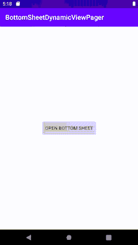

# BottomSheetDialogFragment 中的动态视图页

> 原文：<https://levelup.gitconnected.com/dynamic-viewpager-inside-bottomsheetdialogfragment-d234b00044f3>

在本文中，我们将看到如何在一个模态 BottomSheetDialogFragment 中放置一个可以显示动态片段的 ViewPager。

模态 BottomSheetDialogFragment 的大多数在线资源都覆盖 onCreateDialog 方法，并在那里进行所有的定制，然后返回底部的表。除了少数例外，这在很多情况下都没问题。

其中一个例外是，当您需要一个在底部工作表对话框中带有动态片段的 ViewPager 时。

大概是这样的:

我们不能通过覆盖 onCreateDialog 得到这样的东西的原因是，要膨胀动态片段，我们将需要一个 FragmentPagerAdapter，它又需要一个片段管理器。您只能在 onCreateView 方法中为此获取 childFragmentManager。这产生了一个额外的问题，因为当我们使用 onCreateDialog 时，视图返回为 null。您也许可以使用一个不需要片段管理器的 PagerAdapter(而不是 FragmentPagerAdapter ),但是这只能用于静态视图/布局。

这个问题的解决方案是跳过重写 onCreateDialog，而重写 onStart。

让我们来看一下这些步骤:

首先让我们定义 activity_main.xml

接下来我们的底部表布局。这将包含 TabLayout 和 ViewPager

和一个带有片段文本视图的简单布局。将通过片段动态修改文本视图

我们现在将创建主活动和我们的片段

我们的 MyFragmentAdapter 将扩展 FragmentPagerAdapter 类

最后，让我们实现我们定制的 BottomSheetDialogFragment

就是这样！

您可以在这里找到完整的源代码:

 [## vaishakhbg/BottomSheetDynamicViewPager

### 在 GitHub 上创建一个帐户，为 vaishakhbg/BottomSheetDynamicViewPager 开发做出贡献。

github.com](https://github.com/vaishakhbg/BottomSheetDynamicViewPager.git) 

感谢您的阅读！