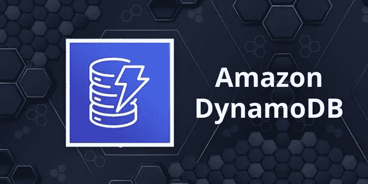
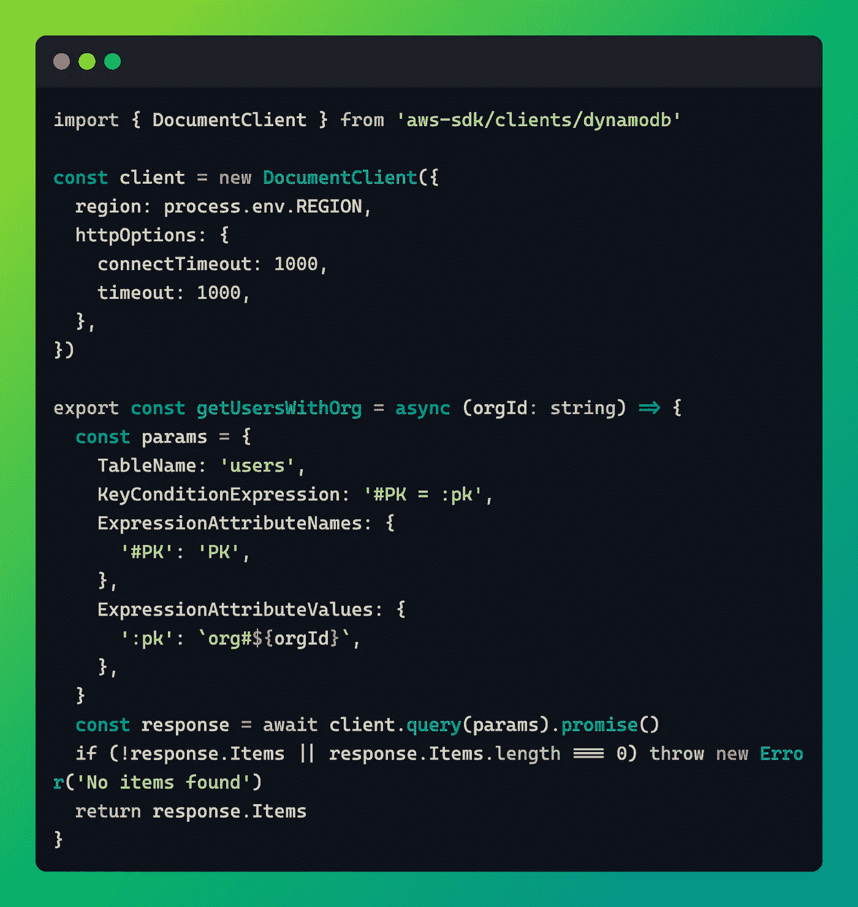
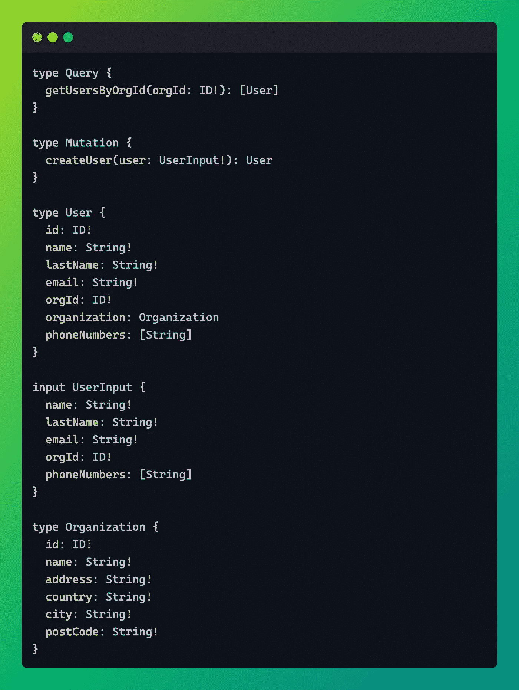
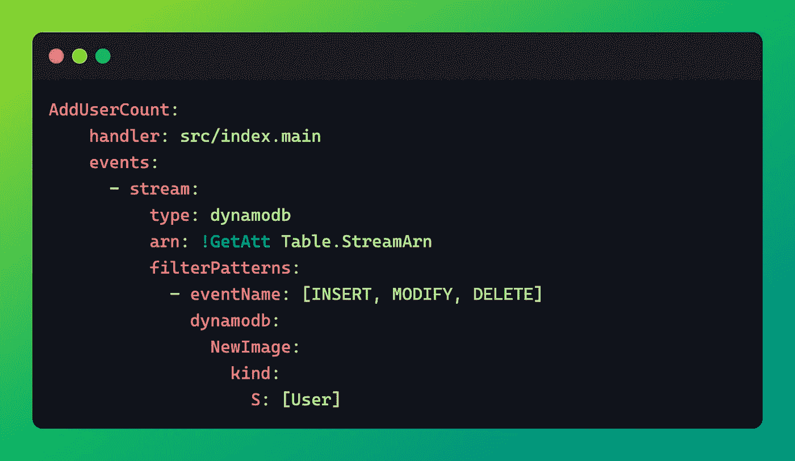
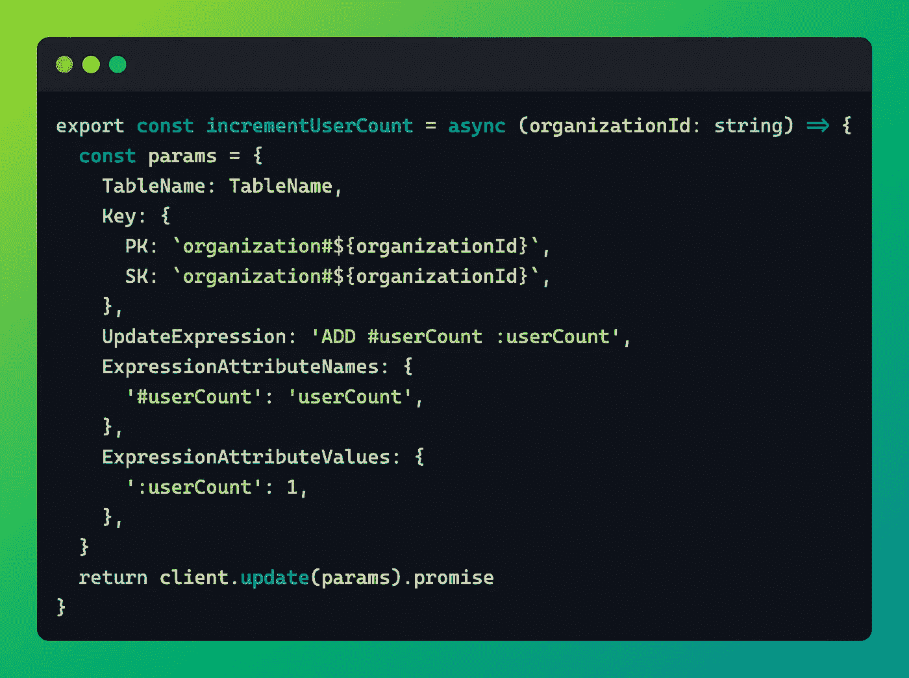

# DynamoDB:增强数据库设计的 5 种具体方法

> 原文：<https://levelup.gitconnected.com/dynamodb-5-specific-ways-to-supercharge-your-database-design-574ffb7f5b8a>

信用数字云培训

你已经开始开发你的第一个无服务器应用程序，你对后端应用程序的设计略知一二，但你也曾使用过 Express 或任何后端框架，以及 Prisma、Sequelize 或 TypeORM 等 ORM 后面的 Postgres。不管出于什么原因，我们决定使用 AWS 无服务器堆栈来构建一个新的服务。到了栈的数据库部分，DynamoDB 几乎总是且唯一是 AWS 无服务器世界中的首选数据库。

你开始思考:等等，这个“数据库”不支持连接吗？难道**只有一桌**？这肯定是一个恶心的玩笑😳？天啊，你只能基于**主键**来查询数据，至于什么是**哈希键**，什么是**排序键**排序到底是什么？如果我需要基于主键以外的任何东西进行查询，我需要一个**全局二级索引**吗？这到底是什么意思🤦🏻‍♂️?

对于我们中的许多人来说，当我们刚刚开始使用 DynamoDB 时，这些问题是值得关注的。毕竟，这不是我们在大学里学到的，也不是我们过去几十年一直在做的。

但是这里有一个好消息:一旦你真正理解了 DynamoDB 的用途、它的基本原理，并且对你要构建的应用程序有了很好的理解，你就会开始觉得有点神奇了！无限可扩展，具有非常低的延迟数，并且不需要维护任何基础架构。更好的是，我认为如果你的数据库设计得很好，你甚至不需要像 Redis 这样的内存缓存！

好了，下面是提升 DynamoDB 设计水平的 5 种具体方法。

# I .熟悉特定于 DynamoDB 的概念

DynamoDB 与行业标准的 SQL 和 NoSQL 数据库有一些共同的数据库概念，但也有许多只适用于它的概念。让我们看看一些特定于 DynamoDB 的概念，并讨论它们的重要性。

## ***分区***

我相信这是真正理解的最关键的一块。从表面上看，DynamoDB 数据库只是一个表。但这种数据库适用于亚马逊、Snap、迪士尼和 Zoom 等大公司的原因很大程度上与分区有关。当您在 DynamoDB 中存储一个项目时，它会被分配一个分区。

分区是由 SSD 驱动器支持的逻辑空间，将保存您存储的数据。您不需要创建分区，而是根据分配给给定项目的分区键来确定分区。这是允许 DynamoDB 如此好地伸缩的许多属性之一:理想情况下，尽管它是一个表，但数据应该均匀地分布在只存在于幕后的分区中。

这里，您的心理模型应该从**表和行**变为同一个分区上的**分区和项目**。

## 分区键(散列键)

如果您有关系背景，或者在大学里学过数据库设计课程，在那里您很可能学习了 SQL、规范化和关系等知识，那么您可能会认为分区键相当于 SQL 中的主键。不完全是！

虽然分区键可以用来惟一地标识给定 DynamoDB 数据库中的一个项目，但是它的主要功能是确定 DynamoDB 在后台将您的项目存储在键空间的什么位置。因此，在选择分区键时，一定要非常慎重和有目的，它们对于一个好的 DynamoDB 数据库设计是绝对必要的。

## 分类关键字(范围关键字)

一旦 DynamoDB 确定了在后台使用哪个分区来存储您的项目，它就会使用 range 键对同一个分区上的多个项目进行排序。

默认情况下，当您在 Dynamo 中运行查询操作时，您会得到一个条目数组，这些条目根据排序键按升序排序。

这里有个问题，我发现人们很怀念这个:

> 一个项目由分区键和排序键的组合唯一标识，即两者的组合是主键！

## 全球二级指数(GSI)

Dynamo 的一个非常特殊的属性是，它只能通过其主键进行查询。它与它的键紧密相连，这可能是一件好事，也可能是一件坏事。我承认，有时这可能有点令人沮丧！

GSI 将允许您查询原始表中非散列或范围键的属性。其工作方式是，您将从任何现有属性中为该索引选择新的散列和范围键，Dynamo 将在后台将数据从主表异步复制到索引。从那时起，您可以使用这个新的键来查询基于您选择的新属性的索引。

根据需要使用尽可能多的索引来满足您的需求，但是如果这些索引开始失去控制，您可能会有一个试图做太多事情的庞然大物！

## GetItem 操作

这与大多数 ORM 中的 findOne 方法没有太大区别。它总是将 ***主键*** (哈希键&范围键)作为参数，从给定的表中返回一个 ***单项*** 。

当您有足够的上下文来知道项目的确切主键时，比如说当用户在 UI 上的 products 表中选择一行时，这将触发一个 API 调用，您将希望在您的应用程序中使用它。这又会在后台使用 GetItem Dynamo 方法通过主键获取特定的产品。

## 查询操作

我们已经讨论过分区的概念以及如何使用它。Dynamo 查询操作将接受分区键作为参数，还可以选择接受排序键，并将返回存储在该分区上的所有按范围键排序的项目。

这就是为什么慎重使用分区键是至关重要的:如果您有意将项目存储在给定的分区中，您将获得所有这些项目，并且通常具有非常低的延迟！

# 二。在设计阶段投入一些时间

不要误解我，不管是 DynamoDB、Postgres 还是 MongoDB，你都应该这样做。在数据库设计上投入时间绝对是永恒的，但是在使用 DynamoDB 时，这一点更加重要。

我从这个人身上学到了一些技巧[将导致返回所有三个项目的查询操作将如下所示，这里我再次使用了 TypeScript:](https://medium.com/u/3c9962a8238# LFC ltd”PK 时，您会得到所有三个项目。实际上，你刚才所做的就是模仿 SQL 中的一个 join，故意选择 PK！

<p id=) [TS/JS 解析器](https://github.com/aws/aws-appsync-community/issues/147)。AppSync 的一般前提是定义一个模式，该模式将包含应用程序的域对象、域对象中的字段以及两个非常重要的顶级对象:

*   一个 ***查询*** :定义所有将要用来取数据的查询
*   一个 ***突变*** :定义所有将被用来写/更新/删除数据的操作

我们熟悉的许多规范化概念在这里都适用。在我们的访问管理示例中，我们现在将在两个单独的表中存储一个用户对象和一个组织对象。该图，也就是我们的模式，可能看起来像这样:

现在，这个 GraphQL API 的消费者在使用***getUserByOrgId***查询获取用户时可以做出选择:

*   **他们不需要组织信息**，因此他们选择省略用户对象中看到的组织嵌套解析器。这意味着我们只访问了一个表，即用户表
*   **他们确实需要详细的组织信息**，比如他们正在构建的 UI，因此将使用我们的嵌套解析器。这很酷，因为我们的 API 现在将用一个用户对象和一个嵌套的组织对象来响应。在这种情况下，我们将碰到两个表。但是 GraphQL 为我们处理了' ***加入'*** ！

这很好，因为它给了我们很大的灵活性，可以使用我们需要的任何数量的表，让我们的消费者选择他们想要获取的数据。最后，GraphQL 模式现在是事实的最终来源，也就是我们的文档！

但是，请记住，这是以增加 API 的延迟为代价的。最后，尽管 GraphQL 负责连接，但您仍然要向两个独立的 DynamoDB 表发出两个后续请求，而不是像我们在上一节中那样发出一个请求。

# 动词 （verb 的缩写）使用 CDC(变更数据捕获)添加对聚合和缓存的支持

DynamoDB 有 DynamoDB streams (MongoDB 也有类似的特性)，这是一个漂亮的特性，每当表中的一个项目发生状态变化时，它就会将一个事件发布到一个流中。这可以是下列之一:

*   创造
*   修改
*   删除

就在最近，AWS 增加了对 DynamoDB 流中事件映射的支持。也就是说，一个流的订阅者，比如一个 lambda 函数，只有在事件模式匹配时才会被触发。在这方面非常类似于事件桥。在无服务器框架中，可能是这样的:

其工作方式是，只有当相关项目具有属性**类型字符串并且其值为 ***用户时，才会触发 AddUserCount Lambda 函数。*** 这是我喜欢用的另一个小技巧*特别是在单表设计中，要有一个静态的 ***类*** 属性，定义一个条目是什么域实体 ***。******

**回到我们稍微复杂的访问模式，获取链接到给定组织的用户数量。使用 DynamoDB 流的方法是检查用户的 PK，即他们属于哪个组织，然后在相关的组织实体上运行 ***Update*** 操作。这将导致添加一个 Number、 ***userCount、*** 类型的属性，预先计算好并准备就绪，在 Lambda 代码中您什么也不用做！**

**这看起来会像这样:**

****

**问题是，我见过的人们使用 DynamoDB 流的大多数用例都是将数据从 Dynamo 转移到另一种类型的 OLAP 数据库，比如红移或弹性搜索。这确实是一个非常有效的用例，但是不要在使用 DynamoDB 流进行聚合上睡大觉。不仅仅是计数，还有总和！**

# **分级编码**

**感谢您成为我们社区的一员！在你离开之前:**

*   **👏为故事鼓掌，跟着作者走👉**
*   **📰查看[升级编码出版物](https://levelup.gitconnected.com/?utm_source=pub&utm_medium=post)中的更多内容**
*   **🔔关注我们:[Twitter](https://twitter.com/gitconnected)|[LinkedIn](https://www.linkedin.com/company/gitconnected)|[时事通讯](https://newsletter.levelup.dev)**

**🚀👉 [**将像你这样的开发人员安置在顶级创业公司和科技公司**](https://jobs.levelup.dev/talent/welcome?referral=true)**