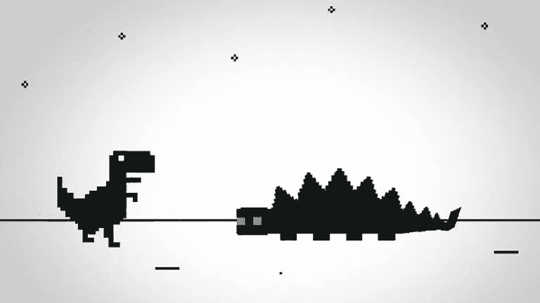
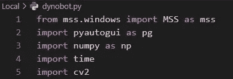
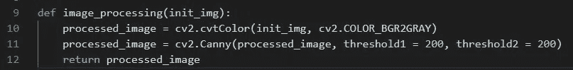
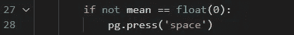

# 具有计算机视觉的恐龙机器人

> 原文：<https://levelup.gitconnected.com/dynobot-with-computer-vision-eae8e9cd1b3c>

今天让我们玩得开心点！每个人可能都在某个时候使用过 Chrome 浏览器。许多人知道，如果你没有互联网连接，Chrome 将允许你玩恐龙游戏。今天，我们将尝试建立一个机器人来为我们玩这个游戏。



**方法论**

我们要做的是捕捉游戏正在进行的部分屏幕，并对其进行截图。我们会尽快完成。然后我们将把图像转换成像素值的数组。恐龙机器人将分析屏幕上给定部分的像素值，如果它检测到障碍，它将撞击空间并跳过它。

**设置**

为了构建我们的机器人，我们将使用 python，因为它为数据解析和计算机视觉提供了各种库。这是我们的恐龙机器人需要的库列表:



# 确保所有库都全局安装或安装在您的虚拟环境中。

**计算机视觉**

现在我能看见了！为了赋予机器人看世界的能力，我们将使用一个 **mss** 库。它将拍摄屏幕的给定部分，并将其保存到。png 格式。

现在让我们告诉机器人它应该看哪里:

```
box = {‘top’: 173, ‘left’: -979, ‘width’: 21, ‘height’: 20}
```

左上角是屏幕上的 x/y 坐标，参数旁边是观察块的大小。

**警告** : ***这个坐标适用于我的屏幕，但可能不适用于你的屏幕。所以如果你想使用机器人，你需要确定游戏窗口的坐标。***

这是如何拍照片的:

```
sct = mss()img = sct.grab(box)
```

**数据解析**

当我们有一个图像时，我们将在 **numpy** 库的帮助下把它变成一个数组。

```
img = np.array(img)
```

接下来我们将使用 **OpenCV** 库去除图像中的噪声，使机器人更容易检测到游戏中的障碍物:



当我们得到处理过的图像时，我们将再次使用 **numpy** 来确定图片上是否有非白色像素。Numpy.mean 将返回数组元素的平均值。

```
mean = np.mean(processed_image)
```

如果所有像素都是白色的，那么**均值**变量的值将是 0.0，如果有一些东西，那么它将不是 0.0。这是机器人行为的条件。如果它不等于 0.0，那么有一个障碍，机器人应该跳转。

为了赋予机器人行动的能力，我们需要让它控制输入设备，在这里是键盘。我们将使用 **pyautogui** 库来跳过:



**恐龙机器人的全部代码:**

**成功了**

**结论**

我们的机器人并不完美，它最终会失败，因为游戏的速度随着时间的推移而加快，机器人将无法在简单的情况下做出我们想要的反应。在可预见的未来，我们将尝试在机器学习的帮助下让我们的恐龙机器人“有自我意识”，我们将看到当它能够学习时会有多好。

软件工程很好玩！技术可以让世界变得更加有趣和生动。Python 生态系统有很多库，让我们可以非常快速地构建酷员工。

不断学习，不断成长！

我们上 [LinkedIn](https://www.linkedin.com/in/pavel-ilin/) 连线吧！