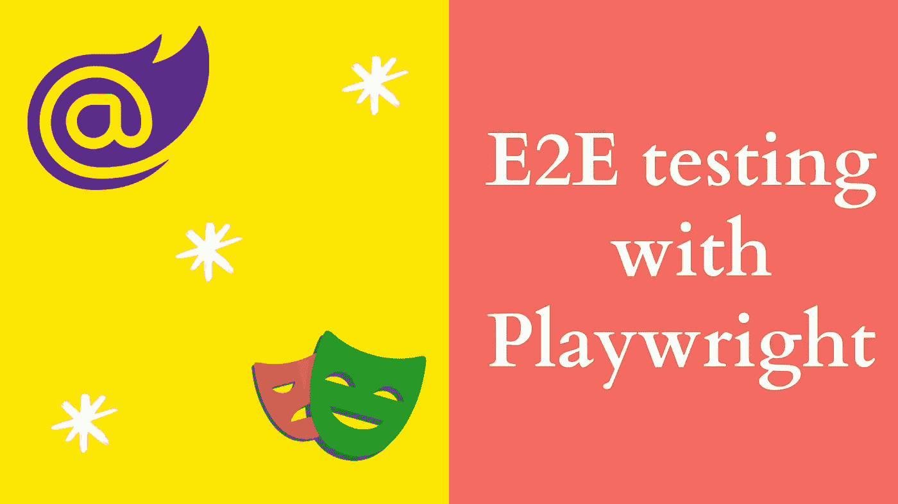
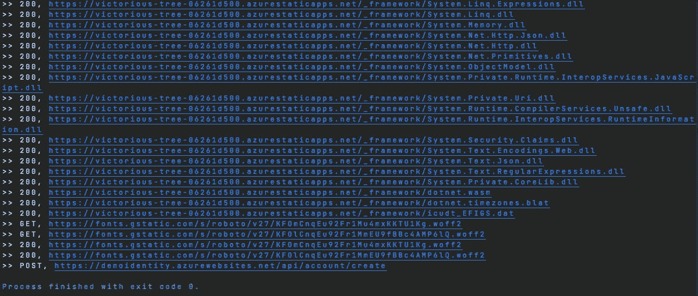
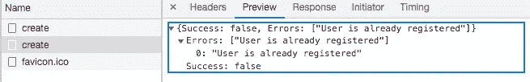

# E2E 测试与剧作家

> 原文：<https://levelup.gitconnected.com/e2e-test-with-playwright-45e2c0389bfa>

## *剧作家开剧作家开*



laywright 支持对现代 web 应用进行可靠的端到端测试，旨在自动化单页面应用和渐进式 web 应用所使用的广泛且不断增长的 Web 浏览器功能。

[](https://playwright.dev/) [## 快速可靠的现代网络应用端到端测试|剧作家

### 单一的 API 来自动化 Chromium、Firefox 和 WebKit。为依赖现代的单页应用程序提供强大的自动化功能…

剧作家 dev](https://playwright.dev/) 

一些功能包括

*   自动等待元素准备就绪后再执行操作(如单击、填充)
*   拦截网络活动以阻止和嘲弄网络请求
*   模拟移动设备、地理位置、权限
*   鼠标和键盘的本机输入事件
*   上传和下载文件

# 我喜欢的功能

## 1.Codegen💪

Codegen 是一个强大的工具，它将从用户与基于弹性文本的选择器的交互中生成代码。

```
playwright codegen [g](https://victorious-tree-06261d500.azurestaticapps.net/)oogle.com
```

Playright codegen 正在运行

## 2.自动等待元素⏱️

编写、自动化和维护 E2E 测试是困难的。我经历过不得不写 E2E 测试一点也不好玩。这种剥落很难避免。在断言一个元素在页面上可见以执行点击或导航到不同页面之前，我已经摆弄过设置延迟。剧作家负责自动等待元素准备好执行，如点击，填充等。

> 剧作家在采取行动之前对元素执行一系列的可行动性检查，以确保这些行动按预期进行。它自动等待所有相关检查通过，然后才执行所请求的操作。如果所要求的检查在给定的`timeout`内没有通过，则`TimeoutError`动作失败。

当调用`Page.ClickAsync(selector, options)`时，剧作家将确保一个元素是:

*   附属于 DOM
*   可见并已启用
*   不在动画或完成动画状态
*   没有被其他元素遮蔽

单击下面的链接，查看针对各种操作执行的可操作性检查的完整列表。

 [## 自动等待|剧作家。网

### 剧作家在采取行动之前对元素执行一系列可行动性检查，以确保这些行动…

剧作家 dev](https://playwright.dev/dotnet/docs/actionability) 

## 3.屏幕上显示程序运行的图片📸

剧作家提供了在测试运行时轻松捕捉屏幕截图的选项。您可以对整个页面或页面上的特定元素进行截图。除了保存截图之外，还可以用图片获取一个缓冲区，进行后期处理。如果 E2E 测试失败，页面截图将有助于找出问题所在并帮助解决问题。

## 4.网络监视🌐

剧作家提供 API 来监控和修改网络流量，包括 HTTP 和 HTTPS。页面所做的任何请求，包括 xhr 和 fetch 请求，都可以被相应地跟踪、修改和处理。下面，我在请求和响应对象上注册了事件处理程序，当发出新请求并收到响应时，将调用这些事件处理程序。收到请求事件后，方法名和 URL 被写入控制台。类似地，当引发响应事件时，其状态和 URL 被写入控制台。



API 请求和响应日志

## 5.API 模拟😛

路由提供了修改页面发出的网络请求的能力。一旦启用路由，每个匹配 URL 模式的请求都将停止，除非它被继续、完成或中止。下面我模拟了对`**/api/account/create` route 的响应，并返回了一个模拟响应。



模拟 API 响应

## 注册和登录 E2E 测试

我有一个带有 Azure 静态 Web 应用程序的 Blazor 静态站点。下面的 E2E 测试`UserRegistartionTest`将注册一个新用户，然后使用注册时指定的凭证登录。该测试将启动 Chrome，注册一个新帐户，最后使用凭据登录。

剧作家 E2E 试验

## 结论

剧作家是一个伟大的工具，让您轻松地为您的应用程序编写端到端的测试。API 很简单，很容易快速上手 codegen 特性。