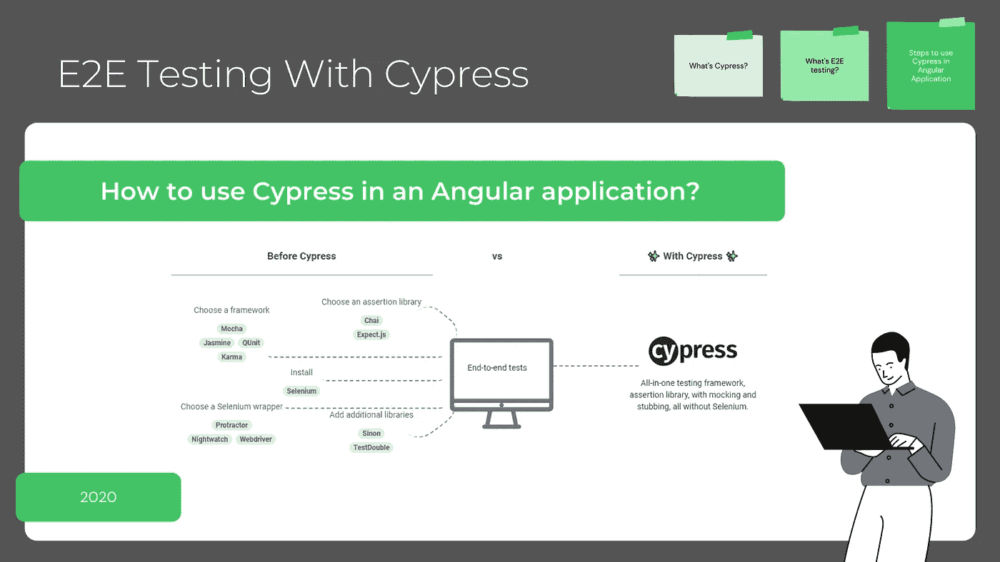
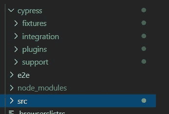
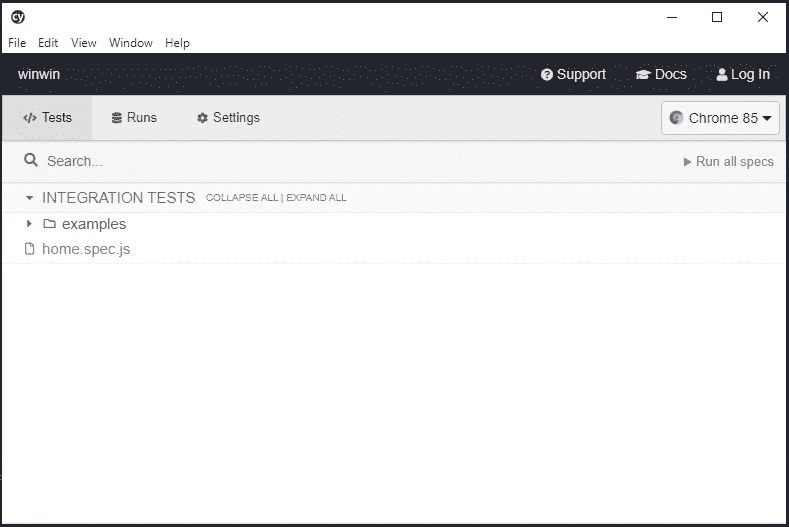
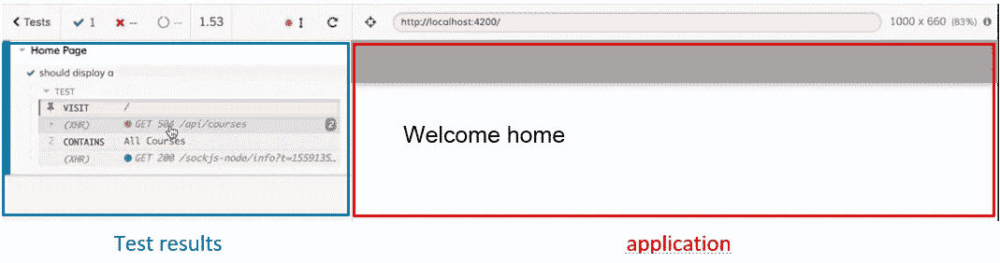

# 用柏树进行 E2E 试验——有棱角

> 原文：<https://levelup.gitconnected.com/e2e-testing-with-cypress-angular-219eaa3926c>

## 如何在有角度的应用中使用 Cypress？



# 柏树是什么？

Cypress 是一个桌面应用程序。它支持多种操作系统，如 Windows、Linus 和 iOS。

Cypress 是一个工具，无论您使用什么样的前端框架，您都可以使用它来测试前端应用程序。

Cypress 是为开发人员和 QA 工程师创建的，目的是让测试应用程序变得更快更容易。

下面是丝柏官网的链接:[链接丝柏。](https://www.cypress.io/)

# 什么是 E2E 或端到端测试？

随着应用程序的持续增长，我们需要确保到目前为止我们添加的功能不会破坏已经完成的工作。端到端测试的工作是确保应用程序的完整性以正确的方式工作，即使是新添加的功能。

E2E 是一种软件测试方法，从头到尾模拟应用程序应该能够做什么。

在这篇文章中，我将一步一步地解释我们如何使用 Cypress 作为工具在一个角度应用程序中进行 E2E 测试。

准备好了吗？走吧(╯ □ )╯︵

# 如何在角应用中使用柏树

## 第 0 步:安装 Cypress

在我的例子中，我使用 NPM 在我的项目中安装 Cypress:

```
//with NPM
***npm install cypress***
```

下面是用其他工具安装 Cypress 的更多信息: [Cypress doc](https://docs.cypress.io/guides/getting-started/installing-cypress.html#System-requirements) 。

如果你是 angular 的初学者，想快速发现它是如何工作的，可以看看下面的快速步骤:

[](https://medium.com/@famzil/2-steps-to-create-launch-test-discover-angular-application-713387952e69) [## 创建、启动、测试和发现角度应用的 2 个步骤

### 发现角度应用的快速简单步骤

medium.com](https://medium.com/@famzil/2-steps-to-create-launch-test-discover-angular-application-713387952e69) 

## 步骤 1:向 package.json 添加命令

将 cypress 添加到 package.json

## 步骤 2:用 cypress.json 文件配置 Cypress

在您的根目录下创建一个`**cypress.json**`文件，在这里您将应用程序运行的基本 URL 赋予 Cypress。

这个文件应该创建在你的项目的根目录下，在那里你有`**package.json**`和`**angular.json**`文件。以下是它的内容:

cypress.json

## 步骤 3:创建一个文件来测试主页

您会注意到 cypress 已经在`**node_module**`目录旁边创建了一个名为 Cypress 的目录。这个文件包含了我们如何使用 Cypress 的例子。



柏树目录

在 cypress/integration 目录下，我们将创建一个 home 测试文件`**home.spec.js**`，内容如下:

home.spec.js 文件

## 第 4 步:运行命令

*   首先，您需要确保启动了应用程序的服务器:

```
***npm run start***
```

*   确保在`**cypress.json**`文件中使用正确的基本 URL
*   跑进另一个终点柏树

```
***npm run cypress:open***
```

Cypress 将打开一个窗口来选择要运行的测试，正如您所看到的，它也显示了示例目录和我们的主测试文件:



柏树窗户

## 第五步:检查结果

在这里，我们单击`**home.spec.js**`启动测试，Cypress 将启动浏览器并显示您的测试结果:



结果

# 💼外卖:

*   Cypress 支持 Chrome、Firefox、Edge、electronic 等多种浏览器。
*   Cypress 不使用硒，因此没有硒的问题，而且速度更快，更直观。
*   可用于任何前端框架。
*   所有的测试都是用 JavaScript 编写的(不需要学习额外的语法来编写端到端的测试)。
*   调试是如此的快速和直观。

亲爱的读者朋友们，感谢你们的支持和宝贵时间。我希望这对你有用和有帮助。

**关注我关于** [**中**](https://medium.com/@famzil/) **和**[**Linkedin**](https://www.linkedin.com/in/fatima-amzil-9031ba95/)**了解更多文章。**

**后会有期(ﾉ◕ヮ◕)ﾉ*:･ﾟ✧**

**FAM**