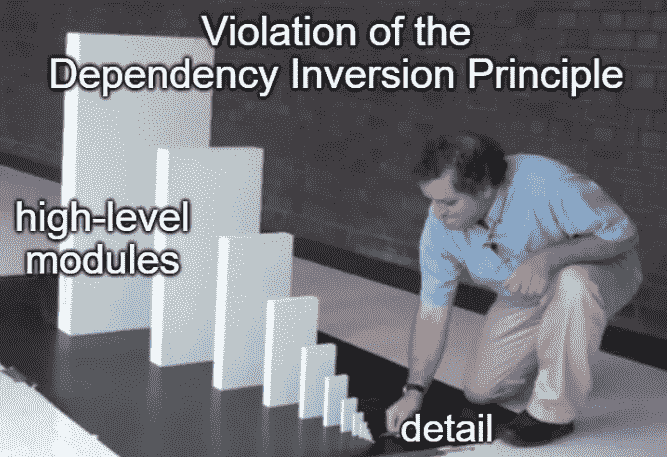

# 在不到 20 秒的时间里解释了每一个坚实的原则

> 原文：<https://levelup.gitconnected.com/each-of-the-solid-principles-explained-in-less-than-20-seconds-b73057625dfc>

S.O.L.I.D .是一套五个 O.O.P .设计原则的首字母缩写，这些原则将帮助你避免编写脆弱、僵化或不可重用的软件。

在本文中，我们将简要描述它们，并了解它们如何帮助我们控制应用程序的依赖结构。

## 1.单一责任原则

单一责任原则声明类或组件应该有单一的变更源。

例如，如果关于*支付*的业务用例发生了变化，那么只有来自专用组件的功能会受到影响。如果任何其他组件或模块需要更改，它们不符合单一责任原则。

小刀不符合单一责任原则

## 2.开/关原则

根据开放/封闭原则，类或组件应该为扩展而开放，为更改而关闭。

如果我们遵循这个原则，我们应该能够仅仅通过扩展组件来添加一个新的特性——而不涉及任何现有的代码。

你有没有注意到高级开发人员在添加新功能之前是如何重构现有代码的？最初，他们确保代码符合开放/封闭原则。之后，他们添加新的特性，而不需要进一步修改旧的代码。

## 3.利斯科夫替代原理

Liskov 替换原则指出，派生类应该能够在客户端不知道的情况下替换其父类。

例如，如果我们的函数返回一个*列表*，我们可以自由地在内部将其从 *LinkedList* 更改为 *HashList* ，而不会破坏使用它的代码。

另一方面，如果我们扩展了一个基类，而我们的实现将返回一个不同的结果或导致意想不到的副作用，这将违反 Liskov 的替换原则。

明显违反了利斯科夫的替代原则

## 4.界面分离原理

为了符合接口分离原则，客户端不应该依赖于它不会使用的函数。

假设我们有一个与方法 *a(…)* 、 *b(…)* 和 *c(…)的接口。*如果有客户端只使用 *a(…)* 和*b(…)*的方法，我们就违反了接口分离原则。一个解决方案是将现有的接口分成更小的接口。

此外，假设我们实现了这个接口，并且确实为 *a(…)* 和 *b(…)* 提供了实现，但是没有为 *c(…)* 提供实现，这再次意味着将会有不使用 *c(...因此我们违反了原则。*

## 5.从属倒置原则

根据依赖倒置原则，高层模块不应该依赖低层模块。细节应该依赖于抽象。

例如，我们可以想象有一个*支付*模块和各种用于具体支付实现的类。各种实现应该依赖于支付模块，以符合依赖性反转原则。

因此，一个具体的支付实现(“*细节*”)的变化不会影响高层的*支付*模块(或任何其他组件)。

## 结论

在本文中，我们简要描述了五个坚实原则中的每一个。

坚实的原则教会我们如何构建不僵化、不脆弱或不可重用的类。

**如果我们放眼全局，这些概念将在设计我们系统的组件或模块时使用。如果你想更深入地了解这个主题，请阅读关于** [**组件内聚原则**](/3-component-cohesion-principles-explained-for-a-junior-developer-53576d1032b3) **的文章——它们是 SOLID 的*老大哥*。**

另一方面，如果你想了解更多关于 SOLId 的知识，我强烈推荐你看鲍勃叔叔的这个演讲。

在相当长的介绍之后，他解释了什么是 O.O.P .语言，以及封装、继承和多态是如何工作的。

之后，他展示了如何使用可靠的原则来控制系统的依赖结构，以及为什么这很重要。

# 分级编码

感谢您成为我们社区的一员！在你离开之前:

*   👏为故事鼓掌，跟着作者走👉
*   📰查看[升级编码出版物](https://levelup.gitconnected.com/?utm_source=pub&utm_medium=post)中的更多内容
*   🔔关注我们:[Twitter](https://twitter.com/gitconnected)|[LinkedIn](https://www.linkedin.com/company/gitconnected)|[时事通讯](https://newsletter.levelup.dev)

🚀👉 [**加入升级人才集体，找到一份惊艳的工作**](https://jobs.levelup.dev/talent/welcome?referral=true)