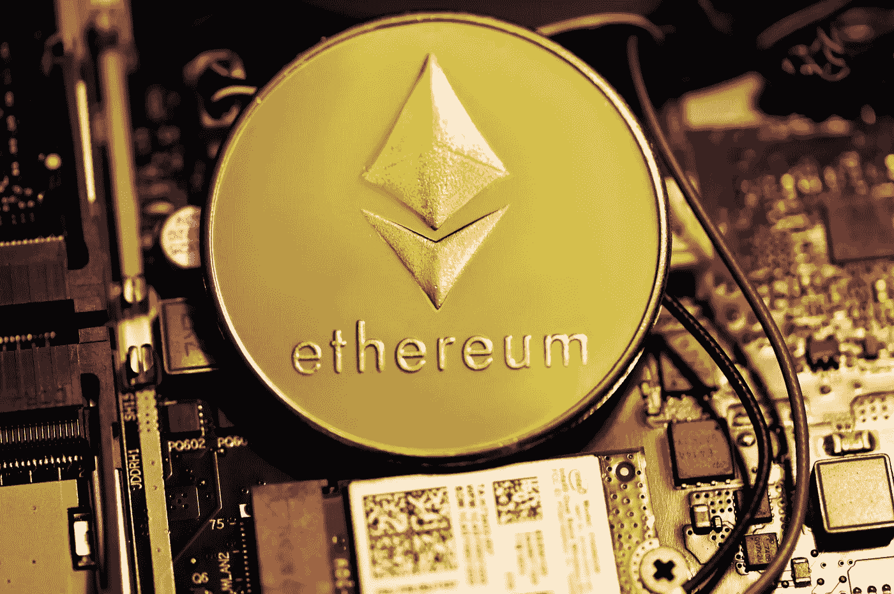

# 在为时已晚之前通过挖掘以太坊赚钱

> 原文：<https://levelup.gitconnected.com/earn-money-mining-ethereum-before-its-too-late-5ccf6a4e4df7>

以太坊采矿正在被淘汰，但现在参与还为时不晚



[行政长官](https://unsplash.com/@executium?utm_source=unsplash&utm_medium=referral&utm_content=creditCopyText)在[广场](https://unsplash.com/s/photos/ethereum?utm_source=unsplash&utm_medium=referral&utm_content=creditCopyText)拍照

以太坊一直是 2021 年的热门话题。一年前，即 2020 年 10 月，以太坊每枚代币的价值不到 400 美元。如今，每枚代币价值近 3500 美元，许多密码爱好者看好它的未来价值。


来源:[货币市场基金](https://coinmarketcap.com/currencies/ethereum/)

这不是我们第一次看到以太坊达到如此高的价格。以太坊在 5 月份达到近 4200 美元的峰值，然后在 7 月份回落至 1800 美元的低点。许多因素影响了加密货币的波动性，然而，由于分散金融(DeFi)的成功和 NFT 的爆发，以太坊已经恢复得相当强劲；这些流行的网络用例意味着，推动以太坊价值的不仅仅是数字货币和投资机会的前景。

由于 NFTs 和 DeFi 使网络异常繁忙，矿工在区块链上进行交易的需求一直非常高。如果你对挖掘以太坊感兴趣，现在让你的显卡工作还不算太晚。在这篇文章中，我将简要讨论自 7 月份以来采矿发生了怎样的变化，然后在几分钟内给出一个开始采矿的快速指南。

# 以太坊采矿

## EIP-1559 并没有降低盈利能力

我上次写以太坊矿业是在 7 月初，当时 NFT 热潮和 ShibaSwap 的推出推高了费用，增加了矿工的利润。我曾预测，在 EIP-1559 法案推出后，以太坊矿业的利润将变得更低，该法案包括对费用结构和矿工薪酬的重大改革。

然而，EIP-1559 是在 8 月初推出的，采矿收入没有下降。我每个月用一台 RTX 3080 进行测试，结果显示盈利能力略有提高，部分原因是以太坊的价值不断上升。从下面的图表中我们可以看到，自 5 月份的繁荣期以来，矿业收入基本保持不变。


来源:[Etherchain.org](https://etherchain.org/charts/miningRevenue)

## 采矿将在未来几个月结束

虽然 EIP-1559 没有导致许多人担心的收入损失，但即将到来的向以太坊 2.0 的过渡和利益一致协议的证明仍将结束使用 GPU 挖掘以太坊的需求。对于那些希望利用采矿的人来说，好消息是这种更新可能还要几个月的时间。

ETH 2.0 更新分为三个主要更新:信标链、合并和碎片链。信标链已经在网络上运行，这实质上为未来过渡到股权证明模型奠定了基础，并允许用户开始押注以太坊。合并是将以太坊主网与信标链相结合的更新，这将结束 GPU 挖掘，转而支持赌注。

合并已经被推迟了几次。许多人希望它能在 2021 年底前推出，但以太坊开发商目前给出的估计是 Q1 或 Q2 2022 年。这意味着矿工还有几个月的时间来利用有利可图的以太坊采矿。

## 决定你的盈利能力

在着手挖掘以太坊之前，最好用计算器估算一下你的潜在收益。我个人喜欢使用 [whattomine](http://whattomine.com) ，它可以让你选择可用的 GPU 以及当地的电价，并显示最有利可图的硬币来采矿。某些 GPU 可能有更高的盈利能力与一枚硬币，如 RavenCoin。本帖我就不深入挖掘替代币的考量了；请记住，除非你非常快速地清算开采的硬币，否则它们的未来价值将是你盈利的一个因素。

# 让我的设置

如果你有一个 4GB 以上 VRAM 的现代显卡，很容易开始挖掘以太坊。开采以太坊需要四个关键组件:一个现代化的 GPU、一个矿池、一个矿工和一个以太坊钱包。

## 选择一个游泳池

由于阅读本文的大多数人将使用一两个 GPU 进行挖掘，他们将需要使用一个池。池是一大群矿工，他们结合自己的计算能力来更快、更一致地解决问题。选择泳池相对简单。他们都有自己的计算收入和收费的政策，但是，在 EIP-1559 之后，他们都非常相似。

在 EIP-1559 年之前，一些像以太矿这样的池通过将矿工奖金添加到他们解决的区块中来为矿工提供免费奖金。这是可能的，因为用户支付的加入区块的所有费用都流向了矿商。然而，EIP-1559 引入了一种基本费用，这种费用是由网络消耗的，并且不能由池来避免。

这意味着当你从矿坑中提取你的 ETH 时，大多数矿坑现在会让你支付基本费用。这对大型矿商的影响较小，对小型矿商的影响较大，因为在单个 GPU 上累积大量 ETH 需要更长的时间。然而，这种变化并没有减少小规模采矿的吸引力；这对小型矿商的影响是不太频繁的支出。小矿主等待领取奖金的时间越长，他们支付的费用就越少。

我推荐任何开始采矿的人去使用[以太矿](https://ethermine.org/start)池。它易于使用，并在 EIP-1559 之后开始将其所有矿工可提取值(MEV)传递给矿工。我会在这篇文章的底部解释 MEV。

## 下载一个矿工

Miners 是简单的应用程序，便于将您的硬件连接到您选择的池，并运行 Ethash 算法。有许多可用的矿工，但有几个是目前最适合特定的 GPU。选择一个推荐的矿工，并使用提供的链接从 GitHub 下载最新版本。下载后，将其解压缩到 Documents 文件夹中的一个新文件夹中。

*   **最适合英伟达:** [**T-Rex**](https://github.com/trexminer/T-Rex/releases)

T-Rex 仍然是 Nvidia 卡最可靠的矿工。NBMiner 现在是一个可行的替代方案，然而，我使用霸王龙的排斥率仍然是最低的。

*   **最适合英伟达 LHR:**[**T-Rex**](https://github.com/trexminer/T-Rex/releases)

T-Rex 在提高低哈希速率(LHR) Nvidia 卡的速度方面取得了很大成功。它把一个朋友的 3060ti 从 30 MH/s 提升到了 40 MH/s，性能提升了 35%。这确实会增加功耗，所以一定要比较和调整电源设置。最新版本甚至允许在 LHR 卡上同时挖掘 ETH 和 RVN/ERGO。

*   **最适合 AMD:**[**NBMiner**](https://github.com/NebuTech/NBMiner/releases)

NBMiner 今年变得非常有竞争力，频繁的更新和对各种显卡的出色支持。我已经开始为 AMD 卡推荐 NBMiner，因为最近它比 Team Red Miner 更容易让人头疼。

## 获得一个钱包

我需要的最后一件东西是一个以太坊钱包。大多数读到这篇文章的人可能已经有一个钱包了，但是，记住你**永远不要用交换钱包来采矿**是很重要的。这意味着你不应该使用你的比特币基地/双子座/etc 账户的公钥。对于初学者来说，我认为[原子钱包](https://atomicwallet.io)和[出埃及记](https://www.exodus.com)是很好的起点。

# 开始采矿

现在我们有了所有我们需要的东西，我们可以开始挖掘以太坊了！您需要在 Windows 中打开命令提示符，并导航到包含您的 miner 的文件夹。您*应该*能够像这样导航到文件夹:

```
cd Documents/<minerfolder>
```

只要您将命令行解压缩到 Documents 文件夹中，您就会看到命令行反映了现在位于 miner 文件夹中的更改。现在我们可以运行命令来连接到我们的池和矿以太坊。

```
t-rex.exe -a ethash -o stratum+tcp://us2.ethermine.org:4444 -u <ETH_WALLET_ADDRESS> -p x -w <ANY_USERNAME>
```

这是要复制并粘贴到命令提示符中的命令。请确保您输入了自己的钱包地址，并且您可以为您的计算机用户名选择任何名称。

在本例中，我使用“us2”作为我的地区，它代表美国西部。如果您居住在欧洲、亚洲或美国东部，您应该将地区更改为最近的选项。如果您住在北美，并且不确定使用哪个地区，请尝试两个地区，看看哪一个在您的 Ethermine 仪表板中产生的旧共享最少。

# 包扎

现在你已经有了用你的个人显卡开始挖掘以太坊所需的所有基本信息。以太坊的价格如此之高，大多数人会发现他们的采矿收入很容易超过电力成本。虽然用单个 GPU 挖掘以太坊不会让你变得富有，但它可以是一个不错的被动收入来源。随着北半球气温的下降，采矿可以抵消你的家庭取暖需求。

## MEV 是什么？它是如何增加收入的？

我在讨论 pools 的时候提到了一个叫 MEV 的东西。在 EIP-1559 之后，包括以太矿在内的一些资金池已经利用了被称为矿工可提取价值(MEV)的东西来帮助增加采矿收入。区块链网络是不可变的交易分类账，然而，在区块链上创建交易的顺序并不总是按照用户进行交易的时间顺序。

矿商对何时将一笔交易纳入大宗交易有最终发言权，这在很大程度上受到支付给矿商的费用的影响。尽管高额费用并不能保证优先权，但矿商也能够操纵交易顺序，从大宗交易中获取额外利润。这种操纵交易顺序产生的额外利润就是 MEV。这种做法是有争议的，因为它往往以不知情的用户为代价来增加采矿收入。然而，MEV 是一个复杂的问题，即使池没有协调它，也可能发生；至少通过这种方式，这些收入被转嫁给了矿商。

***注:*** *如果你喜欢在媒体上阅读我和其他人的内容，* [*可以考虑订阅*](https://medium.com/@willmnorris/membership) *来支持这样的内容创作！*

# 资源

*   [以太矿](https://ethermine.org)
*   [霸王龙矿工发布](https://github.com/trexminer/T-Rex/releases)
*   [NBMiner 发布](https://github.com/NebuTech/NBMiner/releases)
*   [加密钱包指南](/a-crypto-wallet-is-not-what-it-seems-daf4557ad566?source=your_stories_page-------------------------------------)
*   [矿业盈利能力计算器](https://whattomine.com)

***免责声明*** *:这里写的都不是理财建议。我不是理财顾问，这个内容是个人经历和研究的结果。千万不要在网上接受陌生人的理财建议。*