# 在 Unity 中创建乐谱 UI 元素

> 原文：<https://levelup.gitconnected.com/ease-of-building-ui-elements-in-unity-4f501c7e7c5e>

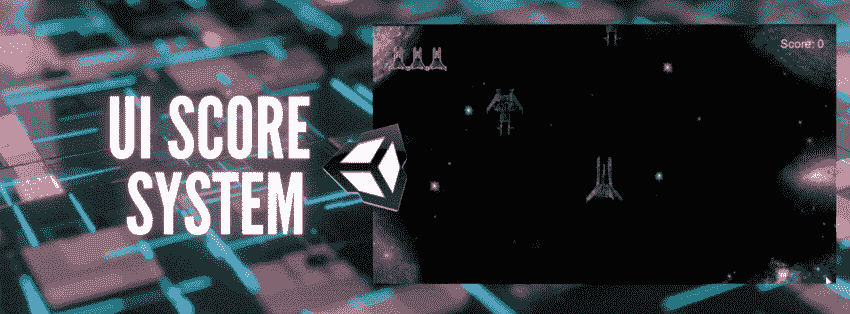

Unity UI 是一个用于游戏和应用程序的用户界面开发工具包。这个框架基于游戏对象，游戏对象使用组件和游戏视图来安排、定位和设计用户界面。

在今天的文章中，我们将探讨如何轻松地添加一个 UI 元素，并将其编写成一个功能齐全的评分系统！

# 添加乐谱文本

1.  转到层次结构，右键单击打开下拉菜单。

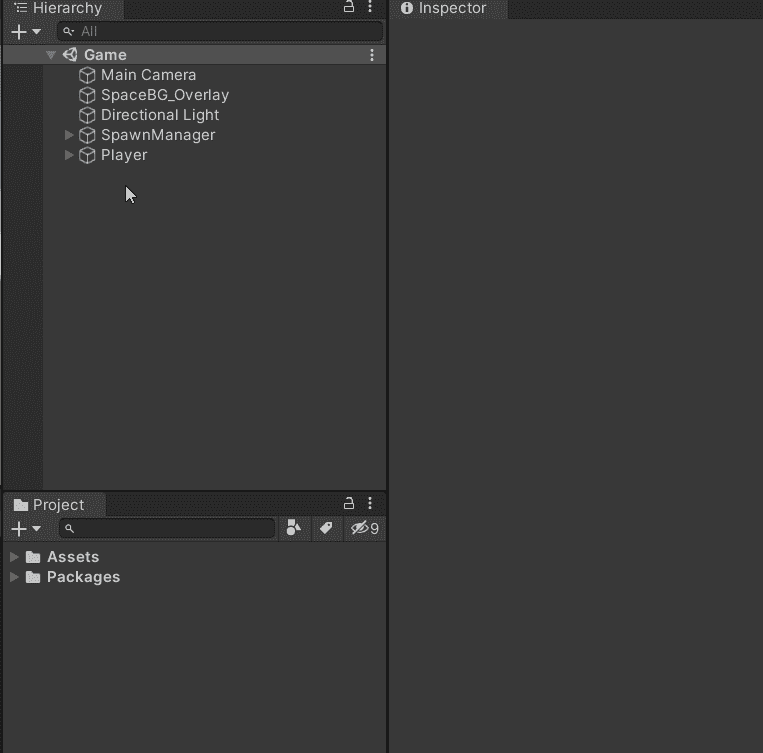

这为层次结构添加了一个**画布、**文本对象、和一个**事件系统**。画布是我们所有 UI 元素所在的工作区，所有 UI 元素，就像我们刚刚添加的文本一样，都是这个主游戏对象的子对象。事件系统是 UI 可交互的原因。

缩小后，您将能够在底部看到画布和新添加的文本。

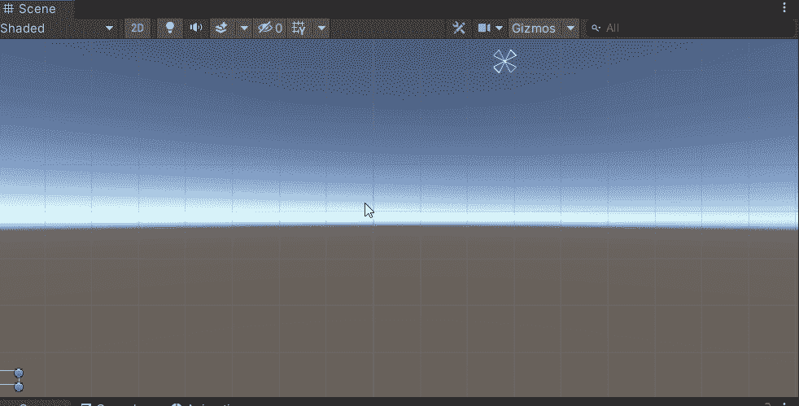

2.如有必要，更改文本的颜色和大小，使其更加清晰可见。

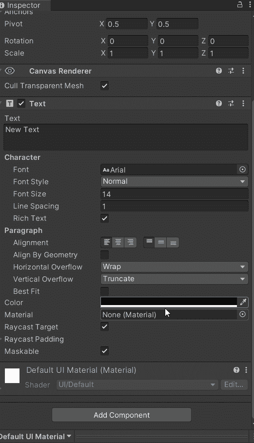

3.定位你的文本:画布的周长代表我们游戏视图屏幕的尺寸。这意味着如果你把文本放在画布的左上角，它也会出现在游戏视图的屏幕左上角。

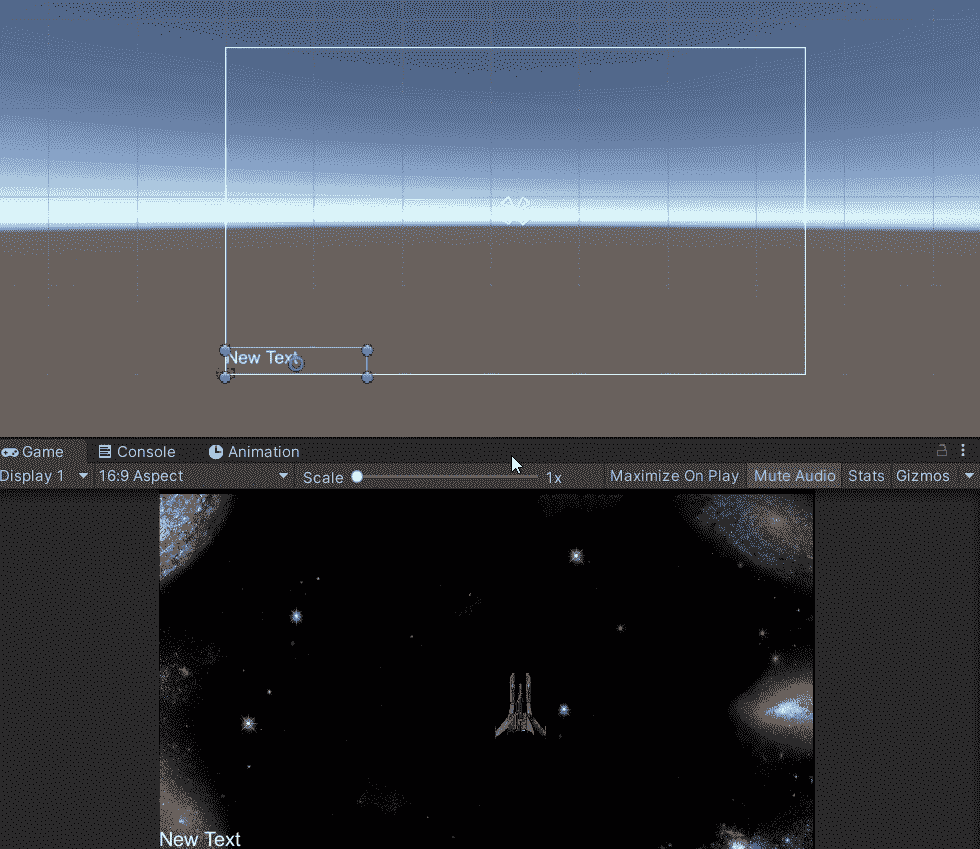

4.锚定文本的位置:如果在调整屏幕大小时，文本没有锚定到特定的位置，那么文本的位置就不会保持不变。当部署到屏幕大小可能不同的不同平台时，锚定文本至关重要。

您可以使用检查器中的**锚定预置**来锚定文本。这允许您选择特定的画布象限或位置来放置文本。然后，您可以根据需要调整位置、宽度和高度。

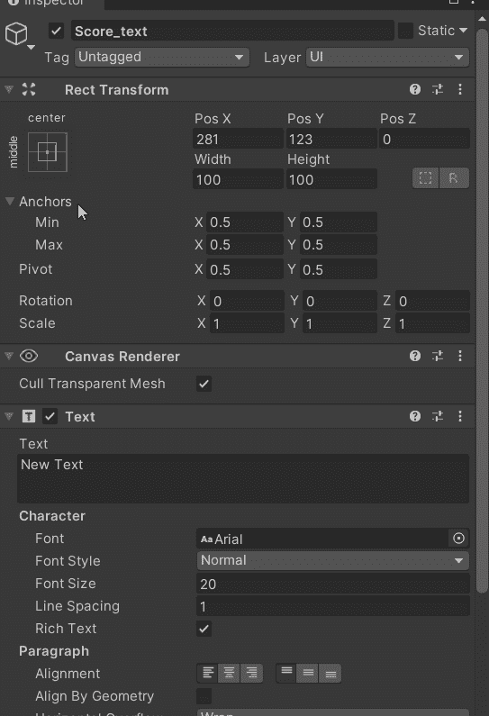

5.根据屏幕大小缩放透视文本:重要的是要记住，无论屏幕大小如何，文本都将保持相同的大小。这可能会导致文本过大或过小，具体取决于它所在的显示器。要确保文本在透视中缩放到屏幕大小，您可以在检查器中设定 UI 缩放模式。

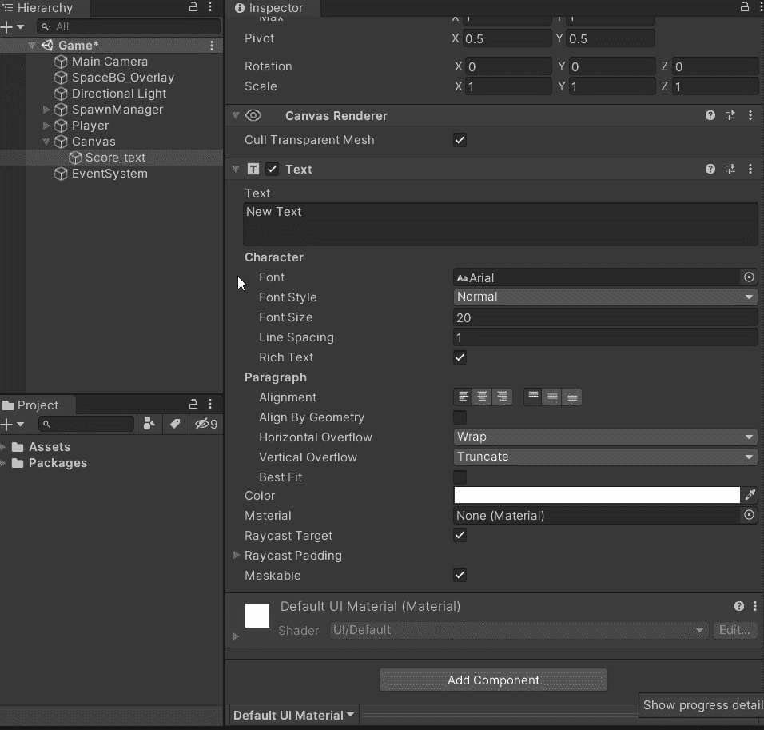

# 编写乐谱文本的脚本

在这一节中，我将向您展示如何编写文本脚本，以便通过代码更新其中的内容。这个例子使用的是 2D 太空射击游戏，每击败一个敌人就增加 10 分。

1.  创建一个脚本来处理 UI 管理，并将其附加到画布上。我们很快就会用到这个脚本！

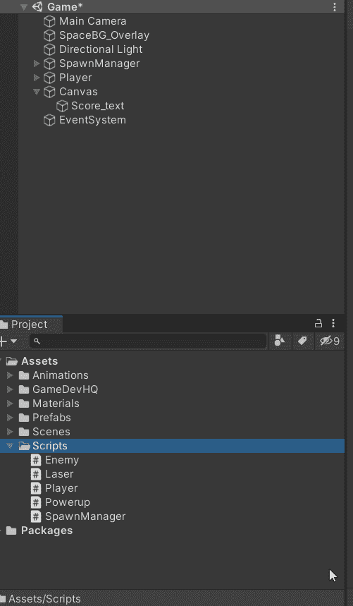

2.创建一个全局变量来存储分数。我的分数变量位于我的**播放器脚本**中，因为分数被添加到播放器中。

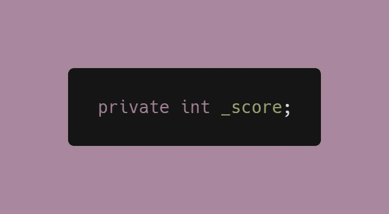

3.增加一个给分数加分的方法。这必须在你的分数变量所在的同一个脚本中。

> **注意**:可以直接用一个 int 值加到分数上。下面的例子使用了一个参数变量，如果需要的话，可以从敌人的脚本中调整来为每种敌人类型分配不同的点值。

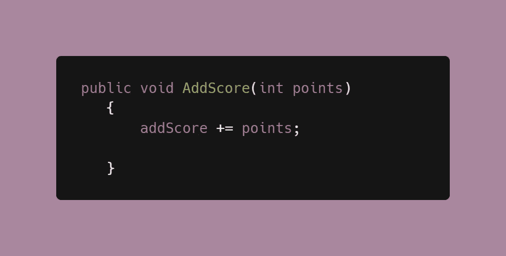

4.使用[脚本通信](https://medium.com/codex/script-communication-in-unity-using-getcomponent-ca4444bfec6)从各自的脚本中访问 addScore 方法。在我的例子中，我从敌人的脚本中访问这个方法，因为每次敌人被击败时分数都需要更新。括号中的值将是前一变量的**点**。

> **注意**:在这种情况下，最好检查你通过脚本通信引用的对象或组件是否为空。

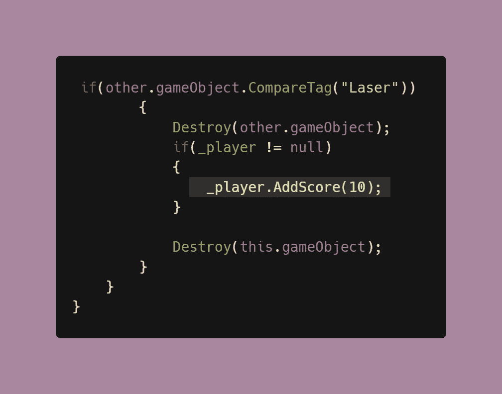

5.在 UI 管理器脚本中，确保将 Unity UI 库添加到您的，以便您可以通过代码访问和操作文本。

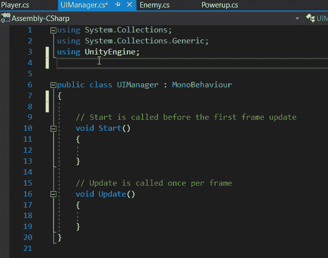

6.使用 SerializeField 创建一个句柄来引用文本对象，以便从检查器中访问它。将文本对象从层次拖动到新创建的引用。

> **注意**:由于您之前已经使 Unity UI 库可访问，现在您可以创建文本数据类型。这使得在这里添加一个**文本**变量成为可能。

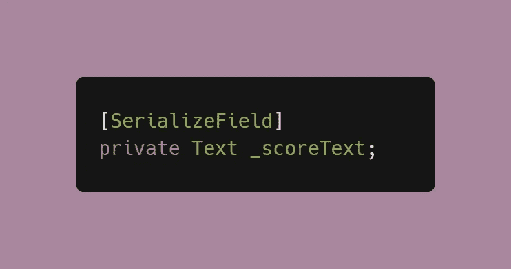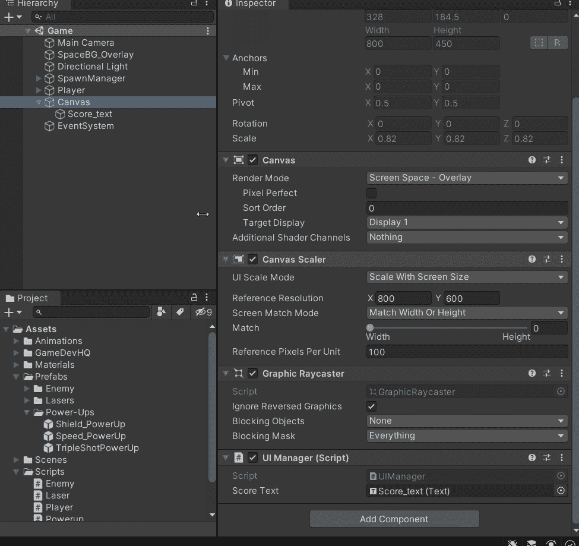

7.将起始分数设置为 0。因为这是使用文本数据类型，所以它实际上会显示在我们的 UI 上。

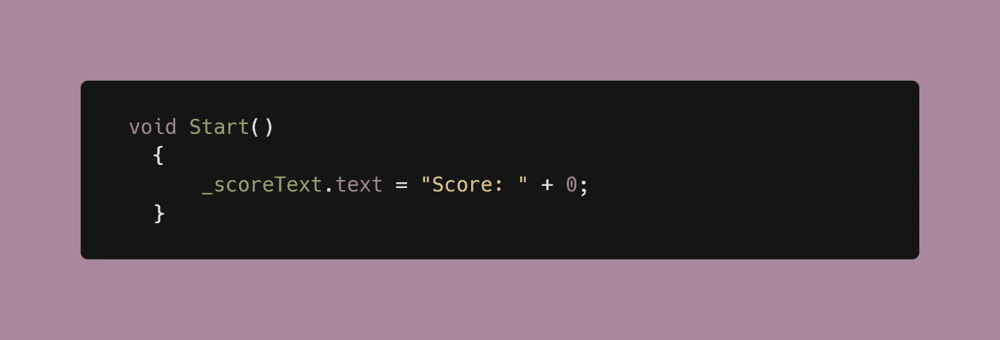

8.在 UI 管理器脚本中创建一个通过 UI 文本更新分数的方法。

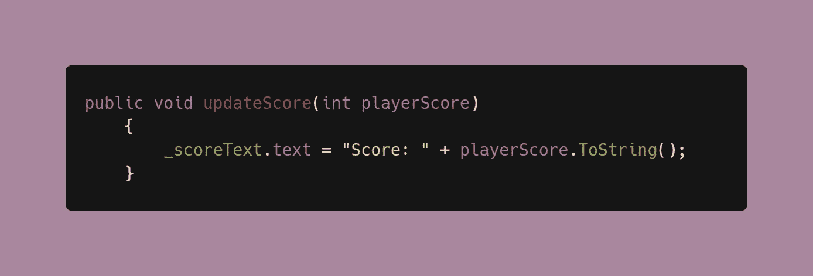

9.在播放器脚本中(或者在 3 中添加了 addScore 方法的相应脚本中)，使用脚本通信来访问 updateScore 方法。这样做是为了每次分数增加时，它也会反映在我们的 UI 中。

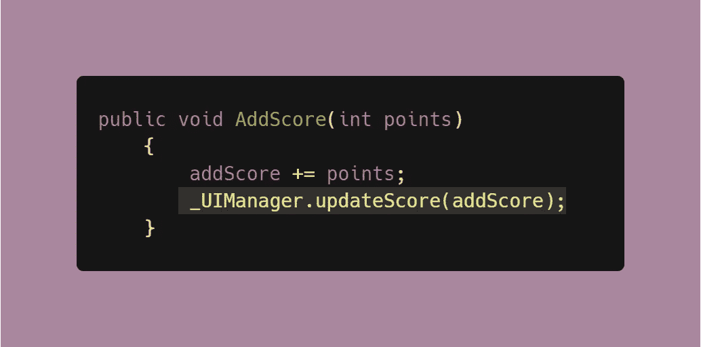

现在，你应该有一个全功能的评分系统，将显示在用户界面！

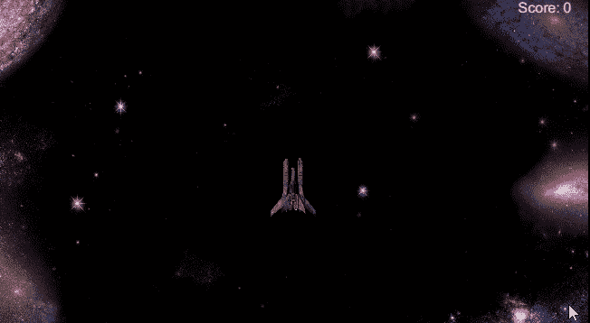

在我的下一篇文章中，我们将看看如何制作一个 [UI 系统，用实际的精灵图像来跟踪玩家的生活](https://medium.com/codex/creating-a-lives-counter-ui-element-in-unity-9d48b485555e)！