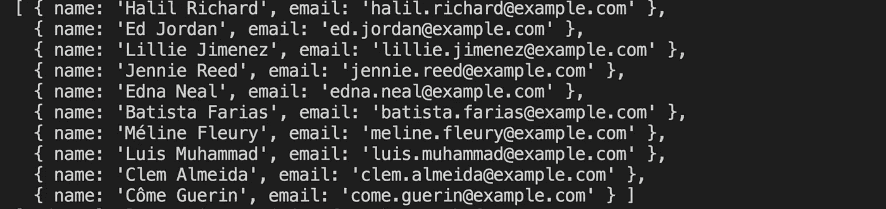

# 使用 Node.js 解析 CSV 文件的最简单方法

> 原文：<https://levelup.gitconnected.com/easiest-way-to-parse-a-csv-file-using-nodejs-76e2ec42dbc5>

了解如何轻松解析 CSV 文件的内容。


照片由[米卡·鲍梅斯特](https://unsplash.com/@mbaumi?utm_source=medium&utm_medium=referral)在 [Unsplash](https://unsplash.com?utm_source=medium&utm_medium=referral) 上拍摄

当 CSV 文件中有许多列并且每列都有不同类型的数据时，很难解析这些数据。

有许多可用的库可以帮助实现这一点。一个简单易用的库就是我们将在本文中探索的`neat-csv`库。

安装`neat-csv`库:

```
npm install neat-csv@5.2.0
```

假设，我们有一个包含用户及其电子邮件地址列表的 CSV 文件。

我们想要解析数据，我们可以这样做，如下所示

这里，我们首先将 CSV 文件作为字符串读取，并将该字符串传递给`neatCsv`函数，该函数返回一个包含解析数据的承诺。

输出将是如下所示的对象数组:



如您所见，这些键是 CSV 文件的第一行和第一列的名称。因此，在第一行添加列名以获得清晰的输出总是好的。

我们可以使用`async await`语法重写上面的代码，使其更加简单。

你可以在这里找到应用程序[的演示，在这里](https://codesandbox.io/s/csv-parser-y66ox)找到 Github 源代码

今天到此为止。我希望你学到了新东西。

**别忘了订阅我的每周简讯，里面有惊人的技巧、窍门和文章，直接在这里的收件箱里** [**。**](https://yogeshchavan.dev/)