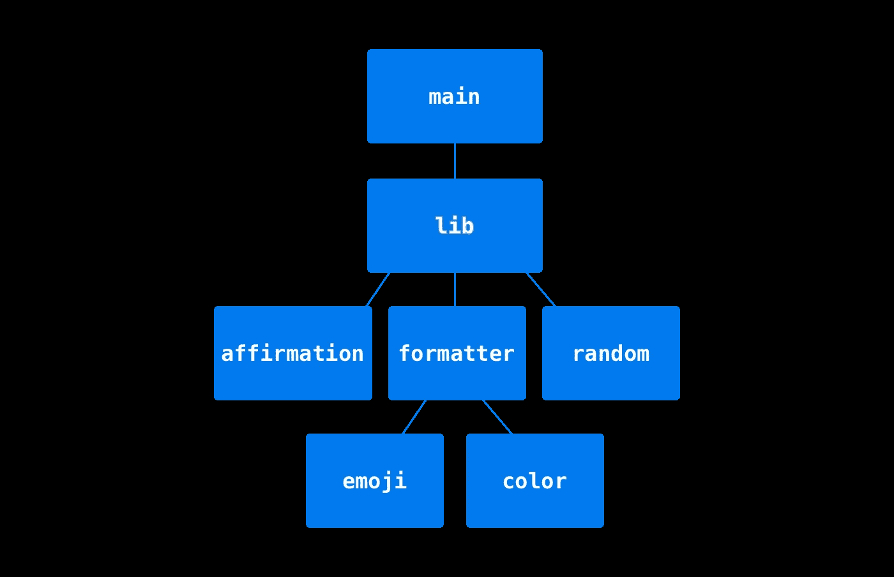

# 跨多个文件理解 Rust 模块的最简单方法

> 原文：<https://levelup.gitconnected.com/easiest-way-to-understand-rust-modules-across-multiple-files-234b5018cbfd>


# TL；速度三角形定位法(dead reckoning)

*   💡不同文件中 Rust 模块的简单明了的解释。
*   🤿:我们将深入一个真实世界的例子来探索模块系统。
*   📈大量图表帮助你理解。

Rust 中的模块系统可能会让来自其他语言的开发人员感到困惑。我花了一段时间来理解它，所以我想与你分享它是如何工作的，以及如何轻松地跨多个文件组织你的程序。

我们走吧。

# 跨文件信任模块

Rust 要求开发人员手动构建模块树。方法是用关键字 **mod** 声明模块。

模块树从板条箱根开始，通常是库板条箱的 *src/lib.rs* 或二进制板条箱的 *src/main.rs* 。Rust 编译器将首先在 crate 根目录中寻找要编译的模块。

假设您想要在二进制机箱中导入一个模块“a ”,您可以像这样声明该模块:

main.rs

```
mod a;
fn main() { /* do amazing things */ }
```

编译器将在以下位置的 *src* 目录中查找模块:

在 *src/a.rs*

```
.
├── Cargo.lock
├── Cargo.toml
└── src
    ├── a.rs
    └── main.rs
```

或者在 *src/a/mod.rs* 中

```
.
├── Cargo.lock
├── Cargo.toml
└── src
    ├── a
    │   └── mod.rs
    └── main.rs
```

通过在 *main.rs* 中声明 **mod a** ，您已经构建了一个模块树，如下所示:


初始模块树

# 跨文件信任子模块

在模块中，您可以创建子模块来进一步组织您的代码。假设您想在模块“a”中声明模块“b”和“c”:

/src/a/mod.rs

```
mod b;
mod c;
```

编译器将在 *src/a* 目录中寻找子模块:

```
.
├── Cargo.lock
├── Cargo.toml
└── src
    ├── a
    │   ├── b.rs
    │   ├── c.rs
    │   └── mod.rs
    └── main.rs
```

现在你已经建立了这样一棵树:


带有子模块的模块树

# “pub”的可见性

默认情况下，模块中的所有[项](https://doc.rust-lang.org/reference/items.html)都是私有的。它们只对同一模块中的项目可见。

src/a/mod.rs

```
mod b;
mod c;

fn do_a() {} // only the other functions in module a can use it
             // it's not visible to main.rs
```

为了让它的父模块能够访问函数 *do_a* ，我们需要添加关键字 **pub** 。

src/a/mod.rs

```
pub fn do_a() {} // now it's visible to main.rs
```

我们可以使用[路径限定符 *::*](https://doc.rust-lang.org/reference/paths.html) 来访问 *do_a* 。

src/main.rs

```
mod a;

fn main() {
    a::do_a();
}
```

我们可以对子模块使用相同的模式。

src/a/b.rs

```
pub fn do_b() {} // visible to module "a" and all the submodules of module "a"
```

通过将 **pub** 添加到 *do_b* ，模块“a”现在可以访问该功能。

src/a/mod.rs

```
mod b;
mod c;

pub fn do_a {
    b::do_b();
}
```

模块“c”的子模块也可以访问 do_b。您可以使用绝对路径或相对路径来访问它。

src/a/c.rs

```
pub fn do_c {
    crate::a::b::do_b(); // absolute path
    super::b::do_b(); // relative path
}
```

# 重新导出项目

非父模块无法访问子模块的项目。例如，我们可以尝试访问 *main.rs* 中的 *do_b*

src/main.rs

```
mod:a;

fn main() {
    a::b::do_b();
    // ^^^^ function `do_b` is private
}
```

你会看到一个错误消息，说 *do_b* 是私有的。这是因为目前为止 *do_b* 只能在模块“a”中访问。为了使它对板条箱根可见，我们需要通过将**发布**添加到模块“a”的模块“b”声明中来重新导出它。

src/a/mod.rs

```
pub mod b;
// --snip--
```

# “使用”声明

[**使用**](https://doc.rust-lang.org/reference/items/use-declarations.html) 声明可以帮助您在访问另一个模块中的项目时缩短路径。例如，我们可以重构模块“a”:

src/a/mod.rs

```
mod b;
mod c;

use b::do_b;
use c::do_c;

pub fn do_a {
    do_b();
    do_c();
}
```

它为 *do_b* 和 *do_c* 创建一个绑定到其路径的本地名称。**使用**对于长路径非常有用。

# 真实世界的例子

为了演示 Rust 的模块系统，我创建了一个名为 **affme** 的简单 CLI，是“affirm me”的缩写。


演示

**affme** 是一个自我肯定生成器。CLI 接受一个名称作为参数，并显示随机确认。

> *演示是 GitHub* *上提供的* [*。请随意看一看回购，并尝试它 out✨*](https://github.com/DawChihLiou/affme)

代码设计很简单:


代码设计

在“格式”块中，

*   它接受用户输入，
*   将输入与随机肯定和随机表情连接起来，
*   将随机字体颜色应用于连接的确认，
*   并最终输出确认。

为了展示跨文件的模块系统，我设计了如下的模块树:



affme 模块树

有几件事值得一提:

*   这个包有两个板条箱，一个二进制和一个库。我使用库箱来封装实现，使用二进制箱来执行 CLI。
*   在库箱根 *src/lib.rs* 中，从*肯定*和*格式化模块*中访问函数。
*   *肯定*模块和*格式器*模块中的两个子模块正在使用*随机*模块中的相同函数来随机选取一个项目。因为*肯定*模块和*格式化器*子模块在树的不同分支，我们需要在模块树的共同祖先中声明*随机*模块。

在文件系统中，它看起来像这样:

```
.
├── Cargo.lock
├── Cargo.toml
├── src
│   ├── affirmation.rs
│   ├── formatter
│   │   ├── color.rs
│   │   ├── emoji.rs
│   │   └── mod.rs
│   ├── lib.rs
│   ├── main.rs
│   └── random.rs
└── target
```

让我们深入库的根目录，看看代码是如何构造的。

资源中心/图书馆

```
mod affirmation;
mod formatter;
mod random;

use affirmation::Affirmation;
use formatter::format;

pub fn affirm(name: &str) -> String {
    let affirmation = Affirmation::new().random();
    format(affirmation, name)
}
```

在这里，您可以在顶部看到模块声明。你也可以找到*使用*声明为*断言*和*格式*创建局部名称绑定。

随机模块很简单:

src/随机. rs

```
use rand::Rng;

pub fn pick<'a, T: ?Sized>(items: &[&'a T]) -> &'a T {
    let random_index: usize = rand::thread_rng().gen_range(0..items.len());
    items.get(random_index).unwrap()
}
```

它有一个公共的 *pick* 函数，从数组切片中返回一个随机项。我用这个功能来选择随机的肯定、表情符号和颜色。让我们以*肯定*模块为例来看看:

src/affirmation.rs

```
use crate::random;

#[derive(Debug)]
pub struct Affirmation<'a> {
    affirmations: [&'a str; 6],
}

impl<'a> Affirmation<'a> {
    pub fn new() -> Self {
        let affirmations = [
            "You're beautiful",
            "You're awesome",
            "You're wonderful",
            "You've got this",
            "You can do all things",
            "Go get it",
        ];
        Affirmation { affirmations }
    }

    pub fn random(&self) -> &'a str {
        random::pick(&self.affirmations)
    }
}
```

你可以看到*为*随机*模块使用*声明。*肯定*模块能够访问*随机*模块，因为*随机*模块是在库机箱根目录中声明的。我在*断言*结构及其函数上使用了 *pub* 关键字，这样 crate root 就可以看到它们。

你可以在*表情符号*和*颜色*子模块中找到相同的编码模式。

要把这些都集合起来，我们来看看*格式*模块。

src/formatter/mod.rs

```
mod color;
mod emoji;

use color::Color;
use colored::*;
use emoji::Emoji;

pub fn format(affirmation: &str, name: &str) -> String {
    let emoji = Emoji::new();
    let color = Color::new();

    let phrase = format!("{}, {} {}", affirmation, name, emoji.random())
        .color(color.random())
        .bold()
        .to_string();

    format!(
        "{}\n{}\n{}\n{}\n{}",
        "*".repeat(phrase.len() + 2).magenta(),
        format!("*{}*", " ".repeat(phrase.len())).magenta(),
        format!("    ✏️  ...{}  ", phrase,),
        format!("*{}*", " ".repeat(phrase.len())).magenta(),
        "*".repeat(phrase.len() + 2).magenta()
    )
}
```

它在范围内引入了*颜色*和*表情符号*子模块，因此我们可以用随机表情符号和随机字体颜色连接完整确认。

# 最后的想法

跨多个文件的 Rust 模块与其他语言略有不同，但是一旦你理解了 **mod** 、 **use** 和 **pub** ，模块设计就变得更加容易和有目的了。

**Rust 模块备忘单**

*   模块树从机箱根开始。
*   使用 **mod** 用模块和子模块构建你的树。
*   使用**发布**使模块项目对父模块可见。
*   你可以用 **pub mod** 或者 **pub use** 重新导出。

# 参考

*   [书:定义控制范围和隐私的模块 Rust 编程语言](https://doc.rust-lang.org/book/ch07-02-defining-modules-to-control-scope-and-privacy.html)
*   [书:使用声明—生锈参考](https://doc.rust-lang.org/reference/items/use-declarations.html)
*   [书:物品—铁锈参考](https://doc.rust-lang.org/reference/items.html)
*   [书:模块—生锈参考](https://doc.rust-lang.org/reference/items/modules.html)
*   [图书:路径—生锈参考](https://doc.rust-lang.org/reference/paths.html)
*   [文章:如何跨不同文件使用 Rust 模块— Casey Falkowski](https://spin.atomicobject.com/2022/01/24/rust-module-system/)
*   [GitHub: affme 资源库](https://github.com/DawChihLiou/affme)

```
Want to Connect? This article was originally posted on [Daw-Chih’s website](https://dawchihliou.github.io/articles/easiest-way-to-understand-rust-modules-across-multiple-files).
```

# 分级编码

感谢您成为我们社区的一员！在你离开之前:

*   👏为故事鼓掌，跟着作者走👉
*   📰查看[级编码出版物](https://levelup.gitconnected.com/?utm_source=pub&utm_medium=post)中的更多内容
*   🔔关注我们:[推特](https://twitter.com/gitconnected) | [LinkedIn](https://www.linkedin.com/company/gitconnected) | [时事通讯](https://newsletter.levelup.dev)

🚀👉 [**加入升级人才集体，找到一份惊艳的工作**](https://jobs.levelup.dev/talent/welcome?referral=true)