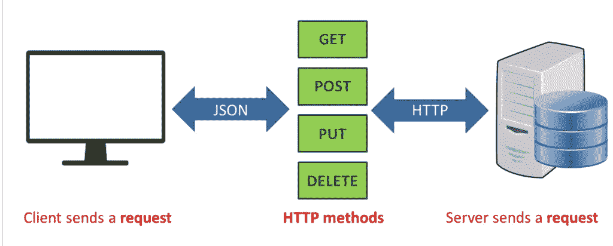
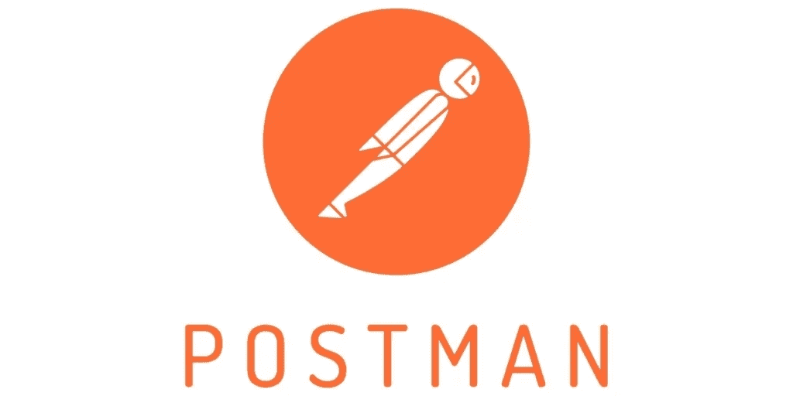
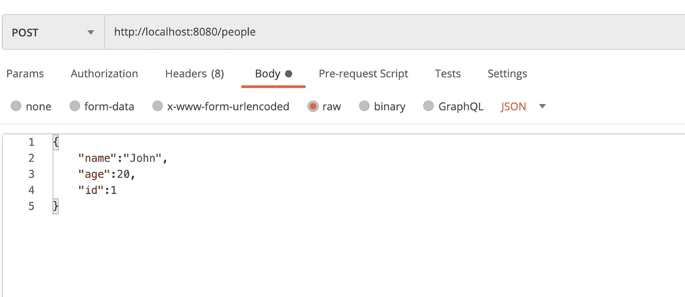

# 用 Spring 轻松创建优雅的 REST API

> 原文：<https://levelup.gitconnected.com/easily-create-an-elegant-rest-api-with-spring-8977c5d07d19>

## 获取、发布、放置和删除路线



在本教程中，我们将创建一个 Spring 服务器，它将管理一个 Person repo 并支持 PUT、POST、GET 和 DELETE 操作。Spring 框架允许我们为我们的应用程序快速启动后端服务器。

首先让我们设置基本的 Spring 应用程序，如果你有 Intellij，你可以选择 Spring boot 并添加 Spring Web 和 Spring devtools 选项。如果您只是使用 Maven，下面是我的 POM 依赖项的样子。

## POM 文件依赖关系

```
<dependencies>
    <dependency>
        <groupId>org.springframework.boot</groupId>
        <artifactId>spring-boot-starter-web</artifactId>
    </dependency> <dependency>
        <groupId>org.springframework.boot</groupId>
        <artifactId>spring-boot-devtools</artifactId>
        <scope>runtime</scope>
        <optional>true</optional>
    </dependency>
    <dependency>
        <groupId>org.springframework.boot</groupId>
        <artifactId>spring-boot-starter-test</artifactId>
        <scope>test</scope>
        <exclusions>
            <exclusion>
                <groupId>org.junit.vintage</groupId>
                <artifactId>junit-vintage-engine</artifactId>
            </exclusion>
        </exclusions>
    </dependency>
</dependencies>
```

这是构建插件。

```
<build>
    <plugins>
        <plugin>
            <groupId>org.springframework.boot</groupId>
            <artifactId>spring-boot-maven-plugin</artifactId>
        </plugin>
    </plugins>
</build>
```

现在我们将创建基本的服务器应用程序。

## 基本应用程序

如果您运行这个，您将在 LocalHost 上启动您的服务器，它将告诉您它被托管在终端的哪个端口上(但是我们还没有配置任何路由，所以页面上不会有任何内容)

接下来，我们将为一个人做一个 POJO。

## Person.java

我们的 Person 对象非常简单，它由姓名、年龄和 ID 组成。在 MVC 架构(模型视图控制器)中，这将作为我们的模型。我们需要 getters 和 setters，因为这是我们的控制器访问和更新这些字段的方式。我们将使用 id 作为查询 Person 对象的主键。

## 端点

我们将“人”存储在一个 map 中，键是他们的 id，值是 Person 对象。如您所见，我们有 4 个端点。每个人都将与我们的 person map 进行交互，并返回一些数据或响应消息以及 HTTP 代码。(以下是标准 HTTP 代码列表

1.  在 **GET /people** 中，我们不接受任何参数，而是通过向 ResponseEntity 添加 personMap.values()来发送所有数据。
2.  在 **POST /people** 中，我们不接受任何参数，但是期望 Person 类的主体(JSON 格式)，我们将那个人添加到我们的地图中，并且我们返回一个响应说创建成功。
3.  在 **PUT /people/{id}** 中，我们为一个 id 获取一个参数，我们获取该 id 并用包含在主体中的 Person JSON 更新与该 id 相关联的 Person 对象。
4.  在 **DELETE /people/{id}** 中，我们删除与该 id 相关联的人员条目。

为了测试 API 路由，我使用了 [Postman](https://www.postman.com/) 。Postman 让您可以轻松地发出任何类型的请求(POST、PUT、DELETE、GET 等)，还可以包含 url 参数或 PUT 和 POST 请求的主体。



下面是我用来通过 POST 创建条目的 JSON 的一个例子

```
{"name":"John","age":20,"id":1}
```

确保你的体型是 raw json，如下图

