# 轻松为您的 Route53 自定义域创建电子邮件地址

> 原文：<https://levelup.gitconnected.com/easily-create-email-addresses-for-your-route53-custom-domain-589d099dd0f2>

## 如果你曾经买过一个自定义域名，你很可能想要在上面有电子邮件地址。这里有一个非常简单的方法来设置它们，使用 AWS。

在 [Route53](https://aws.amazon.com/route53/) 和[简单电子邮件服务(SES)](https://aws.amazon.com/ses/) 中注册和验证自定义电子邮件地址并不困难。但是几乎没有文档向您展示如何轻松地做到这一点。这里有一个简单的解决方案。

通过 AWS 上的 Route53 控制台购买定制域名真的很简单。它们的价格从 9 美元起。在一些[好文档](https://docs.aws.amazon.com/Route53/latest/DeveloperGuide/domain-register.html)的帮助下，你可以在几分钟内设置好。

一旦你有了自己的域名，你也可以很快建立并运行一个静态网站。随着静态网站越来越受欢迎，有很多框架和指南可以帮助你。例如，[这份 AWS 指南](https://aws.amazon.com/getting-started/hands-on/host-static-website/)将在 30 分钟内带你到达目的地！

# 但是！

一旦你想添加电子邮件地址到你的自定义域名，你就碰到了一堵墙。文档枯竭了。*可用的文档*做出各种各样的假设。例如，您已经配置了一个邮件服务器。但是，如果你没有呢？

# 为什么？

有许多原因，你可能想有电子邮件地址在您的自定义域。也许这是一个个人网站，你想包括你的名字？在我的例子中，我正在构建一个 web 应用程序，并希望 AWS Cognito 从我的域发送电子邮件。

我想实现这个目标:

1.  创建自定义域*example.com*。
2.  创建一个使用 [AWS Cognito](https://eu-west-1.console.aws.amazon.com/cognito/home) 进行身份验证的 Web 应用程序。
3.  在我的自定义域名上创建一个电子邮件*no-reply@example.com*。
4.  让 AWS Cognito 从*no-reply@example.com*发送注册电子邮件。

这篇文章的范围是**第三步**。

# 首先是积木

让我们假设您已经在 Route53 中注册了您的自定义域。

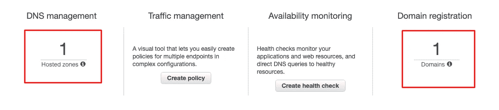

Route53 仪表板

我们将使用[简单电子邮件服务(SES)](https://aws.amazon.com/ses/) 注册新的电子邮件:*no-reply@example.com*。

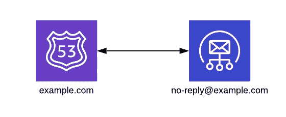

我们需要实现两件事:

1.  验证 SES 内部的*example.com*域。
2.  在 SES 中验证 no-reply@example.com 的*电子邮件地址。*

这看起来很简单，事实也的确如此。然而，要实现这一点，我们还需要跨越一些障碍，尤其是第二点。

# 验证新域

在 AWS 控制台中，导航到 SES >身份管理>域，然后单击“验证新域”。

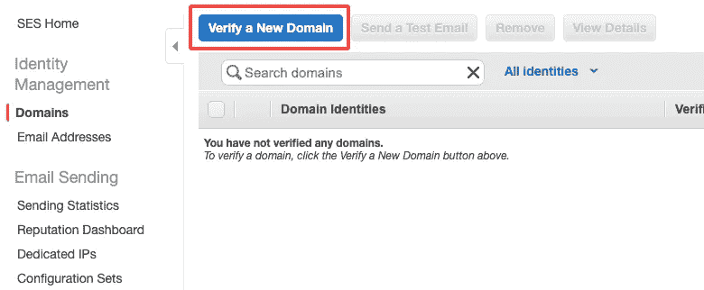

在弹出的表单中，只需输入域名，例如:【example.com】T4。这将与您在 Route53 中注册的相同。确保选中“生成 DKIM 设置”框。[更多信息请点击](https://docs.aws.amazon.com/ses/latest/DeveloperGuide/send-email-authentication-dkim.html)。

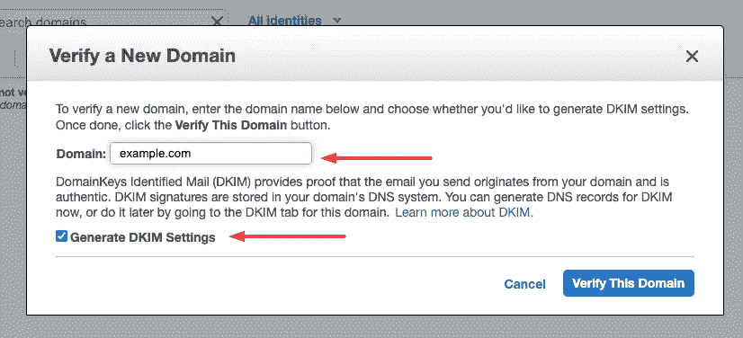

一旦你点击“验证这个域”,你会看到一大堆看起来很复杂的记录和 id。

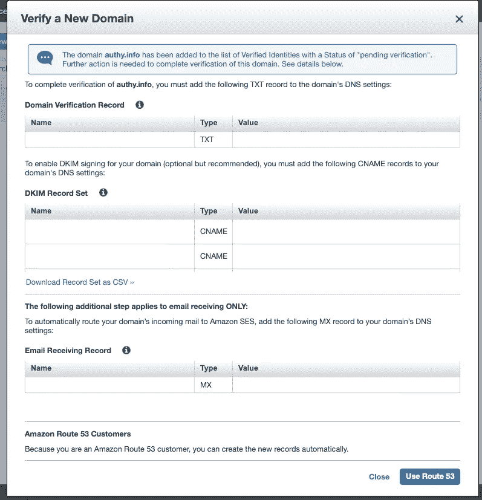

注意:我的记录被故意删掉了

这些记录将允许我们做以下三件事:

*   向 SES 证明我们拥有我们尝试使用的域名。
*   建立 DKIM 记录，当 SES 为我们发送电子邮件时，这将允许其他人知道我们是谁。
*   让系统工程师代表我们的领域接收电子邮件。

任何域名注册机构都可以使用这些记录来实现我们的目标。然而，因为我们使用 53 号公路，我们可以让 AWS 为我们整理所有的线路。只需点击“使用 53 号公路”。

***编辑:*** *您可能会被要求确认对 MX 记录的要求——被告知这将覆盖任何现有的 MX 记录。因为您没有邮件服务器，所以您可以继续检查此框。*

验证可能需要几分钟才能完成，但您最终会得到如下结果:

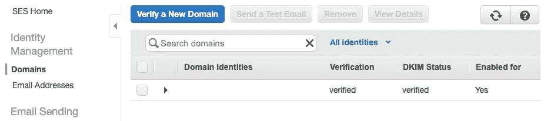

这是第一步—我们有一个经过验证的域。在下一步中，我们将创建并验证一个电子邮件地址:*no-reply@example.com*。

# 验证新的电子邮件地址

在 AWS 控制台中，导航至 SES >身份管理>电子邮件地址，然后单击“验证新的电子邮件地址”。

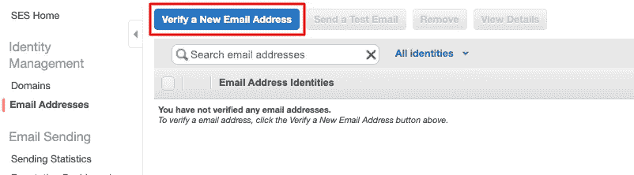

在出现的表单中，只需键入您想要创建的电子邮件地址，例如*no-reply@example.com*。

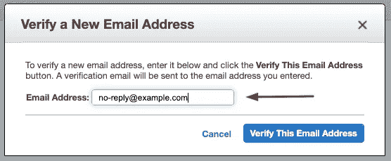

单击“验证此电子邮件地址”,您将看到一条消息，告诉您已向该电子邮件发送了一封验证邮件。

❓Wait，怎么了？我们没有接收该电子邮件的收件箱，我如何点击验证链接？😕

说得好——这是真正的挑战。

您的电子邮件现在将无限期地处于“等待验证”状态。

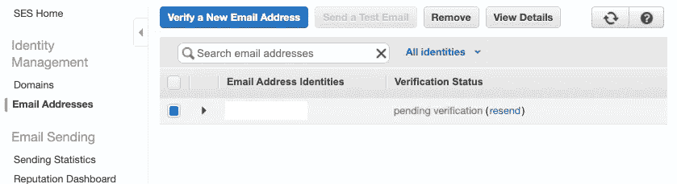

很有可能，就像我一样，你已经设法到达这一点，然后陷入困境。就在这时，踪迹消失了。

不要担心，希望没有破灭。只需几个步骤，我们就可以验证该电子邮件:

*   创建一个 SES 规则集，其中包含将*no-reply@example.com*电子邮件转发到简单通知服务(SNS)主题的规则。
*   使用我们的*个人*邮箱订阅 SNS 话题。
*   提取链接并验证*no-reply@example.com*！

如果要创建多个电子邮件地址，请对每个地址重复验证新电子邮件地址的步骤。

# 创建电子邮件接收规则集

在 AWS 控制台中，导航到 SES >电子邮件接收>规则集，然后单击“创建接收规则”。

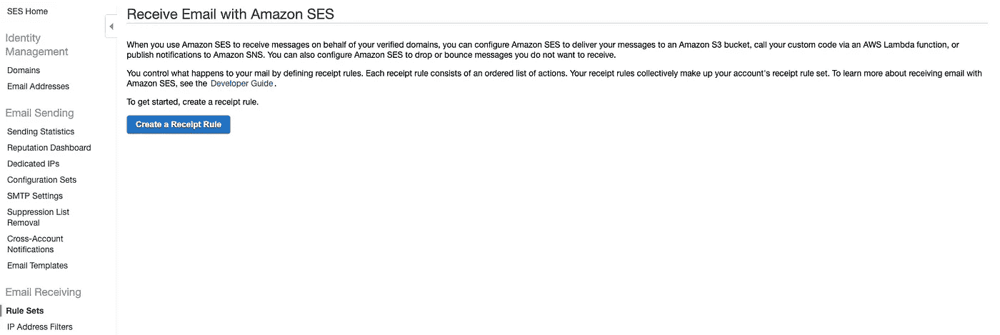

输入您需要验证的每个电子邮件地址。请注意，验证状态设置为“已验证”。这是因为我们新的*域名*已经过验证。然后点击“下一步”。

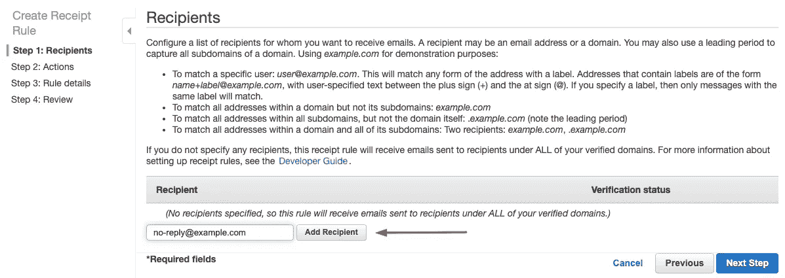

## 添加操作

这是至关重要的一点。我们现在能够告诉 AWS 如何处理我们的新电子邮件地址收到的任何电子邮件。 ***这包括验证邮件*** 。

在这个例子中，我们将使用[简单通知服务(SNS)](https://aws.amazon.com/sns) 。当 SES 收到发给*no-reply@example.com 的电子邮件时，*它会将该电子邮件推送至我们在此创建的 SNS 主题。

从“添加操作”下拉列表中选择 SNS。选择创建新 SNS 主题的选项，并给它一个合理的名称。选择“UTF-8”编码。

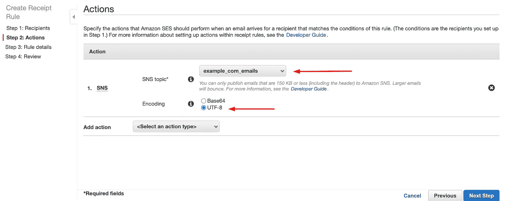

接下来，为您的新规则命名。点击“下一步”

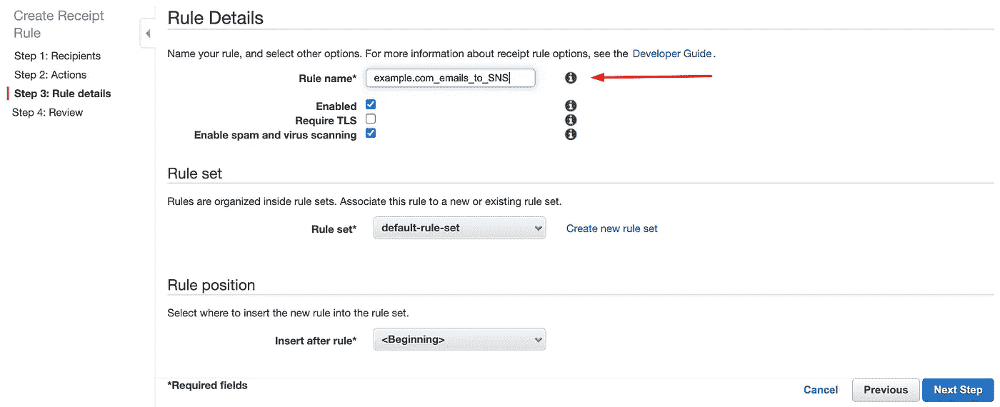

然后，在单击“创建规则”之前，您将有机会检查您的新规则集。

## 订阅社交网络话题

到目前为止，我们已经创建了一个系统，可以将 no-reply@example.com 收到的任何邮件推送到一个新的社交网络话题。接下来，我们必须订阅该主题，以访问这些电子邮件。

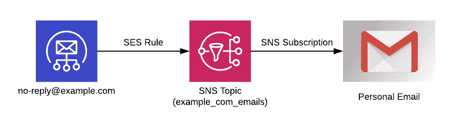

为此，我们将使用我们的个人电子邮件地址进行订阅，例如*example@gmail.com*。

在 AWS 控制台中，导航到[SNS](https://eu-west-1.console.aws.amazon.com/sns/v3/home)主题，并单击您在上一步中创建的主题。

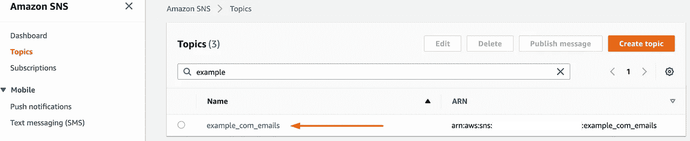

转到“订阅”选项卡，然后单击“创建订阅”。

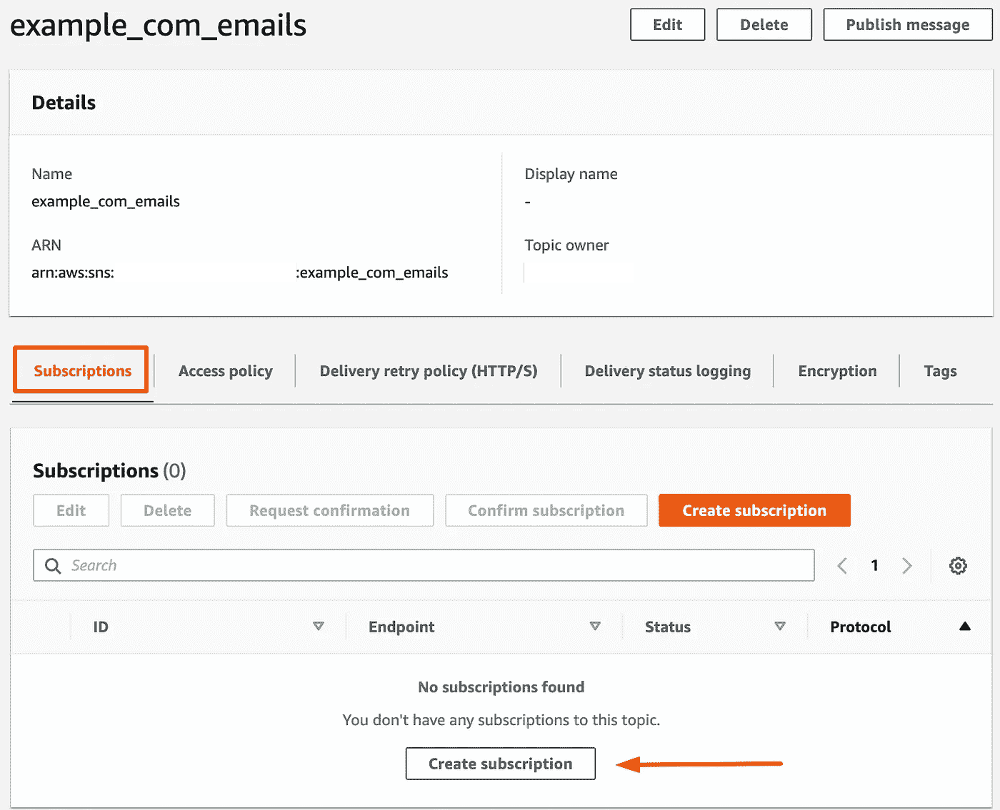

将主题 SNS 保留为默认(这将是您的新主题)。然后选择“Email-JSON”。我们选择 JSON 是因为“Email”选项会使链接格式不正确。

输入您的个人电子邮件地址，然后单击“创建订阅”。

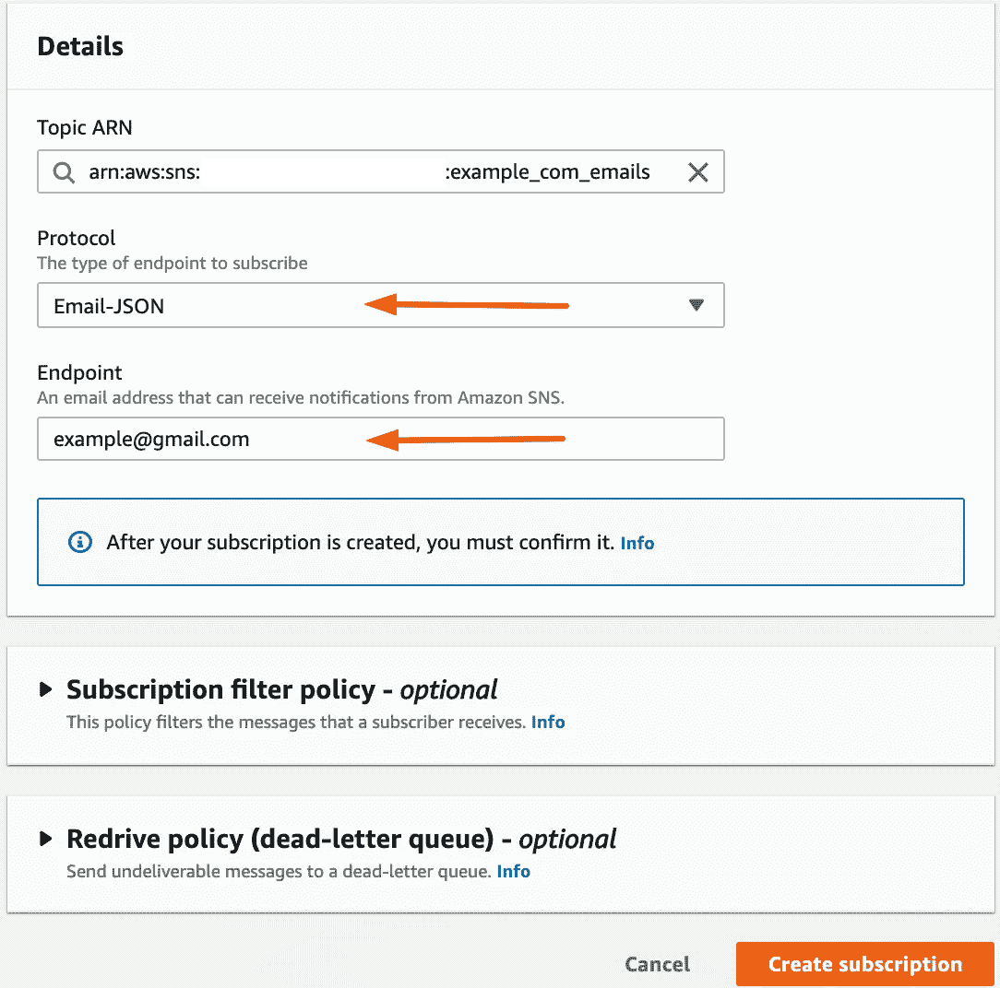

几秒钟后，你会收到一封电子邮件。这是确认您的订阅。在电子邮件中，找到标题为“SubscribeURL”的链接，然后单击它。

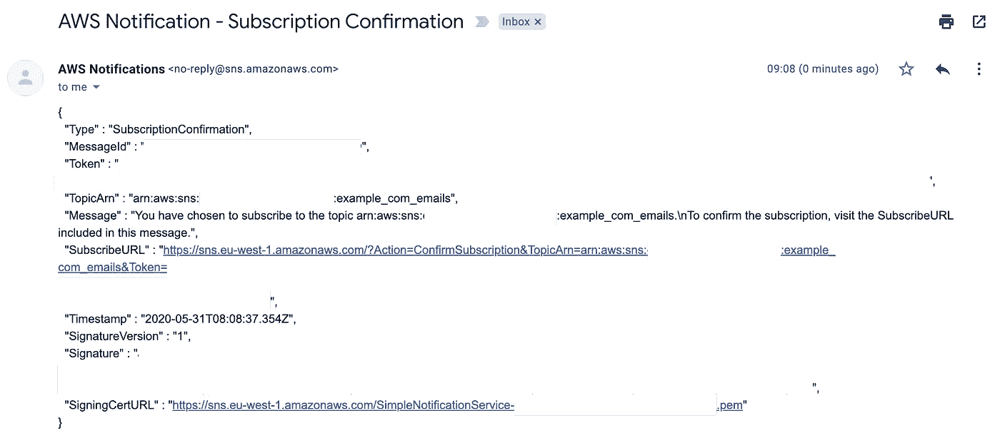

您将被重定向到一个看起来很有趣的 XML 文档。这是确认您已成功订阅 SNS 主题。

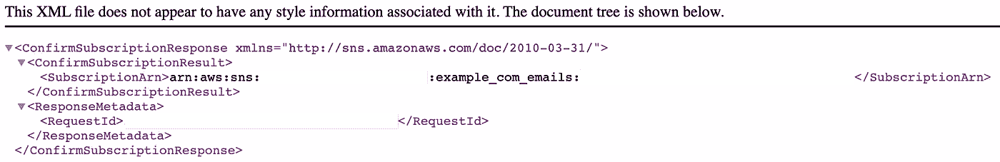

如果有疑问，您可以在 SNS >订阅查看。您应该会在您的电子邮件地址中看到“已确认”状态。

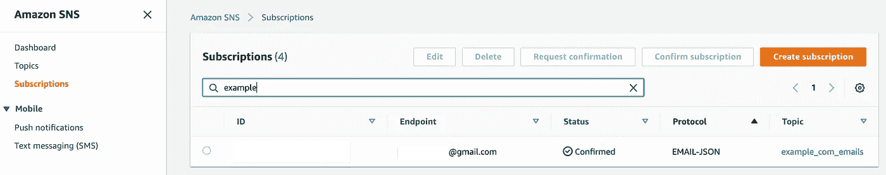

现在一切就绪，你可以接收发送到 no-reply@example.com 的电子邮件了。现在我们可以验证该电子邮件地址。

## 验证电子邮件地址

返回 SES >电子邮件地址。您会看到该电子邮件地址仍然标记为“等待验证”。您还会看到一个链接“重新发送”。

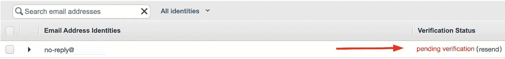

点击“重新发送”链接。如果一切配置正确，您将在个人收件箱中收到验证电子邮件！万岁！

你收到的电子邮件读起来会很恐怖。浏览一下，看看有没有这样的短语:

> 如果您请求了此验证，请转到以下 URL 以确认您有权使用此电子邮件地址

紧接着，您将看到验证链接。仔细复制链接。 ***注意:不要包含“\ \ \ r \ \ n \ \ r \ \ n”字符。***

将链接粘贴到您的浏览器中。您将看到如下消息:

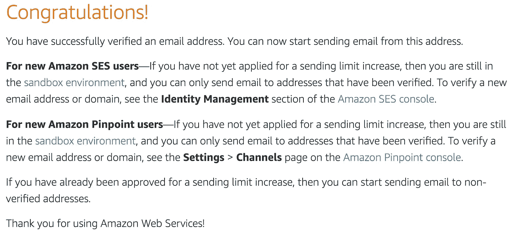

SES >电子邮件地址的验证状态也会显示*已验证*。

干得好！您现在在自定义域中有了一个经过验证的电子邮件地址。您可以通过 SES 使用此电子邮件地址处理任何您需要的事情。

# 谈一下自动化

我不喜欢通过 AWS 控制台进行任何配置。如果有机会，我会尽可能使用 [Cloudformation](https://aws.amazon.com/cloudformation/) 和[无服务器框架](http://serverless.com/)来配置和部署 AWS 服务。我非常喜欢代码提供的[基础设施的一致性和时间节省。](https://en.wikipedia.org/wiki/Infrastructure_as_code)

在这种情况下，很少有云形成支持我们正在做的事情。支持一些资源，例如 SES 规则集和 SNS 主题。但是将所有这些与其他元素连接在一起是很麻烦的。

因为这很大程度上可能是“一次性”的操作，所以我认为自动化会使过程过于复杂，尤其是像这样的教程。但是，有人围绕这个做了一些很好的工作。如果你正在寻找一种自动化的方法，看看这些帖子:

*   [Mark van Holsteijn](https://binx.io/blog/2019/11/14/how-to-deploy-aws-ses-domain-identities-dkim-records-using-cloudformation/)如何使用 Cloudformation 部署 AWS SES 域身份和 DKIM 记录——他还在 Github 上提供了[代码。](https://github.com/binxio/cfn-ses-provider)
*   [Simon-Pierre ging ras](https://medium.com/poka-techblog/verify-domains-for-ses-using-cloudformation-8dd185c9b05c)利用云信息验证 SES 的域

[这篇关于*通过你的自定义域名从你的个人邮箱发送*邮件的文章](https://www.daniloaz.com/en/use-gmail-with-your-own-domain-for-free-thanks-to-amazon-ses-lambda/)也是一篇非常有趣的文章。

# 直到下一次…

无论您是否选择追求自动化路线，我希望本教程已经帮助您克服了验证自定义电子邮件地址的障碍。