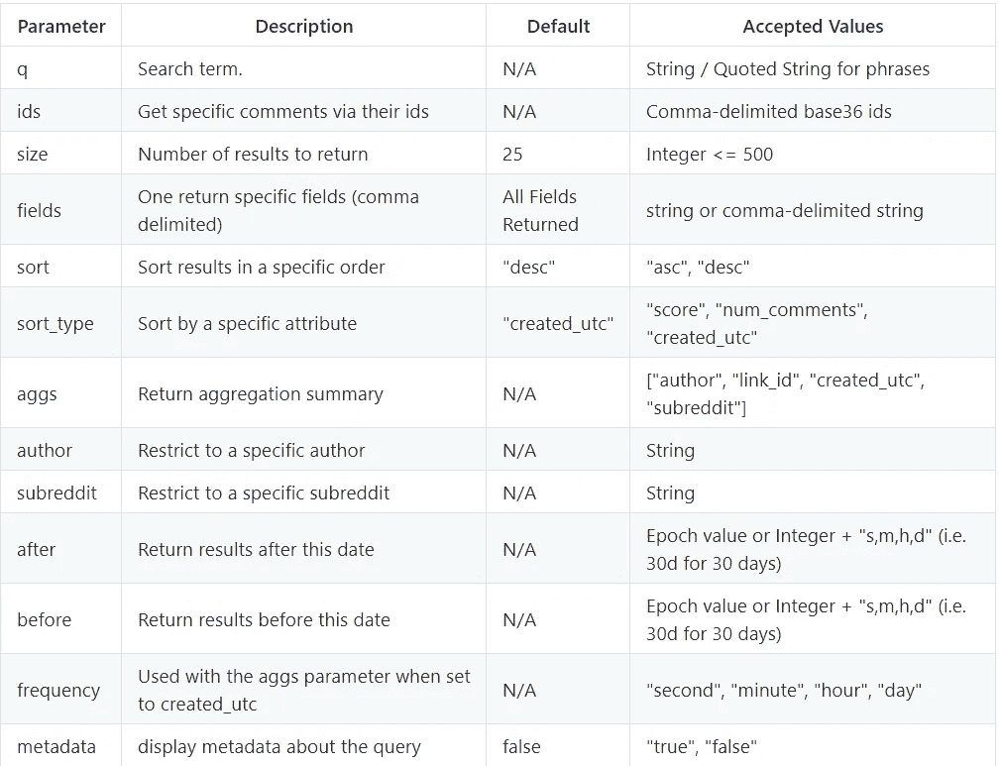
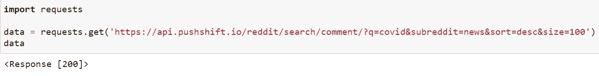
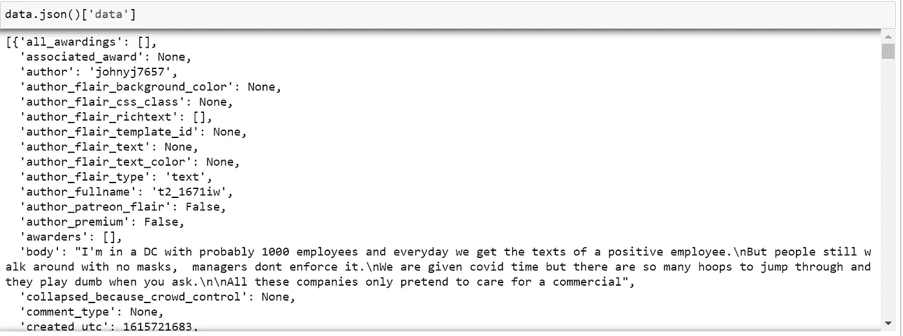
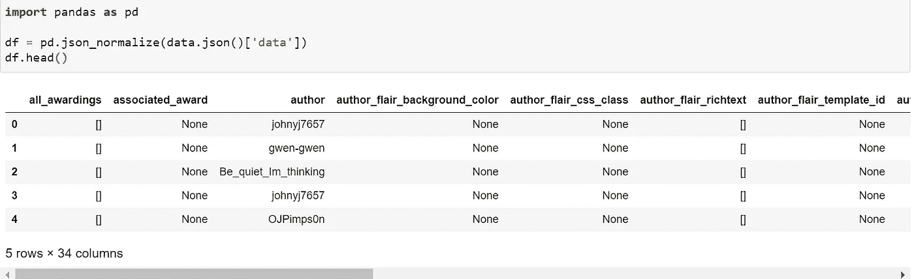
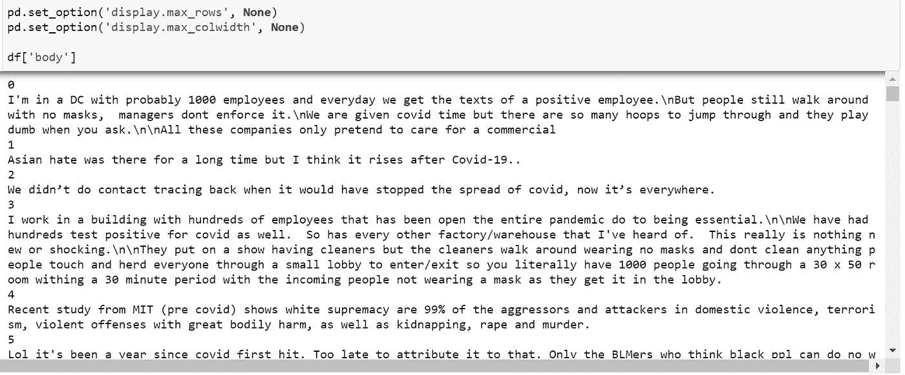
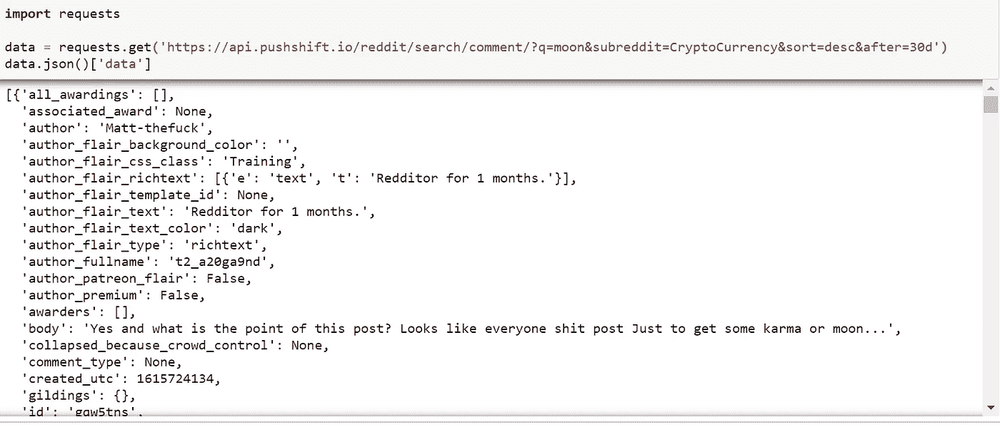
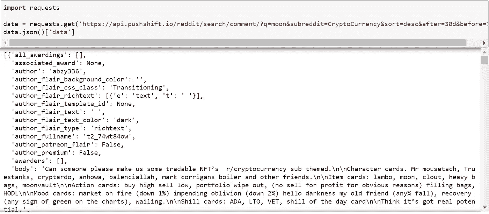
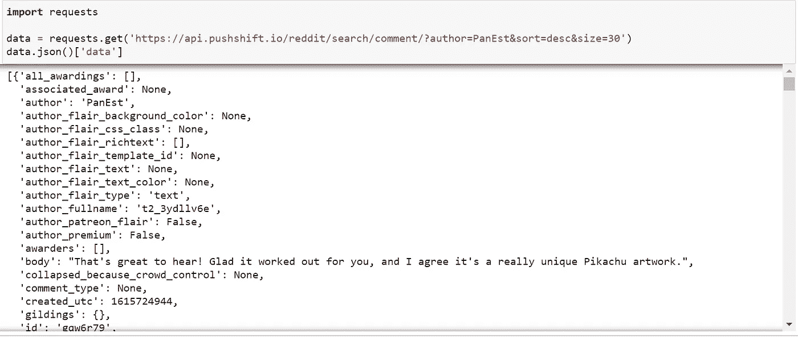
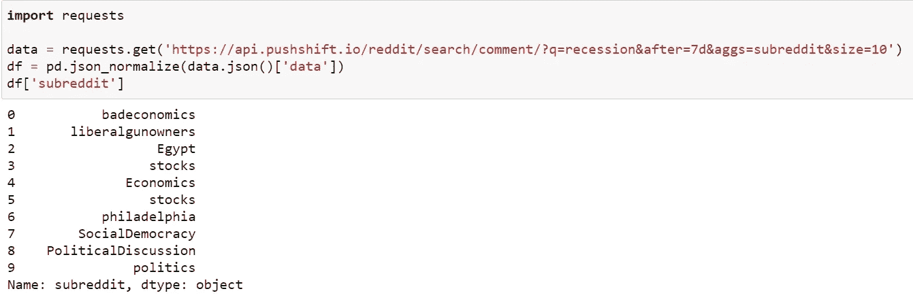
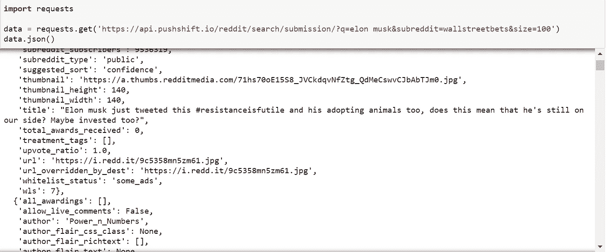

# 使用 Python 轻松获取 Reddit 数据

> 原文：<https://levelup.gitconnected.com/easily-obtain-reddit-data-with-python-8ce0c576540f>

根据本指南生成的 Wordcloud。

继我之前的帖子*用 Python 进行 Reddit 情感分析*之后，我们从 Reddit 评论中的一个特定帖子获得了情感。在本帖中，我们将介绍另一个 API，它是获取大量 Reddit 数据进行分析的另一种更快捷的方法。

 [## 用 Python 进行 Reddit 情感分析

### 他们说行动比语言更响亮，但有时语言也可以掩盖情绪，而这些情绪是无法被…

levelup.gitconnected.com](/reddit-sentiment-analysis-with-python-c13062b862f6) 

为此，我们将利用 [PushShift API](https://pushshift.io/api-parameters/) 。该 API 有几个有用的特性，例如:

*   **获取特定日期范围的数据**
*   **评论搜索** *(在特定子编辑中包含特定搜索词的评论)*
*   **汇总数据** *(在某一日期向包含关键字的子编辑提交的数量)*

首先，我们将利用 [**请求**](https://requests.readthedocs.io/en/master/user/quickstart/) 模块。如果您尚未安装，您可以使用以下功能进行安装: ***pip 安装请求***

完成后，我们可以导入模块，并通过发送请求来获取我们想要的数据。PushShift API 主要有两个主要端点:

*   /Reddit/搜索/评论
*   /Reddit/搜索/提交

注释的全部参数可在 [PushShift Github](https://github.com/pushshift/api) 上找到。

让我们从收集最近的 100 条评论开始，按照搜索条件降序排列:“covid”属于“news”子编辑。注意，我们使用上面提到的搜索参数包含了关键字。

如果您正在使用请求模块，了解几个有助于识别请求是否成功的状态代码是有益的。一些常见的状态代码有:

*   **200** (请求成功)
*   401 (未授权)
*   **404** (未找到)
*   **500** (内部服务器错误)

正如我们所看到的，我们的请求返回了状态代码 200，表明这是一个成功的请求。我们的数据以 JSON 格式返回给我们。

当处理 JSON 类型的数据时，我们可以将其规范化并转换为数据框架，以便进一步处理或将数据导出为 CSV 文件。

从这里开始，我们可以处理我们感兴趣的专栏，例如，查看我们获得的评论的主体。

可能性是无限的，您可以使用前面提到的参数进行试验。例如，通过应用代码来预处理和清理我上一篇文章中使用的数据，我们甚至可以创建一个单词云图像，如本文开头所示！

## 特定时间段内的评论:

PushShift API 提供的另一个有用的特性是能够在指定的时间范围内获取数据。我们可以通过使用 before 和 after 参数来做到这一点。

例如，假设我们想从 Cryptocurrency subreddit 获得在过去 30 天(*内提到“月亮”的评论，方法是在请求 URL* 的末尾=30d 后添加&。如果没有指定大小，它将返回默认的 25 个结果。

并且假设我们想要获得在过去 30 和 7 天内提到“月亮”的评论。*(通过在我们的请求 URL 的末尾=30d 后添加&&7d 前)*

## 来自某个 Reddit 用户的评论:

另一个很酷的特性是我们可以使用 author 参数。这允许我们提取特定 Reddit 用户的评论。例如，用户最近的 30 条评论:PanEst

# 聚集参数

为搜索提供汇总数据的另一个强大方法是使用聚合。例如，我们有兴趣查看在过去 7 天中提及“衰退”一词的前 10 个子主题。

除了从评论中获取数据，我们还可以从提交的内容中获取数据。

## 使用搜索词获取提交内容

例如，subreddit wallstreetbets 最近提交的 100 篇文章中提到了“埃隆·马斯克”(elon musk)。

这就是这篇文章的全部内容，我希望你已经学会了如何利用 requests 模块和另一种从 Reddit 评论或提交中提取数据的方法。

好奇的学习者？释放你在媒体上学习的全部潜力，用不到一杯咖啡的钱支持像我这样的作家。

 [## 通过我的推荐链接加入媒体——杰森·LZP

### 作为一个媒体会员，你的会员费的一部分会给你阅读的作家，你可以完全接触到每一个故事…

lzpdatascience.medium.com](https://lzpdatascience.medium.com/membership)