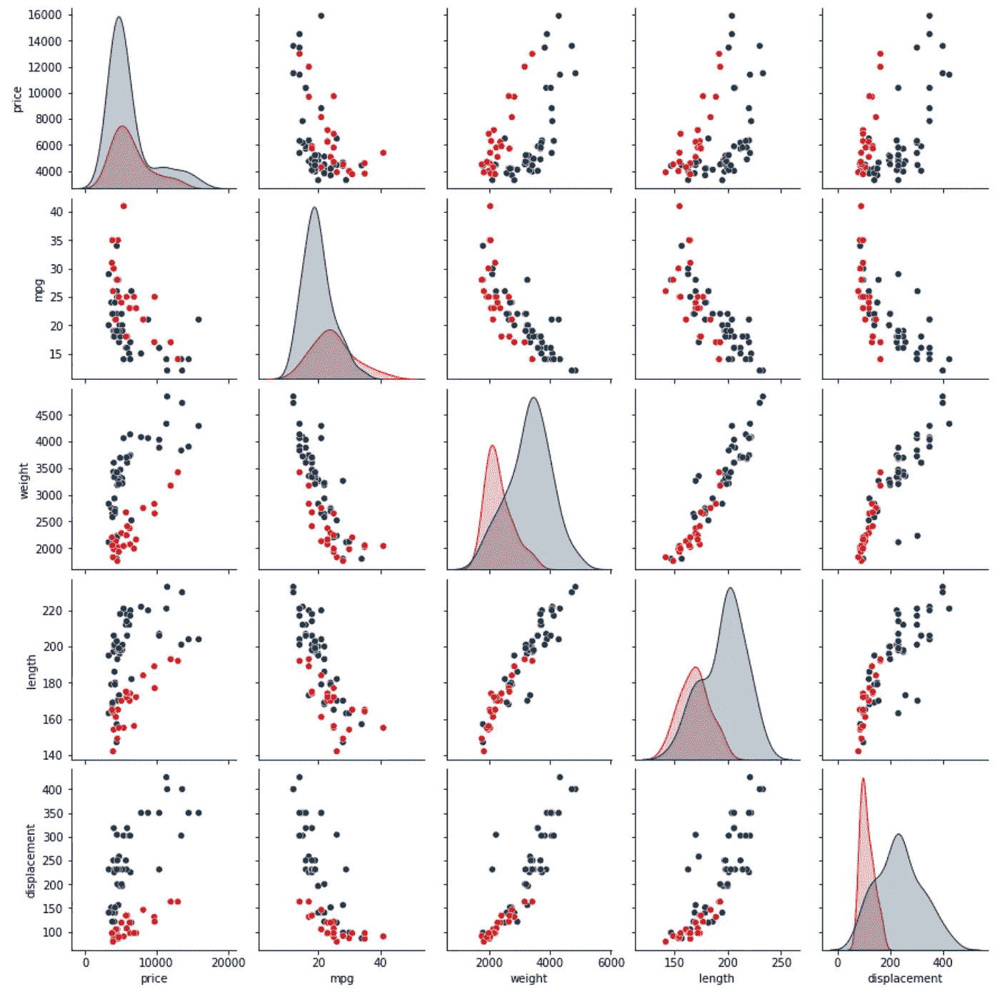
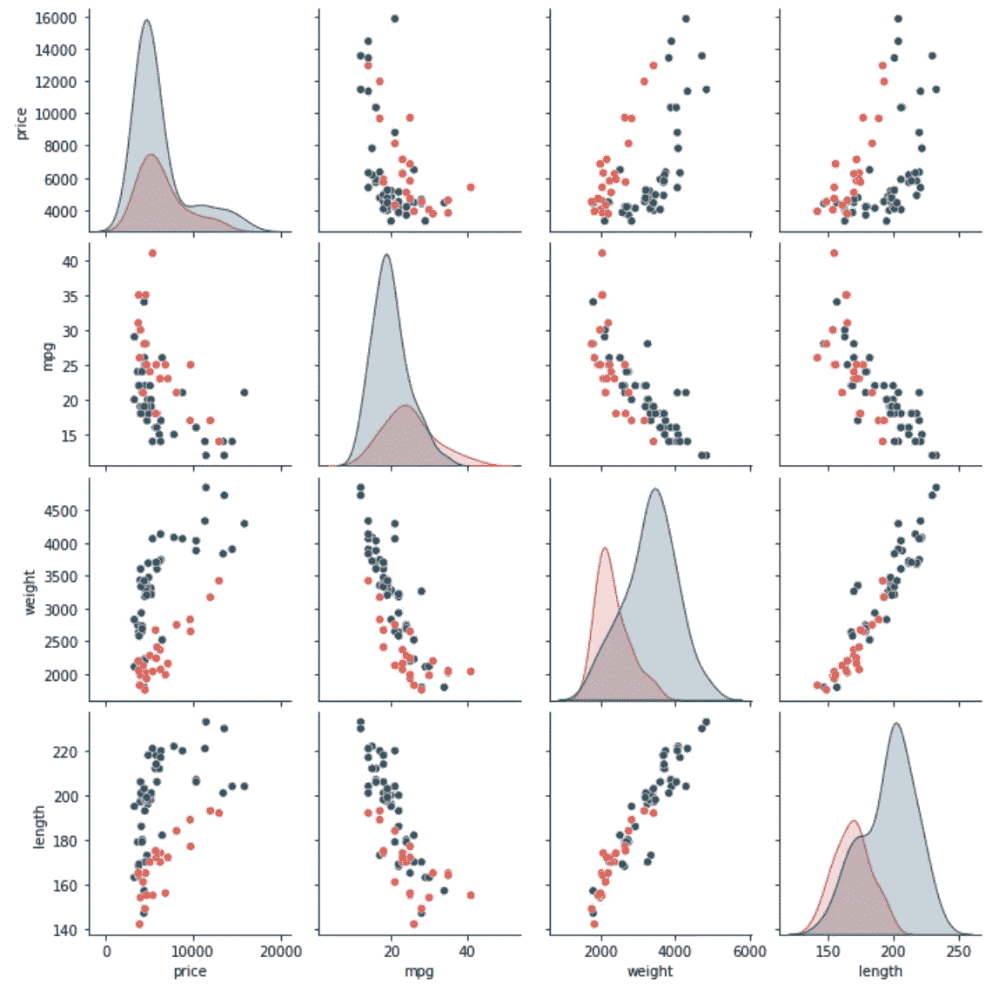
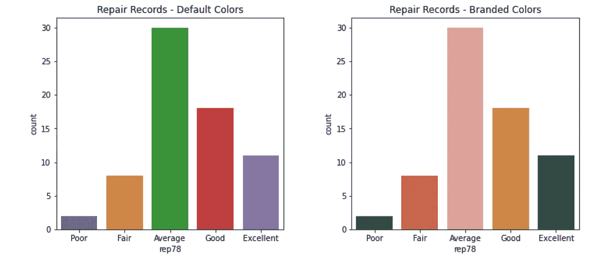
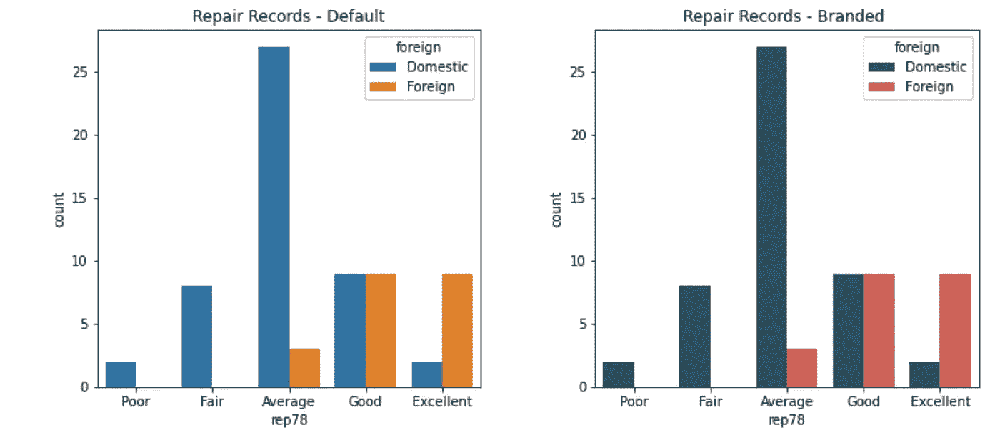
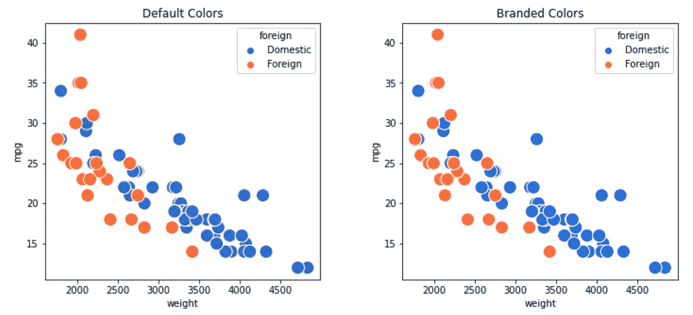
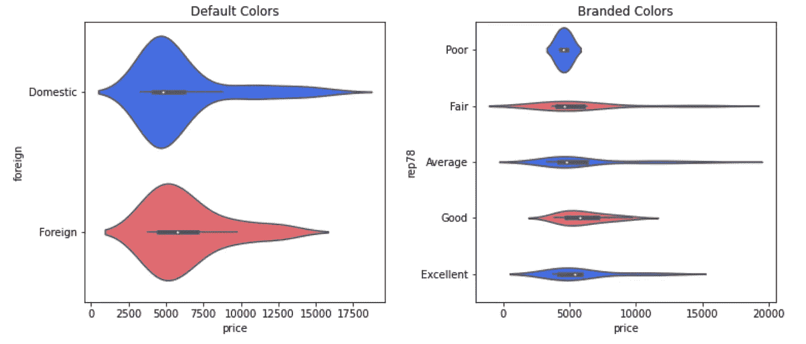

# 轻松复制您公司的 Python 数据调色板，即

> 原文：<https://levelup.gitconnected.com/easily-replicate-your-company-palette-for-python-data-viz-426b7487d5e4>

## 使用本指南准备与工作相关的数据可视化，颜色为您的受众所熟悉和喜爱的颜色

TLDR:用这篇文章中的想法来帮助你生成数据可视化，更好地匹配你的公司品牌和风格指南。

# 介绍

大多数组织都有品牌指南、识别系统或风格指南，其中包括调色板。例如，你可以在[brand.america.gov](https://brand.america.gov/)找到美国国务院详细记录的品牌系统。另一个例子，我喜欢的是来自 Scrimshaw Coffee 的那个。我的母校威斯康星大学在 brand.wisc.edu 有一个很好的例子。

当您为组织中的受众准备数据可视化时，使用受众能够识别的颜色非常重要。通过一些简单的技巧，很容易快速制作出与你公司的品牌系统匹配(或几乎匹配)的可视化效果。

本文展示了如何定义一个调色板，以便在各种数据可视化中使用。示威也是屈指可数。对于这些代码，您将需要标准导入:

```
import pandas as pd
import numpy as np
import matplotlib.pyplot as plt
import seaborn as sns
```

我们使用这些数据(参见本文底部的数据许可信息):

```
df = pd.read_stata('http://www.stata-press.com/data/r15/auto2.dta')
```

## 美国国务院

在第一次演示中，我求助于美国国务院的品牌指南([brand.america.gov](https://brand.america.gov/))。大多数托盘将有一个主要和次要的颜色。原色和二次色可能不会以这种方式/用这些术语特别标注。

用你的判断力来选择你的主要和次要颜色。为了使这段代码更具普遍性，我将使用示例代码，它利用了大多数(不是所有)颜色参考线指向一种主要颜色和一种次要颜色的概念。

```
# Define primary and secondary colors:
primary = '#0A314D'     # Tarawera
secondary = '#D01319'   # Alizarin Crimson# Define a light + dark (primary + secondary) color map.
primary_l   = sns.light_palette(primary,   as_cmap=True)
primary_d   = sns.dark_palette(primary,    as_cmap=True)
secondary_l = sns.light_palette(secondary, as_cmap=True)
secondary_d = sns.dark_palette(secondary,  as_cmap=True)# Define a nominal / categorical pallet.
nominal = [primary,    # Reuse Primary
           secondary,  # Reuse Secondary
           '#2499C2',  # Curious Blue-1
           '#C2850C',  # Hot Toddy
           '#FAD980',  # Goden Glow
           '#8D98AA',  # Gray Chateau
           '#00833E']  # Fun Green
```

在定义了原色和次色之后，上面的代码使用`sns.light_pallette()`和`sns.dark_palette()`函数来创建颜色图。对于需要渐变的视觉效果来说，这些彩色贴图会很好。

最后，对于分类图,`nominal`变量现在包含一个颜色列表。这个颜色列表非常适合作为调色板，用于产生涉及分类(或名义)数据点的视觉效果。为了将它投入使用，我们可以用一个简单的 pairplot 来演示。

```
sns.pairplot(df[['price','mpg','weight',
                 'length','displacement','foreign']],
             palette=[primary, secondary], hue='foreign')
```

产生这种视觉效果，颜色与美国国务院的品牌指南非常接近。



图片鸣谢:作者视觉。来自本文中的代码。

## 斯克林肖咖啡

在第二系列演示中，我转向了另一个来自 [Scrimshaw Coffee](https://issuu.com/corinnealexandra/docs/sc-brandguide_8bbf186b759ac7) 的动态调色板。要从这个调色板中引用颜色，上面的代码只需要 3 次编辑(以粗体显示，然后总结如下)。

```
# Define the primary and secondary colors:
primary =   **'#20536A'   # Prussian Blue**
secondary = **'#E25145'   # Poppy Red**# Define a light + dark (primary + secondar) color map.
primary_l   = sns.light_palette(primary,   as_cmap=True)
primary_d   = sns.dark_palette(primary,    as_cmap=True)
secondary_l = sns.light_palette(secondary, as_cmap=True)
secondary_d = sns.dark_palette(secondary,  as_cmap=True)# Define a nominal pallet.
nominal = [primary,    # Reuse Primary
           secondary,  # Reuse Secondary
 **'#E8998F',  # Salmon
           '#DB9D36',  # Mustard
           '#215644',  # Pine Green
           '#F9d8C6']  # Peach**
```

第一次编辑是换出原色的颜色代码，第二次编辑是换出二次色的代码。第三次编辑是在名义货盘上添加附加条目。有关与 Scrimshaw 咖啡品牌相匹配的颜色的新结果:



图片鸣谢:作者视觉。来自本文中的代码。

为了演示渐变颜色，我们转向`df.corr()`和`sns.heatmap()`函数。

```
# Establish a 2 row by three column facet grid.
fig, axes = plt.subplots(figsize=(21, 10), ncols=3, nrows=2)# Clean up the spacing + Remove the lower left chart.
plt.subplots_adjust(hspace=0.8, wspace=0.3)
fig.delaxes(axes[1, 0])# Plot heatmap with default colors.
sns.heatmap(df.corr(), ax=axes[0,0], ).set_title('Default Colors')# Plot heatmaps with branded gradients.
sns.heatmap(df.corr(), ax=axes[0,1],
            cmap=primary_l).set_title('Primary Light Scrimshaw')sns.heatmap(df.corr(), ax=axes[0,2],
            cmap=primary_d).set_title('Priamry Dark "Scrimshaw')sns.heatmap(df.corr(), ax=axes[1,1],
            cmap=secondary_l).set_title('Secondary Light Scrimshaw')sns.heatmap(df.corr(), ax=axes[1,2],
            cmap=secondary_d).set_title('Secondary Dark Scrimshaw')
```

在这个例子中，左上角的视觉效果是默认的颜色。其余四种视觉效果采用品牌颜色。


图片鸣谢:作者视觉。来自本文中的代码。

这里有两个名义调色板的演示。

```
# Establish a 2 column facet grid + clean up spacing.
fig, axes = plt.subplots(figsize=(12, 5), ncols=2)
plt.subplots_adjust(hspace=0.8, wspace=0.3)sns.countplot(df['rep78'],
              ax=axes[0]
              ).set_title('Repair Records - Default')sns.countplot(df['rep78'], ax=axes[1],
              palette=nominal
              ).set_title('Repair Records - Branded')
```

左边的可视化是默认颜色，而右边的可视化是品牌颜色。



图片鸣谢:作者视觉。来自本文中的代码。

在此视图中，我们可以看到每种维修记录的车辆数量(例如，“差”、“一般”、“优秀”等)。).大约有 30 辆车的维修记录为“一般”,而只有十多辆车的维修记录为“优秀”。

为了查看维修记录因制造来源的不同而有所不同，我们还可以将 hue 参数添加到上面的代码中，结果如下。

```
fig, axes = plt.subplots(figsize=(12, 5), ncols=2)
plt.subplots_adjust(hspace=0.8, wspace=0.3)sns.countplot(df['rep78'],
              ax=axes[0],
              hue=df['foreign']
              ).set_title('Repair Records - Default')sns.countplot(df['rep78'], ax=axes[1],
              palette=nominal,
              hue=df['foreign']
              ).set_title('Repair Records - Branded ')
```

请注意这个结果如何使用较少的名义调色板中的颜色。左侧是默认调色板，右侧是品牌调色板。



图片鸣谢:作者视觉。来自本文中的代码。

## 高级数据颜色

在最后的演示中，我将转向我在 Up Level Data，LLC 使用的调色板。Up Level Data，LLC 是我提供指导和咨询服务的公司。同样，指定调色板只需要对我在上面使用的相同的基本模板进行三次编辑(这里再次用粗体显示这三次编辑)。

```
# Define the primary and secondary colors:
primary =   **'#2962FF'   # Big Blue**
secondary = **'#F6575E'   # Propensity Pink**# Define a light + dark (primary + secondar) color map.
primary_l   = sns.light_palette(primary,   as_cmap=True)
primary_d   = sns.dark_palette(primary,    as_cmap=True)
secondary_l = sns.light_palette(secondary, as_cmap=True)
secondary_d = sns.dark_palette(secondary,  as_cmap=True)# Define a nominal pallet.
nominal = [primary,    # Big Blue
           secondary,  # Propensity Pink
 **'#FAC33E',  # Dimensional Daisy
           '#7FE1B5',  # Matrix Magic
           '#E1AC75',  # Skintone D
           '#241D50',  # Plausible Purple
           '#82685C']  # Skinton B**
```

在更新了这个调色板之后，我为这个演示选择的两个最终可视化图形是小提琴图和散点图。两个我个人最喜欢的，这里。散点图有助于评估两个变量之间的关系。在本次演示中，我们将了解车辆重量和效率之间的关系。以下代码生成散点图。

```
fig, axes = plt.subplots(figsize=(12, 5), ncols=2)
plt.subplots_adjust(hspace=0.8, wspace=0.3)sns.scatterplot(x=df['weight'], y=df['mpg'],
                ax=axes[0], hue=df['foreign'],
                s=200).set_title('Default Colors')sns.scatterplot(x=df['weight'], y=df['mpg'],
                ax=axes[1], hue=df['foreign'], s=200,
                palette=nominal[:2]).set_title('Branded Colors')
```

这产生了下面的图，其中左边是默认调色板，右边是带状颜色。



图片鸣谢:作者视觉。来自本文中的代码。

对于最后一个例子，我们使用两个都是品牌颜色的小提琴图，我们按制造地点分析价格，也按维修记录分析价格。下面的代码产生这些可视化效果。

```
fig, axes = plt.subplots(figsize=(12, 5), ncols=2)
plt.subplots_adjust(hspace=0.8, wspace=0.3)sns.violinplot(y=df['foreign'], x=df['price'],
               ax=axes[0], palette=nominal[:2],
               ).set_title('Default Colors')sns.violinplot(y=df['rep78'], x=df['price'],
               ax=axes[1], palette=nominal[:2]
               ).set_title('Branded Colors')
```

这产生了以下结果。



简单解释一下这些结果，我们看到所有车辆的价格似乎都在 5000 美元左右。国内车辆的价格比国外车辆的价格高。此外，维修记录为“一般”或“一般”的车辆价格似乎高于那些维修记录为“良好”或“优秀”的车辆。

关于 Seaborn 中的 violin plots，有一点很有帮助:当您首先指定 y 参数时，它们呈现为水平，当您首先指定 x 参数时，它们呈现为垂直。我更喜欢水平视图，因为许多观众自然地从左向右阅读。

## 限制

与许多方法一样，我在这里给出的例子也有许多限制。首先，许多品牌和风格指南还包括与字体相关的要求。本指南不提供更新或调整字体的指导。

另一个限制是颜色并不总是完全符合品牌和风格指南的要求。这种不匹配的原因之一是 Seaborn 和其他可视化工具调整透明度(alpha)级别。当透明度级别改变时，颜色也会改变。

# 结论

这篇文章认为，使用你的受众知道和认可的颜色是很重要的。为了满足这一要求，本文还提供了一个有用的代码片段，让您可以轻松地更新大多数可视化颜色选择，使其更符合您的公司或客户的品牌和风格指南。

```
# Define the primary and secondary colors:
primary =   '#2962FF'   # Big Blue
secondary = '#F6575E'   # Propensity Pink# Define a light + dark (primary + secondar) color map.
primary_l   = sns.light_palette(primary,   as_cmap=True)
primary_d   = sns.dark_palette(primary,    as_cmap=True)
secondary_l = sns.light_palette(secondary, as_cmap=True)
secondary_d = sns.dark_palette(secondary,  as_cmap=True)# Define a nominal pallet.
nominal = [primary,    # Big Blue
           secondary,  # Propensity Pink
           '#FAC33E',  # Dimensional Daisy
           '#7FE1B5',  # Matrix Magic
           '#E1AC75',  # Skintone D
           '#241D50',  # Plausible Purple
           '#82685C']  # Skintone B
```

这个 snippit 有三个主要组件。首先是原色和次原色。要指定主要和次要颜色，请从您公司的品牌指南中查找颜色代码。在这个例子中，主要是`primary = '#2962FF'`(“蓝色”)，次要是`secondary = '#f6575E'`(“粉红色”)。

第二，代码使用`sns.ligth_pallet()`和`sns.dark_palette()`来创建适用于渐变的彩色地图。第三，也是最后一点，这段代码还指定了一个颜色列表(在第一个和第二个位置重新使用原色和次原色)作为名义调色板。

享受使用与您公司品牌和风格指南相匹配的颜色制作新的数据视觉效果！

# 感谢阅读

感谢阅读。把你的想法和主意发给我。你可以写信只是为了说声嗨。我期待着尽快聊天。Twitter:[@ adamrossnelson](https://twitter.com/adamrossnelson)LinkedIn:[Adam Ross Nelson 在 Twitter](https://www.linkedin.com/in/arnelson) 和脸书: [Adam Ross Nelson 在脸书](https://www.facebook.com/adamrossnelson)。

# 数据许可

[Stata 数据许可](https://www.stata-press.com/data/r15/u.html)。Stata 提供这些以及其他数据，用于教学、培训、演示和测试目的。[你可以在之前的文章](https://towardsdatascience.com/three-datasets-i-often-use-as-examples-c70ec5b2f793)中读到更多关于这些和其他数据的信息。

# 分级编码

感谢您成为我们社区的一员！在你离开之前:

*   👏为故事鼓掌，跟着作者走👉
*   📰查看更多内容请参见[升级编码刊物](https://levelup.gitconnected.com/?utm_source=pub&utm_medium=post)
*   🔔关注我们:[Twitter](https://twitter.com/gitconnected)|[LinkedIn](https://www.linkedin.com/company/gitconnected)|[时事通讯](https://newsletter.levelup.dev)

🚀👉 [**加入升级人才集体，找到一份神奇的工作**](https://jobs.levelup.dev/talent/welcome?referral=true)