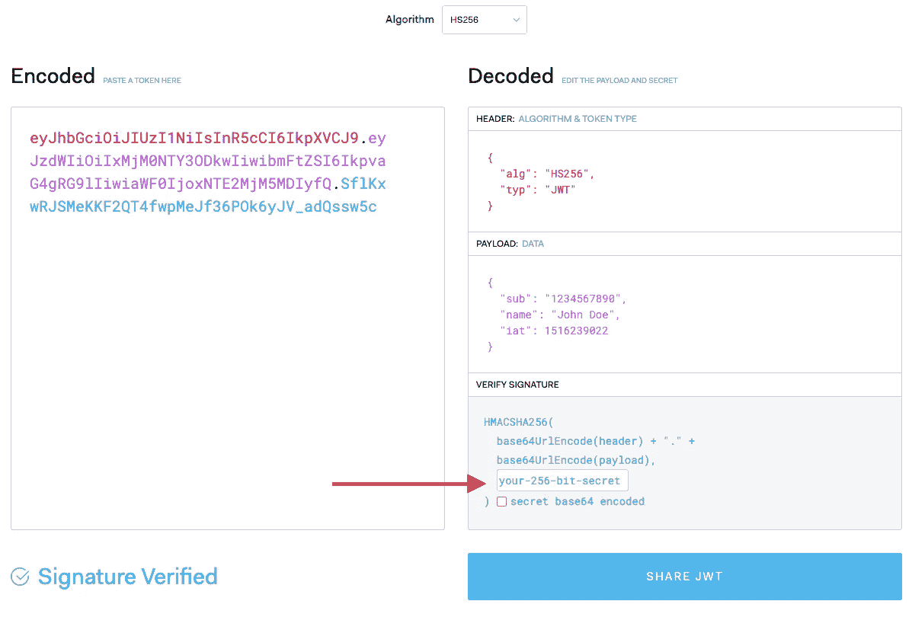

# 使用 JWT 和 Auth0 轻松保护您的 Go Web 服务器

> 原文：<https://levelup.gitconnected.com/easily-secure-your-go-web-server-using-jwt-and-auth0-c9940f4ab70f>

保护您的 web 服务器始终是一项非常重要的任务，因为您通常不希望任何未经授权的用户访问您的服务器。本教程将帮助您使用 JWT 中间件设置 Auth0 和 Go web 服务器进行授权。


照片由[阿德利·瓦希德](https://unsplash.com/@adliwahid)在 [Unsplash](https://www.unsplash.com) 上拍摄

## 目录

*   在 Auth0 中创建应用程序
*   创建具有 JWT 授权的 Go Web 服务器
*   创建有效的 JWT 访问令牌

# 在 Auth0 中创建应用程序

首先，当然，你不必使用 Auth0，可以简单地自己实现所有的用户管理和签名。但是，由于这是相当大的努力，你将永远不得不与敏感的(用户)数据，我建议使用一些第三方提供商来帮助你。

尤其是 Auth0 有一个非常慷慨的免费计划，包含 7000 MAU(截至今天)，这对较小的应用程序来说应该绰绰有余。所以让我们开始吧。如果您还没有帐户，请在 https://auth0.com/[新建一个。](https://auth0.com/)

接下来，转到“应用程序”并创建一个新的应用程序


输入应用程序的名称及其类型。因为我建造的大多是温泉，所以我也会选择这里的这个。但是你可以选择任何符合你需要的。


**使用 HS256**

默认情况下，RS256 被 Auth0 用作 JWT 签名算法，尽管 HS256 在这里绝对没问题，所以我们将改变它，使我们的生活变得更容易，这样我们就不必在不同的密钥文件上浪费时间，而只需要一个简单的秘密。

应用程序→选择应用程序→设置→向下滚动到底部→高级设置

此处必须勾选“符合 OIDC”复选框，才能将签名算法更改为 HS256。


最后但同样重要的是，选择你的应用程序，复制“客户秘密”,并把它保存在某个地方，因为我们以后会需要它。当然，确保你永远不要把这个秘密存放在不安全的地方，也不要把它交给 VCS 或类似的人。


如果你想知道如何安全地存储你的秘密，你可以看看我的另一篇文章:[在 Git 中保护你的秘密，使用 GCP·KMS 的安全方法](/securing-your-secrets-in-git-the-safe-way-using-gcp-kms-ada49e8386af)。

[](/securing-your-secrets-in-git-the-safe-way-using-gcp-kms-ada49e8386af) [## 保护你的秘密在 git，安全的方式使用 GCP KMS

### 将秘密和凭证提交到 git 中，而不会产生安全问题。

levelup.gitconnected.com](/securing-your-secrets-in-git-the-safe-way-using-gcp-kms-ada49e8386af) 

# 创建具有 JWT 授权的 Go Web 服务器

下一步，我们必须创建 Go web 服务器来处理请求并检查授权用户。我这里用的是 [Go 光纤](https://github.com/gofiber/fiber)。创建一个[新的 Go 模块](/how-to-run-your-first-go-application-in-three-simple-steps-1539e846f792)，并将以下代码添加到您的`main.go`文件中。像往常一样，我在 Github 上创建了一个小的资源库，你可以查看整个项目。

[](https://github.com/Abszissex/medium-auth0-go-web-server) [## abszisex/medium-auth 0-go-web-server

### 通过在 GitHub 上创建一个帐户，为 abszisex/medium-auth 0-go-web-server 开发做出贡献。

github.com](https://github.com/Abszissex/medium-auth0-go-web-server) 

代码本身非常简单。这里只有几个重要的部分。

首先，必须定义`signingKey`。这是你的私人`Client Secret`，你可以从你的 Auth0 应用程序中复制。

接下来，您可以选择定义 JWT 中间件应该忽略的某些路由。尽管这里采用的方法非常简单，对于高度复杂的应用程序来说可能不够，但是对于较小的应用程序来说就很好了。

第三，将用于 Go Fiber 的 [JWT 中间件](https://github.com/gofiber/jwt/)应用于应用程序，它由`signingKey`、签名方法(记得我们在 Auth0 选择了`HS256`)和一个简单的过滤方法构成，允许绕过特定路由的中间件。可能总会有一些路线不需要授权。例如，公共文档或登录/注册端点就是很好的例子。

最后但同样重要的是，定义路由和处理程序方法，并启动服务器。

只需在您的 CLI 中运行`go run .`就可以启动 Go web 服务器:


## 测试授权

因此，让我们向服务器发送一些请求，检查是否一切正常。

**没有 JWT 的限制路线**

首先，让我们尝试在没有任何授权头的情况下击中受限路线。

```
### Hit restricted route
$ curl -i [http://localhost:8080/ping](http://localhost:8080/ping)
```

正如您在下图中看到的，服务器用一个`400`响应，告诉我们 JWT 令牌丢失或格式错误。


**没有 JWT 的无限制路线**

第二，我们打无限制路线。即使没有任何授权，我们也应该在这里得到成功的响应。

```
### Hit unrestricted route
$ curl -i [http://localhost:8080/ping/unrestricted](http://localhost:8080/ping/unrestricted)
```

看起来不错。服务器用一个`200`和上面代码中定义的 handler 方法的内容来响应。


**JWT 无效的受限路线**

第三，用一些无效的 JWT 击中受限制的路线。我们预计这里会出现一个服务器错误，因为如果请求没有被授权，我们不希望它被处理。

```
### Hit the restricted route with some invalid token
$ curl -i --header "Authorization: Bearer INVALID_TOKEN" http://localhost:8080/ping
```

完美！我们在这里得到一个`401`,告诉我们被调用者是`Unauthorized`,并且所提供的 JWT 被识别，但是无效或过期。


**JWT 有效的受限路线**

现在，我们终于要测试在实际成功案例中是否一切正常。但为此，需要一个有效的 JWT。所以你可能会问:

> “太好了，那么我从哪里可以得到我的有效 JWT 呢？？?"

如果不涉及第三方授权提供者，您只需使用有效凭证点击自己的授权服务，并从那里获得一个 JWT。使用 Auth0 有点不同，但实际上至少一样简单。

# 创建有效的 JWT 访问令牌

幸运的是，Auth0 发布了网站[https://jwt.io/](https://jwt.io/)，在那里你可以了解到关于 JWT 的一切(他们还提供了一个关于 JWT 的 100 页的免费电子书),并对你的 jwt 进行编码和解码。

[](https://jwt.io/) [## JWT。超正析象管(Image Orthicon)

### JSON Web Token (JWT)是一种简洁的、URL 安全的方式，用于表示要在双方之间传输的声明。的…

jwt.io](https://jwt.io/) 

在 [https://jwt.io](https://jwt.io) 的主页上，有一个 jwt 编码器/解码器，您可以在左侧粘贴您的编码 JWT 并在右侧检查解码结果，和/或更改解码值并在左侧实时生成一个新的编码版本。

JWT 的头部算法(`alg`)和类型(`typ`)已经为我们的用例正确设置。在有效载荷中，您可以插入任何您想要/需要的信息。当然，默认的编码值对您的应用程序无效，因为 [https://jwt.io](https://jwt.io) 不知道您的秘密签名密钥。但是你可以复制&粘贴到右下角(图中标记)来创建一个有效的编码 JWT。



在您添加了您的秘密并复制了编码的 JWT 之后，是时候测试授权的成功案例了。因此，让我们再次尝试在受限路由上调用 web 服务器，只是这次使用有效的 JWT。

```
curl -i --header "Authorization: Bearer YOUR_TOKEN_HERE" [http://localhost:8080/ping](http://localhost:8080/ping)
```

而且很管用！谁会预料到这一点？😉


# 最后的话

我希望我能帮助您克服在 Go web 服务器中使用授权的复杂性，并以相当简单的步骤解释如何轻松地向 web 服务器添加有效的授权。

感谢您花时间阅读我的文章。

## 你想联系吗？

如果你想联系我，请在 LinkedIn 上给我打电话。

另外，请随意查看我的书籍推荐📚。

[](https://mr-pascal.medium.com/my-book-recommendations-4b9f73bf961b) [## 我的书籍推荐

### 在接下来的章节中，你可以找到我对所有日常生活话题的书籍推荐，它们对我帮助很大。

mr-pascal.medium.com](https://mr-pascal.medium.com/my-book-recommendations-4b9f73bf961b) [](https://mr-pascal.medium.com/membership) [## 通过我的推荐链接加入 Medium—Pascal Zwikirsch

### 作为一个媒体会员，你的会员费的一部分会给你阅读的作家，你可以完全接触到每一个故事…

mr-pascal.medium.com](https://mr-pascal.medium.com/membership)