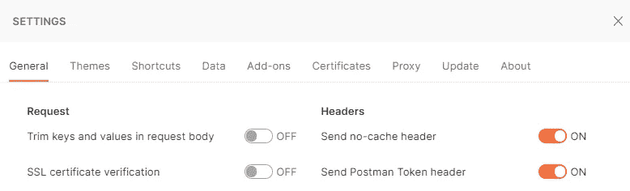
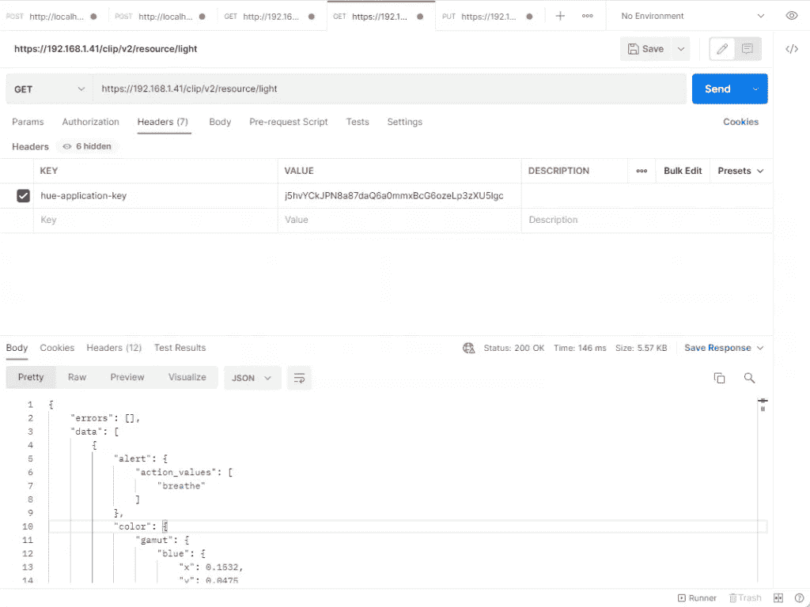
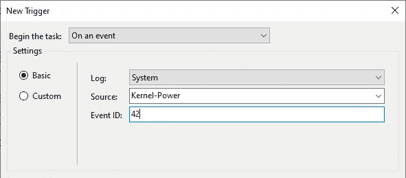
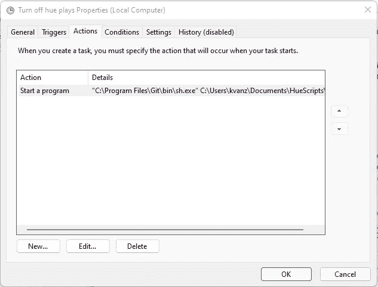
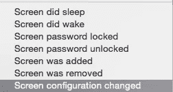

# 根据您的电脑状态 v2 轻松切换飞利浦色调

> 原文：<https://levelup.gitconnected.com/easily-toggle-philips-hue-depending-on-your-pc-state-v2-91249151c325>

## 使用智能手机或平板电脑应用程序并不是控制智能照明的唯一方式。您也可以从您的 PC、笔记本电脑或平板电脑上完成这项工作。


由@iamkendall 点亮 [Unsplash](https://unsplash.com/@iamkendall)

你可能会问为什么是 v2？很久以前，我为 Hue API 的第一个版本写了一篇关于[如何根据你的 PC 状态](https://morehue.com/easily-toggle-philips-hue-depending-on-your-pc-state/)切换飞利浦 Hue 的指南。从那时起，signification 决定清理他们的 API 并创建一个改进的版本。改进后的版本包括**更好的安全性**并且整体更清晰**。但对我来说，这也意味着我必须更新我的剧本，而我为什么不**改进我自己的剧本**？因此，让我们开始根据您的电脑状态切换飞利浦色调。**

**在我之前的故事中，我解释了用 **PowerShell** 和 **Windows 任务调度器**编程 Hue Lights 的基础。在这个故事中，我将再次解释色相灯编程的基础，但这次是用 **cURL** 并使它在每个操作系统上都能运行。我将使用两个[飞利浦色调播放条](https://amzn.to/3lN3kiB)用于本教程。**

****重要！**在遵循本指南之前，请检查您的网桥是否至少是 1948086000 版本。**

> **自动化很容易，你只需要知道要采取哪些步骤。**

***原载于 2021 年 12 月 17 日*[*https://morehue.com*](https://morehue.com/easily-toggle-philips-hue-depending-on-your-pc-state-v2/)*。***

# **阶段**

1.  **找到你的网桥 **ID 和**IP 地址**
2.  **获得一个经过**认证的**用户名**
3.  **找到**灯使**自动化**
4.  **创建一个 **CA 证书****
5.  **创建你想要的**脚本****
6.  **定义**任务****

# **1.找到您的网桥 ID 和 IP 地址**

**幸运的是，Hue 系统附带了一个 API，可以通过**网络请求**轻松控制。但是在我们用飞利浦 Hue 灯做任何事情之前，我们首先需要找到网桥的 **ID 和 IP 地址**。在以前的版本中，只需要 IP 地址，但是对于 Hue API 的 v2，我们需要一个需要 ID 的**安全连接。桥将接收我们所有的网络请求。很好看的教程可以在[这里](https://developers.meethue.com/develop/get-started-2/)找到。但是因为我们现在只需要我们的网桥的 ID 和 IP，所以我们也可以访问这个链接:[https://discovery.meethue.com/](https://discovery.meethue.com/)。****

**该链接将显示一个小的 JSON 响应，其中包含网桥的内部 IP 地址。响应看起来有点像这样:**

```
[
  {
    "id": "ecbdsa5afffe1303cf",
    "internalipaddress": "192.168.1.41"
  }
]
```

**保存此响应，因为我们将在其他步骤中需要它。**

# **2.获取经过验证的用户名**

**与当今任何其他受保护的系统一样，Hue 系统要求用户验证他或她的身份。为了得到这个，我们需要打几个电话。最简单的方法是使用[邮递员](https://www.postman.com/downloads/)。**

**现在我们需要发送一个认证请求来认证我们自己。用下面的消息体`{ "devicetype" : "My_amazing_computer" }`向 URL `https://<bridge_ip_address>/api`发送 post 请求。然后，您将看到以下消息:**

```
[
 {
  "error": {
   "type": 101,
   "address": "",
   "description": "link button not pressed"
  }
 }
]
```

**现在去按你的桥上的链接按钮，然后再按 POST 按钮。您现在应该会得到如下所示的成功响应:**

```
[ 
  { "success": 
    { 
      "username": "j5hvYCkJPN8a87daQ6a0mmxBcG6ozeLp3zXU5lgc",                 
      "clientkey": "ZV17AVUNUB95G2UXW64TEXDZD" 
    } 
  } 
]
```

**这就对了。您现在有了经过验证的用户名。把这个也写下来，我们将在下一阶段用到它。**

# **3.找到要自动化的灯**

**如介绍中所述，significance 对其安全性进行了相当大的升级。一部分是 API **的 v2 只允许通过 HTTPS** 调用。稍后，我们将使用此证书，但在与 Postman 的测试阶段，您需要禁用“文件-设置”菜单中的“SSL 证书验证”。**

****

**禁用 SSL 验证**

**现在，我们需要做的就是创建一个请求，以我们的用户名作为头获取所有的灯，并找到我们想要使用的灯。在 postman 中调用下面的 URL 并添加这个头:“hue-application-key:j 5 hvyckjpn 8 a 87 DAQ 6a 0 MMX BCG 6 ozelp 3 zxu 5 lgc”**

```
https://<bridge_ip_address>/clip/v2/resource/light
```

****

**邮递员请求**

**这将给你一个 JSON 响应，显示你系统中所有的灯。所有这些灯将有相同的名称对应他们，因为你会看到在色调应用程序。对于我的示例，我将使用具有以下 id 的两个色调灯条(“18233658–5 CD b-42 D1–9b 08–588210 dsadsa J2”和“18233658-dajji-dsadi-9b 08-dsajdsaiuidsa”)。**

# **4.创建 CA 证书**

**如果您通过 HTTPS 打电话，您需要使用证书。客户端必须根据色调桥的专用 CA 证书来验证色调桥证书。幸运的是，创建这个证书听起来比实际困难。定义您想要包含自动化脚本的文件夹，并添加一个名为: **huebridge_cacert.pem** 的文件，其内容如下。**

```
-----BEGIN CERTIFICATE----- MIICMjCCAdigAwIBAgIUO7FSLbaxikuXAljzVaurLXWmFw4wCgYIKoZIzj0EAwIw OTELMAkGA1UEBhMCTkwxFDASBgNVBAoMC1BoaWxpcHMgSHVlMRQwEgYDVQQDDAty b290LWJyaWRnZTAiGA8yMDE3MDEwMTAwMDAwMFoYDzIwMzgwMTE5MDMxNDA3WjA5 MQswCQYDVQQGEwJOTDEUMBIGA1UECgwLUGhpbGlwcyBIdWUxFDASBgNVBAMMC3Jv b3QtYnJpZGdlMFkwEwYHKoZIzj0CAQYIKoZIzj0DAQcDQgAEjNw2tx2AplOf9x86 aTdvEcL1FU65QDxziKvBpW9XXSIcibAeQiKxegpq8Exbr9v6LBnYbna2VcaK0G22 jOKkTqOBuTCBtjAPBgNVHRMBAf8EBTADAQH/MA4GA1UdDwEB/wQEAwIBhjAdBgNV HQ4EFgQUZ2ONTFrDT6o8ItRnKfqWKnHFGmQwdAYDVR0jBG0wa4AUZ2ONTFrDT6o8 ItRnKfqWKnHFGmShPaQ7MDkxCzAJBgNVBAYTAk5MMRQwEgYDVQQKDAtQaGlsaXBz IEh1ZTEUMBIGA1UEAwwLcm9vdC1icmlkZ2WCFDuxUi22sYpLlwJY81Wrqy11phcO MAoGCCqGSM49BAMCA0gAMEUCIEBYYEOsa07TH7E5MJnGw557lVkORgit2Rm1h3B2 sFgDAiEA1Fj/C3AN5psFMjo0//mrQebo0eKd3aWRx+pQY08mk48= 
-----END CERTIFICATE-----
```

**现在终于是时候创建我们的脚本了。**

# **5.创建您想要的脚本**

**现在我们已经有了网桥 ID & IP、经过验证的用户名和要自动化的灯，我们可以开始一些真正的编程了！在这一部分，我们将编写一个 cURL 脚本。该脚本将根据参数打开或关闭播放栏。实现这一点的代码是用 bash 编写的，所以如果你还没有它，最简单的方法就是安装 [GIT](https://gitforwindows.org/) 。Git 会自动为你安装 Git Bash。现在将“ **toggle_hue.sh** ”添加到您添加 PEM 证书的同一个文件夹中，其内容如下:**

**首先，您需要用您自己的值来替换下面的变量:BRIDGEID、BRIDGEIP、USERNAME 和 LIGHTIDS。设置好初始值后，脚本将根据您给出的**参数**来**定义您的请求**。如果脚本提供了" on "来打开你想要的灯，如果提供了其他任何东西，它将关闭灯。在设置请求对象后，脚本将在你的灯上循环，然后**发送一个 cURL 请求，其中包含你刚刚添加的证书**(将证书文件夹更改为你想要的文件夹)，以打开或关闭特定的灯。现在，让我们通过在您的文件夹中的 Git Bash 内运行以下命令来尝试或编写脚本: **"bash toggle_hue.sh on"** 。这应该可以打开你的灯了😊。如果你把开替换成关，它将关闭你定义的灯。**

# **6.定义任务**

**对于 windows 和 Linux，这一步是分开的。先说 windows。**

## **6 .窗户**

**在 lights 自动化过程的最后一步，我们需要定义上面写的脚本何时需要运行。幸运的是，windows 有一个称为任务调度器的东西，可以将任何操作与 Windows 中的特定操作结合起来。**

**首先，我们将添加关灯任务。打开 Windows 任务调度器，点击**动作、**，然后点击**创建任务…** 。转到**触发器**选项卡，定义一个新的触发器。我添加了一个触发器，将工作站上的开始任务**锁定**，并将其添加到我们的触发器中。然后我又加了一个睡眠模式。这个稍微复杂一点，我们在一个事件上添加了一个新的触发器**，日志值**系统**，作为源值**内核功率**和事件 ID **42** (睡眠事件)。这将看起来像这样:****

****

**创建新触发器**

**现在我们需要将一个**动作**耦合到已定义的触发器。转到**动作**选项卡，添加一个新动作。离开动作为**开始一个程序。**在设置部分，填写 Bash 作为要运行的程序。如果你已经安装了 Git Bash，你会在“C:\Program Files\Git\bin”下找到它。现在添加以下参数:**

```
C:\Users\<username>\<folder>\toggle_hue.sh off
```

**然后点击确定。您的操作选项卡将如下所示:**

****

**要运行的 Bash 脚本**

**干得好！你完成了自动关闭色调灯的脚本！在我们继续下一步之前，去检查一下。**

## **开灯**

**现在我们需要做同样的事情，当你的电脑醒来时打开灯。这个过程几乎和关灯的任务一样。我现在将指出这项任务的不同之处:**

*   **在工作站解锁上，将锁定的触发器更改为**
*   ****将**事件 ID** 更新为 1(电脑唤醒事件)****
*   ****将动作的**参数**改为 C:\ Users \<username>\<folder>\ toggle _ hue . sh off****

## ****6.b Linux****

****现在让我们对 Linux 做同样的事情。可以想象，在 Linux 上这样做要容易得多。在`/usr/lib/systemd/system-sleep/setup-hue-toggle.sh`中添加以下脚本****

```
**#!/bin/sh
case $1/$2 in
     pre/*)
         bash <folder of hue script>\toggle_hue.sh off
         ;;
     post/*)
         bash <folder of hue script>\toggle_hue.sh on
         ;;
esac**
```

****仅此而已。现在是时候尝试新添加的脚本了，看看它是否像预期的那样工作。如果您也想让脚本在锁定/解锁上工作，将下面的文件添加到 `~/.config/autostart-scripts/setup-hue-toggle.sh`****

```
**#!/bin/sh
dbus-monitor --session 'type=signal,interface=org.freedesktop.ScreenSaver,pah=/org/freedesktop/ScreenSaver,member=ActiveChanged' |
   while read -r line; do
     if [[ $line =~ "member=ActiveChanged" ]]; then
       read -r state
       if [[ $state =~ "true" ]]; then
          bash <folder of hue script>\toggle_hue.sh off
       else
          bash <folder of hue script>\toggle_hue.sh on
       fi
     fi
   done**
```

## ****6.c Mac****

****要在 Mac 上完成同样的事情，你需要安装一个名为 [EventScripts](https://apps.apple.com/jp/app/eventscripts/id525319418?l=en&mt=12) 的程序。在 EventScripts 中，您有几个选项来创建触发器(见下图)。由于 EventScripts 在 Mac App Store 上，它只能在自己的文件夹中运行脚本，所以把你的脚本放在那里。选择 Screen password unlocked 并将参数更改为 bash toggle_hue.sh on。对锁定/睡眠执行完全相同的操作，并将参数更改为 off。****

********

# ****结论****

****自动化很容易，你只需要知道要采取哪些步骤。在本教程中，我们找到了一种根据我们电脑的状态来自动化我们的[飞利浦色调播放条的方法。让这成为你家庭自动化之旅的开始。](https://amzn.to/3lN3kiB)****

****编码快乐！****

*****原载于 2021 年 12 月 17 日*[*https://morehue.com*](https://morehue.com/easily-toggle-philips-hue-depending-on-your-pc-state-v2/)*。*****