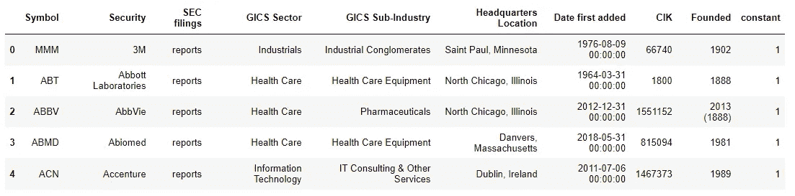
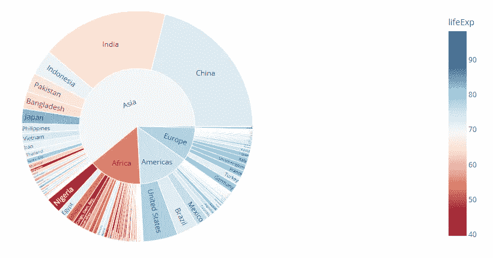
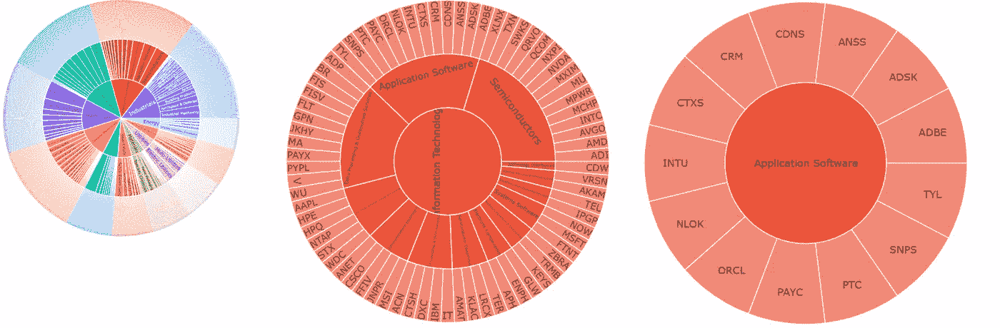
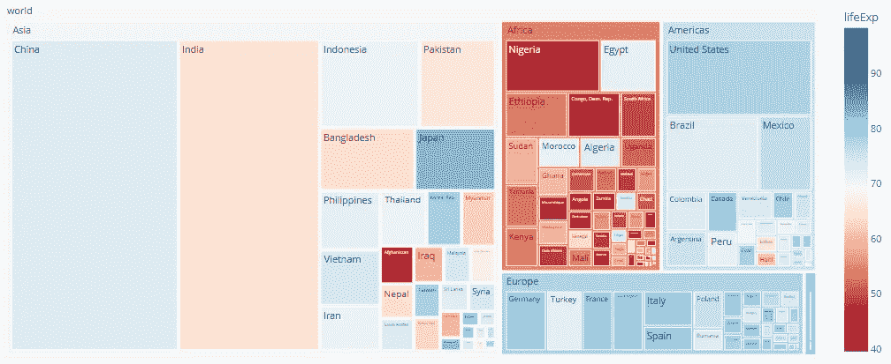
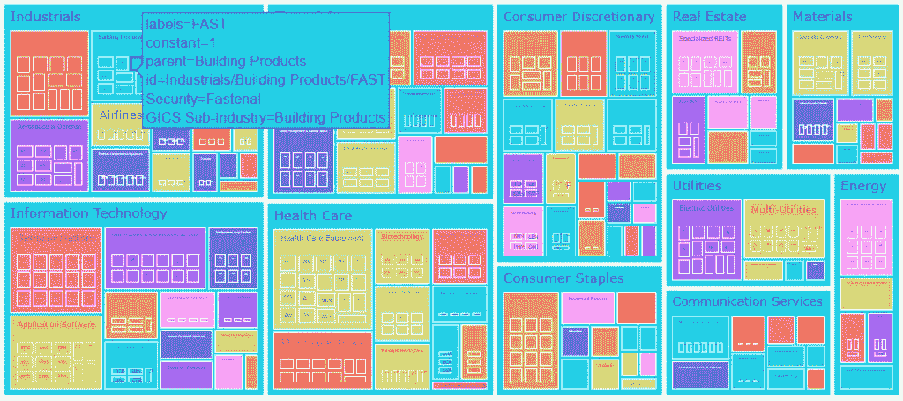
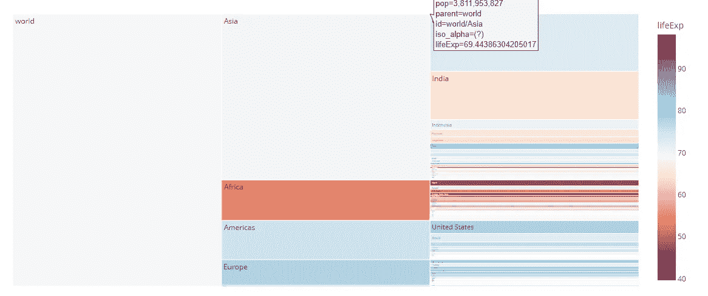
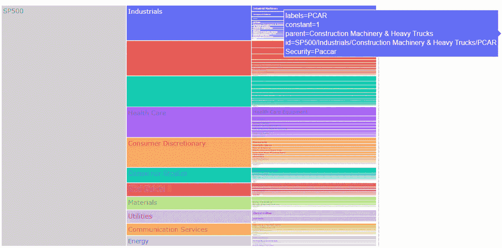

# 使用这三个交互式 Plotly 图表轻松可视化层次结构

> 原文：<https://levelup.gitconnected.com/easily-visualize-hierarchies-using-these-three-interactive-plotly-charts-da81e38561b5>

## 使用 S&P500 数据进行数据可视化的快速课程


约翰·施诺布里奇在 [Unsplash](https://unsplash.com?utm_source=medium&utm_medium=referral) 上的照片

# 用您的数据讲述故事

当我开始在公司的数据科学团队工作时，我的第一个项目是增强一个商业智能仪表板 web 应用程序。在数据科学领域工作，您需要知道如何可视化数据，因为您经常需要向受众传达有关数据、模型和结果的信息。

考虑到应用程序的用户，我知道受众在数据素养方面会有所不同，所以我需要有效的可视化来帮助他们消化这些数字。[我决定使用 Dash 和 Plotly 创建仪表盘，因为 Dash 易于使用，Plotly 提供强大的交互式图表](http://pythondashboards.com)。

当我重新设计 web 应用程序时，我正在分析与我们产品的三层导航菜单相关的数据。因为我在探索分层数据，这让我想到了可视化层次的方法。在本文中，我将介绍三种最常用的可视化层次图表，包括新的*冰柱图*。

*   旭日图
*   树形图
*   冰柱图

# 数据和依赖关系

要使用最新的图表和功能，请确保安装了最新版本的 plotly。根据需要使用 pip 安装 plotly 和 pandas:

```
$ pip install plotly$ pip install pandas
```

这些例子中使用的数据是维基百科提供的 [S & P 500 公司名单。也可以在](https://en.wikipedia.org/wiki/List_of_S%26P_500_companies) [my GitHub](https://github.com/bendgame/Plotly_hierarchies/tree/main) 上找到电子表格。

打开 Pandas 数据框架中的数据，检查最上面的行。

```
import pandas as pd
import plotly.express aspx #open company list in dataframe
df = pd.read_excel('sp500.xlsx')#add a column with a 1 for every row to use as the value
df['constant'] = 1#display top 5 rows
df.head()
```



数据帧的前 5 行

请注意，我添加了一个名为 ***常量*** 的列，并赋予其值 **1** 。调用 Plotly 图表时，将与 ***值*** 参数一起使用。看代码的时候会更有意义。

# 旭日图

我要看的第一个层次图是旭日图。据信，它们被开发出来是为了显示饼图主要部分的[子单元。虽然它们类似于饼图或圆环图，但旭日图从中间开始显示分层数据，然后径向向外堆叠。层次的基础在中心，子代被添加到外环。](https://www.anychart.com/chartopedia/chart-type/sunburst-chart/)



普罗特利的旭日剧情【https://plotly.com/python/sunburst-charts/ 

## 创建旭日图

Plotly 提供了两种创建可视化效果的方法。 [Plotly Express](https://plotly.com/python/plotly-express/) 是 Plotly 易于使用的高级 API，而 Plotly Graph Objects 是更高级的选项，允许更深入的定制。我将使用 Plotly Express 方法展示一个示例，但是我鼓励您浏览文档以了解其他方法。

由于我们的数据在一个数据帧中，当调用 **px.sunburst()** 时，我们需要传递*数据帧*、*层次路径*和*值*。常量列将作为值传递，因此它将被聚合到计数中。例如，将鼠标悬停在应用软件上会显示 13 的计数。

```
fig = px.sunburst(
    df,
    path = ['GICS\xa0Sector', 'GICS Sub-Industry', 'Symbol'],
    values = df['constant']
)
fig.show()
```



旭日图路径信息技术>应用软件

请注意， ***path*** 参数用于传入我们希望用于层次结构的 dataframe 列的名称。根据数据源的不同，例如字典而不是数据帧，您可以将值传递给名称和父参数，而不是提供路径。**注意，如果给出了** `**path**` **，则不需要提供姓名和** `**parent**` **。**

点击此处查看旭日图的完整文档:

[](https://plotly.com/python/sunburst-charts/) [## 旭日图

### 旭日图显示了从根到叶径向向外延伸的分层数据。类似于冰柱图和…

plotly.com](https://plotly.com/python/sunburst-charts/) 

# 树形图

我们将创建的第二个图表是一个[树形图](https://en.wikipedia.org/wiki/Treemapping)。它使用嵌套的矩形可视化分层数据。这种可视化经常用于按部门显示市场。例如，Stocktwits 在他们类似热图的可视化中使用它。



普罗特利的树状图[https://plotly.com/python/treemaps/](https://plotly.com/python/treemaps/)

## 创建树形图

使用 plotly express，创建一个树形图是很容易的。调用`px.treemap`并传入数据帧、路径和值，就像旭日图一样。

```
fig =px.treemap(
    df,
    path = ['GICS\xa0Sector', 'GICS Sub-Industry', 'Symbol'],
    values = df['constant'],
    **color** = 'GICS Sub-Industry', 
    **hover_data** = ['Security'],
    **color_continuous_scale** = 'RdBu'
)
fig.show()
```

因为代码实际上与 sunburst 图表相同，所以我在这个例子中添加了一些可选参数。注意列 *GICS 子行业*被传递给 ***颜色*** 参数，以给子行业而不是部门添加唯一的颜色。 *Security* 被传递给 ***hover_data*** 参数，因此悬停时将显示完整的公司名称。



SP500 Plotly 树状图

要查看所有参数以及如何使用 Graph 对象创建可视化，请在此处查看树形图的完整文档:

[](https://plotly.com/python/treemaps/) [## 树形图

### 树形图使用嵌套矩形来可视化分层数据。输入数据格式与旭日东升相同…

plotly.com](https://plotly.com/python/treemaps/) 

# 冰柱图

新增 Plotly *v5.0，*冰柱图使用特定方向的层叠矩形来可视化分层数据，可以是上、下、左或右。当这个图表在 5.0 中被添加时，我真的很高兴，因为它非常适合我的 3 层导航用例！



## 创建冰柱图

除了几个例外，代码看起来与我们看到的另外两个图表非常相似。要获得带标签的根，请传递 *px。常量(<根名称>)*进入 ***路径*** 参数。我将根命名为 SP500。

```
fig =px.icicle(
    df,
    path = [**px.Constant("SP500")**,'GICS\xa0Sector', 'GICS Sub-Industry', 'Symbol'],
    values = df['constant'],
    hover_data=['Security'],
    color_continuous_scale='RdBu'
)
**fig.update_traces(root_color="lightgrey")
fig.update_layout(margin = dict(t=50, l=25, r=25, b=25))**
fig.show()
```

注意 **update_traces()** 被用来设置*根颜色*为浅灰色。默认情况下根是白色的，因为背景是白色的，这使得冰柱看起来有点难以理解。将其更新为不同于背景的颜色可以防止混淆。



SP500 Plotly 冰柱图

要查看所有参数以及如何使用 Graph 对象创建可视化，请在此查看 Icicle 图表的完整文档:

[](https://plotly.com/python/icicle-charts/) [## 冰柱图

### v5.0 中的新功能 Icicle 图表使用矩形扇区可视化分层数据，这些扇区在一个…

plotly.com](https://plotly.com/python/icicle-charts/) 

# 最后的想法

为了在数据科学或分析领域取得成功，您必须能够可视化数据。为数据选择正确的图表会对用户能否轻松传达信息的含义产生很大影响。现在你已经理解了日光图、树状图和冰柱图，当你看到分层数据并需要可视化时，你就做好了准备。

在我的 github 上找到数据和代码

[](https://github.com/bendgame/Plotly_hierarchies/tree/main) [## bend game/Plotly _ 层次结构

### 在 GitHub 上创建一个帐户，为 bendgame/Plotly_hierarchies 开发做贡献。

github.com](https://github.com/bendgame/Plotly_hierarchies/tree/main) 

感谢阅读！如果您对编程和数据科学感兴趣，请查看另一篇文章！

[](https://towardsdatascience.com/how-to-vectorize-text-in-dataframes-for-nlp-tasks-3-simple-techniques-82925a5600db) [## 如何对自然语言处理任务的数据帧中的文本进行矢量化——3 种简单的技术

### 使用 Texthero、Gensim 和 Tensorflow 的简单代码示例

towardsdatascience.com](https://towardsdatascience.com/how-to-vectorize-text-in-dataframes-for-nlp-tasks-3-simple-techniques-82925a5600db) 

# 谢谢大家！

*   *如果你喜欢我的作品，* [*关注我的《媒介》*](https://medium.com/@erickleppen) *了解更多！*
*   [*通过订阅*](https://erickleppen.medium.com/membership) 获得对我的内容的完全访问和帮助支持！
*   *我们来连线一下*[*LinkedIn*](https://www.linkedin.com/in/erickleppen01/)
*   *用 Python 分析数据？查看我的* [*网站*](https://pythondashboards.com/) ！

[**—埃里克·克莱本**](http://pythondashboards.com/)

[](https://erickleppen.medium.com/the-ultimate-guide-to-erics-articles-d32df8241353) [## 埃里克文章的终极指南

### 我的所有内容按主题组织…

erickleppen.medium.com](https://erickleppen.medium.com/the-ultimate-guide-to-erics-articles-d32df8241353)