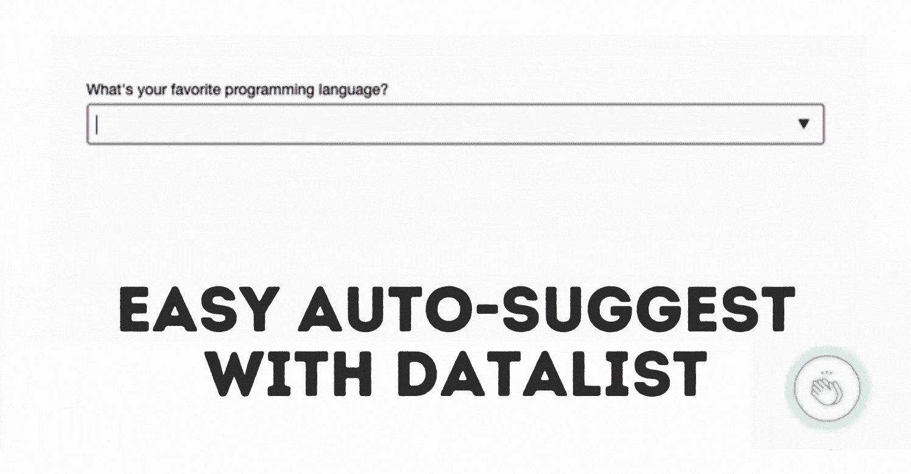
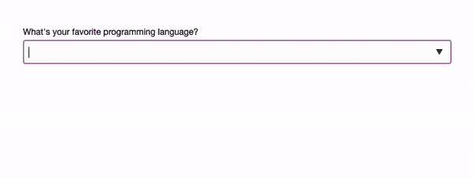
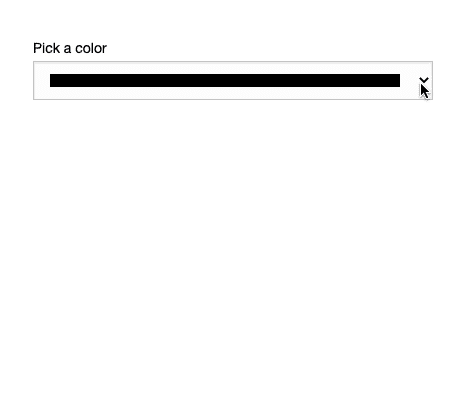

# 使用 HTML5 datalist 标签输入的简单自动完成/建议

> 原文：<https://levelup.gitconnected.com/easy-autocomplete-suggestions-for-inputs-with-the-html5-datalist-tag-22fcfc409235>



使用数据列表轻松实现自动建议

有时，当用户在输入中输入内容时，您可能会向他们建议一些选项。也许有人们正在寻找的流行搜索类别或标签。当然，你可以实现一个 API 驱动的特性，或者如果你想快速启动并运行它，为什么不使用`datalist`标签呢？

如果你想看我摆弄`datalist`标签，你可以在这里看或者继续滚动阅读。

显示 datalist 运行的视频。

> **HTML** `**<datalist>**` **元素**包含一组`[<option>](https://developer.mozilla.org/en-US/docs/Web/HTML/Element/option)`元素，表示允许或推荐的选项，可从其他控件中选择。— **MDN**

Datalist 是普通输入和选择字段的混合体，它允许用户选择建议的选项，在您键入时查看建议，或者添加您自己的选项。

那么它是如何工作的呢？

作为一个简单的例子，让我们向您展示如何将`datalist`标签添加到一个普通的旧`<input type="text">`中(可能是您将使用的最常见的一个)。

`datalist`的工作方式几乎与采用内部`options`的`select`标签相同。

```
<input type="text" id="programming_language" list="languages"/>
<datalist id="languages">
 <option value="JavaScript"></option>
 <option value="Python"></option>
 <option value="Java"></option>
 <option value="HTML">Stop being a troll</option>
</datalist>
```

您将在这里看到的重要事情是，我们的`input`将一个`list`作为选项，该选项指向您想要用来填充输入的`datalist`的`id`。



查看运行中的数据表。

您还可以添加一些内部注释，因此在这个示例中，您将看到如果有人开始键入“Html”作为他们最喜欢的编程语言，我们可以显示一个小注释，告诉他们停止跟踪我们…

关于`datalist`的另一件很酷的事情是，它不仅仅是严格地针对`text`类型的输入。你可以用它给几乎任何标签添加一些建议，包括`date`和`color`标签。

下面是它与颜色选择器一起使用的一个示例:

```
<label for="pick_color">Pick a color</label>
<input type="color" id="pick_color" list="colors"/>
<datalist id="colors">
 <option value="#155AF0"></option>
 <option value="#F107BA"></option>
 <option value="#2B2B2B"></option>
</datalist>
```



使用一种颜色查看用于输入的数据列表

我是通过黑客学习的忠实粉丝，所以直接进入这个 CodePen，亲自尝试一下:

运行中的 datalist 标签示例

什么时候用这个？因为这将添加 DOM 元素，所以我建议当您没有整个数据库的建议时使用它(对我来说，少于 50 条左右是一个好的经验法则)。

直到下一个，编码快乐！❤