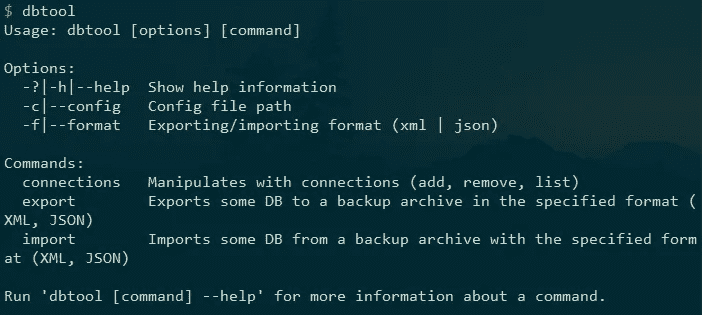
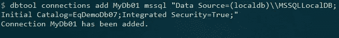
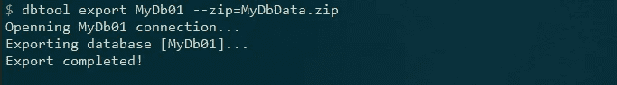

# 轻松植入数据。网络(核心)应用程序

> 原文：<https://levelup.gitconnected.com/easy-database-seeding-in-net-core-applications-f8bcc7a15112>


播种数据库可能是一项相当棘手的任务。这里我们将介绍一些简化这一操作的工具。

# 问题

当我们发布一个. NET(核心)项目时，在首次启动应用程序时，创建底层数据库并用一些数据填充它通常是必不可少的。

例如，让我们想象你有一个演示应用程序的一些图书馆和它的演示，这是必要的，数据库已经有一些数据。
另一个可能的用例:我们应用程序的每个副本都使用它自己的数据库，我们需要在安装期间或第一次启动时用一些初始内容填充它。

创建数据库不是一个大问题，特别是如果项目使用实体框架(核心)——它可以在一行代码中完成。然而，用数据填充我们的数据库是完全不同的事情，在中没有现成的解决方案来完成这项任务。NET 或实体框架。

此外，当所需的种子数据已经存在于本地计算机的数据库中时，这种情况并不少见，但是您需要一种方法将这些数据包含在项目中，并在应用程序启动时部署它们。

# 解决办法

当然，有许多不同的方法来解决上述任务。

我们将在 DbTool 实用程序和 [Korzh 的帮助下尝试这样做。DbUtils](https://github.com/kedonec/Korzh.DbUtils) 库。这两个都是开源项目，可以在 [GitHub](https://github.com/kedonec/Korzh.DbUtils) 上找到。

DbTool 是一个. NET 核心全局工具，可以安装在任何装有[的电脑上。NET Core SDK](https://dotnet.microsoft.com/download) 使用一个简单的控制台命令。使用这个实用程序，我们将把数据库数据导出为某种适合分发的格式(JSON 或 XML)。

然后，我们将在项目中包含结果数据文件，并使用 Korzh。DbUtils 库在应用程序第一次启动时初始化我们的数据库。

# 步骤 1:使用 DbTool 导出数据库数据

## 1.1 安装 DbTool

我们之前说过，DbTool 是一个全局的。NET Core 实用工具，可以安装在您的计算机上，然后在您的系统上用作任何其他 shell 命令。你将需要[。要安装在您机器上的 NET Core SDK](https://dotnet.microsoft.com/download) 版本 2.1(或更高版本)。

安装 DbTool 很容易。为此，只需打开终端(命令提示符)并运行以下命令:

```
dotnet tool install -g Korzh.DbTool
```

如果您在那之后立即运行`dbtool`命令，您将看到一个非常详细的帮助，其中包含所有可用命令的列表。



## 1.2 注册数据库连接

首先，我们需要添加一个到数据库的连接:

```
dbtool connections add {YourConnectionId} {DbType} {YourConnectionString}
```

这里:

*   `{YourConnectionId}`只是您要分配给此连接的唯一名称。
*   `DbType` —数据库服务器的类型。目前(1.2.0 版本)，DbTool 支持 SQL Server ( `sqlserver`)、MySQL ( `mysql`)和 PostgreSQL ( `postgre`)数据库。
*   这个命令的最后一个参数是一个连接字符串。与您已经在项目中使用的连接数据库的相同。

示例:



之后，您可以通过键入以下命令来检查所有连接:

```
dbtool connections list
```

## 1.3 导出数据

现在，当我们添加连接时，我们可以使用`export`命令导出数据库:

```
dbtool export {ConnectionId} [--format = xml | json] [--output = path] [--zip = filename]
```

上面列出的任何选项都可以省略。例如，以下命令:

```
dbtool export MyDb01 --zip = MyDbData.zip
```

将在当前目录下创建一个名为 MyDbData.zip 的 ZIP 归档文件，并用一组 JSON(默认)格式的数据文件填充它。每个数据库表的内容都存储在一个单独的。json 文件。



# 步骤 2:向您的应用程序添加数据播种代码

我们将展示如何使用上一步创建的文件来初始化某个 ASP.NET 核心项目中的数据库。但是，下面描述的过程可以应用于使用。网芯还是。NET Framework 4 . 6 . 1 版或更高版本。
我们这里假设我们的项目使用实体框架(核心)，所以数据库本身是用 EF 手段自动创建的(使用`EnsureCreated`或者`Migrate`方法)。我们还假设我们的数据库运行在 SQL Server(或其本地变体)下。这里列出的说明对于 MySQL DB 也几乎相同。

## 2.1 将数据文件添加到项目中

首先，我们需要将' MyDbData.zip '文件添加到您的项目中。它的最佳位置是项目文件夹中的“App_Data”文件夹。
请注意，您还需要将该文件手动包含到您的项目中。NET 框架项目。

## 2.2.安装 Korzh。DbUtils 包

对于我们的任务，我们需要以下 2 个 NuGet 包:

*   `Korzh.DbUtils.Import`
*   `Korzh.DbUtils.SqlServer`(使用 MySQL 数据库时为`Korzh.DbUtils.MySql`)

要安装软件包，您可以使用 NuGet 软件包管理器、NuGet 控制台或手动将它们添加到。csproj 文件。

## 2.3.添加初始化代码

最后，我们需要创建一个`DbInitializer`类的实例，并在第一次启动时调用它的`Seed`方法。这个过程的最佳位置是我们的`Startup`类的`Configure`方法:

```
public void Configure(IApplicationBuilder app, IHostingEnvironment env)
{
    .     .     .     . app.UseMvc(); //add the following piece of code at the end of your Configure method
    using (var scope = app.ApplicationServices.GetRequiredService<IServiceScopeFactory>().CreateScope())
    using (var context = scope.ServiceProvider.GetService<AppDbContext>()) {
        //the next lines will run only if the database was not created previously
        if (context.Database.EnsureCreated()) { 
            Korzh.DbUtils.DbInitializer.Create(options => {
                //set the connection string for our database
                options.UseSqlServer(Configuration.GetConnectionString("MyDemoDb"));
                options.UseZipPacker(System.IO.Path.Combine(env.ContentRootPath, "App_Data", "MyDbData.zip"));
            })
            .Seed();
        }
    }
}
```

如果您需要在第一次启动时做一些额外的初始化(例如，添加一些默认的用户帐户)，将所有这些初始化代码隐藏到一个单独的类中，并且只向`IApplicationBuilder`接口公开一个扩展函数(姑且称之为`EnsureDbInitialized`)将是一个好主意。就像我们在 EasyQuery 库的[示例项目中所做的一样。](https://github.com/easyquery/AspNetCoreSamples/blob/master/EqAspNetCoreDemo/Data/DbInitializeExtensions.cs)

在这种情况下，您只需要在您的`Startup.Configure`方法的末尾添加一个调用:

```
public void Configure(IApplicationBuilder app, IHostingEnvironment env)
{
    .  .  .  .
    app.UseMvc(); //Init demo database (if necessary)
    app.EnsureDbInitialized(Configuration, env);
}
```

就是这样。

我真的希望本文中介绍的解决方案能为您节省一些时间。感谢您的阅读。

[](https://gitconnected.com/learn) [## 了解如何编码-查找编码教程| gitconnected

### 从开发者提交和排名的教程中学习任何编程语言、框架或库。教程是…

gitconnected.com](https://gitconnected.com/learn)