# 在 React 中拖放

> 原文：<https://levelup.gitconnected.com/easy-guide-drag-and-drop-in-reactjs-1a676291dce7>

> D 探索如何在 5 分钟内管理反应中的拖放。你可以在这里找到我的代码[。](https://github.com/MatteoTasinato/Easy-Drag-n-Drop-React-)

了解如何在 React 中拖放组件。

在开始之前，我们必须问自己，当我们谈论计算机中的拖放时，我们指的是什么。

> 我们可以说**拖动&放下**是当一个**组件**被拖动到另一个**组件**上时，软件触发一个**回调**的能力。

没错，这个回调可以为所欲为，可以让元素消失，可以触发百万函数链，但基本上就是这样的情况。

从现在开始我们将讨论一个真实的场景:我们想把一个**棒球**(可拖动对象)扔进一个**纸盒**(容器对象)中，然后**读取写在球上的标志**(回调函数)。

然后抓起一个纸盒子:

纸盒(通过[储存](https://stockup.sitebuilderreport.com/stock-photos)

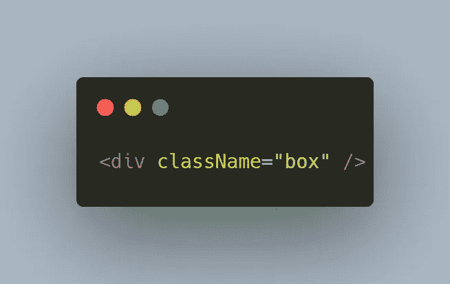

纸盒在 Matrix 中的外观。

现在，我们的盒子很好，但是…它没用。我们需要它能够理解什么时候球被扔进了里面，并且能够阅读写在球上的标记。

幸运的是，Javascript 是一个神奇的世界，在这里我们可以将额外的能力注入到我们想要的每个对象中，甚至是一个纸盒。

在 React 中，有两种主要方法来增强组件:

第一个选项是创建一个**方法**，它将接受一个**组件**并返回一个组件的**增强版本，这样:**

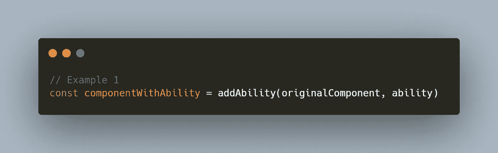

或者我们可以创建一个**方法**来生成将被注入到我们的盒子中的能力:

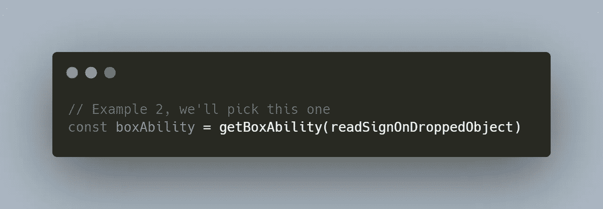

我们正在创建一种能力，可以读取放在我们容器中的任何物体上的标志。

我们将选择第二种方式。现在，我们如何创建 **createBoxAbility** 方法呢？它需要生成一个将被纸盒使用的道具:

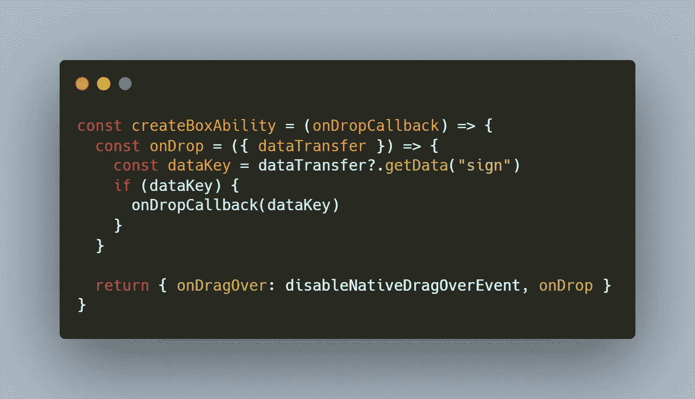

我们可以看到这个方法返回了两个元素的属性:

*   **onDragOver** :用于注册一个回调，当一个组件被拖拽到盒子上时，这个回调将被触发。我们希望阻止此事件的浏览器默认效果:

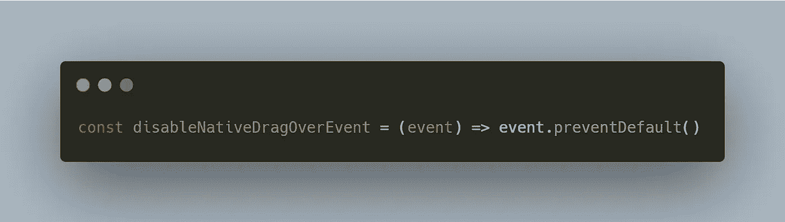

对 **onDragOver** 的回调。它只会停止事件传播。

*   **onDrop** :当用户在我们的盒子上释放拖动的球时，这个回调被触发。

您可以注意到这个回调为我们提供了一个**数据传输**对象。这个物体为我们提供了读写球上信息的能力。在本例中，我们正在读取它的**标志**属性。

现在我们有了**能力来读取掉落物体上的标志，**很容易将其应用到盒子上:

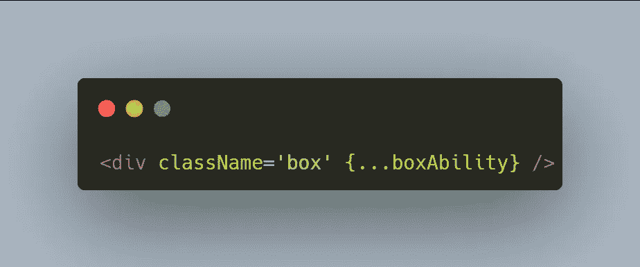

这个盒子能够接收一个球，并读出球上的标志。

我们完成了纸盒，现在轮到棒球了！

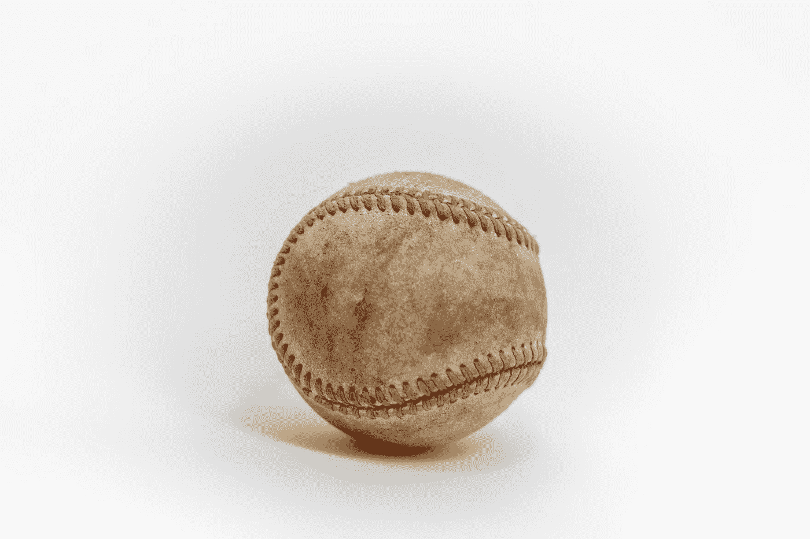

照片由[克里斯·布里格斯](https://unsplash.com/@cgbriggs19?utm_source=medium&utm_medium=referral)在 [Unsplash](https://unsplash.com?utm_source=medium&utm_medium=referral) 上拍摄

棒球作为一个 HTML 组件，有两个我们必须注意的属性:

1.  **draggable** :布尔值，如果为真，则允许用户拖动元素；
2.  **onDragStart** :用户开始拖动我们的球时触发的回调。

现在，我们必须编写一个方法来生成能够使我们的球可拖动的道具:

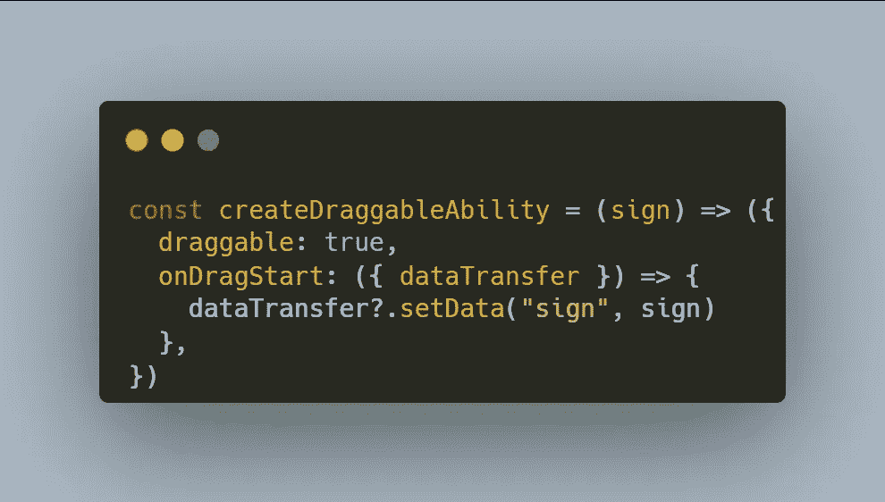

如你所见 **onDragStart** 可以访问**data transfer**对象。我们可以用这个物体在我们的球上签名。

至于盒子，将这个属性附加到球上非常容易，让我们来创建它:

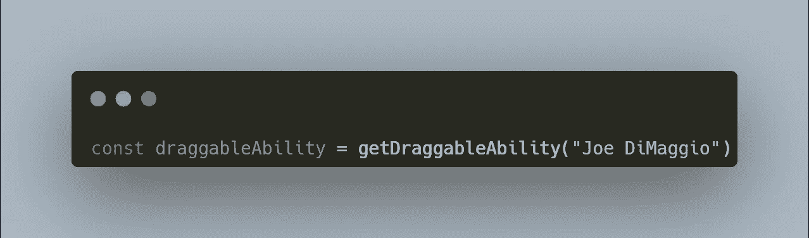

创造被拖的能力。

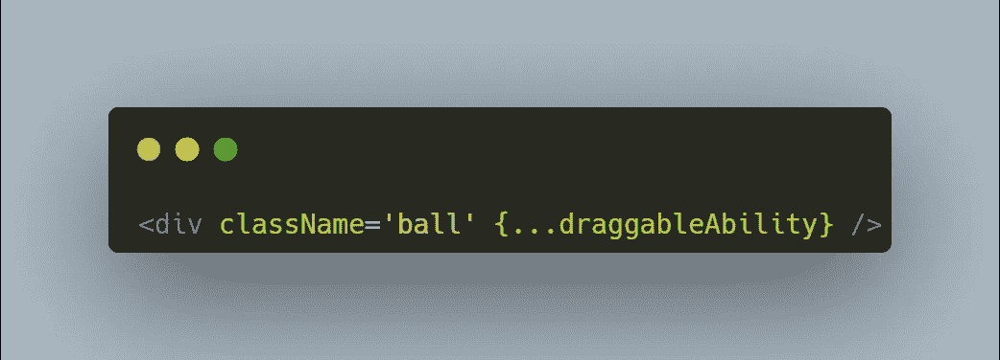

在棒球上注入能力。

嘿，我们成功了！恭喜你！尝试链接到[这里](https://github.com/MatteoTasinato/Easy-Drag-n-Drop-React-)的代码，您将能够看到类似这样的内容:

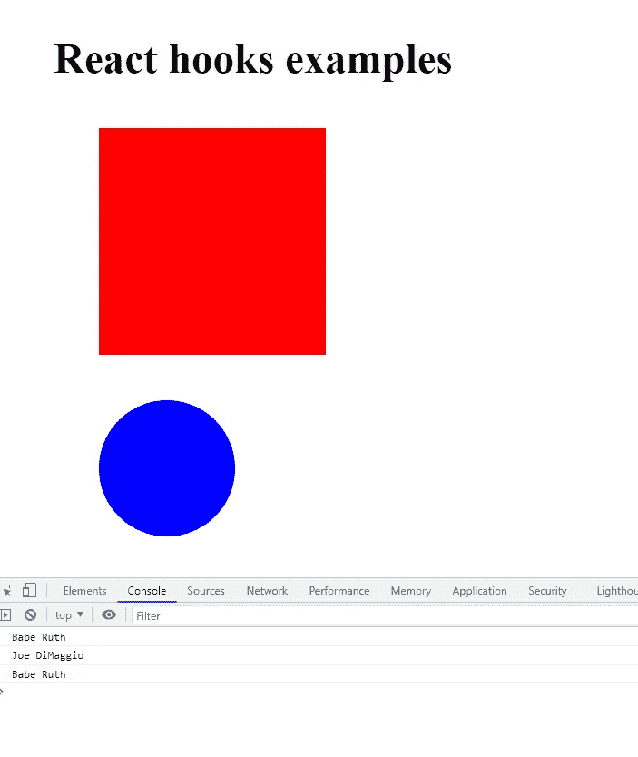

本文中显示的代码的执行。

现在你可以让每一个 HTML 组件都可以拖动了！当然，有很多方法可以改进这一小块代码，把这篇文章作为你好奇心的起点吧！

**奖励积分:**

您可以将这些函数包装在一个组件中，并将其用作包装器。

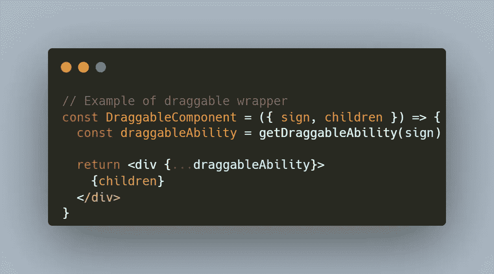

包装组件。根据你的需要修改它，例如，你可以使用一个 **React.useCallback.**

并以这种方式使用包装器:

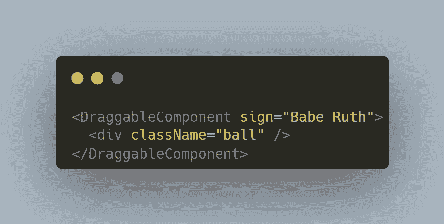

你收藏的好作品。

您甚至可以使用这个包装器来使所有东西都可以拖动！

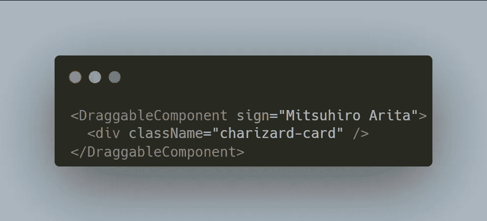

让你的激情变得可以拖动。

那都是乡亲们！如果您喜欢这篇文章，请跟随我，我的下一篇文章将是关于 Javascript 事件监听器的！