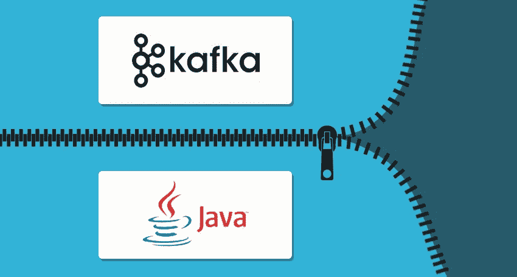
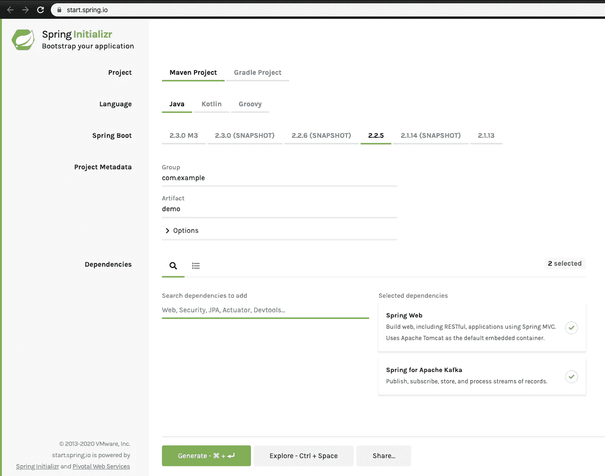
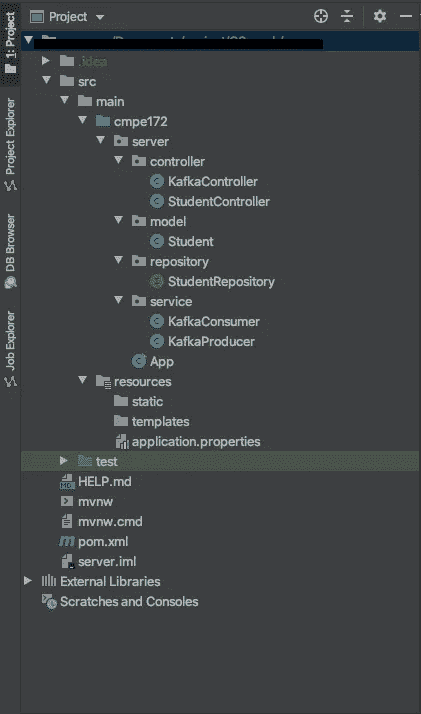
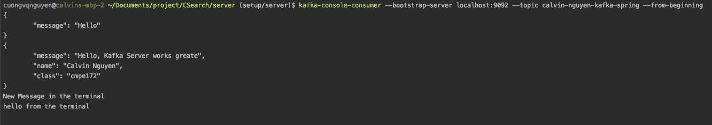

# 在 macOS 上轻松安装 Java Springboot 和 Apache Kafka

> 原文：<https://levelup.gitconnected.com/easy-java-springboot-apache-kafka-setup-on-macos-ceb481e167f8>

# 作者说明

问候读者，

本文是我与创业公司一起成长系列的 ***的一部分，该系列由各种*技术教程、新闻和软件开发技巧*组成:***

1.  [用 Node.js(第 1 部分)— ES6](https://medium.com/swlh/a-complete-guide-build-a-scalable-3-tier-architecture-with-mern-stack-es6-ca129d7df805) 构建一个结构良好的三层架构
2.  [提高团队代码质量的两个简单技巧](https://medium.com/swlh/2-simple-tips-to-increase-your-team-code-quality-143b879ae2f7)
3.  [认证的完美结构&用 Node.js 授权你的 API](https://medium.com/swlh/perfect-structure-to-authenticate-authorize-api-with-node-js-and-passport-jwt-d529b1a618ba)
4.  [我在一个小时内构建了一个 M.E.R.N 代码库](https://medium.com/swlh/i-built-a-m-e-r-n-codebase-in-an-hour-742acd71ed7e)(第 2 部分)
5.  [如何用 Java 构建 REST API&MySQL 使用 Tomcat](https://medium.com/@calvinqc/build-a-simple-rest-apis-with-java-8-tomcat-jsp-mysql-intellij-on-mac-3308f4e59a03)
6.  [使用 Nodemailer、Gmail & Google OAuth2](https://medium.com/swlh/multi-purposes-mailing-api-using-nodemailer-gmail-google-oauth-28de49118d77) 构建自己的邮件 API
7.  [WebRTC——支持 Google Meet、Facebook Messenger 的技术](https://medium.com/swlh/webrtc-the-technology-that-powers-google-meet-hangout-facebook-messenger-and-discord-cb926973d786)
8.  向新的 Github CLIs 问好
9.  **使用 Java、Springboot、Kafka 进行简单设置**
10.  [成功的团队合作需要什么](/what-it-takes-to-have-a-successful-team-cooperation-bc21b82e9f3)
11.  [如何使用 Docker、EC2、ECS 和 ECR 将应用程序部署到 AWS](https://medium.com/swlh/how-to-deploy-an-application-to-aws-using-docker-ecs-and-ecr-aa7785fc9667)
12.  [通过将我们的客户端托管到云存储，我们节省了 45%的总成本](https://medium.com/@calvinqc/we-cut-down-45-of-our-budget-by-switching-to-google-cloud-storage-7e5a6a10542)

感谢访问这个系列，并享受阅读！



图片来源于 Cloudkarafka

# 要求

*   [自制](https://brew.sh/)
*   用[邮递员](https://www.postman.com/)测试。想了解更多，可以看这个[视频](https://www.youtube.com/watch?v=t5n07Ybz7yI&feature=emb_logo)。
*   [**理解卡夫卡的核心概念**](https://www.youtube.com/watch?v=udnX21__SuU)

# 部分

1.  **安装 Java 8**

```
$ brew tap adoptopenjdk/openjdk
$ brew cask install adoptopenjdk8
```

**2。安装 Kafka**

```
$ brew install kafka
```

3.打开第一个端子**启动 Zookeeper**

```
$ zookeeper-server-start /usr/local/etc/kafka/zookeeper.properties
```

4.打开**第二终端**启动卡夫卡

```
$ kafka-server-start /usr/local/etc/kafka/server.properties
```

5.打开**第三终端**创建一个卡夫卡主题

```
$ kafka-topics --bootstrap-server localhost:9092 --topic **<enter-a-topic>** --create --partitions 1 --replication-factor 1
```

# 用 Springboot 创建一个 Maven 项目

1.  打开 [start.spring.io](https://start.spring.io/)
2.  选择**Spring Web**&**Spring 为 Apache Kafka** 依赖关系



3.在 IDE 中打开您的项目(我更喜欢使用 IntelliJ)

# 配置 Kafka 生产者和消费者

1.  将此添加到`src/main/resources` 文件夹中的`application.properties`，并修改高亮显示:

```
spring.datasource.url=jdbc:mysql://localhost:3306/<your-db-name>?allowPublicKeyRetrieval=true&useSSL=false&serverTimezone=UTC
spring.datasource.username=<your-db-username>
spring.datasource.password=<your-db-password>app.topic=**<same-topic-created-in-terminal>**spring.kafka.bootstrap-servers=localhost:9092
spring.kafka.groupId=**<any-group-id>**spring.kafka.consumer.bootstrap-servers=localhost:9092
spring.kafka.consumer.group-id=**<any-group-id>**
spring.kafka.consumer.auto-offset-reset=earliest
spring.kafka.consumer.key-deserializer=org.apache.kafka.common.serialization.StringDeserializer
spring.kafka.consumer.value-deserializer=org.apache.kafka.common.serialization.StringDeserializerspring.kafka.producer.bootstrap-servers=localhost:9092
spring.kafka.producer.value-serializer=org.apache.kafka.common.serialization.StringSerializer
spring.kafka.producer.key-serializer=org.apache.kafka.common.serialization.StringSerializer
```

2.打开一个新终端，并创建一个主题:

```
kafka-topics --bootstrap-server localhost:9092 --topic **<same-topic-in-application.properties>** --create --partitions 1 --replication-factor 1
```

# 初始化 Kafka 生产者和接收者服务

1.  在`com.example`包中，创建这些文件夹:`$ mkdir controller model repository service`
2.  创建生产者和接受者服务:`$ touch service/KafkaConsumer.java service/KafkaProducer.java`
3.  将此添加到 **KafkaConsumer:**

```
**package <enter-your-package-here>;**import org.springframework.kafka.annotation.KafkaListener;
import org.springframework.stereotype.Service;import java.util.ArrayList;
import java.util.List;[@Service](http://twitter.com/Service)
public class KafkaConsumer { public static List<String> messages = new ArrayList<>();
    private final static String topic = **"<same-topic-in-resources>"**;
    private final static String groupId = **"<same-group-id>"**; @KafkaListener(topics = topic, groupId = groupId)
    public void listen(String message) {
        messages.add(message);
    }
}
```

4.将此添加到 KafkaProducer:

```
**package <enter-your-package-here>;**

import org.springframework.beans.factory.annotation.Autowired;
import org.springframework.beans.factory.annotation.Value;
import org.springframework.kafka.core.KafkaTemplate;
import org.springframework.stereotype.Service;

@Service
public class KafkaProducer {

    @Autowired
    private KafkaTemplate<String, String> kafkaTemplate;

    @Value("${app.topic}")
    private String topic;

    public void produce(String message) {
        kafkaTemplate.send(topic, message);
    }

}
```

# 创建 Kafka API

1.  创建一个 Kafka 控制器文件:`$ touch controller/kafkaController.java`并添加如下内容:

```
package server.controller;

import org.springframework.web.bind.annotation.*;

import server.service.KafkaConsumer;
import server.service.KafkaProducer;

import org.springframework.beans.factory.annotation.Autowired;

import java.util.List;

@RestController
public class KafkaController {
  @Autowired
  private KafkaConsumer consumer;

  @Autowired
  private KafkaProducer producer;

  @PostMapping("/send")
  public void send(@RequestBody String data) {
    producer.produce(data);
  }
  @GetMapping("/receive")
  public List<String> receive() {
    return consumer.*messages*;
  }

  public KafkaConsumer getConsumer() {
    return consumer;
  }

  public KafkaProducer getProducer() {
    return producer;
  }

  public void setConsumer(KafkaConsumer consumer) {
    this.consumer = consumer;
  }

  public void setProducer(KafkaProducer producer) {
    this.producer = producer;
  }
}
```

*注意:还有模型和存储库，您可以用它们来配置您的数据库，但在本教程中我们不需要它。*



最终项目结构

# 测试

有两种方式发送生产者的信息:邮递员和终端。我给你们俩看:

1.  打开您之前用来创建主题的第三个终端

```
$ kafka-console-consumer --bootstrap-server localhost:9092 --topic **<enter-your-topic>** --from-beginning
```

## 2.邮递员

2.1 使用 **POST/** 方法，用 JSON 体输入**localhost:8080/send**；

```
{
   "message": "Hello from Postman"
}
```

2.2 打开**第 4 端子，**并输入:

```
$ kafka-console-producer --broker-list localhost:9092 --topic **<enter-your-topic>** > Hello from the terminal
```

3.检查终端，您将实时看到您通过邮递员和终端**发送的消息。**



# 干得好！

现在，您可以满怀信心地建立自己的 Java Spring 和 Apache Kafka 了！

## 感谢[技术官僚 sid](http://www.technocratsid.com/) 帮助设置！

# 后续行动

*   如果你喜欢阅读 ***《我与创业公司一起成长*** ，并且希望在未来阅读更多。请在此订阅。​
*   在 [Github](https://github.com/calvinqc) 、 [LinkedIn](https://www.linkedin.com/in/calvinqc/) 上与我联系