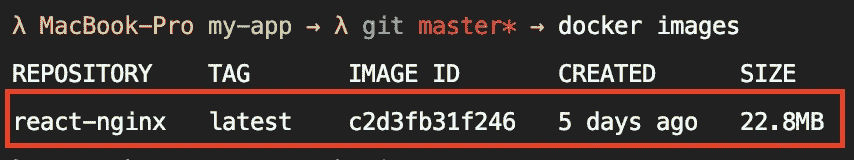
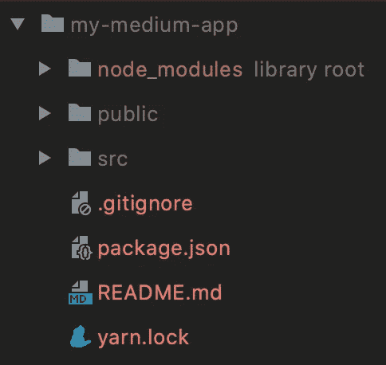
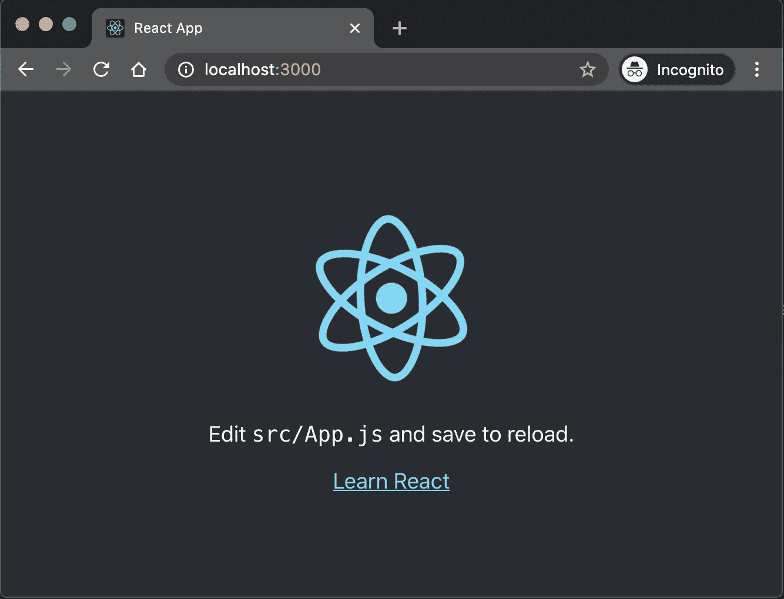
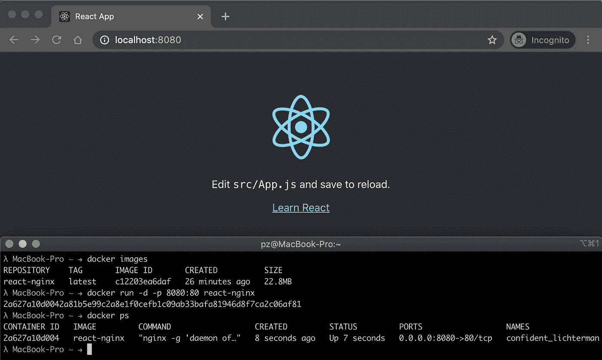

# 轻松优化您的 React Docker 图像。降到 22MB！

> 原文：<https://levelup.gitconnected.com/easy-optimization-of-your-react-docker-image-down-to-22mb-9d9e3a06870>

如何为 React web 应用程序构建和运行一个精简的 Docker 映像，以及为什么它很重要。


[张家瑜](https://unsplash.com/@danielkcheung)在 [Unsplash](https://unsplash.com/) 上拍照

# “问题”

我想我们都同意一个大的 Docker 图像尺寸从来都不是好的。有几个原因:

*   启动时间增加，尤其是自动缩放的问题
*   例如，使用云提供商会增加成本
*   更长的图像提取时间
*   使用不必要的存储

我最近的一篇文章[将你的 Node.js Docker 图片尺寸缩小了 90%！](https://medium.com/faun/decreasing-your-node-js-docker-image-size-by-90-84cc1b1093d9)我已经提供了一个例子，说明如何将 Node.js 应用程序的 Docker 图像大小从大约 930MB 减少到 102MB。但是有了前端网络应用，我们可以走得更远！

前端 Web 应用的好处在于，你不需要 Node.js 来运行它们。因此，如果你记得每个网站、Web 应用程序或类似程序的“基础”，你会注意到我们在这里真正需要做的唯一事情是向客户端提供一些 HTML、JavaScript 和 CSS。除了提供一些简单的、有希望缩小/优化的文件之外，没有什么别的了。这里没有 Node.js 或其他任何东西。

这就是为什么我们可以在 Docker 映像中为我们的前端应用程序节省大量 MB。因此，我们不需要在 Docker 容器中运行 Node.js 进程，我们唯一要做的就是在其中运行一个超级小的 web 服务器(Apache、NGINX 等),它只是将我们的 HTML、JavaScript、CSS，也许还有图像返回给请求者。

我个人比较喜欢用 NGINX。当然，你可以使用任何你喜欢的网络服务器。您应该只检查是否有 Docker 映像可用，这样您就不必创建自己的基本映像。

因此，让我们快进一点，快速浏览一下我们的 React 应用程序服务 Docker 映像可以有多小。在下一张图中，您可以看到一个小的 docker 图像，它通过 NGINX 服务于我的“Hello World”-React 应用程序。你可以看到它的大小只有 22.8MB，非常小。尤其是和一个羽翼丰满的 Node.js 的 930MB 或者 Node.js alpine one 的 102MB 相比。



“docker images”命令只为“react-nginx”Docker 映像显示 22.8MB

在下一节中，我想向您展示如何为您的 React 应用程序创建这样一个小图像。

旁注:当然，下面的方法也适用于所有其他 JS/TS 前端框架，如 Angular、Vue.js 等，因为它们最终都只是 HTML/JS/CSS。

# 密码

和往常一样，我准备了一个小的 GitHub 资源库，您可以将其用作参考，或者直接用来开始使用您的新应用程序。

[](https://github.com/Abszissex/medium-react-docker-optimization) [## abszisex/medium-react-docker 优化

### 所有命令都需要在内部运行。/my-app/ folder:安装依赖项启动本地开发服务器(Chrome 选项卡是…

github.com](https://github.com/Abszissex/medium-react-docker-optimization) 

## 准备 React 应用程序

为了快速入门，我使用了 [Create React App](https://github.com/facebook/create-react-app) 框架来创建我的 React 应用程序。只需导航到您的新项目文件夹并运行:

```
*npx create-react-app my-medium-app*
```

这个命令为您提供了入门所需的一切:

*   创建新的纱线项目
*   添加 git
*   创建样板 HTML/JS/CSS
*   安装所有必要的节点模块



通过创建 React 应用程序新建 React 应用程序

该命令完成后(可能需要一段时间)，您可以直接移动到新的应用程序文件夹并运行您的应用程序。

```
cd my-medium-app
yarn start
```

`yarn start`还会在 [http://localhost:3000](http://localhost:3000) 上自动打开您的网络浏览器，React 应用程序现已可用:



运行在 http://localhost:3000 上的 React 应用程序

既然我们现在有了一个运行中的 React 应用程序，让我们以“小”的方式将其容器化吧！

## 创建 Docker 图像

与往常一样，在创建新的 Docker 映像时，我们首先向应用程序文件夹添加两个新文件:

```
.dockerignore
Dockerfile
```

*   `.dockerignore` —定义在构建 Docker 映像时应忽略且不应复制到其中的文件/文件夹
*   `Dockerfile` —定义顺序运行以生成新 Docker 图像的命令。

让我们快速浏览一下这两个文件:

创建新的 Docker 映像时，我们只想包含构建/服务流程所需的文件。所以我们忽略了 git、Docker(因为我们在 Docker 中不需要它)，以及`build`和`node_modules`之类的东西，因为我们希望在构建过程中创建它们，并且不希望遇到冲突或者意外地获取错误的源代码——从头开始构建>。

对于 docker 文件，第一部分(第 1-19 行)非常简单。

*   将定义(包括依赖项)复制到构建阶段
*   安装所有的生产依赖项(这里不需要开发依赖项)
*   复制源代码
*   创建生产版本

我们首先复制并安装我们的依赖项，而不是将它们与所有其他源代码一起复制，这也是一个构建优化的原因。因为当`package.json`和`yarn.lock`没有改变时，你的依赖 Docker 就不能从缓存中采取这些步骤，如果你只是改变了你的源代码中的一些东西，就不必再次获取和安装所有的`node_modules`。这加快了你的码头建设了很多。

回到 Dockerfile 的第 22–34 行:

*   使用`nginx:alpine`作为基础图像。如果你对`alpine`部分有兴趣，请参考我的另一篇文章[将你的 Node.js Docker 图像尺寸减小 90%！](https://medium.com/faun/decreasing-your-node-js-docker-image-size-by-90-84cc1b1093d9)。
*   将当前工作目录设置为 NGINX 用来提供文件的文件夹`/usr/share/nginx/html`。
*   从 NGINX 中删除所有现有资产。
*   将生产就绪`build`从前一个构建阶段复制到当前工作目录中。
*   用`daemon off`启动`nginx`，这样码头工人集装箱不会在命令完成后停止。见 [StackOverflow](https://stackoverflow.com/questions/18861300/how-to-run-nginx-within-a-docker-container-without-halting#:~:text=Use%20the%20daemon%20off%20configuration,.nginx.org%2FCoreModule.&text=To%20expand%20on%20Charles%20Duffy's,directly%20on%20the%20command%20line.)

现在，我们的配置部分已经完成，让我们构建并运行我们的 Docker 映像！

## 构建并运行码头工人图像

要构建 Docker 映像，只需在应用程序文件夹中运行以下命令:

```
*docker build -t react-nginx .*
```

该命令在当前目录中搜索一个`Dockerfile`并使用它来构建一个新的 Docker 映像。`-t`参数用于定义名称和“名称:标签”格式的可选标签。

您可能有多个`Dockerfile`用于不同的目的，或者如果您想要测试不同的配置，您可以总是使用`docker build`命令上的`--file PATH/TO/FILE`参数来指定您想要使用的`Dockerfile`的路径。供参考:[码头工人建造文件](https://docs.docker.com/engine/reference/commandline/build/)。

构建完成后，我们现在可以使用以下命令运行 Docker 映像:

```
*docker run -d -p 8080:80 react-nginx*
```

*   `-d`-告诉 Docker 在“分离”模式下运行您的容器，这样它就不需要您的终端打开，而是在后台运行
*   `-p`-提供端口映射。在这里，码头工人被告知我们想要将我们的港口`8080`映射到内部港口`80`。`80`是 NGINX 服务我们的 React App 的默认 HTTP 端口。
*   `react-nginx`-通过`docker build`定义的图像名称

命令运行之后，React 应用程序现在可以通过 [http://localhost:8080](http://localhost:8080) 获得。

在下图中，您可以看到正在运行的 React 应用程序，它是通过 Docker 容器提供的。还使用了以下命令:

*   `docker images` —打印系统上所有可用的图像。在我们的例子中，它只是我们之前用`docker build`创建的名为`react-nginx`的图像。你还可以看到它只有 22.8MB 的小尺寸。
*   `docker run -d -p 8080:80 react-nginx` —启动 Docker 容器，使用`react-nginx`图像并打印出容器 ID。
*   `docker ps` —提供系统上所有当前运行的 Docker 容器的列表



通过 Docker 容器运行 React 应用程序

# 打扫

完成这个简短的教程后，我们应该清理我们的资源:

1.  使用从`docker run`返回的 ID 或者通过`docker ps`显示的更短的`CONTAINER ID`来停止 Docker 容器，两者都可以正常工作。

```
# Stops the container
docker stop CONTAINER_ID# Removes the container
docker rm CONTAINER_ID# Verify that all containers are cleaned up
# The '-a' is used to display also stopped containers
docker ps -a
```

2.从系统中删除图像。您可以使用`docker images`命令找到`IMAGE_ID`，如上图所示。

```
docker image rm IMAGE_ID
```

# 结论

我希望我可以向您展示，创建一个服务于 React(在此输入任何 JS 前端框架)应用程序的超小型 Docker 映像非常简单，并且不需要太多配置。

感谢您花时间阅读我的文章。

## 你想联系吗？

如果你想联系我，请在 LinkedIn 上给我打电话。

另外，请随意查看我的书籍推荐📚。

[](https://mr-pascal.medium.com/my-book-recommendations-4b9f73bf961b) [## 我的书籍推荐

### 在接下来的章节中，你可以找到我对所有日常生活话题的书籍推荐，它们对我帮助很大。

mr-pascal.medium.com](https://mr-pascal.medium.com/my-book-recommendations-4b9f73bf961b) [](https://mr-pascal.medium.com/membership) [## 通过我的推荐链接加入 Medium—Pascal Zwikirsch

### 作为一个媒体会员，你的会员费的一部分会给你阅读的作家，你可以完全接触到每一个故事…

mr-pascal.medium.com](https://mr-pascal.medium.com/membership)