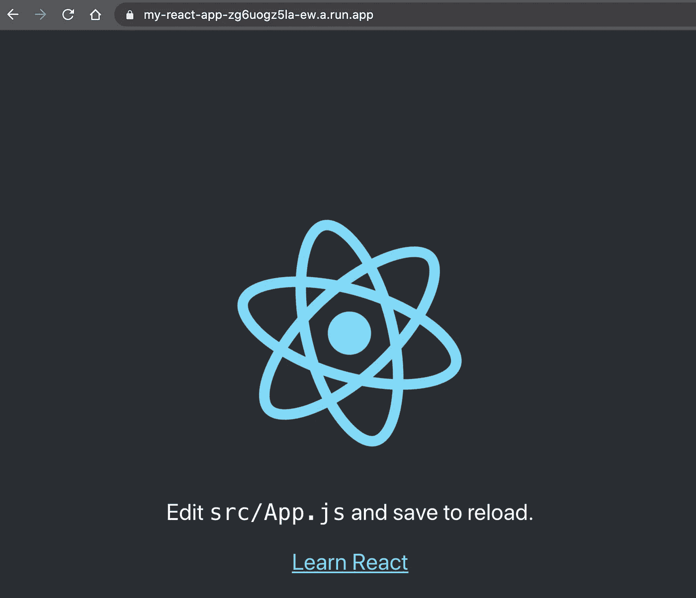

# 使用云运行轻松实现 React 应用的无服务器部署

> 原文：<https://levelup.gitconnected.com/easy-serverless-deployment-of-your-react-app-using-cloud-run-c26aa79af491>

使用 GCP 云运行将 React 应用作为 Docker 容器部署在无服务器环境中，并使其可在公共互联网上访问。

布雷特·乔丹在 [Unsplash](https://unsplash.com/) 上的照片

# 要求

开始之前，请确保您准备好以下零件:

*   一个谷歌云平台帐户，为您的(演示)项目启用计费
*   [您的 GCP 项目启用了云构建](https://cloud.google.com/cloud-build)
*   在您的 GCP 项目上启用了云运行
*   [GCloud SDK](https://cloud.google.com/sdk/docs/install) 安装在您的本地机器上

除了 GCP 的这些要求，我们当然还需要一个我们想要托管的容器化的 React 应用程序。如果你还没有，请参考我的另一篇文章【React Docker 图片的简单优化。降到 22MB！我将向您展示如何用一行代码创建一个运行中的 React 应用程序，并提供一些优化的 docker 文件来将其打包。

对于本文的下一部分，我假设您已经阅读了我的另一篇文章，因为我不会重复那里已经描述过的部分。

# 本文的预期结果

完成本文中定义的步骤后，我们将有一个简单且可重复的流程，如何在无服务器环境中构建和部署容器化的 React 应用程序，并公开发布，如下图所示:

React 应用程序在云上运行并公开发布

# 代码

我准备了一个小的 GitHub 资源库，您可以将其用作参考，或者直接用来开始使用您的新应用程序。

 [## abszisex/中反应云运行

### 安装用于 CLI 的 GCloud SDK 需要启用云构建需要启用云运行需要运行所有命令…

github.com](https://github.com/Abszissex/medium-react-cloud-run) 

## 准备 React 应用程序和 Docker 配置

请参考我的另一篇文章[轻松优化你的 React Docker 图片。降到 22MB！](/easy-optimization-of-your-react-docker-image-down-to-22mb-9d9e3a06870)用于新 React 应用程序的初始设置和容器化。

## 云运行—容器运行时契约

如果我们简单地将我们的代码和现有的 docker 文件一起部署到云上运行，这是行不通的，因为有一个特定的[容器运行时契约](https://cloud.google.com/run/docs/reference/container-contract)必须完成。但我们将确保在接下来的几个步骤中履行这份合同！

## 准备 NGINX 和 Dockerfile 文件

首先，我们创建一个新的`nginx.conf`来配置 NGINX 服务器，它运行在 Docker 容器中，为 React 应用程序提供服务。这里重要的部分是`$PORT`变量，因为`$PORT`变量是 Google 自动添加到运行容器中的[。](https://cloud.google.com/run/docs/reference/container-contract#env-vars)

nginx.conf

其次，我们必须相应地修改 docker 文件。这里的“新”线是#25 和#37 到#42。

Dockerfile 文件

在第 25 行，我们仅使用`COPY`命令将我们的`nginx.conf`文件复制到 NGINX 的配置文件夹中，并将其重命名为`configfile.template`，以暗示它是一个可以接收变量的模板。

接下来，在第 37 行，我们定义了环境变量，这些变量可以在启动容器时设置。

*   `PORT` —容器运行的端口，默认为`8080`
*   `HOST` —容器运行的主机地址，默认为`0.0.0.0`。默认值非常重要，因为[云运行要求主机地址为](https://cloud.google.com/run/docs/reference/container-contract#port) `[0.0.0.0](https://cloud.google.com/run/docs/reference/container-contract#port)`。

在第 42 行，我们最后告诉 NGINX，环境变量`$PORT`应该在我们的 NGINX-template 中替换，并且这个模板应该作为启动服务器时的默认配置。

## 定义 GCloud 要忽略的文件

接下来，我们**应该**创建`.gcloudignore`文件。即使不是强制性的，拥有一个也是很重要的。与`.dockerignore`类似，它定义了当通过不同命令将文件上传到云时，GCloud 应该忽略的文件。在我们的案例中，当我们通过云构建在云上构建 Docker 映像时，就会发生这种情况。

如果我们不定义它，我们会在每次构建/部署应用程序时将所有文件上传到云中。所以你可能会问自己:“我真的想把所有的`node_modules`和一个填充的`build`上传到我打算进行干净构建的云中吗？？?"。如果你能清楚地回答这个问题，你应该使用一个`.gcloudignore`文件😉

## 创建构建和部署脚本

最后但同样重要的是，现在是时候创建我们的脚本，使用云构建和云运行来构建和部署我们的应用程序了。作为一个小奖励，我还提供了一个用当前版本(例如`0.1.0`)标记构建的 Docker 图像的例子，取自您的`package.json`和`latest`。

构建和部署对云运行做出反应的应用程序

让我们来看一下不同的脚本部分:

`VARIABLES`

*   定义你所有的“硬”变量。
*   确保使用您的 GCP 项目中的正确项目 ID

`GENERATED VARIABLES`

*   定义所有自动生成的变量。
*   使用`yarn`环境和一些 shell 命令从`package.json`文件中“神奇地”提取当前版本。
*   为图像名称以及图像名称与当前和`latest`版本的组合创建变量。

`BUILD`

*   将当前文件夹提交给运行 Docker 文件的云构建，以构建 Docker 映像。
*   Docker 图像被自动标记为在`GENERATED VARIABLES`中构建的版本。

`TAGGING`

*   标签`latest`正被添加到 Docker 图像中，该图像具有在`BUILD`中使用的标签。
*   `--quiet` —禁用所有交互式提示，这在 CI/CD 管道上运行时尤其必要。

`DEPLOYMENT`

*   将刚刚构建的 Docker 映像部署为云运行服务
*   `--allow-unauthenticated` —允许任何人访问。这是绝对强制的，因为服务需要被公众访问，所以不允许需要授权。

现在，让我们运行这个 shell 脚本…

脚本完成后，它会打印新的云运行服务的 URL，React 应用程序现在可以在该服务中访问:

成功部署脚本的输出

带有 React 应用程序 Docker 图像的 Google 容器注册表

为 React 应用服务的云运行服务

# 打扫

教程讲完了，就该做一些清理工作了。

# 结论

我希望我能为你提供一个简单易懂的指南，告诉你如何构建 React 应用程序并将其部署到 Google 提供的无服务器云运行服务中。

感谢您花时间阅读我的文章。

## 你想联系吗？

如果你想联系我，请在 LinkedIn 上联系我。

另外，可以随意查看[我的书籍推荐](https://medium.com/@mr-pascal/my-book-recommendations-4b9f73bf961b)📚。

 [## 我的书籍推荐

### 在接下来的章节中，你可以找到我对所有日常生活话题的书籍推荐，它们对我帮助很大。

mr-pascal.medium.com](https://mr-pascal.medium.com/my-book-recommendations-4b9f73bf961b)  [## 通过我的推荐链接加入 Medium—Pascal Zwikirsch

### 作为一个媒体会员，你的会员费的一部分会给你阅读的作家，你可以完全接触到每一个故事…

mr-pascal.medium.com](https://mr-pascal.medium.com/membership)