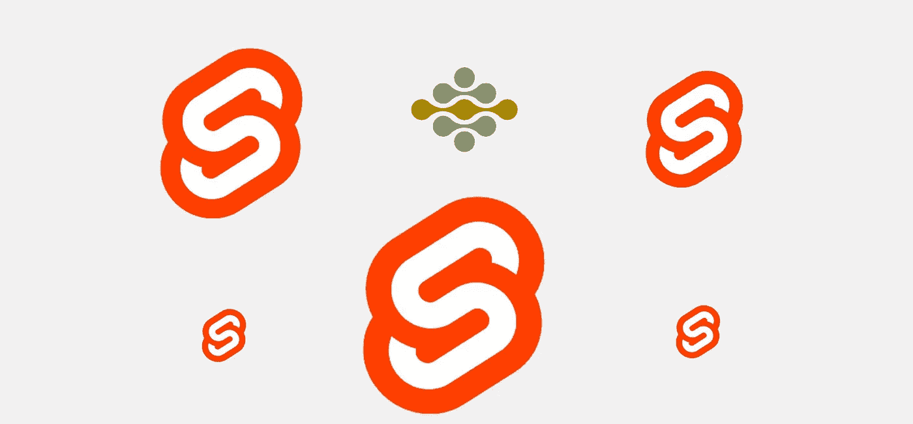

# 简单纤薄的微型前端，带讲台

> 原文：<https://levelup.gitconnected.com/easy-svelte-micro-frontends-with-podium-34aa949bed02>

想要直接进入代码吗？

[](https://github.com/Jozzeh/podium-svelte-example) [## jozzeh/讲台-苗条-示例

### 一个迷你苗条微前端架构使用服务器端组成与讲台。讲台文件…

github.com](https://github.com/Jozzeh/podium-svelte-example) 

Podium 使微前端的服务器端组合变得容易。某种程度上，Podium 和 Svelte 有点像——Svelte 是一个编译器，生成纯 HTML、CSS 和 JS(没有虚拟 dom)。Podium 将来自不同来源(微前端)的 HTML、CSS 和 JS 编译/组合成一个页面。

本文是系列文章的一部分。其他文章有…
[*指挥台:服务器端组成的微前端简介*](https://medium.com/@jozzeh/podium-easy-server-side-micro-frontends-385f3a4cd346)[*反应微前端与指挥台*](https://medium.com/@jozzeh/react-micro-frontends-with-podium-dd832075d924)[*微前端与 VueJS &指挥台*](https://medium.com/@jozzeh/vue-micro-frontends-with-podium-7d4d96b36596) [*结合多个前端库与指挥台*](https://medium.com/@jozzeh/react-vue-svelte-on-one-page-with-micro-frontends-f740b3ee6979)

我们将使用讲台在一个页面上组成 2 个基本的苗条应用程序。微前端独立工作，但如果应用程序需要在运行时共享一些数据，我们将使用讲台事件总线。


代码的结果

## 纤细的微型前端(吊舱)

我们需要 3 个文件夹… 1 个用于基本应用程序，2 个用于苗条的微前端。在每个微前端，运行“npx degit sveltejs/template”命令。

在创建了这两个苗条的应用程序之后，我们需要对模板代码做一些小的修改。这些变化将确保苗条的应用程序在放在一个页面上时能够很好地工作。

**渲染 div**

Svelte 呈现应用程序的 div 应该是唯一的。

在标准安装中，两个瘦应用程序都在 de“body”元素中呈现 App 组件。当我们将两个苗条的应用程序结合在一个页面上时，我们不能让两个应用程序覆盖身体的 innerHTML。我们需要向 index.html 添加一个具有唯一名称的 div，然后将该 div 作为渲染目标。

public/index.html

```
<body>
  <div id="svelte-message"></div>
</body>
```

在 body 标记中添加一个具有唯一 ID 的新 div。
打开 src/main.js 文件

```
import App from './App.svelte';
const app = new App({
  target: document.querySelector( '#svelte-message' )
});
export default app;
```

将 querySelector 函数中的 ID 作为目标，以匹配 public/index.html 文件中的 div ID。

就这样…现在，你可以开发苗条的应用程序了。

**提示:CSS 方法论**

当两个或更多的应用程序走到一起时，应用程序的 CSS 也被添加和加载。如果在不同的应用程序中使用相同的 CSS 类名，组件 CSS 将被覆盖。

苗条应用程序中的 CSS 是有作用域的，所以作为开发人员，我们被宠坏了…然而，一些 CSS 文件可能不是特定于组件的。(模板中有一个全局 CSS 文件。)

建议使用 [BEM 方法](https://en.bem.info/methodology/)或为这些非组件 CSS 文件的每个 CSS 类使用额外的前缀。前缀可以是应用程序的名称，用于“限定范围”或“命名空间”CSS 类。

## 创建讲台脚架

讲台布局(页面)需要 3 样东西来组合微前端:

1.  超文本标记语言
2.  CSS 文件
3.  JS 文件

Podlet 生成一个 manifest.json 文件，该文件规定了布局可以从哪里获取文件。

首先，添加所需的包

```
npm install express @podium/podlet @podium/browser
```

接下来，在项目的根目录下创建一个文件(我称之为 mine podlet.js ),导入必要的包并从 podlet 的定义开始。

```
const express = require("express");
const Podlet = require("@podium/podlet");
const fs = require("fs");const app = express();*// Basic definition of the podlet* const podlet = new Podlet({
  name: "svelteMessagePod", *// required* version: "0.1.0", *// required* pathname: "/", *// required* manifest: "/manifest.json", *// optional* development: true, *// optional, defaults to false* });
```

Svelte 将捆绑的 JS 和 CSS 文件放在公共文件夹中的一个 build 文件夹中。通过使用 NodeJS 的文件系统模块，我们可以读取目录内容并将 JS 和 CSS 文件添加到 Podlet 中。

```
*// All css and js files in the build folder should be added to the podlet definition.* let svelteassets = fs.readdirSync('public/build');svelteassets.forEach((element, index) => {
  if(
  element.indexOf('.css') !== -1 && element.indexOf('.css.map') === -1
  ){
  podlet.css({ value: "http://localhost:7100/build/" + element });
  }else if(
  element.indexOf('.js') !== -1 && element.indexOf('.js.map') === -1
  ) {
  podlet.js({ value: "http://localhost:7100/build/" + element, defer: true });
  }
});*// create a static link to the files for demo purposes.
// In production the localhost URL should be a URL going to a CDN or static file hosting.* app.use("/build", express.static("public/build/"))
```

正如评论所说，静态文件的 CDN 是必要的。出于演示的目的，我从本地服务器提供文件。

脚本以 HTML 的定义和清单的生成结束。

```
*// add HTML to send. This is the div ID in public/index.html* app.get(podlet.content(), (req, res) => {
  res.status(200).podiumSend('<div id="svelte-message"></div>');
});*// generate the podlet manifest* app.get(podlet.manifest(), (req, res) => {
  res.status(200).send(podlet);
});*//start the app at port 7100* app.listen(7100);
```

## 讲台布局——结合苗条的应用程序

组合苗条的应用程序不是苗条的特定…它只是创建一个布局的讲台方式(包含微前端的页面)。

以下是创建布局的文档:【https://podium-lib.io/docs/layout/getting_started 

NodeJS 代码注册了这两个 podlets，并将它们呈现在一个页面上。
(基础 app/layout.js)

## 结论

不需要太多的改变，我们可以完全独立地开发苗条的应用程序。
讲台 Podlet 层完全独立于应用程序。作为一名开发者，你可以自由地以你喜欢的方式创建你苗条的微前端。

[](https://github.com/Jozzeh/podium-svelte-example) [## jozzeh/讲台-苗条-示例

### 一个迷你苗条微前端架构使用服务器端组成与讲台。讲台文件…

github.com](https://github.com/Jozzeh/podium-svelte-example) 

**一些外卖**

微前端架构还是需要团队互相沟通的。尤其是当一个新项目开始的时候。新团队/项目应该与其他团队保持一致，在 HTML 或 CSS 中没有冲突。

如果开发人员在项目之间切换，公共文件夹结构和包会非常方便。在所有微前端中保持一致的用户界面是一个挑战。开源组件库或定制设计系统可能是 UI 不一致的解决方案。

*本文是关于流行框架和库的微前端系列文章的一部分。以下是其他文章:*

[*指挥台:服务器端组成微前端*](https://medium.com/@jozzeh/podium-easy-server-side-micro-frontends-385f3a4cd346)[*反应微前端与指挥台*](https://medium.com/@jozzeh/react-micro-frontends-with-podium-dd832075d924)[*微前端与 VueJS &指挥台*](https://medium.com/@jozzeh/vue-micro-frontends-with-podium-7d4d96b36596) [*结合多个前端框架&库与指挥台*](https://medium.com/@jozzeh/react-vue-svelte-on-one-page-with-micro-frontends-f740b3ee6979)



多个细长徽标，中间有一个领奖台徽标

[](https://skilled.dev) [## 编写面试问题

### 一个完整的平台，在这里我会教你找到下一份工作所需的一切，以及…

技术开发](https://skilled.dev)