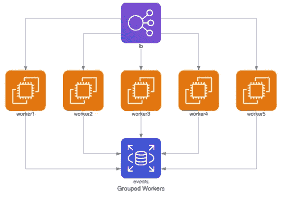

# 数据工程师易于生成的图表

> 原文：<https://levelup.gitconnected.com/easy-to-generate-diagrams-for-data-engineers-a54af803bd72>

有些情况下，图表非常强大和有用，但同时也很烦人或者很难创建。当作为一名数据/软件工程师工作时，你不想去 PowerPoint 绘制由箭头连接的矩形来代表你的新数据流想法。您也不希望在为您已经拥有的流程编写文档时进行所有这些手工操作。如果您想直观地演示像 NoSQL 数据库交互这样的东西，它会变得更加复杂。在这篇文章中，我想概述几个非常强大的工具，它们会让你的图表生活变得更加简单。


# **作为代码的架构图**

在许多方面，您可能希望有一个过程的可视化表示。首先想到的是建筑。这可能是一个原型阶段，也可能是您想要记录的已建立的复杂工作流程。如果您的团队中没有架构师，并且您自己负责跟踪这些事情，那么您通常会希望尽可能地将它保持在您通常的编码例程中。换句话说，让代码为您绘制图表并将其保存在 Git 这样的版本控制系统中会很好。

一个名为**“diagrams”**的新 python 库正是为你做的！它允许你写一个简单的 python 代码，一旦你运行它，一个图片(在。png 或您指定的其他格式)。是不是很酷？

> 目前，它支持六大提供商:AWS、Azure、GCP、Kubernetes、阿里云和甲骨文云。以及内部节点、编程语言和框架。

它们非常新(于 2020 年 2 月首次发布)，所以附加功能和改进即将推出。

举个例子，可以用几行代码生成一个简单的 AWS 上的分组工人图，如下所示:

```
**from** diagrams **import** Diagram
**from** diagrams.aws.compute **import** EC2
**from** diagrams.aws.database **import** RDS
**from** diagrams.aws.network **import** ELB**with** Diagram(“Grouped Workers”, show=False, direction=”TB”):
     ELB(“lb”) >> [EC2(“worker1”),
                   EC2(“worker2”),
                   EC2(“worker3”),
                   EC2(“worker4”),
                   EC2(“worker5”)] >> RDS(“events”)
```



AWS 上的分组工人

图表还支持创建簇(可以无限嵌套)，为尚不支持的源添加您自己的图标，以及定制边缘(箭头)，例如，您可以更改箭头的类型、颜色以及添加标签。

下面是一个更复杂的内部服务工作流示例:

```
**from** diagrams **import** Cluster, Diagram, Edge
**from** diagrams.onprem.analytics **import** Spark
**from** diagrams.onprem.compute **import** Server
**from** diagrams.onprem.database **import** PostgreSQL
**from** diagrams.onprem.inmemory **import** Redis
**from** diagrams.onprem.logging **import** Fluentd
**from** diagrams.onprem.monitoring **import** Grafana, Prometheus
**from** diagrams.onprem.network **import** Nginx
**from** diagrams.onprem.queue **import** Kafka**with** Diagram(name=”Advanced Web Service with On-Premise (colored)”, show=False):
    ingress = Nginx(“ingress”) metrics = Prometheus(“metric”)
    metrics << Edge(color=”firebrick”, style=”dashed”) << Grafana(“monitoring”)**with** Cluster(“Service Cluster”):
    grpcsvc = [
        Server(“grpc1”),
        Server(“grpc2”),
        Server(“grpc3”)]**with** Cluster(“Sessions HA”):
    master = Redis(“session”)
    master — Edge(color=”brown”, style=”dashed”) — Redis(“replica”) << Edge(label=”collect”) << metrics
    grpcsvc >> Edge(color=”brown”) >> master**with** Cluster(“Database HA”):
    master = PostgreSQL(“users”)
    master — Edge(color=”brown”, style=”dotted”) — PostgreSQL(“slave”) << Edge(label=”collect”) << metrics
    grpcsvc >> Edge(color=”black”) >> masteraggregator = Fluentd(“logging”)
aggregator >> Edge(label=”parse”) >> Kafka(“stream”) >> Edge(color=”black”, style=”bold”) >> Spark(“analytics”)ingress >> Edge(color=”darkgreen”) << grpcsvc >> Edge(color=”darkorange”) >> aggregator
```


内部部署的高级 Web 服务(带颜色和标签)

你可以在这里阅读更多关于[的相关图表。](https://diagrams.mingrammer.com/)

# **作为代码的 SQL 图表**

对于 SQL，您可以使用多种资源，但是我非常喜欢使用这个免费且简单的工具来绘制实体关系图，称为 [DB Diagram](https://dbdiagram.io/home) 。使用下面的代码，您可以生成 7 个具有指定字段、数据类型和关系的表:

```
//// — LEVEL 1
//// — Tables and References
// Creating tablesTable users as U {
    id int [pk, increment] // auto-increment
    full_name varchar
    created_at timestamp
    country_code int
}Table countries {
    code int [pk]
    name varchar 
    continent_name varchar
}// Creating references
// You can also define relaionship separately
// > many-to-one; < one-to-many; — one-to-oneRef: U.country_code > countries.code
Ref: merchants.country_code > countries.code// — — — — — — — — — — — — — — — — — — — — — — — ////// — LEVEL 2
//// — Adding column settingsTable order_items {
    order_id int [ref: > [orders.id](http://orders.id/)] // inline relationship (many-to-one)
    product_id int
    quantity int [default: 1] // default value
}Ref: order_items.product_id > [products.id](http://products.id/)Table orders {
    id int [pk] // primary key
    user_id int [not null, unique]
    status varchar
    created_at varchar [note: ‘When order created’] // add column note
}// — — — — — — — — — — — — — — — — — — — — — — — ////// — Level 3
//// — Enum, Indexes
// Enum for ‘products’ table belowEnum products_status {
    out_of_stock
    in_stock
    running_low [note: ‘less than 20’] // add column note
}// Indexes: You can define a single or multi-column indexTable products {
    id int [pk]
    name varchar
    merchant_id int [not null]
    price int
    status products_status
    created_at datetime [default: `now()`] Indexes {
        (merchant_id, status) [name:’product_status’]
        id [unique]
    }
}Table merchants {
    id int
    country_code int
    merchant_name varchar
    “created at” varchar
    admin_id int [ref: > U.id]

    Indexes {
       (id, country_code) [pk]
    }
}Table merchant_periods {
    id int [pk]
    merchant_id int
    country_code int
    start_date datetime
    end_date datetime
}Ref: products.merchant_id > [merchants.id](http://merchants.id/) // many-to-one//composite foreign keyRef: merchant_periods.(merchant_id, country_code) > merchants.(id, country_code)
```


来自 dbdiagram.io 的示例图

一个非常有用的特性是能够与您获得的输出进行交互。例如，当您将鼠标悬停在某个特定的表格上时，它会向您显示相关的关系和有用的详细信息。


dbdiagram.io 中带有突出显示的依赖关系的示例图

这些图表也很容易共享和下载。

# **AWS Neptune gremlin 查询图**

最后但同样重要的还有 [AWS 海王星](https://aws.amazon.com/neptune/)观想。对于那些不熟悉 Neptune 的人来说，它是一个为云构建的快速可靠的图形数据库。可以使用 [Gremlin 查询语言](https://tinkerpop.apache.org/gremlin.html)或者 [SPARQL](https://www.w3.org/TR/rdf-sparql-query/) 进行查询。不仅可以看到节点/边列表的输出，同时还可以可视化交互，这很棒。我发现视觉数据更容易理解，尤其是在复杂的数据通信中。直到最近，AWS 还不支持它，但在 2020 年 8 月，这项新功能发布了！现在，当使用 [Neptune Workbench](https://docs.aws.amazon.com/neptune/latest/userguide/notebooks.html) (预配置的 [AWS SageMaker](https://aws.amazon.com/sagemaker/) 实例)时，您几乎无需任何额外的努力就可以做到这一点。

> Neptune workbench 为任何返回路径的 Gremlin 查询创建查询结果的可视化。要查看可视化效果，您可以在运行查询后选择控制台选项卡右侧的 Graph 选项卡。
> 
> 您可以使用查询可视化提示来控制可视化工具绘制查询输出的方式。这些提示遵循 *%%gremlin* 单元格魔术，并以— path-pattern(或其简称，-p)参数名开头:

```
%%gremlin -p comma-separated hints
```

使用创建 Neptune 工作台时提供的样本数据集，您可以运行多个有趣的查询来体验新特性。在这里，我想和你分享一个由 Kelvin Lawrence 在他最近的文章中创造的例子，他在文章中详细解释了这个概念。

以下 Gremlin 查询获取以新西兰为起点、以澳大利亚为终点的所有路线。

```
%%gremlin -p v,inv g.V().has('country','NZ').out('route').has('country','AU').path().by('city')
```


在图表选项卡上找到的路线

[下面的 AWS 文档](https://docs.aws.amazon.com/neptune/latest/userguide/notebooks-visualization.html)提供了关于如何开始在 AWS Neptune 中使用 Gremlin 的更多细节。

有许多资源可以让你的生活变得更轻松，新技术也比以往任何时候都更快地进入市场。还有很多更有用的工具，我很乐意知道哪些对你有用！