# 容易掌握 TypeScript 中的泛型

> 原文：<https://levelup.gitconnected.com/easy-to-master-the-generics-in-typescript-c288e2995bc6>


## 为什么我需要一个泛型？

> 软件工程的一个主要部分是构建组件，这些组件不仅要有定义良好且一致的 API，还要可重用。能够处理今天的数据和明天的数据的组件将为您提供构建大型软件系统的最灵活的能力。
> 
> 在像 C#和 Java 这样的语言中，工具箱中用于创建可重用组件的主要工具之一是*泛型*，也就是说，能够创建一个可以在多种类型而不是单一类型上工作的组件。这允许用户消费这些组件并使用他们自己的类型。

上面官方的解释对于初学者来说很难理解。

我认为初学者首先应该明白为什么需要泛型，它解决了什么问题。而不是看这种议论文式的定义。

让我们看一个像这样的例子，感受一下泛型解决的问题。

定义一个`print` 函数，打印出传入的参数并返回它。传入参数是字符串类型，函数返回字符串。

```
function print(arg:string):string {
    console.log(arg)
    return arg
}
```

现在要求改变了，我仍然需要打印号码类型，我能做什么？

您可以使用联合类型进行转换。

```
function print(arg:string | number):string | number {
    console.log(arg)
    return arg
}
```

现在要求又变了，我还需要打印字符串数组，数字数组，甚至任何类型，该怎么办？

有一种愚蠢的方法可以编写尽可能多的受支持的联合类型。

或者将参数类型改为`any`。

```
function print(arg:any):any {
    console.log(arg)
    return arg
}
```

不是说写`any` 类型不好，毕竟尽量不要在 TypeScirpt 里面写`any` 。

而这不是我们想要的结果，只能说传入值是 any 类型，传出值是 any 类型，传入值和返回值不统一。

甚至还有这样的 bug:

```
const res:string = print(123)
```

定义一个字符串类型来接收打印函数的返回值返回一个数字类型，TS 并没有向我们报错。

这就是泛型的用武之地，它们可以轻松解决输入输出一致的问题。

> 注意:Generic 不是为解决这一问题而设计的。泛型还解决了许多其他问题，这里用这个例子引出泛型。

## 泛型的基本用法

1.  **处理功能参数**

泛型类型的语法是将类型参数写在<>中，一般可以表示为 t。

```
function print<T>(arg:T):T {
    console.log(arg)
    return arg
}
```

这样，我们实现了输入输出的统一类型，可以输入输出任何类型。

泛型类型中的 T 就像一个占位符或变量，当与已定义的类型一起使用时，可以像参数一样传入，也可以按原样输出。

> 泛型的编写方式对于前端工程师来说有点奇怪，比如<> T，但是最好记住，只要你一看到<>，就知道它是一个泛型。

当我们使用它时，有两种方法可以指定类型。

*   定义要使用的类型
*   TS 类型推断来自动派生类型

```
print<string>('hello')  // Define T as string
print('hello')  
// TS type inference, automatic derivation of the type string
```

我们知道，类型和接口都可以定义函数类型，所以我们也用通用术语来写。

```
type Print = <T>(arg: T) => T
const printFn:Print = function print(arg) {
    console.log(arg)
    return arg
}
```

界面这样写。

```
interface Iprint<T> {
    (arg: T): T
}
function print<T>(arg:T) {
    console.log(arg)
    return arg
}
const myPrint: Iprint<number> = print
```

**2。默认参数**

如果你想给一个泛型类型添加默认参数，你可以这样写。

```
interface Iprint<T = number> {
    (arg: T): T
}
function print<T>(arg:T) {
    console.log(arg)
    return arg
}
const myPrint: Iprint = print
```

所以默认是数字类型，怎么样，感觉 T 像不像函数参数？

**3。处理多个功能参数**

现在有一个函数传入一个只有两项的元组，交换元组的项 0 和项 1，返回元组。

```
function swap(tuple) {
    return [tuple[1], tuple[0]]
}
```

这样写，我们失去了类型，用一个泛型类型对它进行了一点转换。

我们用 T 表示 0 项的类型，U 表示 1 项的类型。

```
function swap<T, U>(tuple: [T, U]): [U, T]{
    return [tuple[1], tuple[0]]
}
```

这使得能够控制元组项目 0 和项目 1 类型。

**4。功能副作用操作**

泛型不仅便于将参数类型约束到函数中，而且对于执行副作用操作的函数也是如此。

例如，我们有一个通用的异步请求方法，它希望基于不同的 url 请求返回不同类型的数据。

```
function request(url:string) {
    return fetch(url).then(res => res.json())
}
```

调用一个接口来获取用户的信息。

```
request('user/info').then(res =>{
    console.log(res)
})
```

返回结果 res 是一个`any`类型，很烦。

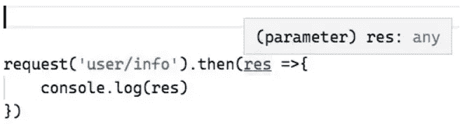

我们希望 API 调用清楚返回类型是什么数据结构，所以我们可以这样做。

```
interface UserInfo {
    name: string
    age: number
}
function request<T>(url:string): Promise<T> {
    return fetch(url).then(res => res.json())
}
request<UserInfo>('user/info').then(res =>{
    console.log(res)
})
```

这使得获取接口返回的数据类型变得非常容易，并且使得开发更加高效。

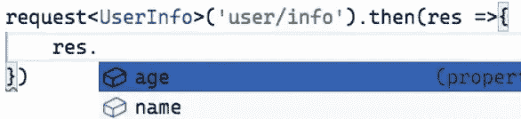

## 约束泛型

假设现在有这样一个函数，打印传入参数的长度，我们这样写。

```
function printLength<T>(arg: T): T {
    console.log(arg.length)
    return arg
}
```

因为不确定 T 是否具有长度属性，所以会报告一个错误。

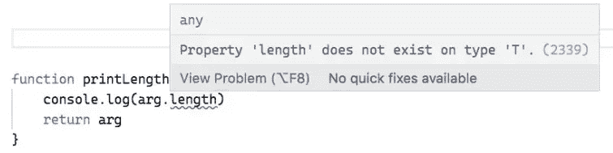

所以现在我想约束泛型类型，它必须有一个长度属性，我该怎么做？

您可以将它与 interface 结合起来约束类型。

```
interface ILength {
    length: number
}

function printLength<T extends ILength>(arg: T): T {
    console.log(arg.length)
    return arg
}
```

这里的关键是`<T extends ILength>`，它允许泛型从接口`ILength` 继承，这样它就可以约束泛型。

我们定义的变量必须有`length` 属性，比如下面的`str`、`arr` 和`obj` ，才能通过 TS 编译。

```
const str = printLength('lin')
const arr = printLength([1,2,3])
const obj = printLength({ length: 10 })
```

这个例子也重申了接口的`duck typing`。

只要你有`length` 属性，你就符合约束，所以你是`str`、`arr`还是`obj`都没关系。

当然，如果我们定义一个不包含`length` 属性的变量，比如一个数字，它会报告一个错误:

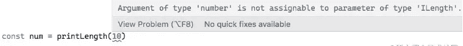

## 泛型的一些应用

使用泛型类型，您可以定义函数、接口或类，而无需事先指定特定的类型，而是在使用时指定类型。

1.  **通用约束类**

用两种方法定义一个栈，栈内和栈外。如果你希望栈内和栈外元素是统一的类型，你可以这样写。

```
class Stack<T> {
    private data: T[] = []
    push(item:T) {
        return this.data.push(item)
    }
    pop():T | undefined {
        return this.data.pop()
    }
}
```

当定义实例时，写类型，例如，如果栈内和栈外都是 number 类型，那么写这个。

```
const s1 = new Stack<number>()
```

这样，堆叠字符串将会报告错误。

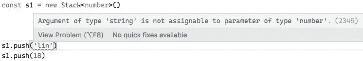

这是非常灵活的，如果需求发生变化，并且传入和传出堆栈是`string` 类型，只需在定义实例时更改它。

```
const s1 = new Stack<string>()
```

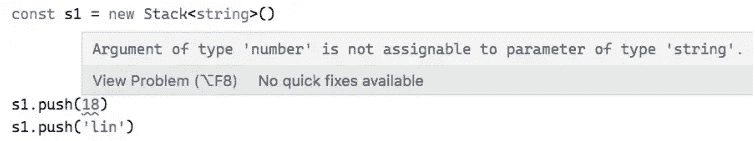

特别要注意，泛型不能约束类的静态成员。

为 pop 方法定义 static 关键字会报告一个错误:

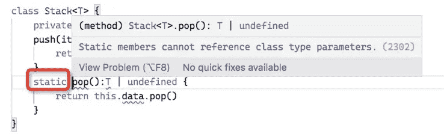

**2。通用约束接口**

使用泛型，您还可以调整接口，使其更加灵活。

```
interface IKeyValue<T, U> {
    key: T
    value: U
}

const k1:IKeyValue<number, string> = { key: 18, value: 'lin'}
const k2:IKeyValue<string, number> = { key: 'lin', value: 18}
```

**3。通用定义数组**

定义一个数组，就像我们之前写的那样。

```
const arr: number[] = [1,2,3]
```

现在也可以这样写。

```
const arr: Array<number> = [1,2,3]
```

数组项类型错误，报告了错误

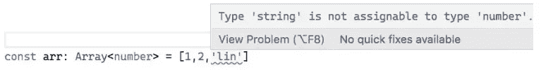

## 后端接口参数类型的实用、通用约束

让我们看看泛型类型的一种用法，它对项目开发非常有帮助，约束后端接口参数类型。

```
import axios from 'axios'

interface API {
    '/book/detail': {
        id: number,
    },
    '/book/comment': {
        id: number
        comment: string
    }
    ...
}

function request<T extends keyof API>(url: T, obj: API[T]) {
    return axios.post(url, obj)
}

request('/book/comment', {
    id: 1,
    comment: 'great!'
})
```

这样，当调用接口时会有提醒，例如

写入了错误的路径:

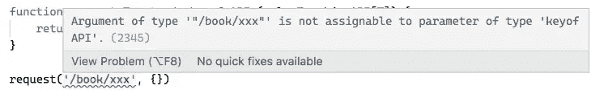

传递了错误的参数类型:

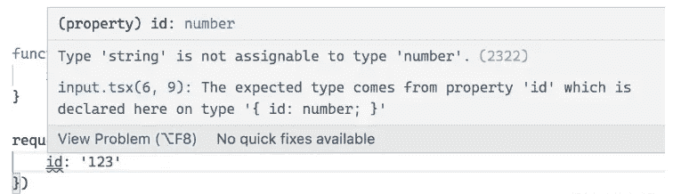

传递的参数少于:

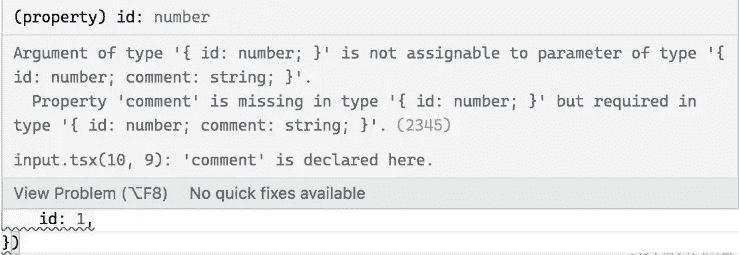

## 摘要

从字面上看，泛型是广义的。
通用类型是在没有预先指定具体类型的情况下定义的函数、接口或类，而是在使用时指定类型。
泛型类型中的 T 就像一个占位符，或者变量，在使用的时候可以像参数一样在定义的类型中传递，可以按原样输出。
泛型类型提供了成员之间有意义的约束，可以是:函数参数、函数返回值、类的实例成员、类的方法等。

如果你对我的文章感兴趣，可以关注我的[媒体](https://hyhwell.medium.com/)或[推特](https://twitter.com/Maxwell_hyh)。

[](/making-it-easier-to-get-started-with-typescript-a39dc2abffd9) [## 使开始使用 TypeScript 变得更加容易

### TypeScript 中的函数定义、类和继承

levelup.gitconnected.com](/making-it-easier-to-get-started-with-typescript-a39dc2abffd9) [](https://javascript.plainenglish.io/one-article-to-understand-typescript-object-oriented-59346983c466) [## 理解面向对象的类型脚本的一篇文章

### 理解静态属性、静态方法、多态、抽象类和接口定义

javascript.plainenglish.io](https://javascript.plainenglish.io/one-article-to-understand-typescript-object-oriented-59346983c466) [](/10-advanced-typescript-tips-for-development-2666298d50f) [## 用于开发的 10 个高级打字技巧

### 高级打字技巧

用于开发高级打字稿 Tipslevelup.gitconnected.com](/10-advanced-typescript-tips-for-development-2666298d50f)