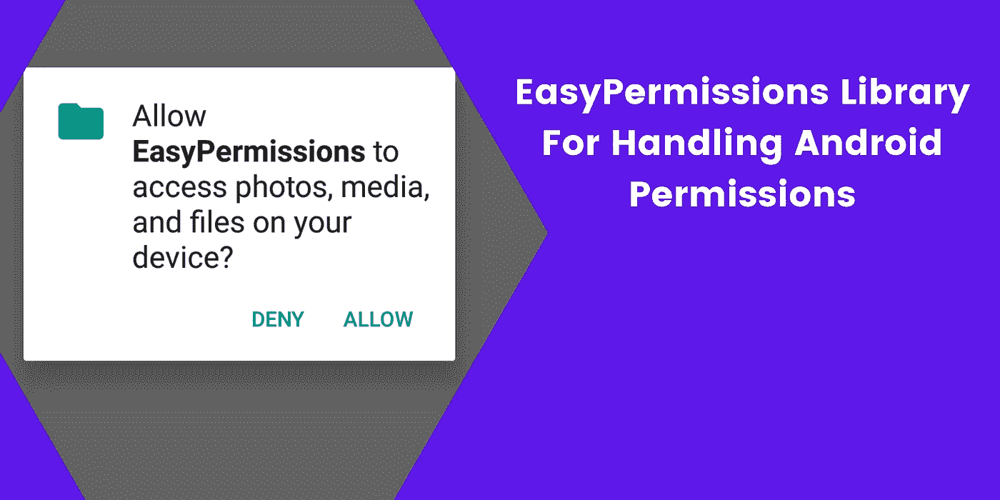

# EasyPermissions 库:Android 中如何处理运行时权限？

> 原文：<https://levelup.gitconnected.com/easypermissions-library-how-to-handle-runtime-permission-in-android-b552a9086da>



> 最近有人向我介绍了 Android 版的 EasyPermissions 库，我很喜欢这个事实，它实际上非常容易使用，只需要几行代码就可以了。该库为您处理运行时权限！

我将在这里创建一个简单的应用程序，向您展示如何使用这个库。该应用程序由一个按钮和一个图像视图的屏幕/活动组成，当用户单击该按钮时，我们希望打开一个照片选择器，并访问他/她的手机上的照片。然后，当用户选择一张照片时，我们将在 imageView 中显示该照片。为了做到这一点，我们必须在访问照片之前征求用户的许可。

因此，让我们从将库依赖项添加到 build.gradle 文件(模块:app)开始。

```
dependencies {
    // For developers using AndroidX in their applications
    implementation 'pub.devrel:easypermissions:3.0.0'

    // For developers using the Android Support Library
    implementation 'pub.devrel:easypermissions:2.0.1'
}
```

这是到撰写本文时为止，为使用 AndroidX 和仍在使用 Android 支持库的开发人员提供的最新依赖版本。但是，您可以通过以下链接查看该图书馆:

[](https://github.com/googlesamples/easypermissions) [## Google samples/easy 权限

### EasyPermissions 是一个包装器库，用于在针对 Android M 或更高版本时简化基本的系统权限逻辑…

github.com](https://github.com/googlesamples/easypermissions) 

同步您的项目 gradle 文件后，现在我们将开始编写代码，允许我们使用 EasyPermissions 库请求用户的许可。

因此，创建一个带有单个按钮和单个 imageView 的活动，如下面的 xml 代码所示:

现在，在 MainActivity 中，我将实现 EasyPermissions。PermissionCallbacks 接口。在我的例子中，我将在活动中使用它，但是如果你使用一个片段，同样的代码也适用。

您将得到一个错误，因为您需要覆盖该接口的三个方法，它们是 onRequestPermissionsResult、onPermissionsGranted 和 onPermissionsDenied。只需在 Windows 中点击 alt + enter，或者在 Mac 中点击 option + enter，就会弹出一个窗口，要求你实现方法，然后点击实现方法。


这里有三种方法，我们将重点介绍其中的两种。第一个是 onRequestPermissionsResult 方法，第二个是 onPermissionsDenied，我们将添加如下所示的代码。但是，我将保持原样。

现在当用户点击按钮时，一个名为 openPhotoPicker 的方法将被如下调用。我还将声明一个请求代码常量，并将其命名为***READ _ STORAGE _ PERMISSION _ REQUEST***并赋予其值 123。此外，我将声明另一个常量***PICK _ IMAGE _ REQUEST***，当我在 openPhotoPicker 方法中调用 startForActivityResult 时将传递该常量。

在 openPhotoPicker 方法中，我们将确保请求用户的许可。就在方法上方添加注释@AfterPermissionGranted()，并将我们刚刚创建的常量放在括号内。在该方法中声明一个名为 permission 的字符串变量，并选择您希望用户授予您的权限。在这种情况下，我们希望 manifest . permission .***READ _ EXTERNAL _ STORAGE***。

正如你所看到的，它非常容易使用，你创建一个权限变量，然后使用“如果条件”来检查以下是否容易权限。*has permissions*(get activity()，permission))为真，则继续该方法，否则使用 EasyPermissions 请求用户的许可。 *requestPermissions 并传递上下文、****READ _ STORAGE _ PERMISSION _ REQUEST****、PERMISSION 变量，以及您希望在权限对话框中显示给用户的消息字符串。在我们的例子中，消息是* **“我们的应用程序需要权限才能访问您的存储”。**

现在，只有当我们有用户权限，我们将打开照片选择器，用户将能够选择一张照片。用户选择的照片将在 onActivityResult 中返回。当我们得到***PICK _ IMAGE _ REQUEST***的 requestCode 和 resultCode 为 ***RESULT_OK***

我们可以通过调用 data.getData()方法来获取选择的照片 uri

您可以对这个选择的照片 uri 做任何您想做的事情，比如在 imageView 中显示它。简单来说，你可以使用 Glide 库来显示它，如代码所示。如果您想使用 Glide 库，请将此依赖项添加到您的项目中:

```
dependencies {
  implementation 'com.github.bumptech.glide:glide:4.11.0'
  annotationProcessor 'com.github.bumptech.glide:compiler:4.11.0'
}
```

最后，不要忘记将读取外部存储权限添加到 AndroidManifest.xml 文件中。

```
<**uses-permission android:name="android.permission.READ_EXTERNAL_STORAGE"** />
```

下面是完成所有步骤后的 MainActivity 代码:

这是应用程序的行为方式:


目前就这些。试着用 EasyPermissions 库来处理你的 Android 权限吧！