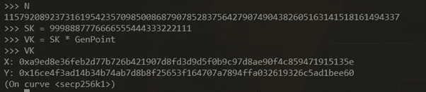

# ECDSA —如何以编程方式对事务进行签名

> 原文：<https://levelup.gitconnected.com/ecdsa-how-to-programmatically-sign-a-transaction-95eec854bca7>

## 加密系列 IV——ECDSA 解释道:我们将获取一条消息并完成 ECD sa 签名的所有步骤——ECD sa 签名是区块链最常用的数字签名算法

如果你在区块链的空间，几乎可以肯定，你听说过 ECDSA。ECDSA 代表**椭圆曲线数字签名算法**，使用椭圆曲线加密技术。

ECDSA 是比特币使用的签名方案。每个比特币地址(你用来收发资金的那个)都是 ECDSA 公钥的加密哈希。你可以查看这篇 [**文章，了解更多关于加密哈希**](/the-heart-of-blockchains-hash-functions-501d0b32762b) 的知识。

对于这篇 ECDSA 文章，我们将遵循以太坊的以太坊库的方法。

ECDSA 还用于区块链以外的许多其他应用。比如苹果生态系统广泛使用 ECDSA，它是 iOS 的主要签名机制之一；在 iMessage，iCloud 等等都有使用。

## **ECDSA VS RSA**

为什么我们已经有了 RSA(非对称加密的黄金标准),还需要 ECDSA？

好吧，碰巧破解一个 RSA 密钥需要分解 2 个大素数(我们在这里 讨论过 RSA 的 [**素数分解)。我们在这方面做得越来越好，这需要有越来越大的 RSA 密钥。**](/decoding-the-rsa-algorithm-ecc5caca1392)

另一方面，破解 ECDSA 需要求解椭圆曲线离散对数问题(ECDLP)，难度要大得多。这意味着，使用 ECDSA，我们可以拥有与 RSA 相同的安全级别，但使用更小的密钥，这意味着更少的数据，从而转化为更快的交易(这在区块链非常重要)。要破解 ECDSA，您必须猜测椭圆曲线上的一个点，该点是由一个大的随机数[生成的。](/random-numbers-the-single-most-important-thing-in-blockchain-e850d4e23a51)

## **让我们一步步与 ECDSA 签订交易！**

现在请和我一起浏览 ECDSA 的交易签名。我保证你读这篇文章会很开心😇。这是区块链和密码学中的一个基本功能。不像巧克力那么重要……但仍然是必不可少的。

你还记得以前的*密码学系列* [**文章里我们讲过 RSA**](/decoding-the-rsa-algorithm-ecc5caca1392) ，爱丽丝和鲍勃分享并签署一条消息吗？现在，我们将进行 ESDSA 数字签名(为冗余道歉)，我们将以编程方式进行！😍


要签署交易，用户需要遵循几个步骤。更准确地说，用户的钱包或软件会做这件事，而不是真正的用户。令人欣慰的是，签署交易的复杂过程几乎是无缝和自动的。从用户体验的角度来看，只需要按一个按钮。然而，我们想知道幕后是什么，以及交易实际上是如何签名和验证的。

发送的任何交易都必须签名，我们可以随时检查签名的有效性以及是谁签名的。

在我们的例子中，发送者将使用**签名密钥**对消息进行签名，将消息与签名打包并发送给接收者。然后，接收者将接受签名并用**验证密钥**验证消息。

为了与 ECDSA 签署交易，我们将使用推荐的 192 位椭圆曲线域参数，更具体地说是 secp192k1 的参数，这些参数可以在 Daniel R. L. Brown 的“ [SEC 2:推荐的椭圆曲线域参数](https://www.secg.org/SEC2-Ver-1.0.pdf)”中找到，这些参数是由 SECG 开发的行业标准的一部分—高效加密标准组。如果你对密码学感兴趣，这是一个非常有用的文档。我们将需要回到[第 2 节:推荐的椭圆曲线域参数](https://www.secg.org/SEC2-Ver-1.0.pdf)来获取构建 ECDSA 的参数。

开始吧！😊

让我们一步一步地进行签名、发送消息和用 ECDSA 验证消息。首先，让我们使用 Python3 命令提示符。如果你没有安装 Python3，请继续操作[安装 Python](https://www.python.org/downloads/) 。然后，您将能够在命令提示符下运行它(当您在 Windows 搜索栏中键入“cmd”时，会弹出黑屏)。如果你有一台 Ubuntu 机器，这可能会更好。

好的，一旦你安装了 python 并且命令提示符打开，输入“python”来运行你的命令 Python 命令行。

现在让我们导入 Keccak。Keccak-256 是以太坊采用的 **SHA3 算法**的变种。

让我们通过运行命令来确保您拥有 libgmb3 和 fastecdsa 库

```
sudo apt install gcc python-dev libgmp3-devpip3 install fastecdsa
```

首先，我们将从加密哈希库(是的，这基本上是一个加密哈希库)导入 Keccak。让我们通过运行以下命令来实现这一点:

```
from Crypto.Hash import keccak
```

让我们添加从 secp192k1 的推荐参数文档中提取的椭圆曲线域参数，作为“Pcurve”和我们要用来签名的椭圆曲线的 N 余因子。


您可以在本文档部分找到这些值，但我将把它们复制到下面，以使您的生活更轻松。

它们都是大素数，并且它们是私钥的条件的一部分。在 python3 控制台中，键入:

```
Pcurve = 2**256–2**32–2**9–2**8–2**7–2**6–2**4–1
```

它与下面的十六进制符号相同

然后添加

```
N = 0xFFFFFFFFFFFFFFFFFFFFFFFFFFFFFFFEBAAEDCE6AF48A03BBFD25E8CD0364141
```

我们的私钥将在从 1 到 n 的范围内。

现在，添加以下内容:

```
Ac = 0Bc = 7Gx = 0x79BE667EF9DCBBAC55A06295CE870B07029BFCDB2DCE28D959F2815B16F81798Gy = 0x483ADA7726A3C4655DA4FBFC0E1108A8FD17B448A68554199C47D08FFB10D4B8
```


这些是我们将用来生成公钥和私钥的参数。

我们还需要导入两个函数，egcd(扩展欧几里德算法的最大公约数除法器函数)和模逆函数:

```
def egcd(a, b):
     if a == 0:
          return (b, 0, 1)
     else:
          g, y, x = egcd(b % a, a)
          return (g, x - (b // a) * y, y)
     def modinv(a, m):
          g, x, y = egcd(a, m)
          if g != 1:
               raise Exemption('modular inverse does not exist')
          else: return x % m
```

你也可以在这里找到脚本:[https://gist . github . com/Bitatlas/4 a6fa 3742713 f 50 c 07 ed 6 a6 AE 78 BD 94](https://gist.github.com/Bitatlas/4a6fa3742713f50c07ed6aa6ae78bd94)

注意:如果你在 Python 脚本中发现任何错误，86.8%的情况都与缩进有关。缺口必须正确对齐。


一旦您导入了这两个函数，我们将需要添加以下导入:

```
from fastecdsa.curve import Curvefrom fastecdsa.point import Pointfrom fastecdsa.curve import secp256k1
```


这些是我们签署消息所需的所有库和参数推荐值！


太好了，我们现在有了开始 ECDSA 签名所需的一切！

让我们从签名信息“**我爱区块链**”开始，如下所示:

```
keccak.new(data=b’I LOVE BLOCKCHAIN’, digest_bits=256).hexdigest()
```


好了，我们刚收到消息散列。

让我们使用下面的命令创建一个变量 msgHash。请注意，我们添加“0x”只是为了用十六进制表示值。

```
msgHash = ‘0x’ + keccak.new(data=b’I LOVE BLOCKCHAIN’, digest_bits=256).hexdigest()
```

我们要做的下一件事是创建一个生成器点，这将有助于创建验证密钥。验证密钥将通过签名密钥与生成器点相乘来创建。

```
GenPoint = Point(Gx, Gy, curve=secp256k1)
```


如果我们打印输出 GenPoint，我们会看到我们的**椭圆曲线**的 X 和 Y，这是以太坊和比特币中使用的同一条曲线。

现在我们需要创建一个签名密钥和验证密钥。签名密钥是通过创建一个随机数生成的(这就是为什么创建真正的随机数[](/random-numbers-the-single-most-important-thing-in-blockchain-e850d4e23a51)**)所以我们可以随机创建一个比 n 小的数。然后，我们通过将签名密钥乘以 GenPoint 来创建验证密钥。然后我们会得到这个:**

****

**接下来，我们需要 X 和 Y，另一个点，它需要是一个随机数。 [**一个数越随机，越 N 安全**](/random-numbers-the-single-most-important-thing-in-blockchain-e850d4e23a51) 。我们可以在键盘上键入一个“随机”数字，但是让我们尝试做一些事情来生成一个比这个数字更随机的数字:**

```
import randomrandom.randint(99999, 999999999999)randNum = random.randint(99999, 999999999999)
```

****

**最后，创建 XY1 点和 r:**

****

**现在让我们创造我们的“s”。注意，我们需要将 msgHash 值作为不带引号的整数使用。为此，我调用了 msgHash 并将不带引号的值再次复制粘贴到 msgHash。**

**然后我们可以创建 s:**

```
s = ((msgHash + r * SK) * modinv(randNum, N)) % N
```

****

**瞧啊。！！我们有自己的签名 r 和 s**

****

**现在，我们可以通过 ECDSA 验证过程。验证过程的条件是 r = x % N，并且每次我们想要进行新的签名时，我们需要从随机点 k*V 创建一个新的 k 作为我们椭圆曲线中的随机点(x，y)。**

**让我们来验证一下:**

```
w = modinv(s, N)u1 = msgHash * w % Nu2 = r * w % NXY2 = u1 * GenPoint + u2 * VK
```

****

**最后，我们可以进行最后的验证:**

```
r == XY2.x % N
```

****

****我们得到“真实”**！我们已成功签署并验证了一项交易！呜呜呜。是只有我，还是这是非常令人兴奋的事情？**

****

**当我们再看一次事务时，r、s 和 v，它们存在的原因以及它们在签署和验证事务中的作用就更有意义了！**

**椭圆曲线是一种强大的加密工具。当量子计算机成为现实时，它甚至可能比 RSA 更有用。ECDSA 正被广泛用于互联网和区块链应用程序，包括大多数主要的加密货币，如比特币和以太坊，都将 ECDSA 作为其工具集的一部分。**

**如果您有任何问题，请告诉我，也可以查看下面我的区块链课程，在那里我会详细解释区块链的所有加密组件。**

****🚀请关注我，也请查看我的🧱区块链课程:****

****🐶** [**有史以来第一次 Dogecoin 课程**](https://www.udemy.com/course/-dogecoin-course-the-first-complete-dogecoin-course/?referralCode=9416B1408224CE309DD8)**

****👨‍🎓** [**金融科技、云和网络安全课程**](https://www.udemy.com/course/fintech-technologies-cloud-and-cybersecurity/?referralCode=F1D4EA005A2881735A36)**

****📖**[](https://www.amazon.com/dp/B091CYTX37/ref=sr_1_1?dchild=1&keywords=unblockchain&qid=1617186443&s=digital-text&sr=1-1)**[**完整 NFTs 教程**](https://www.udemy.com/course/the-complete-nft-course-learn-everything-about-nfts/?referralCode=AAEE908D13D0E2276B19)****

******👨‍🎓** [**Unblockchain 课程**](https://www.udemy.com/course/blockchain-deep-dive-from-bitcoin-to-ethereum-to-crypto/?referralCode=B8463EE382E6D313304B) **—脑洞大开的区块链课程******