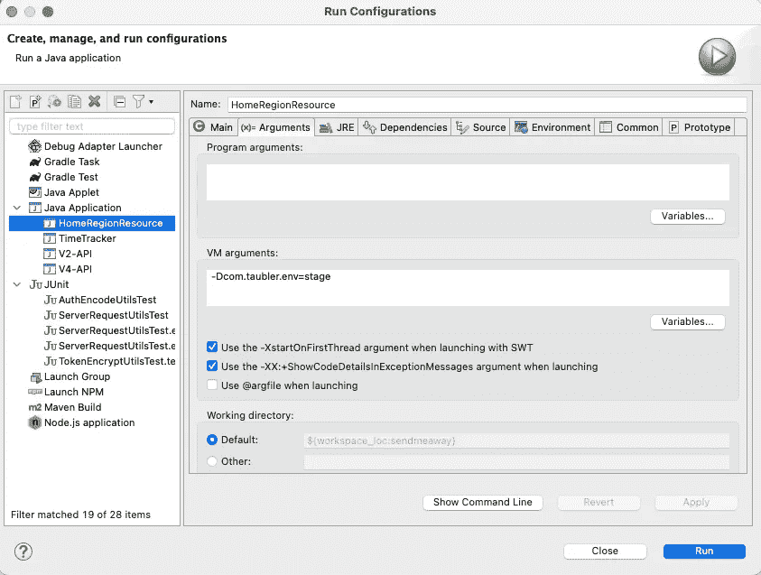
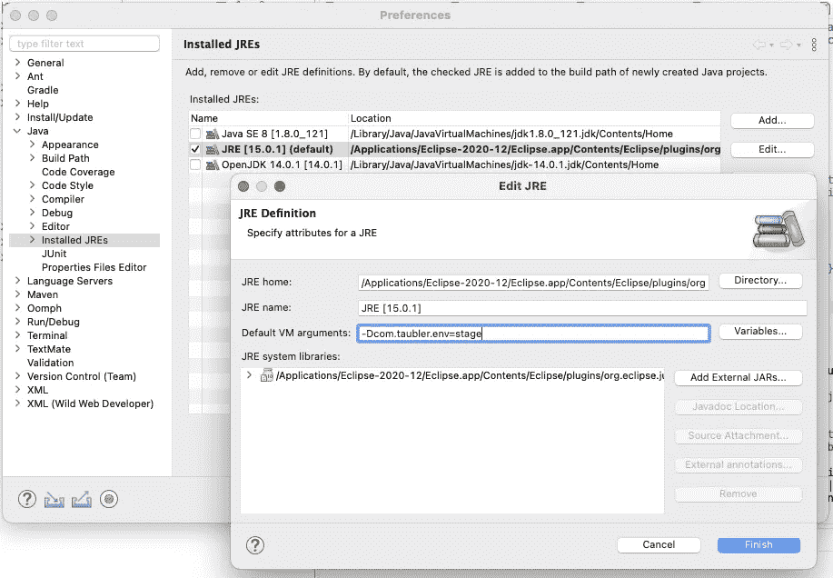

# Eclipse:测试、运行配置和 JVM 参数

> 原文：<https://levelup.gitconnected.com/eclipse-testing-run-configurations-and-jvm-arguments-e7e574439612>

## 如何将 JVM 参数传递给一个不存在的运行配置？

马修·施瓦茨在 Unsplash[上的照片](https://unsplash.com?utm_source=medium&utm_medium=referral)

像 Eclipse 这样的 IDE 的一个优点是，在开发应用程序时，运行它是多么容易。Eclipse 为此使用了运行配置的概念。运行配置定义了代码的入口点(即项目和主类)，以及运行的许多其他方面，包括要使用的 JRE、类路径以及供应用程序使用的各种参数和变量。

如果您是一个 Eclipse 用户，您可能已经创建了自己的运行配置。很简单。只需进入*运行* *→运行配置…* 菜单项。在出现的对话框中，单击左上方的新建图标，并创建您的新配置。

然后，您可以使用右边的大约六个选项卡来配置您的运行时环境。在 *Arguments* 选项卡中，您可以配置的选项之一是要传递给应用程序的 *VM 参数*。例如，我的一个 web 应用程序可以在不同的环境中运行；根据我是在开发、试运行还是生产模式下运行，某些设置会发生变化。因此，当我启动应用程序时，我传递一个`-Dcom.taubler.env=x`参数(其中 *x* 可能等于 *dev* 、 *stage* 或 *prod* )。当我通过命令行运行我的应用程序时，我只是将参数添加到我的启动脚本中。类似地，当我通过 Eclipse 运行我的应用程序时，我可以将参数添加到我的运行配置中，在 *Arguments* 选项卡中。

这对于单次运行配置，或者至少少量的稳定运行配置非常有效。但是我在通过 Eclipse 运行单元测试时发现了一个问题。似乎每当您以特定的方式运行 JUnit 测试时(例如，右键单击一个测试类并选择*Run As**→JUnit Test*)，Eclipse 都会隐式地为该测试创建一个运行配置。这可能会产生许多您甚至不知道自己已经创建的运行配置。这本身不是问题(除了不断增长的运行配置列表)。然而，如果您的应用程序代码期望传入某个 JVM 参数，那么在尚未创建运行配置的情况下，如何将该参数传入您的测试运行呢？

当我第一次遇到这个问题时，我找到了一个解决方案，但它的可扩展性不是很好。我将运行任何新的单元测试一次，允许 Eclipse 创建相关的运行配置，并让测试错误出来。然后我会打开运行配置窗口，找到新创建的配置，点击进入*参数*选项卡并添加我的 *-D* 参数。此时，我可以成功地重新运行我的测试。

事实证明有更好的方法。您可以将 Eclipse 配置为无论何时启动特定的 Java 运行时环境，默认情况下总是包含一个或多个 JVM 参数。为此，打开 Eclipse 的首选项窗口。展开 *Java* 部分并选择 *Installed JRE* s，然后在主内容窗口中，选择您用来运行项目的 JRE，并单击 *Edit…* 按钮。将出现一个对话框，带有一个标签为*默认虚拟机参数*的输入字段。您可以在那里输入 JVM 参数；比如`-Dcom.taubler.env=stage`。关闭窗口，从那时起，您运行的任何单元测试都会自动将该参数传递给 JVM。

请注意，您可以传递任何 JVM 参数，您通常会在命令行上传递这些参数。例如，您可以输入`-Xmx512m`来设置所有运行的最大内存分配。

当然也有一些缺点。首先，作为一种偏好，这个设置不会包含在您的项目中(当然，这也可以看作是一种好处)。其次，这种偏好与特定的 JRE 相关联，因此如果您使用多个 JRE 进行测试，您将需要复制所有 JRE 的参数。尽管如此，这显然是一个可行的、可扩展的解决方案。