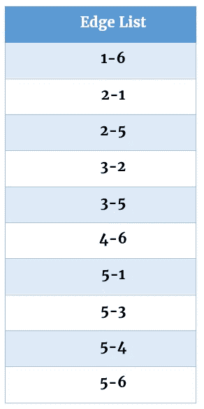

# 直观解释的边缘列表

> 原文：<https://levelup.gitconnected.com/edge-lists-visually-explained-51336ae662a8>

边列表是表示相邻顶点的另一种方式。为什么要创建边缘列表？同样，为了节省时间。当试图找出图中的相邻节点时，边列表要有效得多。让我们看一个例子，看看有人如何从有向图中创建边列表。

边列表包含按字母数字顺序排列的边列表。我们从填充顶点 1 的所有出站边开始。顶点 1 有一条到顶点 6 的出站边，因此该边被存储。

按照字母数字顺序在图中移动，将被考虑的下一个顶点是顶点 2。顶点 2 有两条向外的边:到顶点 1 和到顶点 5。这两条边都将被记录到边列表中。

顶点 3 有两条向外的边:到顶点 2 和顶点 5。

顶点 4 有一条到顶点 6 的出站边。

顶点 5 有 4 条出站边:边 5–1、边 5–3、边 5–4 和边 5–6。所有的边都存储在边列表中。

最后，顶点 6 有 3 条到顶点 1、2 和 5 的出站边。它们被添加到边列表中。

边列表是完整的，并且包含所有有向边。如果图是加权的，可以在每个边旁边创建一个额外的列来包含该边的权重。即(1–6 | 12)

*如果你喜欢你所读的，我的书，***算法的说明性介绍，涵盖了这个图形表示和更多。**

**

*迪诺·卡希奇目前是 [LSBio(寿命生物科学公司)](https://www.lsbio.com/)、[绝对抗体](https://absoluteantibody.com/)、 [Kerafast](https://www.kerafast.com/) 、[珠穆朗玛生物科技](https://everestbiotech.com/)、[北欧 MUbio](https://www.nordicmubio.com/) 和[艾阿尔法](https://www.exalpha.com/)的 IT 主管。他还担任我的自动系统的首席执行官。他有十多年的软件工程经验。他拥有计算机科学学士学位，辅修生物学。他的背景包括创建企业级电子商务应用程序、执行基于研究的软件开发，以及通过写作促进知识的传播。*

*你可以在 [LinkedIn](https://www.linkedin.com/in/dinocajic/) 上联系他，在 [Instagram](https://instagram.com/think.dino) 上关注他，或者[订阅他的媒体出版物](https://dinocajic.medium.com/subscribe)。*

*阅读迪诺·卡吉克(以及媒体上成千上万的其他作家)的每一个故事。你的会员费直接支持迪诺·卡吉克和你阅读的其他作家。你也可以在媒体上看到所有的故事。*