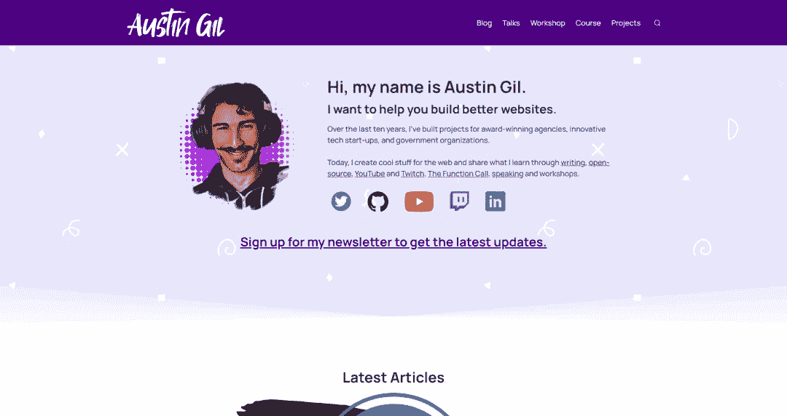
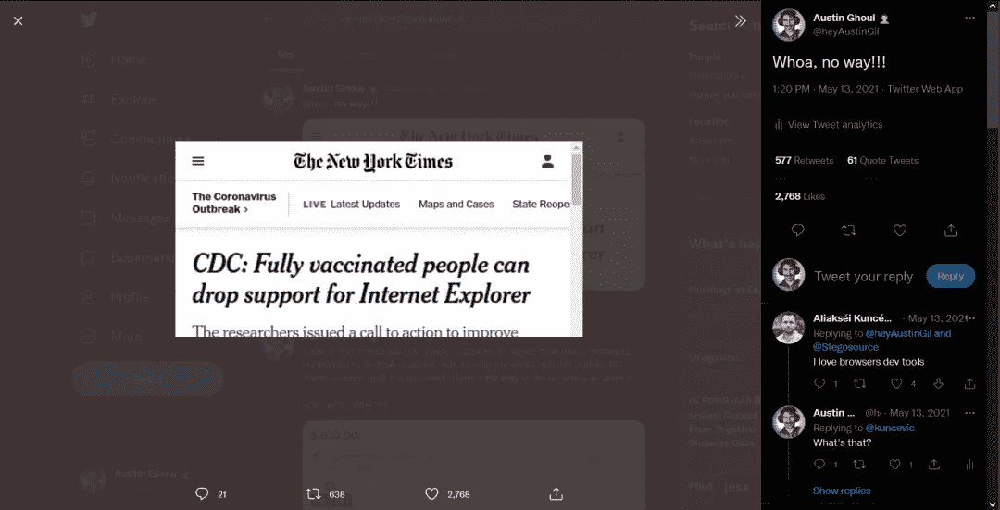

# 编辑别人的网站:内容可编辑&设计模式

> 原文：<https://levelup.gitconnected.com/edit-someone-elses-website-contenteditable-designmode-eb1b9fe4c0d5>


我第一次打开我的 devtools 并改变一个网站的内容时，我真的以为我黑了它。我想，“天哪，我释放了什么样的疯狂力量？”

我一点也不知道这只是一个局部变化，当我重新加载浏览器时就会消失。尽管如此，想到我们能做到这一点还是很酷的。

我今天提出来，是因为实际上有几个 API 是相关的，我想强调一下。

# `contenteditable`

`[contenteditable](https://developer.mozilla.org/en-US/docs/Web/HTML/Global_attributes/contenteditable)`是一个 HTML 属性，当被赋予`"true"`的值时，允许从前端修改元素的内容。

`contenteditable`很酷，因为你可以将它添加到任何你想要的 HTML 元素中，并允许用户从他们的终端修改该元素的内容。

现在，如果你首先想到的是一个低成本的网站可视化编辑器，不幸的是，`[contenteditable](https://medium.engineering/why-contenteditable-is-terrible-122d8a40e480)` [并不是一个很好的解决方案](https://medium.engineering/why-contenteditable-is-terrible-122d8a40e480)。它有很多陷阱，业界一致认为这不是正确的方法。

(参见[尼克·桑托斯](https://twitter.com/nicksantos)的《[为什么内容可编辑很糟糕](https://medium.engineering/why-contenteditable-is-terrible-122d8a40e480))

然而，这是我想分享的一个非常有趣的特性。我提出这一点是因为 contenteditable 是对我想分享的下一件事的很好介绍。

# `designMode`

在`document`对象上有一个名为`[designMode](https://developer.mozilla.org/en-US/docs/Web/API/Document/designMode)`的 API，你可以将它设置为`"on"`或`"off"`。这个`designMode`很酷的一点是它允许您在整个文档上启用那个`contenteditable`状态。

所以我们可以去我的网站，打开 devtools，将`document.designMode`设置为`"on"`，然后关闭 devtools，现在网站上的所有内容都可以编辑了。

```
document.designMode = "on"
```

这意味着只需几次点击和击键，我们就可以将它变成:



变成这样:


怎么样？我已经破坏了我自己的网站。

如果你没有听说过这两个浏览器特性，我不会感到惊讶，因为它们相当罕见。原因是它们没有太多很好的用例。

也许你可以创建一个浏览器扩展来打开和关闭`designMode`。然后允许用户轻松地修改网页，以便向团队成员提供反馈，或者可以在屏幕截图中捕捉它，或者将其发送到 Slack 或 GitHub。我不知道，我敢肯定那里有一些东西，但它可能不会经常对大多数人有用。

…除非你和我一样，喜欢给《纽约时报》写讽刺文章的标题。



出于法律原因，让我明确声明:我不鼓励或提倡使用这些功能来修改网站，传播错误信息。那是一件可怕的事情。

然而，这些都是很酷、很有趣的 API，我想我应该分享一下。


非常感谢您的阅读。如果你喜欢这篇文章，请[分享给](https://twitter.com/share?via=heyAustinGil)。这是支持我的最好方式之一。你也可以[注册我的时事通讯](https://austingil.com/newsletter/)或者[在 Twitter 上关注我](https://twitter.com/heyAustinGil)如果你想知道什么时候有新文章发表。

*原载于*[*austingil.com*](https://austingil.com/contenteditable-and-designmode/)*。*